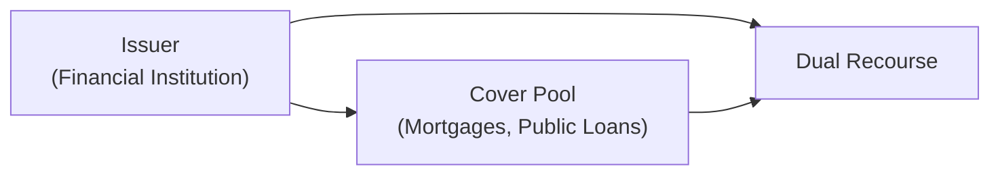

## Introduction

Covered bonds have a bit of magic to them—at least that’s how I felt when I first encountered these instruments in the European markets. They offer “dual recourse,” meaning the investor can look to the issuer as well as a designated pool of high-quality assets (the “cover pool”) if something goes wrong. European Pfandbrief, one of the oldest and most reputable forms of covered bonds, epitomizes the discipline and legal rigor behind this market. This section dives into the core structures, regulatory frameworks, and real-world nuances of covered bonds and European Pfandbrief from a fixed-income perspective.

## Key Characteristics of Covered Bonds

Covered bonds are debt instruments secured by loans—often mortgages or public-sector debt—that stay on the issuer’s balance sheet. From an investor’s standpoint, they’ve traditionally represented a robust, lower-risk investment. Here’s why:

• Dual Recourse: If the issuer cannot repay principal and interest, investors have direct recourse to a pool of assets specifically earmarked to support the bond.  
• Dynamic Cover Pool: As soon as an asset in the cover pool is repaid, defaults, or no longer meets eligibility criteria, the issuer must replace it to maintain the strict coverage level required by law or regulation.  
• Overcollateralization: The value of the cover pool usually exceeds (or is required to exceed) the bond’s principal. This cushions investors against valuation and default risks.  
• Legislative Backbone: Most covered bond legislation includes minimum collateral requirements, regular coverage tests, and ongoing oversight by regulators.

Anyway, think of these features as multiple layers of safety. Even if times get rough, covered bond investors have a special combination of issuer backing plus a legally protected pool of assets.

## European Pfandbrief: A Blueprint for Stability

Pfandbrief is the German form of covered bond—recognized for its centuries-long track record. It originates from laws dating back to the 1700s, and it has since built a reputation in Europe for reliability and credit quality. When you buy a German Pfandbrief, you’re buying into strict regulations that govern:

• Eligible Assets: Typically mortgage loans on residential or commercial real estate, or loans to public-sector entities.  
• Continuous Monitoring: There’s ongoing scrutiny by regulators to ensure the cover pool meets minimum standards.  
• Mandatory Overcollateralization: Legislation demands that the collateral value must exceed outstanding Pfandbrief obligations.  
• Segregation of the Cover Pool: Assets in the cover pool are treated separately from the issuer's general bankruptcy estate.

I remember being surprised to learn that Pfandbrief issuance volumes run into the hundreds of billions of euros, making them a major slice of the European fixed-income universe. Watch any coverage of Europe’s credit market, and you’ll probably see Pfandbrief yields quoted side by side with government bonds.

## Covered Bonds vs. ABS

At first glance, covered bonds can look similar to Asset-Backed Securities (ABS). Both invest in mortgage or loan pools, both pay out from the underlying assets. So what’s the difference? Here’s a quick comparison:

• On-Balance-Sheet vs. Off-Balance-Sheet:  
  – Covered Bonds: The cover pool stays on the issuer’s balance sheet. Investors have a claim against the issuer plus the pool.  
  – ABS: The loans are typically sold to a special purpose vehicle. Investors rely primarily on cash flows from that vehicle’s assets.  
• Legislative Support and Dual Recourse:  
  – Covered Bonds: Heavily regulated, with dual recourse explicitly enshrined in law.  
  – ABS: Recourse is limited to the underlying loans. Once the originator sells the assets, the investor usually has no direct claim on the originator.  
• Risk and Spreads:  
  – Covered Bonds: Often trade at tighter spreads compared to similarly rated ABS because of their legal protections and dynamic collateral.  
  – ABS: Spreads can be higher, reflecting more complex structures, less legislative protection, and higher dependence on the performance of the underlying assets alone.

In other words, an investor in a covered bond gets the comfort of a well-regulated environment plus ongoing issuer accountability. In contrast, an ABS investor primarily hinges on the performance of a ring-fenced asset pool.

## Legal and Regulatory Frameworks

One highlight of covered bonds is their deep entrenchment in national laws. While specific legal frameworks vary by country, they generally share:

• Asset Encumbrance Limits: Regulators often restrict how much of a bank’s balance sheet can be pledged to covered bonds so that unsecured creditors are also protected.  
• Collateral Quality and Valuation: Overcollateralization must be maintained; the cover pool is regularly tested and revalued.  
• Special Supervision: Regulatory bodies, such as BaFin in Germany for Pfandbrief issuance, ensure compliance with coverage tests, eligibility of the collateral, and continuous alignment with legislative standards.  
• Investor Protection in Insolvency: If the issuer defaults, investors in covered bonds typically stand ahead of unsecured debt holders with a direct claim on the secured assets.

Many jurisdictions in the European Union have converged on a harmonized framework for covered bonds, further reinforcing their credibility among international investors.

## Structural Mechanics

Below is a simplified diagram illustrating the parties involved in a typical covered bond structure:

1. The issuer originates mortgages or public-sector loans.  
2. These assets become part of the cover pool.  
3. Investors purchase covered bonds with recourse to both the issuer and the cover pool.

You’ll often see an interest rate mismatch: mortgage assets might pay different rates than the coupons on the bonds. Issuers manage these differences through asset-liability management and hedging strategies. By law, any mismatch or shortfall in the pool must be addressed by the issuer’s general resources, reinforcing that “dual recourse” benefit.

## Pricing and Yield Dynamics

Investors typically accept lower yields on covered bonds versus unsecured bank debt from the same issuer. Why?

• Enhanced Security: Dual recourse and overcollateralization make these bonds less risky.  
• Regulatory Favor: Many global regulatory regimes grant covered bonds preferential treatment in capital requirements and repo eligibility.  
• High Liquidity: In well-established markets, such as Germany, France, or Denmark, covered bonds enjoy strong liquidity, further supporting higher prices.

That said, the yield you see still depends on credit spreads, interest rate environment, and the specific nature of the cover pool (e.g., residential mortgages in prime areas vs. riskier commercial loans).

## Rating Considerations

Rating agencies (Moody’s, S&P, Fitch, DBRS, and others) analyze covered bonds at multiple layers:

• Issuer’s Credit Strength: A covered bond from an investment-grade issuer typically starts with a higher rating foundation.  
• Cover Pool Quality: Rating agencies scrutinize key metrics like loan-to-value ratios for mortgages, diversification of the pool, and historical default data.  
• Legislative and Regulatory Protection: Jurisdictions with a strong legal framework for covered bonds (like Germany for Pfandbrief) enhance the bond’s appeal.  
• Overcollateralization: Agencies measure the issuer’s ability to sustain coverage levels under stress scenarios (e.g., falling property values).

In a sense, covered bonds often earn ratings at or near the top of the scale, reflecting their robust structure. But it’s still important to watch the news—anything that affects real estate, issuer creditworthiness, or the legislative environment can make an impact.

## Real-World Examples and Case Studies

• German Pfandbrief Performance: Historically, Pfandbrief default rates have been minuscule. In fact, it’s considered one of the safest bond instruments in Europe.  
• Spanish “Cédulas Hipotecarias”: Spain’s version of covered bonds faced challenges during the housing crisis, but legal overcollateralization and strong regulatory oversight limited losses.  
• Danish Covered Bonds: Denmark has a unique system in which mortgage banks issue bonds that match the underlying mortgages almost one-for-one. This has proven resilient through various economic cycles.

From my own perspective, I first got a taste of how stable this market is during the 2008 financial crisis. While a lot of securitized products saw huge spreads and liquidity crunches, covered bonds—especially European Pfandbrief—maintained comparatively tighter spreads and found stable demand from conservative asset managers.

## Risk Management and Portfolio Application

For a portfolio manager:

• Credit Risk: Even though covered bonds are safer, there’s still a chance of issuer default if broader systemic risk arises.  
• Interest Rate Risk: Like any fixed-income security, covered bonds are exposed to shifts in the yield curve. Duration management is key.  
• Spread Risk: Covered bond spreads can fluctuate based on market sentiment, regulatory changes, or real estate cycles.  
• Liquidity Risk: While many covered bonds are fairly liquid, some niche issuances may have lighter trading volumes.

On the plus side, from a liability-driven investing standpoint, covered bonds can serve as a stable, moderate-yield alternative to government debt. They often benefit from special regulatory treatment (in the EU, for instance) that can improve their attractiveness to banks, insurance companies, and pension funds.

## Common Pitfalls and Challenges

• Overlooking Legislative Differences: A “covered bond” in one country might have a stronger legal regime compared to another. That can affect risk, even if the name is the same.  
• Concentration in the Cover Pool: Sometimes we see covered bond programs reliant on specific property types or regions. A downturn in that region can affect its spread.  
• Potential Over-Valuation of Collateral: If the underlying property prices are at a peak, the overcollateralization cushion might be less robust than it appears.  
• Asset Encumbrance Concerns: If an issuer pledges too many assets into covered bonds, unsecured creditors might face higher risk, influencing the issuer’s overall creditworthiness.

Anyway, it’s a balancing act: the better your coverage, the more encumbered your balance sheet. Regulators keep a close eye on that.

## Best Practices and Lessons Learned

• Regular Monitoring: As an investor, stay updated on cover pool composition, changes in valuations, and the issuer’s credit rating.  
• Asset-Liability Matching: For issuers, prudent ALM strategies reduce the complexities with mismatched durations or interest rates in the cover pool.  
• Diversification in Pool Selection: Mix varied mortgage loans (residential, commercial, geographic distribution) to ensure stable cash flows.  
• Transparent Disclosures: Investors expect frequent updates on cover pool statistics—loan-to-value, defaults, maturity breakdown, property types, etc.

## Conclusion

Covered bonds, and especially the revered Pfandbrief, stand as pillars of stability in the global fixed-income market. They incorporate robust legislative support, dynamic coverage, and strict oversight—factors that shield investors from risks typically associated with purely asset-backed structures. At the same time, they offer issuers a relatively low-cost source of financing. In short, they’re a win-win: issuers get funding at attractive rates, and investors gain exposure to quality collateral and legal protections.  

Learning about covered bonds often helps us see how regulation, asset quality, and careful structuring can create a capital market instrument that weathers even turbulent times. From a portfolio management perspective, they’re a prime candidate for investors seeking moderate yields with a relatively defensive credit profile.

## References

• European Covered Bond Council (ECBC). “ECBC Covered Bond Fact Book.”  
• VdpPfandbrief.de. “Information on Pfandbrief Legislation in Germany.”  
• Fitch Ratings and Moody’s: “Covered Bond Rating Methodologies.”  
• BaFin (German Federal Financial Supervisory Authority) website: Regulatory guidance on Pfandbrief.  
• CFA Institute. (Current and prior Level I and Level III curriculum readings related to fixed income and structured products.)

## Test Your Knowledge: Covered Bonds and Pfandbrief



### Covered bonds share which of the following key features?

- [x] Dual recourse to both the issuer and a dedicated cover pool.
- [ ] Recourse only to a special purpose vehicle.
- [ ] They typically sit off the issuer’s balance sheet.
- [ ] No regulatory oversight of collateral.

> **Explanation:** Covered bond holders have “dual recourse” to the issuer and the cover pool, while assets remain on the issuer’s balance sheet under strict regulatory oversight.

### Which factor most distinguishes covered bonds from asset-backed securities?

- [x] The cover pool remains on the issuer’s balance sheet, providing dual recourse.
- [ ] The bonds are always rated higher than the issuer’s unsecured debt.
- [ ] They are only issued in Europe.
- [ ] The underlying assets are never mortgages.

> **Explanation:** Unlike ABS, covered bonds are backed by on-balance-sheet assets with recourse to both the issuer and the asset pool.

### In a German Pfandbrief, what ensures the safety of the bondholders?

- [x] Robust regulations requiring overcollateralization and dynamic coverage tests.
- [ ] Lack of any regulatory oversight.
- [ ] Absence of bankruptcy protection.
- [ ] Pool assets are not subject to regular revaluation.

> **Explanation:** Germany’s Pfandbrief program requires the issuer to maintain stringent overcollateralization and to replace defaulted or prepaid loans, enhancing bondholder safety.

### Why do covered bonds generally command tighter spreads than unsecured debt from the same issuer?

- [x] They carry lower credit risk because of dual recourse and a dedicated cover pool.
- [ ] They are rarely traded in secondary markets.
- [ ] They are junior to unsecured debt.
- [ ] They tend to have no maturity date.

> **Explanation:** Lower credit risk justifies tighter spreads. Covered bond investors can claim against both the issuing bank and the collateral.

### Which best describes the dynamic nature of a covered bond’s collateral pool?

- [x] The issuer must replace non-performing or prepaid assets to maintain coverage ratios.
- [ ] Once collateral is pledged, it cannot be changed.
- [x] If a loan in the cover pool defaults, the issuer replaces it with another eligible loan.
- [ ] The cover pool is static and only changes when the bond matures.

> **Explanation:** Covered bonds have a dynamic pool: non-performing and prepaid loans are replaced to uphold required collateral levels.

### Which of the following is correct regarding Pfandbrief structures?

- [x] They are governed by specific legislation in Germany with stringent rules.
- [ ] They are always unsecured.
- [ ] They do not require overcollateralization under any circumstance.
- [ ] They are typically issued through special purpose vehicles only.

> **Explanation:** Pfandbrief structures are backed by national legislation that mandates coverage tests, overcollateralization, and issuer accountability.

### If the issuer of a covered bond defaults, investors:

- [x] Have a direct claim on the cover pool’s underlying assets.
- [ ] Lose all recourse and rank below equity.
- [x] Retain the right to pursue the issuer’s remaining assets.
- [ ] Must rely solely on a government guarantee.

> **Explanation:** Covered bond investors have dual recourse: if the issuer defaults, they can claim both the cover pool and any remaining issuer assets.

### Which is a common pitfall when evaluating covered bonds?

- [x] Failing to consider differences in legal frameworks across jurisdictions.
- [ ] Overrating the bond due to zero recourse.
- [ ] Assuming they have no overcollateralization.
- [ ] Confusing them with equity-like instruments.

> **Explanation:** Different national laws can vary widely in their level of bondholder protection, so it’s crucial to understand the specific legal framework.

### What is the primary reason rating agencies may assign a higher rating to covered bonds than the issuer’s senior unsecured debt?

- [x] The added security of the cover pool and legislative protections.
- [ ] A guarantee by all EU member states.
- [ ] Absence of interest rate risk.
- [ ] Zero chance of default.

> **Explanation:** The cover pool, along with strict legal protections and overcollateralization, often supports higher ratings relative to unsecured bonds.

### Covered bonds may be considered relatively safe investments. True or False?

- [x] True
- [ ] False

> **Explanation:** Covered bonds typically benefit from dual recourse, strict oversight, and overcollateralization, contributing to their reputation as relatively safe fixed-income investments.


