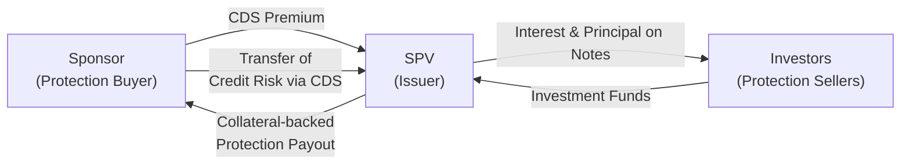

## Introduction
Synthetic securitization is a curious corner of the fixed-income market that demonstrates how financial innovation can rearrange risk exposures without necessarily changing the underlying assets. Banks, insurance companies, and other financial institutions often harness these structures to free up regulatory capital or tailor specific risk profiles. Instead of selling actual loans or bonds, synthetic securitizations transfer credit risk through derivatives—most commonly credit default swaps (CDS). At first glance, it might look like a complicated web of contractual relationships. And, well, it absolutely can be. But once you peel back each layer, it starts to make sense. 

In this section, we’ll explore how synthetic securitizations work, why they exist, and what potential advantages and pitfalls they bring to the table. If you’ve ever read headlines about synthetic collateralized debt obligations (CDOs) contributing to financial volatility, this is where we get to see some real behind-the-scenes action.

## Key Concepts
Before plunging further, let’s anchor ourselves with a few definitions. Understanding these foundational ideas helps clarify the design and purpose of synthetic deals.

• Synthetic Securitization: A structure where credit risk is transferred via derivatives (often CDS), rather than through a sale of the underlying assets.  
• Credit Default Swap (CDS): A contract that offers protection against the default or other specified credit events of a reference entity.  
• Synthetic CDO: A repackaged credit risk product using CDS premiums instead of physical bonds or loans as collateral.  
• Reference Pool: The set of bonds, loans, or other credit instruments for which the CDS is written.  
• Counterparty Risk: The risk that the protection seller or protection buyer defaults on its contractual obligations.  
• Credit Event: A specific trigger such as default, bankruptcy, or restructuring that activates the CDS payout process.  
• Spread Income: The difference between the yield on collateral and the CDS premium stream.  
• Correlation Risk: The possibility that multiple underlying credits default at the same time or in close succession, more frequently than initially expected.

## Significance and Rationale
One might wonder: why structure a synthetic securitization if you could simply sell or securitize the loans outright? For many institutions, the answer revolves around capital management and portfolio efficiency. 

Here’s how it often plays out in practice:

• Capital Relief: A bank might have a large pool of corporate loans on its balance sheet. By transferring the default risk to an SPV through CDS, the bank can potentially reduce its capital requirements because the risk of those loans is now effectively “hedged.”  
• Strategic Retention of Loans: Sometimes, banks want to maintain customer relationships or keep the interest income from these loans but still reduce credit risk. A synthetic approach accomplishes this by preserving ownership while offloading risk.  
• Regulatory Nuances: Selling loans outright can be complicated if regulatory or legal hurdles prevent the sale; synthetic structures may be more flexible.  
• Tailored Risk Exposure: Investors can buy or sell slices of risk exposure in a synthetic CDO that references a diverse pool of issuers, often at yields that might be higher than similarly rated corporate bonds.

## How It Works: The Flow of Risk and Payments
At the heart of a synthetic securitization is the credit default swap. Let’s break it down in broad strokes:

1. The sponsoring bank (or protection buyer) identifies a reference pool of assets—say, corporate loans—that it wishes to hedge.  
2. That bank structures an SPV (special purpose vehicle). The SPV may or may not physically own these reference assets; instead, it uses CDS contracts to assume the credit risk from the sponsoring bank.  
3. The sponsoring bank pays periodic premiums to the SPV. In return, if a credit event occurs (e.g., default, bankruptcy, or restructuring) in the reference pool, the SPV compensates the bank.  
4. The SPV, in turn, raises capital from investors (the protection sellers) by issuing notes or other instruments. Investors receive attractive spread income—comprised of the CDS premiums and the earnings from collateral (such as high-grade bonds or money market instruments)—in exchange for bearing the risk of potential defaults in the reference pool.  
5. If a credit event happens, the SPV uses its collateral to pay the protection buyer for losses. Consequently, the investors may lose part or all of their invested capital, depending on the severity of the default.  

Below is a simplified flowchart illustrating the main parties and cash flows in a typical synthetic securitization:

## Synthetic CDO Structures
A prominent illustration of synthetic securitization is the synthetic CDO. Traditional “cash” CDOs are constructed around physical bonds or loans that serve as collateral. Synthetic CDOs, on the other hand, rely on CDS exposures to mirror the risk and return profile of a reference pool.

• Typically, synthetic CDOs are tranched—much like standard CDOs—into senior, mezzanine, and equity pieces.  
• Each tranche has varying degrees of subordination, which translates into different risk/return profiles.  
• Losses experienced in the underlying reference pool are allocated from the equity tranche upwards, protecting senior tranches until junior tranches are depleted.

## The SPV, Collateral, and Premium Streams
Although the SPV in a synthetic securitization might not hold the original loans or bonds, it often holds high-quality collateral—think government bonds or AAA-rated securities—to mitigate risk and earn a modest return. Investors effectively fund the SPV through the purchase of credit-linked notes (CLNs) or other instruments, and the SPV invests that money in what should be relatively safe collateral.

If no credit events occur in the reference pool, the SPV’s collateral matures at par, and investors typically get their principal back plus the spread from the CDS premiums. If defaults do happen, the SPV sells a portion of its collateral or uses it to compensate the protection buyer (the sponsor). This reduces the payout investors eventually receive.

## Risk Considerations
Life in synthetic-structure land is definitely not risk-free. Several layers of complexity can amplify vulnerabilities:

• Reference Pool Default Risk: The creditworthiness of the underlying issuers can change rapidly, especially during systemic downturns.  
• Counterparty Risk: If the SPV’s swap counterparty fails, or if the SPV itself becomes insolvent, the entire arrangement can unravel.  
• Correlation Risk: In times of market stress, multiple reference entities can default nearly simultaneously, creating larger losses than initially modeled.  
• Documentation and Credit Event Definition: If a restructuring is not categorized as a credit event in the CDS contract, the protection seller might not cover associated losses. Ambiguities or inconsistencies in legal documentation can lead to disputes or unexpected costs.  
• Liquidity Risk: Synthetic CDO tranches are not always liquid, particularly in times of market distress. Certain structures can become “toxic,” leaving investors unable to exit positions without incurring heavy losses.  

It’s worth noting (from personal experience) that reviewing the legal definitions of credit events can feel tedious, but it’s absolutely crucial. Ask anyone who’s tried to argue whether a distressed-debt exchange qualifies as a “default”—there’s a lot more nuance there than you’d ever imagine.

## Example: Bank Capital Relief
Imagine a regional bank that holds a $500 million portfolio of mid-market corporate loans. Rather than selling those loans (and potentially damaging client relationships), the bank creates a synthetic securitization. By buying protection from an SPV for a specific portion of potential losses, the bank receives capital relief—allowing it to redeploy capital into new lending opportunities.

Over time, the bank pays CDS premiums to the SPV. If no defaults occur, investors in the SPV keep the premiums plus the yield from high-grade collateral. If defaults do occur, the SPV pays the bank from its collateral account, and investors experience losses proportionate to the severity of the defaults.

## Regulatory Environment and Disclosure
Regulators worldwide pay close attention to synthetic securitizations due to their potential to move risk around the system in ways that can be opaque. Transparency, robust stress testing, and clear disclosures of off-balance-sheet exposures are commonly required. For instance, banks engaging in synthetic transactions often have to detail:

• The size and composition of the reference pool.  
• The notional amount of risk transferred.  
• The credit events specified and the deal’s structural details.  
• Potential correlation or concentration risks.

Some regulators also track the performance of posted collateral, ensuring that collateral is genuinely high-quality and sufficient to cover potential losses.

## Common Pitfalls and Best Practices
If you’re considering investing in or structuring synthetic securitizations, be sure to watch out for:

• Underestimation of Correlation: One default in the reference pool can signal trouble for other issuers.  
• Over-Complexity: The more intricate the structure, the greater the uncertainty in measuring systemic and counterparty risk.  
• Collateral Quality Slippage: Investors must confirm that the collateral is truly robust and does not degrade over time.  
• Documentation Gaps: Always confirm how credit events are defined and how payouts are triggered.  

On the bright side, best practices include:  
• Ensuring robust CDS documentation aligned with standard ISDA definitions.  
• Performing scenario analyses that capture tail risks.  
• Maintaining transparent disclosures to regulators, shareholders, and internal risk committees.  
• Matching maturity profiles between the CDS contracts and the SPV’s collateral.  

## Linking to Other Fixed-Income Markets
Synthetic securitizations neatly integrate with topics covered elsewhere in the fixed-income market. For example, recall from Chapter 6 (Bond Pricing and Valuation Basics) how discount rates are determined. In a synthetic CDO, each tranche yield is priced using risk premiums that reflect not just credit risk but also correlation and liquidity considerations. Meanwhile, from Chapter 8 (Interest Rate Risk and Return Analysis), you might remember that changing interest rates can affect the market value of the collateral. Combine these factors, and you see how quickly synthetic transactions can become multi-dimensional.

## Exam Relevance and Concluding Thoughts
Synthetic securitizations often show up in exam questions that focus on understanding credit derivatives, structured finance, and how capital relief can be achieved without direct asset sales. You may be asked to identify or calculate the potential payoff following a credit event or to discuss how changes in correlation assumptions could impact the valuation of a mezzanine tranche. 

A balanced knowledge of the mechanics, risks, and regulatory environment surrounding synthetic deals is essential for any aspiring CFA® charterholder—whether you’re diving into a portfolio manager role, a risk management seat, or a structured finance position.

At the end of the day, these structures remind us that risk can be packaged and repackaged, but it doesn’t just vanish. It moves from one place to another, sometimes transparently and sometimes not. Make sure you know exactly where that risk is going—and who will hold the bag if defaults start rolling in.

## References and Further Reading
- Das, S. (2000). “Credit Derivatives and Synthetics.” New York: Wiley.  
- BIS, “OTC Derivatives Market Statistics—Credit Default Swaps.”  
- ISDA.org, “CDS Definitions and Standard Documentation.”  

Additionally, explore official regulatory publications for disclosure standards (e.g., Basel Committee’s guidelines). Various banks and consultancy firms routinely publish white papers on synthetic securitizations, which can provide updated insights into best practices and market trends.

## Test Your Knowledge: Synthetic Securitizations and Credit Derivative Structures



### In a synthetic securitization, which instrument typically transfers credit risk without requiring the sale of the underlying assets?
- [ ] A physical bond purchase agreement
- [x] A credit default swap (CDS) contract
- [ ] An interest rate currency swap
- [ ] A forward rate agreement (FRA)

> **Explanation:** Credit default swaps allow credit risk to be transferred synthetically, eliminating the need to sell the original assets.

### One major advantage for a bank executing a synthetic securitization is:
- [ ] Diluting shareholder equity
- [x] Gaining regulatory capital relief
- [ ] Eliminating market risk entirely
- [ ] Avoiding credit event payouts

> **Explanation:** Banks often use synthetic securitizations to reduce the capital reserves required to be held against on-balance-sheet assets, thereby achieving capital relief.

### In a synthetic CDO, the SPV:
- [ ] Always acquires the underlying loans
- [x] Sells credit protection on a reference pool of assets using CDS
- [ ] Eliminates the need for investor-supplied collateral
- [ ] Cannot invest collateral proceeds in high-grade securities

> **Explanation:** Synthetic CDO vehicles typically do not purchase the underlying assets. Instead, they write CDS on a reference portfolio, using collateral from note issuance to ensure payment if a credit event occurs.

### A typical “credit event” under ISDA definitions might include:
- [x] Bankruptcy or failure to pay
- [ ] A one-notch credit rating downgrade
- [ ] A change in interest rates by the central bank
- [ ] A purely market-driven price drop in the reference asset

> **Explanation:** Credit events are explicitly defined and often include bankruptcy, failure to pay, or restructuring, not simple market-driven price changes or rating downgrades of small magnitudes.

### Which of the following is most directly at risk if the SPV’s swap counterparty defaults in a synthetic securitization?
- [ ] The reference entities
- [x] The SPV and its investors
- [ ] The rating agencies
- [ ] The bank’s foreign exchange positions

> **Explanation:** If the swap counterparty (or protection buyer/seller) defaults, the SPV and investors may not receive or make timely payments, causing losses.

### Correlation risk in a synthetic CDO refers to:
- [x] The chance that multiple reference entities default together
- [ ] The risk that an SPV’s collateral yields deviate from standard government bonds
- [ ] Timing mismatches in claim payouts
- [ ] The effect of changing tranches' subordination levels

> **Explanation:** Correlation risk is the increased possibility that defaults might happen simultaneously or close together rather than independently.

### What is a potential regulatory concern with synthetic securitizations?
- [ ] Excessively high transparency for all market participants
- [ ] No possibility of capital relief
- [ ] Overemphasis on loan sales
- [x] The opaqueness and difficulty for regulators to track off-balance-sheet risk

> **Explanation:** Synthetic securitizations can move risk off the balance sheet, creating challenges for regulators in monitoring systemic exposure.

### In synthetic securitization, “spread income” typically arises from:
- [x] The difference between the CDS premium streams and the yield earned on collateral
- [ ] Discounted bond prices in the secondary market
- [ ] Capital gains on reference assets sold at a premium
- [ ] Inflation-linked interest adjustments

> **Explanation:** The SPV earns CDS premiums from the protection buyer and invests in high-grade collateral. The net difference between these premiums and the collateral yield is known as spread income.

### A key difference between a traditional cash CDO and a synthetic CDO is:
- [ ] A synthetic CDO funds itself by selling equity and mezzanine tranches
- [ ] The underlying collateral in a synthetic CDO is illiquid
- [x] A synthetic CDO uses CDS to replicate exposure to a reference pool rather than holding the physical assets
- [ ] Traditional CDOs are always risk-free

> **Explanation:** Synthetic CDOs do not purchase the reference assets; they simply take on the credit exposure through CDS.

### True or False: Synthetic securitizations eliminate the credit risk of the underlying loans entirely for the bank.
- [x] True
- [ ] False

> **Explanation:** If structured properly, the bank (protection buyer) transfers the default risk of its loans to the SPV and thus can obtain significant capital relief. However, some basis or counterparty risk might remain. Always confirm how the transaction is structured and documented.


