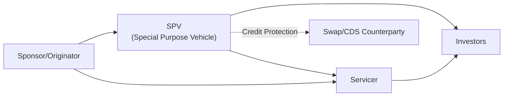

## Overview and Context

Structured finance products, such as mortgage-backed securities (MBS), collateralized debt obligations (CDOs), and various asset-backed securities (ABS), can sometimes feel like complicated puzzles. They package individual income-generating assets (like loans or receivables) into pools, then slice and dice those cash flows for different classes of investors. But as neat and tidy as that might sound, the real world occasionally gets messy—oh boy, does it ever. When you invest, it’s not just about the structure of your deal but also about how well that deal is actually executed and who’s on the other side of all those transactions.

In these pages, we’re going to explore the risk dimensions that investors should keep on their radar—especially operational and counterparty risks, which can subtly creep up and cause big headaches. A thorough risk assessment goes beyond credit or market factors. You need to evaluate data accuracy, servicing processes, legal frameworks, and counterparties’ financial health.

## Linking the Dots in Structured Finance

Structured finance typically revolves around a few key players: originators (who create the underlying loans), a special purpose vehicle (SPV) or issuer, servicers (who collect payments from borrowers), rating agencies, and investors. And in synthetic structures, you may also have counterparties for swaps or credit default swaps (CDSs). An operational slipup by any one of these parties can disrupt the entire deal. So it’s helpful to visualize how everyone and everything ties together.

In this diagram, you can see how the SPV stands at the center, issuing the structured notes to investors. The servicer collects principal and interest payments and passes them to the SPV (and ultimately to investors). A separate counterparty may provide credit protection via a swap or CDS arrangement. Each of these relationships is governed by dense legal documentation. The next sections explore where and why operational and counterparty risks can surface.

## Operational Risk: The Nuts and Bolts

Operational risk in structured finance is the risk of loss resulting from inadequate or failed internal processes, people, and systems, or from external events. Trust me, I’ve seen it firsthand: a friend of mine worked at a small servicer who once mixed up digital loan files so that tens of thousands of dollars in payments ended up getting allocated to the wrong loan accounts. It took weeks (and an army of staff) to unwind that. These sorts of fiascos can jeopardize not only a single loan but also the entire performance of the securitized pool.

### Key Sources of Operational Risk

• Servicing Inadequacies: If the servicer fails to follow up on delinquencies or process payments on time, it can lead to revenue leakage or confusion in cash-flow waterfalls. In severe cases—like an economic downturn—inefficient or overwhelmed servicers might let collections slip, undermining the entire structure.  
• Data Mismanagement: Inaccurate data on collateral characteristics or borrower credit profiles can skew the model that predicts cash flow. Maybe the average borrower is riskier than reported, or some performance data were entered incorrectly. Such errors can cause mispricing and confusion during monthly reporting.  
• Technology Failures: Automated systems can be a blessing—until there’s a glitch. An IT outage at the servicer can delay payment processing and hampers timely reporting.  
• People and Process Failures: Human errors, lack of proper training, or complicated internal procedures can all contribute to the slipups that degrade investor confidence.

### Mitigating Operational Risk

• Robust Internal Controls: Standardized checklists, dual approvals for data entry, automated processes with reconciliation steps—these are all ways to ensure ongoing accuracy.  
• Backup Servicing Arrangements: Many transactions have provisions to replace the primary servicer if it fails to meet certain performance thresholds or runs into financial trouble itself.  
• Transparent Reporting: Regular, granular reports help investors spot anomalies early, discouraging operational missteps from growing out of control.  
• Incentive Alignment: Ensure the servicer’s fee structure rewards good performance rather than volume alone. Misaligned incentives can tempt a servicer to postpone delinquency follow-ups or cut corners.

## Counterparty Risk: Who’s on the Other Side?

Counterparty risk arises any time you rely on a third party to fulfill a financial obligation—particularly relevant in synthetic transactions where a credit default swap provider might fail to honor claims, or where an interest rate swap counterparty might default. Think about it: if that swap provider can no longer make its contractual payments, the entire return profile of a structured product might get turned on its head.

### Common Counterparty Exposures

• Credit Default Swaps (CDSs): A synthetic CDO uses CDS protection to mimic the performance of a reference portfolio. If the CDS seller defaults, the synthetic protection is gone, leaving investors directly exposed.  
• Interest Rate or Currency Swaps: Many structures rely on swaps to manage interest rate mismatch or currency mismatch. Should the swap counterparty default, the structured deal faces unhedged exposure, which can lead to dramatic changes in cash flow.  
• Liquidity Providers: Sometimes, there’s a liquidity facility in place for short-term needs. If that liquidity provider is unable to supply cash at the moment of need, payment disruptions can cascade through the deal.

### Strategies for Managing Counterparty Risk

• Collateralization and Margin Requirements: Often, counterparties post collateral that gets marked to market daily to limit the chance of credit losses if one party defaults.  
• Counterparty Credit Review: Monitoring the financial health of swap or CDS providers is critical—some deals specify triggers if the provider’s credit rating falls below a set level.  
• Replacement Provisions: If the swap or CDS provider is downgraded, the transaction documents often require them to find a replacement provider or post additional collateral.  

## Legal Considerations and Documentation Reviews

An entire world of legal risk lurks beneath the surface of structured finance. A major reason deals often have hundreds of pages in prospectuses, offering memoranda, and swap confirmations is to ensure legal clarity (or at least an attempt at it!). But legal risk creeps in through:

• Bankruptcy-Remote Structures: The SPV is designed to be independent from the originator, but if courts find the deal was not actually “true sale,” the structured assets could be consolidated back into the originator’s estate if the originator goes bankrupt.  
• Enforceability of Contracts: If vital provisions (like priority of payments) are unclear or unenforceable, the entire transaction structure can unravel in distress.  
• Litigation Over Servicing Practices: Borrowers or other parties can sue the servicer or the SPV, alleging wrongful foreclosure or improper fee collection, which leads to extra costs.

When analyzing a new structured deal, investors should do more than read the summaries—ideally, they’d consult legal experts or thoroughly review the detailed documentation. Identify whether the SPV’s bankruptcy-remote status is robust, confirm the legal opinions that the “true sale” was valid, and grasp rules around how cash-flows might be diverted if performance deteriorates.

## Data Quality, Stress Testing, and Worst-Case Assumptions

It’s not always enough to rely on historical data alone. You’ve got to test how your deal performs if, say, default rates double or recovery rates plummet. Stress testing in structured finance generally involves:

• Bumping Up Default Rates: Evaluate how bond tranches and the equity piece behave if you assume defaults come in at a rate significantly higher than historical averages.  
• Lowering Recovery Rates: Model scenarios where foreclosures or repossession produce minimal recoveries.  
• Uneven Prepayment Speeds: In mortgage-backed securities, for instance, prepayment behavior can drastically alter the cash-flow timeline and peak exposures.  
• Scenario-Driven Stress: Some investors also test macro scenarios, like a deep recession or an oil price shock, to see how the underlying borrower or collateral might fare.

These stress tests rest heavily on having accurate and up-to-date data. If the input data is shaky, no matter how fancy your modeling approach, the results may be misleading. Rating agencies do their own analysis to assign ratings, but savvy investors do their own due diligence as well. That includes verifying the track record of the originator, the servicing procedures, and any data audits that have been conducted.

## Real-World Example: The Importance of Servicing

During the global financial crisis of 2008, a number of MBS deals suffered not just because borrowers defaulted in higher numbers but also because servicers were overwhelmed with delinquencies they weren't prepared to handle. In some cases, inaccurate property valuations, poor communication with borrowers, and a backlog of foreclosure processing exacerbated losses. Where servicers had robust systems and flexible staffing, the deals tended to be more orderly, with fewer additional losses. This taught us that strong operational processes can make a big difference—especially when the economy turns sour.

## Best Practices and Pitfalls

• Due Diligence Over Reliance on Ratings: Performance can deviate from rating agency assumptions, so always dig into the actual data and structure.  
• Track Servicer Performance Over Time: Don’t be lulled into thinking a reputable servicer is automatically perfect. Monitor monthly or quarterly performance metrics.  
• Validate Legal Opinions: If the deal hinges on a certain legal interpretation, ensure you understand the potential loopholes or challenges.  
• Overlooked Data Gaps: Maybe a subset of loans was never properly re-underwritten, or the borrower’s FICO data was incomplete. Even minor oversights can bubble up.

## Conclusion and Exam Tips

Structured finance invests you right in the middle of a carefully arranged ecosystem—one that can break down if operational and counterparty risks aren’t well-managed. On the CFA exam (or in real-life portfolio decisions), be prepared to:

• Evaluate the roles and responsibilities of the SPV, servicer, swap counterparty, and sponsor.  
• Assess the thoroughness of legal and operational structures—especially if there are triggers or replacement provisions you can identify.  
• Conduct your own stress testing or scenario analysis, looking well beyond the base case.  
• Consider cross-referencing rating agency materials with your own deep-dive due diligence.

And time management is key if the exam tosses you a complex structured finance question. Answer systematically: break down the structure, identify the relevant parties, pinpoint possible vulnerabilities, and show how you’d mitigate them. 

## References and Further Reading

• IMF Global Financial Stability Report: sections on Structured Finance Risks.  
• S&P, Fitch, and Moody’s structured finance rating methodology documents (publicly available).  
• Hull, J. (2018). “Risk Management and Financial Institutions.” Wiley.  

-----

## Test Your Knowledge of Operational and Counterparty Risks in Structured Finance



### Which of the following best describes operational risk in structured finance?

- [ ] The risk of high default rates on the underlying assets.
- [x] The risk of loss arising from inadequate processes, people, or systems.
- [ ] The risk of changing interest rates affecting bond prices.
- [ ] The risk of a swap counterparty’s inability to honor obligations.

> **Explanation:** Operational risk refers to failures in internal processes, systems, or human factors that lead to losses.

### Which party in a structured finance transaction is typically responsible for collecting borrower payments and handling delinquencies?

- [ ] The SPV (Special Purpose Vehicle)
- [ ] The CDS Counterparty
- [x] The Servicer
- [ ] The Swap Dealer

> **Explanation:** The servicer is tasked with collecting principal and interest payments and managing delinquency or default processes.

### What is the primary concern if a credit default swap (CDS) provider in a synthetic CDO defaults on its obligations?

- [x] The protection the CDS was meant to provide disappears.
- [ ] The SPV’s legal setup becomes invalid.
- [ ] The interest rates on the underlying loans automatically reset.
- [ ] The servicer must repay all principal in full.

> **Explanation:** If the CDS provider defaults, the synthetic deal loses the protection it was relying upon to offset credit risk, directly exposing investors.

### Which of the following is the primary reason investors review legal opinions regarding “true sale” in structured finance?

- [x] To confirm that the assets will not be consolidated into the originator’s bankruptcy estate.
- [ ] To establish that the originator has guaranteed full repayment.
- [ ] To eliminate all interest-rate risk from the transaction.
- [ ] To ensure the rating agency has a valid license to rate the deal.

> **Explanation:** Verifying a valid true-sale ensures the securitized assets are ring-fenced from the originator’s bankruptcy risk, preserving the bankruptcy-remote nature of the SPV.

### Which measure can help mitigate counterparty risk when dealing with an interest rate swap provider?

- [ ] Relying on historical default data of the underlying loans.
- [x] Requiring the swap provider to post collateral or margin.
- [x] Triggering a replacement if the provider is downgraded below a certain level.
- [ ] Canceling all swap agreements at the first sign of volatility.

> **Explanation:** Collateralization and replacement triggers are common techniques to reduce exposure to a deteriorating swap counterparty.

### In structured finance, which scenario best exemplifies an operational risk event?

- [x] A servicer accidentally misallocates monthly loan payments due to a system error.
- [ ] A borrower’s default rate rises unexpectedly during an economic downturn.
- [ ] A currency swap counterparty files for bankruptcy protection.
- [ ] Investors experience negative yield due to deflationary trends.

> **Explanation:** Misallocating monthly loan payments due to a system error is a textbook example of operational risk.

### Which of the following helps assess a structured product’s resilience under challenging market conditions?

- [ ] Base-case scenario analysis only.
- [x] Stress-testing with high default rates and low recovery assumptions.
- [x] Analysis of potential legal pitfalls in the SPV structure.
- [ ] Ignoring prepayment rates.

> **Explanation:** Stress testing that includes higher defaults, lower recoveries, and potential negative scenarios is essential for understanding a transaction’s robustness.

### One critical function of backup servicing arrangements in a securitization is to:

- [x] Step in if the servicer fails to fulfill its obligations.
- [ ] Guarantee no credit losses ever occur.
- [ ] Lower the coupon rates for senior bondholders.
- [ ] Replace the originator in the event of default on the underlying loans.

> **Explanation:** A backup servicer is designated to rapidly take over servicing duties if the primary servicer defaults or performs poorly.

### How might an investor handle the potential risk of data inaccuracies in a new structured finance deal?

- [x] Conduct due diligence and verify loan-level data wherever possible.
- [ ] Trust the sponsor’s marketing materials unconditionally.
- [ ] Assume the rating agency’s data collection is always correct.
- [ ] Avoid employing any stress testing.

> **Explanation:** Independent verification of loan-level data and thorough due diligence helps ensure accurate modeling and risk assessment.

### True or False: A low credit rating for the originator or sponsor of a securitization structure automatically invalidates the entire deal’s bankruptcy-remote feature.

- [x] True
- [ ] False

> **Explanation:** A very weak sponsor credit rating could raise questions about whether assets were properly sold and fully isolated. While not automatically invalid, it can introduce heightened legal and operational risks if the transaction structure is challenged in court.


