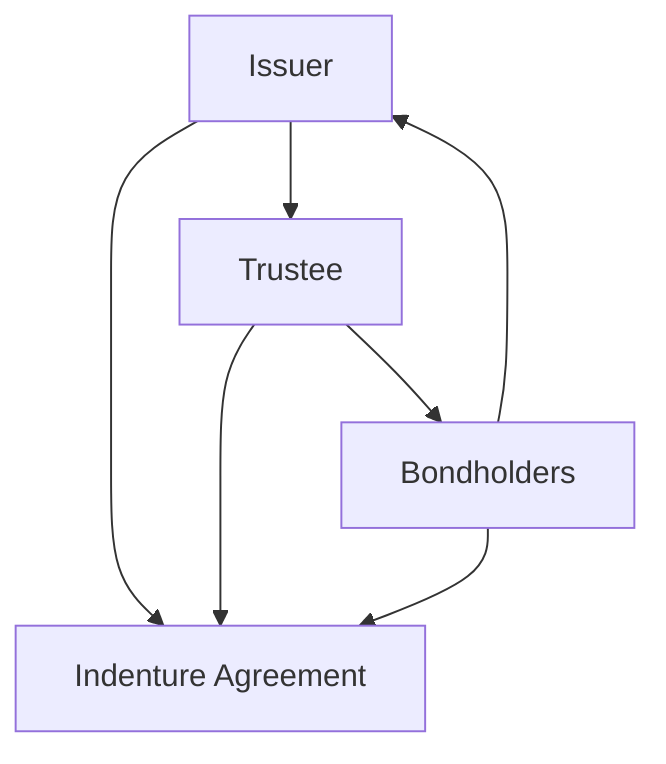

## Introduction and Overview

You know, when I first started analyzing bonds, I thought a bond indenture was just some dull, boilerplate legal document that no one really reads—like the terms and conditions for a smartphone app. But wow, was I ever wrong! A bond indenture (often called a trust deed) is actually one of the most important pieces of the entire fixed-income puzzle, especially for us as analysts. In short, the indenture is the formal contract between the bond issuer and the bondholders. It lays out all the bond’s essential terms—how much interest is paid, when principal is due, whether there are any call or put features, and so on.

But what truly makes the bond indenture a powerful mechanism is how it protects you, the investor, through various covenants. Covenants come in two flavors: affirmative covenants (which require the issuer to do certain beneficial things) and negative covenants (which prohibit the issuer from doing certain risky things). Let’s walk through each type, see why they matter, and explore what happens if an issuer violates them.

## The Purpose of Bond Indentures

An indenture is more than just a piece of paper. It’s designed to:

• Establish a clear, legally enforceable agreement between the bond issuer and bondholders.  
• Define the responsibilities of a trustee, who typically acts on behalf of the bondholders to ensure the issuer complies with all stipulations.  
• Specify the framework under which the issuer’s obligations can be monitored and enforced.

When we talk about “bond indentures” in these pages—and in the real world—we’re talking about tangible investor protection. Believe me, it can feel reassuring to know there’s a dedicated legal structure that says, “Hey, you can’t just do whatever you want with our money.”

## Key Parties and Document Flow

It often helps to visualize who’s involved and how these roles interconnect. The following schematic shows a simplified relationship:

• A["Issuer"]: The entity that needs funding and issues the bond.  
• B["Trustee"]: A third party that monitors the issuer’s covenant compliance on behalf of investors.  
• C["Bondholders"]: Investors who provide capital and expect coupon and principal repayment.  
• D["Indenture Agreement"]: The formal legal contract among all parties.

## Affirmative Covenants

Affirmative covenants are things the issuer must do. Think of these as “housekeeping rules” designed to keep the issuer’s house in order. They typically include:

• Maintaining Proper Insurance: The issuer is required to keep key assets insured. Otherwise, a major calamity could destroy the property base needed to repay bondholders.  
• Providing Financial Statements: The issuer might have to submit audited financial updates or comply with disclosure standards like IFRS or US GAAP, so bondholders can evaluate the company’s financial health each quarter or year.  
• Meeting Financial Ratio Thresholds: Sometimes the issuer must maintain a certain debt-to-equity ratio or interest-coverage ratio. It’s one of the earliest warning systems for bondholders if the issuer’s financial position is deteriorating.

These affirmative covenants help ensure that the issuer operates in a manner consistent with paying off its obligations. After all, you probably wouldn’t want to lend money to someone who refuses to show you their financial statements or carry insurance on the assets that back the debt.

## Negative Covenants

Negative covenants are prohibitions—actions the issuer cannot take without bondholder approval. In many ways, these restrictions can be more critical than affirmative covenants, because they prevent the issuer from drastically altering its risk profile. Typical negative covenants include:

• Limits on Additional Debt Issuance: Suppose an issuer wants to raise even more debt. If the bond indenture includes a limit on additional leveraging, that helps keep existing bondholders from being overshadowed (or out-ranked in seniority).  
• Restrictions on Asset Sales: Bondholders don’t want to see the issuer selling off strategic assets that serve as collateral or that generate essential revenue.  
• Dividend Payment Restrictions: If the issuer’s financial health worsens or if certain financial ratios dip below thresholds, it might be barred from paying dividends or making large distributions to shareholders.  
• Prohibition on Mergers or Acquisitions: Some indentures require the issuer to seek approval from bondholders before merging with another entity, ensuring that bondholders are not left holding bonds for a radically different company.

In essence, negative covenants address the risk-laden question: “What if management decides to do something that jeopardizes my investment?” By restricting specific high-risk behaviors, the covenant is like a seatbelt for bondholders.

## Covenant Breaches and Technical Defaults

Breaches of covenants can trigger what we call “technical defaults.” This doesn’t necessarily mean the issuer has missed a coupon or principal payment. Instead, it means the issuer violated one of the indenture’s specific terms (for instance, letting its debt-to-equity ratio climb beyond a covenant limit). Although the issuer might still be paying coupons on time, a technical default can give bondholders the right to renegotiate terms, demand immediate repayment, or undertake other legal actions—depending on how the covenant is worded.

It’s important to note that once a covenant breach is declared, the issuer might attempt to cure the breach. This could involve:

• Raising additional equity to shore up capital ratios.  
• Reducing or changing operations to comply with negative covenants.  
• Seeking a waiver from bondholders, which often involves paying them a fee or offering more favorable terms (like a higher coupon) in exchange for relaxing or altering the breached covenant.

## Enforcing Covenants and the Role of the Trustee

“OK,” you might say, “but how do bondholders enforce these covenants?” That’s where the trustee steps in. The trustee is usually a bank or financial institution appointed to monitor compliance on behalf of bondholders. If the issuer violates a covenant, the trustee can step in with legal action or, in many cases, coordinate bondholders to vote on a remedy.

Bondholders themselves generally hold the ultimate power to declare defaults or waive them. But because bondholders are numerous and rarely coordinate individually, the trustee acts as the liaison. This ensures a level of professional oversight and reduces the coordination problems that come with a diffuse group of investors.

## Amending Covenants and Supermajorities

Covenants are typically tough to renegotiate after a bond is issued. Most indentures require a supermajority vote—perhaps two-thirds or three-quarters of bondholders—to change the original terms. So if an issuer wants to loosen a debt restriction, it often can’t do this unilaterally. It has to get enough bondholders on board, who might say: “Sure, but we’d like a higher coupon or additional collateral in return.” This negotiation dynamic is one reason bonds exist in a stable environment: the issuer can’t unilaterally change major rules halfway through the game.

## Real-World Example: A Corporate Deal Gone Wrong

Many years ago, I worked on a corporate debt deal for a manufacturing firm that was absolutely sure it would maintain its stellar credit rating. They sold bonds with fairly relaxed covenants (bare-bones negative covenants and modest affirmative covenants). But the market environment changed fast, and the company took on additional loans outside the original capital structure—something the original bond indenture didn’t prohibit. Eventually, the firm’s leverage became so high that it teetered on the brink of default. Bondholders, who were left with minimal recourse because the covenants weren’t strict enough, ended up negotiating a painful restructuring.

This real scenario highlights how the scope and stringency of covenants can drastically influence bondholder outcomes. That manufacturing firm’s bondholders were left wishing they had demanded more restrictive negative covenants upfront, limiting the firm’s ability to issue new debt.

## Practical Observations for Analysts

• Covenant Checks: When performing credit analysis (see Chapter 9 for an in-depth discussion), check the borrower’s covenants. Are they protective enough? Are they measured frequently enough (quarterly, annually)?  
• Variation by Market: Generally, high-yield bonds tend to have more restrictive covenants, precisely because investors demand extra protections for issuers with higher credit risk. Investment-grade issuers might be able to get away with fewer covenants.  
• Global Differences: In some jurisdictions, it’s easier to enforce certain covenants or call a technical default than in others. Legal frameworks and market practices vary across borders.  
• Covenant-Lite Trends: Over the past decade or so, some leveraged loan markets have seen a rise in “covenant-lite” structures, where negative covenants are minimal. This can make the security riskier for the lender or bondholder.

## Potential Pitfalls

1. Over-Reliance on Covenants: Covenants can fail to protect if they aren’t monitored vigorously or if a slick CFO finds loopholes.  
2. Vague Language: Sometimes covenants are written in ambiguous terms. This can lead to the dreaded “lawsuit scenario,” where multiple interpretations of the same clause are argued in court.  
3. Covenant-Lite Complacency: During bull market phases, investors might not demand robust covenants, leaving them more vulnerable during downturns.  
4. Bondholder Coordination Issues: Even if covenants are triggered, individual bondholders may not always be able to coordinate effectively to take action—unless the trustee or a strong majority steps up.

## Exam Relevance and Key Takeaways

• Bond indentures form the legal backbone of any bond issuance.  
• Affirmative covenants are about what the issuer must do (maintain insurance, provide reports, keep certain ratios).  
• Negative covenants restrict issuance of more debt, asset sales, or dividends.  
• A breach of covenant can lead to a technical default, which might entitle bondholders to various remedies.  
• Supermajority provisions ensure major covenant amendments require broad bondholder consent.  
• In the fixed-income portion of the CFA curriculum, you will see how covenants tie into credit analysis, distressed debt situations, and overall bond pricing. Keep an eye on how covenants mitigate (or fail to mitigate) credit risk.

## Good Practices and Strategies

• As an analyst, you want to scrutinize bond documents, searching for key covenants and how strict they are.  
• Make sure you track any material changes in the issuer’s operational or financial position that might breach covenants.  
• For exam success, remember to connect negative covenant restrictions with potential changes in credit risk and shifts in the issuer’s capital structure.

## References and Further Reading

- Fabozzi, F. J. (Ed.). (2021). “Bond Markets, Analysis, and Strategies.” 10th Edition. McGraw-Hill.  
- White, L. “Bond Covenants and Investor Protection.” Journal of Finance, vol. 55, no. 1 (2019): 55–79.  
- CFA Institute. (Current Edition). “Fixed Income: Indentures and Covenants.”  
- Official frameworks on covenants:  
  SEC.gov (Bond Indentures): https://www.sec.gov/fast-answers/answersbondindenturehtm.html  

--------------------------------------------------------------------------------

## Practice Questions: Bond Indentures and Covenants



### Which of the following best describes an affirmative covenant?

- [ ] A clause that restricts the amount of dividends issued to shareholders.  
- [x] A clause that requires the issuer to maintain a specific level of insurance coverage.  
- [ ] A clause that prevents the issuer from selling certain key assets.  
- [ ] A clause that limits the issuer’s ability to borrow additional funds.  

> **Explanation:** Affirmative covenants require the issuer to perform an action—such as maintaining insurance—whereas negative covenants limit or restrict specific actions.

### A bond issuer breaches a financial ratio requirement but continues to pay coupons and principal on schedule. This is typically referred to as:

- [ ] A declared insolvency.  
- [ ] A bond default resulting in immediate bankruptcy.  
- [x] A technical default.  
- [ ] An event of default requiring full redemption.  

> **Explanation:** If an issuer violates a covenant (e.g., a debt ratio requirement) but still pays coupons and principal, it is a technical default. Full redemption or bankruptcy depends on the provisions in the indenture and the actions bondholders take.

### Negative covenants are primarily designed to:

- [ ] Ensure adequate insurance coverage.  
- [x] Restrict the issuer from taking on potentially harmful actions, like incurring too much debt.  
- [ ] Require regular submission of audited financial statements.  
- [ ] Maintain ecological sustainability programs.  

> **Explanation:** Negative covenants limit specific unfavorable actions by the issuer (e.g., issuing more debt, asset sales) and thereby protect existing bondholders.

### Which party in the bond transaction usually takes responsibility for monitoring covenant compliance on behalf of all bondholders?

- [ ] The corporate CFO.  
- [ ] The underwriter.  
- [x] The trustee.  
- [ ] The rating agency.  

> **Explanation:** The trustee is the neutral third party that monitors the issuer’s compliance with the indenture and can take legal or organizational action upon a covenant breach.

### When a bond issuer wants to amend a covenant, which of the following is most likely required?

- [ ] Unanimous approval from the management team.  
- [ ] Court approval only.  
- [x] A supermajority vote of bondholders.  
- [ ] Consent from the rating agencies.  

> **Explanation:** Most bond indentures stipulate that covenant changes require a supermajority vote (e.g., two-thirds or three-quarters) of bondholders, preventing unilateral changes by the issuer.

### You discover an issuer revealing it has sold strategic assets without notifying bondholders, violating a clause in the indenture. This scenario exemplifies a breach of which type of clause?

- [ ] Affirmative covenant.  
- [x] Negative covenant.  
- [ ] A maturity extension clause.  
- [ ] A cross-default provision.  

> **Explanation:** Restrictions on asset sales are negative covenants, as they prohibit the issuer from engaging in certain transactions that might erode bondholder protection.

### If maintenance of certain debt ratios is an essential element in the bond indenture, it likely falls under:

- [ ] A negative covenant prohibiting all leverage.  
- [x] An affirmative covenant requiring compliance with a financial ratio.  
- [ ] A trust deed condition that is non-enforceable.  
- [ ] A convertible bond feature.  

> **Explanation:** Affirmative covenants often include maintaining established financial thresholds. Violations of such can prompt technical defaults.

### Which of the following best characterizes a “covenant-lite” bond?

- [x] It generally contains fewer and less restrictive covenants than typical bonds.  
- [ ] It can only be issued by top-rated sovereigns with no need for any covenants.  
- [ ] It is automatically in default if a single payment is missed.  
- [ ] It includes only severe negative covenants but no affirmative covenants.  

> **Explanation:** Covenant-lite structures are less stringent in restricting issuer behavior, offering fewer protections to bondholders.

### In the event of a technical default, which of the following is often the first step?

- [ ] Immediate acceleration of all outstanding debt.  
- [x] Negotiation of a waiver or potential restructuring with bondholders.  
- [ ] Liquidation of the issuer’s assets.  
- [ ] Mandatory rating downgrade by rating agencies.  

> **Explanation:** Most technical defaults prompt attempts at curing the default or negotiating a waiver before more drastic measures—like acceleration—are taken.

### True or False: Negative covenants require the issuer to undertake certain actions, such as maintaining a minimum liquidity level.

- [ ] True  
- [x] False  

> **Explanation:** Negative covenants prohibit certain actions (e.g., issuing more debt). Affirmative covenants require the issuer to do something (like maintaining liquidity levels).


