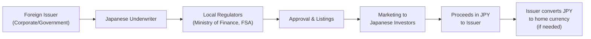

## Introduction
Local currency bonds can be, well, a bit of a puzzle at first glance. Yet they are an integral part of modern fixed-income markets—especially if you’re eyeing cross-border diversification opportunities. Panda Bonds, Samurai Bonds, and Masala Bonds are some of the quirkier-sounding instruments out there, but trust me, there’s nothing whimsical about their importance. These bonds allow foreign issuers to tap into host-country markets, typically denominating the debt in the local currency. And that bit—where the bond is denominated in the local currency—changes the game for both issuers and investors.

Anyway, here in this reading, we’ll explore some of the major local currency bond types, highlight what makes them so unique, and discuss the tricky risk dynamics associated with them (particularly currency risk). We’ll also provide a high-level overview of the regulatory environment that surrounds them, along with examples and a few personal anecdotes here and there. The hope is that by the end, you’ll feel more confident in identifying, analyzing, and maybe even investing in or recommending these local currency bonds as part of a multi-asset portfolio strategy.

## Why Local Currency Matters
I remember the day a keen colleague of mine said, “Hey, do you think we should put some Masala Bonds in our portfolio so we can get direct exposure to Indian rupee returns?” That one comment reminded me of how local currency bonds can open up investor access to emerging markets without requiring complicated foreign exchange trades or hedging strategies. Investors often prefer local currency issues when they wish to diversify or if they see an upside in an emerging currency. Conversely, the issuer might be adopting a local currency bond to reach a new set of investors and might be ready to absorb the exchange rate fluctuation if they eventually convert proceeds back to their home currency.

## Overview of Panda, Samurai, and Masala Bonds
Local currency bonds have unique names depending on the host market and the currency in which they are issued:

- Panda Bonds: Renminbi (RMB)-denominated bonds issued in Mainland China by foreign issuers.  
- Samurai Bonds: Japanese yen (JPY)-denominated bonds issued in Japan by foreign issuers.  
- Masala Bonds: Indian rupee (INR)-denominated bonds issued by either non-Indian entities or Indian issuers outside India, primarily for overseas investors.

We also have “Dim Sum Bonds,” which can be confused with Panda Bonds because both are denominated in RMB. The difference? Dim Sum Bonds are issued offshore (mainly in Hong Kong), while Panda Bonds are issued onshore in China. 

## Key Features of Local Currency Bond Types

### Panda Bonds
Panda Bonds can be a big deal for multinational firms or sovereign enterprises wanting to raise funds in RMB, tapping into China’s growing domestic market. But let me tell you, the local regulatory environment can be pretty stringent. The People’s Bank of China (PBoC) and other Chinese regulatory agencies impose specific guidelines on who can issue these bonds, how the proceeds can be used, and the disclosure norms required. If you’re new to the Chinese capital market scene, you might spend months (or years) just securing approvals. Nonetheless, the success of major Panda Bond issuances by countries like South Korea (for example, the Korean government or policy banks) has illustrated the potential for diversification and interest rate advantages in RMB.

In terms of currency risk, foreign entities that issue Panda Bonds often convert the RMB proceeds into their home currency through foreign exchange markets or might keep some deposits in RMB for local investments. That means the issuer typically shoulders currency fluctuation risk—they borrowed in RMB, but their revenues might be in USD, EUR, or some other currency. If the RMB appreciates, the issuer’s repayment burden in home-currency terms can rise.

### Samurai Bonds
Samurai Bonds are yen-denominated offerings launched by non-Japanese issuers in Japan’s domestic market. Why on earth would a Latin American corporate, for instance, want to raise yen? Well, historically, Japan’s interest rates have been super low. So, if the yields are favorable (and they often are), it can be cheaper for foreign corporates and governments to raise capital in Japan. From the investor’s perspective, Samurai Bonds allow them to invest in foreign credits but remain denominated in yen. That’s huge because it hedges local investors from direct FX risk.

However, you can’t just waltz into Tokyo and issue. Samurai Bonds are overseen by Japan’s Ministry of Finance and the Financial Services Agency. Issuers must meet listing and disclosure requirements. If you’re a new issuer, you might also have to obtain appropriate credit ratings from Japanese rating agencies. Overall, Samurai Bonds can be a useful tool for fostering cross-border cooperation, but you have to do plenty of homework to ensure compliance.

### Masala Bonds
When I first heard of “Masala Bonds,” I chuckled at how the popular Indian spice mixture found its way into bond nomenclature. But in practice, Masala Bonds are no joke. Issuing these rupee-denominated bonds in offshore markets (like London or Singapore) is a strategic move by both Indian issuers and foreign institutions. By denominating the bond in INR, the currency risk largely shifts to the issuer if they have no natural rupee revenue sources. In many cases, Indian banks and corporates issue Masala Bonds to attract foreign capital but keep the rupee exposure. 

A big driver behind Masala Bonds was the Reserve Bank of India’s push to internationalize the rupee, deepen the bond market, and reduce currency mismatches in the economy. The idea is that if India-incorporated entities can borrow in rupees from overseas investors, it mitigates the balance sheet risk that typically arises when borrowing in major reserve currencies. Of course, foreign investors in these instruments might be taking views on the future of the rupee. If the rupee were to appreciate, they effectively get more dollars for their investment. If it depreciates, the opposite is true.

### Dim Sum Bonds
Dim Sum Bonds are also worth a quick note: these are RMB-denominated debts issued outside Mainland China, often in Hong Kong. They can be seen as “offshore RMB bonds,” as opposed to onshore Panda Bonds. Dim Sum Bonds sometimes have less stringent requirements compared to Panda Bonds because they fall under Hong Kong’s regulatory framework, which, historically, has been relatively more open to international capital flows.

## Market Mechanics and Regulatory Landscape
Local currency bond mechanics are driven by the interplay of domestic regulations, local currency demand, and the central bank’s objectives around capital market development. Typically, to issue a Panda, Samurai, or Masala Bond:

1. The issuer, who is foreign to the host market, seeks regulatory approval from the local authorities (like the PBoC in China, or the Ministry of Finance in Japan).  
2. The issuer obtains local credit ratings, which might be separate from their global rating because local agencies often have additional requirements or localized rating scales.  
3. Disclosure documents are prepared to the standards stipulated by local law.  
4. The bond is underwritten by local investment banks or securities firms, who then market it to local institutional and sometimes retail investors.  
5. The bond is listed on a local exchange or recognized platform, complying with ongoing disclosure norms.

Yes, it can smell like a lot of red tape. But from a policy perspective, emerging (and even developed) markets see local currency bond issuance by foreign entities as a step forward in capital market deepening. It helps develop broader yield curves, fosters competition among market participants, and often encourages liquidity in the local bond markets.

## Currency Risk Dynamics
Let’s break down currency risk. Local investors in, say, Samurai Bonds are shielded from direct FX risk because the bond is denominated in Japanese yen. However, the foreign issuer has effectively borrowed in JPY, so if they don’t have natural yen revenues (e.g., from operations in Japan), they face an exchange rate risk upon maturity when they have to repay principal and coupon. Some issuers may hedge through currency swaps or forward contracts, but that can add extra costs.

Over in the Panda Bond space, if you’re a US-based company raising RMB, you’re making a bet—consciously or not—on the direction of the RMB relative to USD. An adverse currency movement might hike up your effective borrowing cost. But if you expect strong Chinese business revenues in RMB, or if you think the RMB will remain stable, the financing might be cheaper than raising USD in the States.

## Local Currency Bond Structures
Local currency bonds can adopt different structures (fixed-rate, floating-rate, or even zero-coupon), but generally, they must align with local market conventions. For instance, some Samurai Bonds are offered with both fixed and floating coupons to cater to varying appetites among Japanese investors. The same holds true for Panda and Masala Bonds, though local regulations in each region also determine which coupon formulas (e.g., references to local benchmark rates) are permissible.

Tax treatment matters, too. Under IFRS or US GAAP, organizations might have to treat foreign currency borrowings differently in their balance sheets and note disclosures. They might face foreign exchange gains or losses that have to be recognized in net income or in other comprehensive income, depending on how the bond is categorized (e.g., if it’s designated as a hedge).

## Diagram: Issuance Flow of Local Currency Bonds

Below is a simple mermaid diagram illustrating the journey of a foreign issuer launching a Samurai Bond in Japan (though the process is quite similar for Panda, Masala, or Dim Sum Bonds):

## Practical Examples and Case Studies

### Case Study 1: Global Bank Issues Panda Bonds
A European bank wanted to diversify its funding sources and tap into the vast Chinese savings pool. So it issued a series of Panda Bonds in Shanghai. The bank utilized a portion of the proceeds for local lending in RMB to multinational corporations operating in China. This provided a “natural hedge” for the bank because it had both assets (loans) and liabilities (bonds) denominated in RMB. Net effect: reduced currency mismatch and no immediate FX conversion required.

### Case Study 2: Latin American Corporate Embraces Samurai Bonds
A large Brazilian infrastructure company needed cheaper funding than what it could access in its home market. It saw yen interest rates and thought, “Wow, that’s pretty attractive.” So they hopped over to Tokyo and floated Samurai Bonds. Yes, they needed to convert the proceeds to Brazilian reals for their local projects, and they faced some exchange rate risk. But by entering into a cross-currency swap—where they swapped JPY interest payments for BRL—they effectively locked in a synthetic real interest rate at terms better than what they would get in the Brazilian bond market (given inflation and local yields). 

### Case Study 3: Masala Bond for an Infrastructure Project
An Indian renewable energy firm raised funds via Masala Bonds on the London Stock Exchange. By doing so, they avoided exposing themselves to foreign currency fluctuations that would typically accompany USD or EUR borrowing. The foreign investors expected some yield pickup plus the possibility of rupee appreciation. However, in practice, the rupee’s path can be volatile, so from the investor’s vantage point, these returns can be less predictable than a straightforward hard currency bond.

## Portfolio Management Considerations
From a portfolio manager’s viewpoint, local currency bonds can be fitted into specialized emerging market bond allocations or multi-currency strategies. At CFA Level I, a question might ask: “Why might an investor prefer Samurai Bonds over a direct foreign bond denominated in USD?” The short answer: currency risk. By buying a yen-denominated Samurai Bond, a Japanese investor stays within their currency zone—no direct FX exposure. But the deeper rationale also includes regulatory, tax, and market access considerations.

If you’re an asset manager employing liability-driven investing (LDI) principles, local currency bonds might help match liabilities if those liabilities are also yen or RMB denominated. On the other hand, for an insurance company in Europe, exposure to local currency bonds in Asia might be used as a portfolio diversifier or an alpha source if you anticipate currency appreciation in the host market. But it comes with additional complexities in risk budgeting and hedging.

## Potential Pitfalls and Best Practices
1. Regulatory Hurdles: Make sure you thoroughly understand the approval requirements and listing rules. Missing any critical piece of documentation can delay issuance or block it altogether.  
2. Liquidity Issues: Some local currency bond segments can be less liquid, making it harder to exit large positions.  
3. Exchange Rate Fluctuations: The issuer often retains the short end of the currency stick—hedging strategies or natural offsets can reduce risk, but at a cost.  
4. Tax and Accounting Complexity: IFRS vs. US GAAP treatment of foreign-denominated liabilities can be complicated; ensure compliance to avoid restatements or fines.  
5. Market Familiarity: Local investor appetite can shift with macroeconomic conditions. Sometimes the local currency bond market might freeze up due to policy changes or capital controls (looking at you, historically, China and various emerging markets).

## Personal Anecdote
Let me just share a quick personal story. Years ago, I was exploring Samurai Bond investments for a client who was particularly interested in Japanese farmland expansions—yes, farmland. The company was from Australia, but the farmland in question was in rural Japan, so they had some expenses in yen. Issuing in yen for them made good sense: they had a partial inflation and currency hedge because their local revenues would be in yen as well. It seemed like a perfect match. But boy, I remember how the labyrinth of Japanese disclosures took ages. In the end, it worked out well, but only after a few headaches and a lot of coffee-fueled nights with local law firms.

## Link to Broader Market Themes
Local currency bonds reflect a broader trend of “currency internationalization,” especially in emerging markets. China’s push with the RMB is a prime example of a government steadily lifting capital controls, encouraging foreign issuers to borrow in RMB, and turning Shanghai into a global financial center. Same goes for India’s encouragement of Masala Bonds. By expanding local currency bond markets, these countries aim to reduce reliance on external currencies (like USD or EUR) and to deepen their domestic capital markets. 

## Conclusion
All told, Panda, Samurai, Masala, and other local currency bonds are clever instruments for bridging markets and lowering financial boundaries—sometimes. They offer local investors currency comfort while letting foreign issuers tap new pools of capital. From a curriculum standpoint, keep in mind how these instruments shift currency risk from investor to issuer, the regulatory background, and the impetus for capital market deepening. As with many aspects of global fixed income, details matter. Each local currency bond type has its own quirks, redemption procedures, tax implications, and risk-reward trade-offs.

Before we get to some practice questions, let’s quickly reiterate: if you plan to add local currency bonds to your portfolio, either hedging or matching currency inflows and outflows is indispensable. Pay attention to liquidity constraints, regulatory changes, and your own risk tolerance. After all, no bond is truly “risk-free”—not even the ones named after our favorite local foods or animals.

## Additional References
• IMF Working Paper: “Local Currency Bond Markets in Emerging Economies.”  
• People’s Bank of China (PBoC) Guidelines on Panda Bond Issuance.  
• Japanese Ministry of Finance (MoF) Publications on Samurai Bonds (https://www.mof.go.jp/)  
• Reserve Bank of India (RBI) Circulars on Masala Bonds.  
• CFA Institute. (Latest). CFA Program Curriculum.  

## Final Exam Tips
• Understand how currency risk differs for the issuer vs. the investor.  
• Pay attention to the regulatory environment: local approvals and disclosure norms often appear in exam questions.  
• Keep an eye on the yield differential. Sometimes local currency yields can be more attractive, but that might be offset by currency depreciation.  
• IFRS vs. US GAAP note disclosures for foreign-denominated debt can show up in “Financial Statement Analysis” context.  
• In item-set questions, watch out for how capital market deepening benefits the host country.  

## Test Your Knowledge: Local Currency Bonds Quiz



### A foreign company issues Samurai Bonds in Japan. Who typically bears the exchange rate risk?

- [x] The foreign issuer
- [ ] The Japanese investor
- [ ] The Bank of Japan
- [ ] No one, as Samurai Bonds have no currency risk

> **Explanation:** Samurai Bonds are yen-denominated bonds issued by a non-Japanese issuer in the Japanese market. Investors remain in their home currency (yen), so the foreign issuer is generally the one exposed to fluctuations.

### Which of the following is TRUE regarding Panda Bonds?

- [ ] They are yen-denominated bonds issued by non-Japanese entities.
- [x] They are renminbi-denominated bonds issued onshore in China by foreign entities.
- [ ] They are rupee-denominated bonds issued outside India by Indian companies.
- [ ] They are renminbi-denominated bonds issued offshore in Hong Kong.

> **Explanation:** Panda Bonds are RMB-denominated and issued in Mainland China. Dim Sum Bonds, on the other hand, are RMB-denominated but issued in Hong Kong.

### Masala Bonds are primarily attractive to foreign investors because:

- [x] They allow exposure to Indian rupee assets without the complexity of opening local accounts.
- [ ] They eliminate all currency risks for the foreign investor.
- [ ] They are offered only by the Reserve Bank of India.
- [ ] The yields are risk-free due to Indian government guarantees.

> **Explanation:** Masala Bonds let foreign investors invest in Indian rupee instruments abroad. The investor still faces rupee currency risk in terms of currency fluctuation, but they can invest without directly entering the Indian domestic market.

### What is a primary motivation for a government to foster issuance of local currency bonds by foreign entities?

- [ ] To shift credit risk entirely to the foreign issuer
- [ ] To discourage currency inflows
- [ ] To keep local interest rates artificially high
- [x] To deepen the local capital market and support currency internationalization

> **Explanation:** A key benefit is that it deepens the local markets by growing demand, cultivating more liquid markets, and building yield curves—contributing to longer-term currency and economic stability.

### If a global bank issues Panda Bonds in China, how might it hedge its currency exposure?

- [x] By engaging in RMB/USD cross-currency swaps
- [ ] By doing nothing since the issuer has no currency exposure
- [ ] By issuing additional Samurai Bonds
- [ ] By buying Indian rupee forwards

> **Explanation:** A cross-currency swap from RMB to the issuer’s home currency (e.g., USD or EUR) is a common method of hedging the repayment obligation in RMB.

### Which statement best describes Dim Sum Bonds compared to Panda Bonds?

- [ ] Both are regulated identically by the People’s Bank of China.
- [x] Dim Sum Bonds are offshore RMB bonds issued mainly in Hong Kong, whereas Panda Bonds are issued onshore in the PRC.
- [ ] They are both equally used as prime instruments by the Chinese government to raise funds.
- [ ] Dim Sum Bonds never trade in secondary markets.

> **Explanation:** Dim Sum Bonds are RMB-denominated but issued in Hong Kong (offshore market). Panda Bonds are also RMB-denominated but issued onshore in Mainland China.

### Which of the following is typically a regulatory requirement for Samurai Bond issuance?

- [x] Obtaining Japanese credit ratings and approval from Japanese regulators
- [ ] Mandatory listing on the Hong Kong Stock Exchange
- [ ] Denominating the bond in USD
- [ ] Zero disclosure requirements

> **Explanation:** Samurai Bonds must comply with Japan’s financial regulations, including obtaining local credit ratings (often from rating agencies recognized in Japan) and meeting Ministry of Finance and Financial Services Agency guidelines.

### From a portfolio context, which scenario might most benefit from including Masala Bonds?

- [x] An investor seeking portfolio diversification and a potential INR appreciation
- [ ] An investor needing exposure solely to Japanese yen
- [ ] A firm that wants to avoid any exposure to emerging markets
- [ ] A government prioritizing foreign currency reserves

> **Explanation:** Masala Bonds offer rupee exposure, which can serve as a diversification tool. They do require some emerging-market risk tolerance, so they’re not for those who want to avoid EM risk entirely.

### What is the likely impact on a foreign issuer’s cost of funding if the local market in which the bond is issued has lower interest rates, but there is also significant volatility in the local currency?

- [x] The overall cost might still be high once currency risk hedges are factored in.
- [ ] No impact at all, because the interest rates are always more important.
- [ ] The cost of funding remains the same as in their home market.
- [ ] Hedge costs are typically negligible for all local currency bonds.

> **Explanation:** Even if local rates are low, hedging a volatile exchange rate can drive up the effective cost of funding for the issuer.

### Panda Bonds, Samurai Bonds, and Masala Bonds share which of the following characteristics?

- [x] They are denominated in the host country’s local currency.
- [ ] They are all denominated in USD.
- [ ] They eliminate currency risk for the issuer.
- [ ] They can only be issued by the World Bank.

> **Explanation:** These bond types are denominated in the currency of the host country (RMB for Panda, JPY for Samurai, and INR for Masala). Currency risk typically lies with the issuer.


