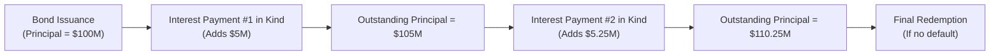

## Introduction and Overview

Payment-in-Kind (PIK) and Toggle Bonds can feel a bit complicated when you first encounter them—sort of like discovering a hidden level in a video game. Maybe you’ve heard of these bonds popping up in leveraged buyouts (LBOs) where companies, often strapped for near-term cash, still need to offer investors a return without draining their cash flows. Despite their name, these bonds don’t serve you coupons on a silver tray. Instead, they allow a unique method of “paying” interest by issuing additional securities rather than making a cash payment. Cool, right? But there’s more to it than just saving some cash in the short term.

Below, we’ll dig into what PIK and Toggle Bonds are, how they’re structured, why they exist, and what kind of risks and rewards they entail for investors. We’ll parse out common pitfalls, explore some real-world examples, and see how they fit into the larger picture of fixed-income securities.

## Defining Payment-in-Kind Bonds

Payment-in-Kind (PIK) bonds are instruments that either allow or require the issuer to make coupon payments in the form of additional debt securities rather than in cash. Let’s say you hold a PIK bond that accrues a 10% interest payment annually. Instead of receiving a 10% cash coupon, you might receive an equivalent amount of additional PIK notes or bonds, effectively adding to your existing principal or carrying forward an accrued claim. Often you’ll see PIK bonds in situations where the issuer has limited liquidity early on—like start-ups or companies undergoing a leveraged buyout.

### Key Characteristics

• No Cash Coupon (At Least Initially): Because the issuer can pay interest using more debt, there’s minimal (or zero) cash outflow for them during the bond’s early life.  
• Higher Yield Potential: PIK bonds usually carry higher coupons because they pose higher risk—investors expect to be compensated for the greater likelihood of issuer default.  
• Capital Accumulation: Each time a PIK bond pays interest in kind, the outstanding principal effectively goes up or the investor’s bond position size effectively grows. Eventually, the holder might receive a significantly larger face amount at redemption (assuming no defaults happen in the meantime).  

Think of a PIK bond as a “pay me later” approach for the issuer. Investors trust in the issuer’s future profitability and capacity to refinance or repay those added amounts. Meanwhile, the bond gets riskier the more interest accrues over time.

### A Quick Anecdote

Many years ago, I was fascinated by a mid-sized media company that used PIK bonds because they were funneling all available cash into a big expansion strategy. The CFO joked that sending out new bonds every coupon period felt like writing “IOUs for IOUs.” It allowed them to keep cash in the business for strategic acquisitions, but it cranked up their overall debt load. When demand forecasts disappointed, the company’s leverage soared to uncomfortable levels—and bondholders were left biting their nails until the final repayment came through. This little anecdote always reminds me that PIK structures can lead to ballooning debt obligations if you’re not careful.

### When Are PIK Bonds Used?

• Leveraged Buyouts (LBOs): Private equity firms often use PIK bonds to finance acquisitions. This structure gives the newly acquired target more flexibility to reinvest cash or pay off more pressing obligations.  
• Distressed or Cash-Strapped Issuers: Companies that need breathing room to stabilize operations sometimes choose PIK structures to avoid defaulting on cash coupon payments.  
• Growth-Oriented Firms: Startups or expansion-stage firms may issue PIK bonds to retain as much cash as possible for growth.  

## Toggle Bonds

Toggle Bonds introduce a twist to the PIK concept. They give the issuer a choice (an embedded option of sorts) to alternate—“toggle”—between paying interest in cash or in kind. Toggle Bonds usually start with the standard option of paying in cash, but if the issuer’s cash flows get tight, they can switch to paying interest with additional bonds.

### Core Features

• Issuer Flexibility: The primary advantage for the issuer is the ability to decide payment mode (cash vs. in kind) based on their financial situation.  
• Higher Coupon/Yield: Because there’s an optionality advantage for the issuer, investors typically require a higher yield to compensate for the possibility of receiving more debt instead of actual cash.  
• Credit Sensitivities: If the issuer repeatedly exercises the “in-kind” option, it might signal deteriorating liquidity or a need to preserve cash, which can negatively impact the bond’s perceived creditworthiness.  

Toggle Bonds, in a way, represent a big “maybe” for investors: maybe you’ll get cash, or maybe you’ll get a bunch more bonds in your portfolio. This can produce a fair bit of uncertainty and requires careful monitoring of the issuer’s financial situation.

## Structural Considerations

Payment-in-Kind and Toggle Bonds both share a notable feature: coupon payments may not be paid fully in cash. Investors typically weigh these factors:

• Deferred Cash Flow: PIK and Toggle structures delay the cash compensation to the investor. In the interim, the accrued interest folds into principal or new debt securities.  
• Larger Principal at Maturity: Over time, the face amount owed can grow significantly. That can be fantastic if the issuer remains solvent and repays at par. If not, it can lead to a bigger default loss.  
• Impact on Leverage: For the issuer, each PIK or toggled coupon effectively adds new layers to their debt stack. With each coupon period, the capital structure can become more levered, potentially endangering existing covenants.  
• Distressed Debt Potential: Analysts often keep close tabs on liquidity measures, operating cash flows, and overall market conditions. Frequent toggling or repeated payment-in-kind can be a red flag for mounting credit risk.

Below is a quick visual that illustrates the accumulation of outstanding principal in a simplified PIK scenario:

As you can see, each time interest is paid in kind, the principal or the total claim on the issuer’s resources grows.

## Risk and Return Analysis

Let’s talk about the elephant in the room: risk. PIK and Toggle Bonds tend to be riskier than plain-vanilla counterparts. In corporate finance parlance, these bonds often reside lower in the capital structure or come from issuers that are already highly leveraged. You can’t magically create money by deferring interest, so let’s break down the major considerations:

### Credit Risk

The probability of default is typically higher for PIK issuers, particularly if they’re employing this structure to preserve scarce cash flow. By the time the bonds are near maturity, the outstanding obligations can be quite large. Analysts keep an eye on:  
• Coverage Ratios (e.g., EBITDA-to-Interest)  
• Debt-to-Equity or Debt-to-EBITDA levels  
• Financial Covenants that might be triggered if the company’s leverage blows out  

### Liquidity Risk

Even though PIK or Toggle interest preserves near-term cash, an issuer’s liquidity can still degrade if their operations underperform. Toggle Bonds may telegraph the issuer’s environment: repeated toggling to PIK mode can suggest slowing revenue growth or external economic hardships.

### Demand and Yield

Because of the heightened risk, investors generally demand higher yields. Essentially, they’re being paid for the possibility that their ultimate return could be part-cash, part-more-bonds. In a robust credit market (when interest rates are low and liquidity is abundant), PIK or Toggle issuance might spike because companies can secure funding relatively easily. In a tightening credit environment, such issuance drops because investors become more risk-averse.

### Example: Accrued PIK Interest Calculation

Let’s assume a PIK bond with a 10% annual coupon on a notional principal of $1,000, and it allows interest to be paid entirely in new bonds. Each year’s “coupon” is added to the outstanding amount.  

• Year 1 Principal Start: $1,000  
• Year 1 PIK Coupon (10% of $1,000): $100—added to principal  
• Year 1 Principal End: $1,100  

• Year 2 PIK Coupon (10% of $1,100): $110—added to principal  
• Year 2 Principal End: $1,210  

• Year 3 PIK Coupon (10% of $1,210): $121—added to principal  
• Year 3 Principal End: $1,331  

Should the issuer repay on time at the end of Year 3, you will receive $1,331 total. But if the issuer runs into a liquidity crunch, your risk is amplified because you’re left holding a bigger bag of claims.

## Where PIK and Toggle Bonds Fit in the Capital Structure

Often, PIK or Toggle bonds come in below more senior obligations. In a leveraged buyout, for example, you might see a layered structure:

• Senior Secured Bank Debt (1st Lien)  
• Second-Lien Debt or Senior Unsecured Bonds  
• Subordinated or Mezzanine Debt (where PIK may occur)  
• Equity  

Because PIK debt frequently sits near the lower rung, the probability of recovery if a default occurs is lower. Analysts incorporate these structural subordination issues into their pricing, requiring a yield premium over more senior securities.

## Regulatory and Accounting Tidbits

From an accounting perspective, recognized interest expense is often accrued on the income statement even if no cash actually goes out the door. Under both IFRS and US GAAP, the PIK interest is typically capitalized into the bond’s carrying amount on the balance sheet. Over time, this drives up reported total liabilities.  
• IFRS/US GAAP: The issuer must recognize interest expense each period in an amount that reasonably reflects the economic cost, whether paid in cash or in kind.  
• Tax Implications: In many jurisdictions, the issuer may still deduct interest expense (PIK or otherwise) for tax purposes, though local rules can vary.

## Analysis Framework for Investors

When analyzing PIK or Toggle Bonds, you might want to consider:  
1. TheIssuer’sCashFlowForecasts: Is there a realistic chance for the issuer’s financial performance to improve enough to handle the ballooning obligations?  
2. CovenantLightorCovenantHeavy?: Are there triggers that might cause a default or forced restructuring if leverage gets too high?  
3. LiquidityScenarioAnalysis: Evaluate short-term vs. long-term liquidity, especially if repeated toggles are exercised.  
4. Recovery Rate Stress Test: If the issuer defaults, how likely is recovery given the other pieces of the capital structure?  
5. Market Conditions: In bullish credit markets with strong liquidity, the issuer might survive a few toggles. In a downturn, a repeated PIK strategy can quickly turn into distress.

## Potential Pitfalls and Challenges

• Ballooning Liability: The total payout at maturity can become daunting for issuers, leaving them on the edge of default risk if business projections fall short.  
• Negative Market Perception: The market might interpret PIK usage as a sign of vulnerability or aggression in capital structure decisions, especially if toggles are frequently invoked.  
• Price Volatility: Because of higher credit risk, PIK bonds can exhibit pronounced price swings, particularly if negative news emerges about the issuer’s performance.  
• Complex Documentation: Payment triggers, toggling conditions, and possible stepping-up of coupons can make these bonds tricky for less-experienced investors to interpret properly.

## Best Practices for Portfolio Management

• Diversification: If you are going to hold PIK or Toggle Bonds, do so as part of a diversified strategy that also includes stable, well-rated instruments.  
• Active Monitoring: Keep tabs on the issuer’s periodic disclosures—watching especially for changes in operating cash flows, covenant headroom, or credit ratings.  
• Stress Testing: Evaluate how your portfolio might behave in a worst-case scenario (e.g., sudden drop in revenues or broad market downturn).  
• Covenant Review: Clauses in the indenture matter. Make sure you understand restrictions on additional debt issuance, dividend payouts, or other corporate actions that might affect your bond’s standing.

## Real-World Usage and Examples

• Private Equity: A large chunk of PIK activity is done by private equity sponsors leveraging buyouts. A sponsor might prefer PIK to preserve operational cash for expansions, hoping that by the time the company matures, the improved cash flows will handle the heavier debt.  
• Corporate Growth Financing: Some mid-stage companies also issue PIK debt for expansions, marketing campaigns, or capital investments. They bet on future returns, so they keep as much immediate liquidity as possible.  
• Distressed Situations: We occasionally see PIK or Toggled structures in distressed exchange offers, giving the issuer a measure of relief from near-term cash obligations.

## Exam Relevance and Application

On your CFA exam, you might encounter scenario-based questions requiring you to:  
• Calculate accrued interest on a PIK bond over multiple periods.  
• Analyze how toggling from cash to PIK influences an issuer’s debt burden and a bond’s yield.  
• Discuss how repeated issuance of PIK interest payments might affect credit quality and investor-required returns.  
• Compare the risk profile of PIK or Toggle Bonds to other high-yield securities.  

Be prepared to handle quick math on principal accumulation, as well as conceptual questions about the trade-offs between short-term cash preservation and long-term rising indebtedness.

## Practical Tips for Mastering PIK and Toggle Bonds

• Think of PIK as delayed gratification (for the investor) and delayed cost (for the issuer).  
• Master the timeline perspective: future obligations can balloon, which intensifies default risk.  
• Use ratio analysis to gauge liquidity and coverage—spotting any potential covenant breach.  
• Start with simpler examples (like the $1,000 principal at 10% interest) to get the logic behind compounding principal.  
• Stay updated: credit markets can shift drastically in short periods, influencing how feasible a repeated PIK or toggle strategy might be.

## Conclusion: Bringing It All Together

Payment-in-Kind and Toggle Bonds demonstrate how creative financing can be—sometimes, you need a structure that grants short-term relief from cash outflows to facilitate expansions or acquisitions. But with creativity comes elevated risk. As an aspiring analyst or portfolio manager, your expertise lies in weighing that risk-return trade-off, anticipating how an organization’s capital structure might evolve, and evaluating the potential for an upsized principal redemption (or a shortfall) down the line.

If there’s one big takeaway, it’s this: PIK or Toggle Bonds are not just “no-cash” coupons. They’re a strategic choice that demands careful, ongoing scrutiny. The more a firm leans on in-kind payments, the more an investor must question if ballooning interest obligations can realistically be met. And maybe—if everything works out as planned—investors get handsomely rewarded for shouldering that extra risk.

## Further Exploration

• S&P Global Ratings Criteria on PIK and Toggle Bonds.  
• “Private Equity Demystified: Leveraged Buyouts and PIK Structures,” C. Wright, Corporate Finance Institute.  
• [Moody’s Analytics: Payment-in-Kind Bonds](https://www.moodys.com/)  
• “Leveraged Buyouts and High Yield Financing,” by Schilt and Lockett.  
• IFRS Guidance on Debt Accounting (IFRS 9) and US GAAP (ASC 470).

---

## PIK and Toggle Bonds: Knowledge Check



### A corporation issues a PIK bond to finance an acquisition. Which of the following is the most direct benefit for the issuer?

- [ ] Reduced overall credit risk from the perspective of lenders.  
- [ ] Lower coupon payments relative to conventional bonds.  
- [x] Preservation of cash flow in the early years.  
- [ ] Guaranteed improvement in credit rating over time.  

> **Explanation:** The primary reason issuers use PIK bonds is that it allows them to conserve cash; they “pay” interest by issuing more debt rather than using cash.

### Which statement best describes a feature of Toggle Bonds?

- [ ] They require at least half the coupon to be paid in cash at all times.  
- [ ] They only allow a single switch from cash payments to PIK payments.  
- [x] They permit the issuer to choose between cash or in-kind interest at specified intervals.  
- [ ] Investors have the option to receive stock instead of bonds.  

> **Explanation:** Toggle Bonds feature an embedded option for the issuer to toggle between cash or PIK coupons based on their cash flow needs.

### What is a common outcome when an issuer frequently exercises the “in-kind” feature in a Toggle Bond?

- [ ] The bond automatically converts to equity.  
- [ ] The bond’s maturity shortens due to covenant provisions.  
- [x] The debt balance owed grows more quickly, raising default risk.  
- [ ] The issuer qualifies for an immediate upgrade in credit rating.  

> **Explanation:** Repeated PIK toggling can lead to compounding debt balances—a sign of weaker liquidity that increases default risk.

### In a leveraged buyout scenario, PIK bonds are often placed in which part of the capital structure?

- [ ] They are always the most senior claims on assets.  
- [x] They are often near or at the subordinated or mezzanine layers.  
- [ ] They rank equal to first-lien debt.  
- [ ] They must be issued by a separate special purpose entity.  

> **Explanation:** PIK bonds are typically lower in the hierarchy than senior secured obligations, exposing them to higher loss severity if default occurs.

### Which of the following is the main driver behind higher nominal yields on PIK or Toggle Bonds?

- [ ] They have less credit risk relative to standard investment-grade bonds.  
- [x] Investors demand additional compensation for the issuer’s flexibility and higher default risk.  
- [ ] The bonds provide an immediate tax advantage to bondholders.  
- [ ] They are considered zero-coupon bonds from an accounting standpoint.  

> **Explanation:** Higher yields serve as compensation for increased risk, given the potential deferral of cash payments and ballooning debt levels.

### An investor wants to forecast the principal outstanding for a PIK bond at maturity. Which piece of information is most critical?

- [x] The bond’s coupon rate and compounding schedule.  
- [ ] The current yield on Treasury securities.  
- [ ] The issuer’s historical equity price volatility.  
- [ ] The market’s inflation expectations.  

> **Explanation:** The coupon rate and whether it is paid in kind will determine how much additional principal accumulates each period.

### A repeated switch to PIK payments by the issuer could signal:

- [x] Deteriorating liquidity or a strategic desire to retain cash.  
- [ ] A certain improvement in credit rating as coupons are deferred.  
- [x] Higher credit risk as obligations grow.  
- [ ] Guaranteed stable bond prices because interest is being “paid.”  

> **Explanation:** Repeated PIK toggling often indicates the issuer is under liquidity stress, resulting in higher risk for bondholders.

### In analyzing a Toggle Bond, an analyst should pay particular attention to:

- [ ] The issuer’s intangible asset valuations.  
- [ ] The bond market’s day count convention.  
- [ ] Political considerations in the issuer’s home country only.  
- [x] Embedded covenants that may be triggered by rising debt levels.  

> **Explanation:** Toggle Bonds can rapidly increase debt balances, so covenants on leverage or coverage ratios often become critical.

### How does IFRS generally require issuers to account for PIK interest expense?

- [x] It is accrued as interest expense, increasing the carrying amount of the debt.  
- [ ] It is treated as a capital distribution, reducing the issuer’s equity.  
- [ ] It is ignored until maturity when a lump sum is paid.  
- [ ] It is recognized only when a cash disbursement occurs.  

> **Explanation:** Under IFRS, interest expense is recognized in the income statement, and if coupons are paid in kind, it increases the bond liability on the balance sheet.

### True or False: Issuing PIK bonds generally reduces an issuer’s overall financial leverage ratio over time.

- [x] True  
- [ ] False  

> **Explanation:** Actually, this statement can be tricky. Issuing PIK bonds does not typically reduce leverage; it often increases it. However, in very specific circumstances—like partial redemptions or strategic refinancing—some short-term improvement might be observed. Still, as a general rule, PIK usage results in higher leverage. So this “True” or “False” question highlights a subtlety: if the statement had no context, the safe typical answer would be that it’s false to assume PIK always reduces leverage. But given special disclaimers or certain contexts (like immediate refinancing or partial equity conversions), there can be exceptions. Use caution in exam scenarios where context is key!


