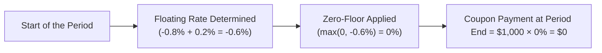

## Introduction
Negative coupon bonds are one of those rare but fascinating phenomena in the world of fixed income. Let’s be honest: it sounds pretty counterintuitive, right? We usually think of bonds as something that pays us interest, not something we pay the issuer for holding. Yet in certain unusual (and sometimes downright surreal) market circumstances, negative coupons have become a reality—particularly in regions like parts of Europe and Japan during strongly accommodative monetary policies.

Oddly enough, I remember the first time I encountered a negative coupon bond in a portfolio. It felt like looking at an upside-down map—something that made sense to someone, somewhere, but took me a moment to process. With that in mind, we’ll break down how negative coupon bonds arise, highlight the role of zero-floor provisions in floating-rate structures, and explore the nuances that any analyst should consider if interest rates dip below zero. 

## Overview of Negative Coupon Bonds
A “negative coupon bond” is one that literally pays a coupon rate below zero. Instead of you, the investor, receiving interest, you might have to pay the issuer for the privilege of holding the bond. It’s basically the world flipped on its head.

But how does this even happen? It usually occurs when short-term policy rates, or major floating-rate benchmarks (like EURIBOR in Eurozone countries) sink into negative territory. Some floating-rate instruments are tied to reference rates that can go negative. And if the spread is not sufficient to keep the coupon rate above zero, you get a negative coupon.

In a simpler sense, if your bond’s coupon is calculated as:

Coupon Rate = (Reference Rate) + (Spread)

…then, in an environment where reference rates are deeply negative, a modest or even moderately positive spread might not be enough to keep coupons above zero. Once that sum goes negative, the coupon also becomes negative.

Unlike more common scenarios in which we simply see yields fall below zero (meaning you pay more than par for the bond, guaranteeing a loss if held to maturity), negative coupon rates represent a contractually stated negative payment stream. That means the issuer literally receives money from you—albeit via a lower redemption or a direct offset to principal—throughout the life of the bond.

## Drivers Behind Negative Coupon Structures
One big question is: Why might anyone intentionally structure a negative coupon bond? Usually, it’s not the direct intention of an issuer from the start—nobody sets out at issuance and says, “Let’s ensure our bond coupons turn negative.” Rather, it becomes a possibility because of how the bond’s floating-rate structure interacts with interest rates in real time.

• Extremely Low or Negative Policy Rates  
  Central bank policies such as quantitative easing, large-scale asset purchases, and negative deposit rates reduce yields across the curve. In places like the Eurozone, historically low or negative rates led to negative yields on a substantial chunk of high-grade debt.

• Market Perception and Safe Haven Status  
  Certain government or highly rated corporate bonds act like “safe haven” assets during times of crisis. Suppose a strong demand wave for those bonds drives yields through the floor—even below zero. If the reference rate on a floating bond is negative enough, the resulting coupon can also become negative.

• Short-Term or Temporary Financing Needs  
  In a few specialized financing transactions, short-term notes or floating instruments might briefly dip below zero coupon levels if the benchmark or anchor financing rates are sufficiently negative. This can reflect short-term dislocations or specialized market conditions. 

## Mechanics of a Negative Coupon
Let’s lay out a simple stylized formula. For a floating-rate note (FRN), the coupon payment over a certain period might look like this: 

Coupon Payment = Principal × (Reference Rate + Spread) × Day Count Fraction,

where Reference Rate = LIBOR, EURIBOR, or some other index rate.

If (Reference Rate + Spread) < 0, then the coupon payment is negative. In a hypothetical example:

• Reference Rate = –1.0%  
• Spread = +0.3%  
• Net Coupon Rate = –0.7%

In an annualized sense, that –0.7% means the investor effectively pays the issuer 0.7% per year on the notional amount. That negative coupon is entirely separate from whether the yield to maturity (YTM) is negative. Indeed, you can have a bond that still has a theoretical positive yield if purchased at a discount, yet has negative coupon payments along the way (though that’s pretty unusual and complicated).

## Zero-Floor Provisions
While negative coupons can (and do) occur, many bond issuances incorporate what’s known as a “zero-floor provision.” This effectively sets a lower bound at 0% for the coupon, so even if the reference rate plus spread is negative, the coupon rate is floored at zero. 

As an investor, you might see zero-floor provisions as a lifeline if rates go below zero. For instance, you don’t want to find yourself in the awkward position of paying interest to the issuer every coupon period. Let’s clarify how that works:

• Floating Rate Calculation with Floor  
  If a bond has a zero-floor provision, the coupon rate is max(0, Reference Rate + Spread).  
  In other words, “Hey, we’ll set the coupon to zero if (Reference Rate + Spread) is negative.”  

• Investor Protection  
  This ensures that the coupon never dips below zero, thus safeguarding the investor from outflows to the issuer. Even in strongly negative interest rate environments, your coupon remains at zero, effectively turning the bond into a sort of zero-coupon bond for that period.

You can picture the zero-floor as a brake pedal on negative interest rates. It’s there to ensure the coupon can’t push below zero, just like a car’s physical brake prevents it from rolling backward on a steep hill (at least in principle).

## Role in Pricing and Valuation
When interest rates go negative, traditional bond pricing might need adjustments. In typical environments, we discount future cash flows using a yield, which is often tied to an assumption that yields are non-negative or at least very close to zero. But negative rates scramble some standard formulas.

At an abstract level, let’s consider a bond with coupon payments Ci at times ti, plus redemption of par (principal) at maturity T:

Bond Price = Σ [ Ci / (1 + r)^ti ] + [ Par / (1 + r)^T ],

where r might be negative. Yes, plugging a negative r in the discount factor (1 + r) can produce less-than-intuitive results, but the math does hold. You end up with a price that can be above par even if the coupon is effectively zero (or negative). 

For floating-rate instruments with zero floors, you add an extra step in your logic or your model:

1) Compute the raw floating rate reference plus spread.  
2) Check if it’s below zero.  
3) If below zero, set the coupon to zero.  
4) Discount the resulting cash flow at the appropriate discount rate (which itself might be negative).

Let’s illustrate a simplified scenario in a timeline diagram. Imagine a floating-rate note with principal of $1,000, reference rate = –0.8%, spread = +0.2%, and a zero-floor provision.

In the above timeline, the negative net rate is floored at zero, so the coupon becomes $0. Without that floor, you would be sending the issuer $6 per year (i.e., 0.6% of $1,000).

## Risk and Return Implications
It might seem silly to hold an asset with negative coupons or negative yields, but let’s think about why an investor might still accept it:

• Safety and Liquidity  
  High-grade sovereign or quasi-sovereign bonds with negative coupons can be more about capital preservation than yield. Sometimes, large institutions have “must-buy” mandates or regulatory capital constraints that push them into negative-yield assets.

• Speculative Positioning  
  If you believe yields will go even more negative, you could potentially achieve a capital gain by buying a bond at a certain negative yield and selling it at an even lower (more negative) yield. This isn’t your everyday Joe’s trade strategy, but it does happen.

• Currency Hedging, Asset-Liability Matching  
  In certain currency contexts, you might find negative yielding bonds beneficial when factoring in FX hedging or other portfolio offsets. For instance, a pension fund might need euro-denominated assets to match euro liabilities, so their main objective might be currency or interest rate hedging, not absolute yield.

When negativity creeps into coupon rates, you still have to do the usual risk analysis: Duration, convexity, interest rate risk, and the possibility of intensifying negative yields (leading to price appreciation if rates decrease further). That said, if yields revert upward, you can take a capital loss. So it’s not without risk.

## Modeling Example
Let’s do a quick numeric example to illustrate negative coupon math. Suppose you have a 1-year FRN with a principal of $1,000 and two semiannual coupon resets:

• Reference rate (initial) = –0.50%  
• Spread = +0.30%  
• Effective coupon rate if no floor = –0.20%  
• With zero-floor? The coupon rate is floored at 0.00%  

Halfway through the year, you recalculate the reference rate. Let’s say now it’s –0.80%. On the second coupon date without a floor, this new coupon would be (–0.80% + 0.30%) = –0.50%. You’d pay $5 to the issuer (0.50% × $1,000 × 0.5) at the end of the second six-month period. But with a zero-floor provision, that coupon is bumped up to 0%, so your payment is $0.

Hence, your total coupon outlay across the year is $0 with the floor. Without the floor, you’d have paid $2 at the first coupon date and $5 at the second date, totaling $7 per year. For an investor, that’s obviously an enormous difference.

## The Broader Negative Yield Phenomenon
It’s worth highlighting that negative coupon bonds, while fascinating, are just a small slice of a bigger phenomenon: negative yields. A bond can have a negative yield even if its stated coupon is positive but so small that, at the bond’s market price, the yield dips below zero. Negative yields truly ramped up during the height of quantitative easing (QE) in the Eurozone and Japan, where central banks have used negative interest rates as part of monetary policy, driving yields for government bonds, financial institutions, and sometimes even high-grade corporates beneath zero.

## The Significance of Zero-Floor Provisions
Broadly, zero-floor provisions are a way to manage the “downside” risk for investors in a negative rate environment. If reference rates keep drifting downward, that floor is your safety net. However, the presence of a zero-floor also shifts some risk back to the issuer or changes the pricing profile. In practice, an issuer might offer a slightly lower spread at issuance to compensate for the protective feature. After all, they’re giving up the possibility of charging investors interest if rates go deeply negative.

From a valuation standpoint, that floor has value. In derivatives, we treat a floor as an embedded option—it’s basically a floor on the floating rate. If you’re analyzing a floating-rate bond with a zero-floor, you’d factor in the economic cost of that embedded derivative.

## Potential Pitfalls and Observations
1. Failing to Model Zero-Floor in Valuation  
   If you ignore a zero-floor provision when performing a scenario analysis, your bond valuation might be off in negative rate scenarios.

2. Overlooking Tax Implications  
   In some jurisdictions, having a negative coupon or near-zero coupon could have unique tax implications. For instance, the IRS or local tax authority might treat negative coupon payments as interest expense for the investor, which can get complicated.

3. Incomplete Hedging Strategies  
   If your hedging plan uses interest rate swaps or credit default swaps that assume floorless floating rates, you might miss out on the mismatch that arises when the underlying bond has a zero-floor.

4. Market Liquidity Risks  
   Negative coupon bonds, like many specialized instruments, can experience limited liquidity. In a crisis, you might struggle to find a buyer for a bond with an embedded zero-floor or negative coupon. So keep an eye on secondary market conditions.

## Real-World Cases
• Eurozone Government Debt:  
  There have been several instances where German Bunds or Swiss Confederation bonds ended up with a negative yield—and some with actual negative coupons. Ultra-safe government securities in these regions sometimes paid negative coupons during periods of intense flight to quality.

• Corporate Issuance with FRNs Tied to EURIBOR:  
  Some European corporate loans or short-dated FRNs had references to EURIBOR that sank below zero. Without contractual floors, the coupon turned negative, requiring special operational handling. In practice, many ended up with zero floors to avoid the complexity of collecting payments from the lender to the borrower.

## Practical Strategies for Analysts
• Thoroughly Read the Bond Indenture  
  If you see the words “zero-floor” or “negative coupon,” dig into the bond documentation to figure out how the mechanics are triggered and what the fallback language says.

• Perform Stress Tests  
  In your interest rate scenarios, don’t be shy about including extremely negative rates. If the early 2020s taught us anything, it’s that so-called “unthinkable” rates can happen!

• Evaluate Option-Adjusted Spread (OAS) Carefully  
  Negative coupon or zero-floor features can alter the bond’s sensitivity to interest rate changes. You might need more sophisticated modeling (including Monte Carlo) or at least an OAS framework that handles negative rate paths.

• Keep an Eye on Policy Announcements  
  Central bank decisions on deposit rates or asset purchase programs have outsized impact in negative yield environments. A 25 bps shift deeper into negative territory can significantly affect your bond valuations.

## Conclusion
Negative coupon bonds and their zero-floor provisions represent a truly unexpected quirk in fixed income markets—one that grew more prominent with the era of negative interest rates in Europe and beyond. While they’re far from typical, these instruments highlight the importance of fully understanding a bond’s contractual mechanics. After all, you definitely want to know if you might be paying your issuer just for the privilege of holding their debt!

Despite how it may sound, negative coupons don’t necessarily mean a guaranteed loss. The overall yield to maturity, purchase price, and potential capital gains or losses also factor in. But the complexities of a negative-rate environment demand a careful approach. If you see mention of negative coupons or zero-floor provisions, give yourself the time to walk through the details. Trust me, the last thing you want is an unpleasant surprise when your portfolio mysteriously starts sending cash flows in the wrong direction.

## References
- European Central Bank policies and negative interest rates:  
  https://www.ecb.europa.eu/home/html/index.en.html  
- Hull, J. (2020). “Risk Management and Financial Institutions.” Wiley.  
- Bank for International Settlements (BIS) papers on negative yielding bonds and market developments.  
- CFA Institute (2025). “CFA® 2025 Level I Curriculum, Volume 6: Fixed Income.”  
- Discussions in Chapter 6 (Bond Pricing and Valuation Basics) of this volume give additional context for discounting cash flows under different rate scenarios.

-----

## Test Your Knowledge: Negative Coupon Bonds and Zero-Floor Provisions



### A bond with a floating coupon is referenced to a negative interest rate with no spread. If the bond has no floor, what happens to the coupon payment?

- [ ] It remains at zero.  
- [ ] It reverts to a fixed positive coupon.  
- [x] It becomes a negative payment, effectively requiring the investor to pay the issuer.  
- [ ] It is deferred until the reference rate turns positive.  

> **Explanation:** If the reference rate is negative and no floor or spread exists to offset it, the coupon rate itself becomes negative, meaning the investor pays the issuer.  

### Which of the following best describes a zero-floor provision for a floating-rate note?

- [ ] It sets the spread on the bond to zero if the spread is negative.  
- [x] It ensures the coupon never falls below zero, effectively protecting the investor from negative coupon payments.  
- [ ] It limits yield volatility by capping the interest rate at zero.  
- [ ] It provides recourse to the issuer if the spread is below zero.  

> **Explanation:** The zero-floor provision protects investors by ensuring that if (reference rate + spread) is negative, the coupon rate is set at zero instead of a negative value.  

### Why might an issuer be willing to include a zero-floor provision in a floating-rate bond?

- [ ] It allows them to issue at a much higher coupon rate in normal conditions.  
- [x] It is demanded by investors who do not want to assume the risk of paying interest to the issuer in negative rate scenarios.  
- [ ] It has no impact on the bond’s pricing or spread.  
- [ ] It automatically guarantees a lower bond price.  

> **Explanation:** Investors often require zero-floor provisions in negative-rate environments to avoid situations where they must pay interest to the issuer. The issuer typically compensates by offering a slightly lower spread.  

### In a scenario where the reference rate is −2.0% and the bond’s spread is +0.4%, which statement is true if the bond has no zero-floor?

- [ ] The investor receives the stated coupon, which must be at least 0%.  
- [ ] The coupon is automatically raised to a positive coupon to prevent negative payments.  
- [x] The coupon rate is −1.6%, meaning the investor owes interest to the issuer.  
- [ ] There is no effect because negative rates are ignored in practice.  

> **Explanation:** Without a zero-floor, a reference rate of −2.0% plus 0.4% spread results in an effective −1.6% coupon.  

### Which of the following best explains why investors buy negative coupon bonds?

- [x] They anticipate further yield declines, thus expecting a potential price appreciation.  
- [ ] They always expect to receive higher coupons in the long run.  
- [x] They might require certain safe-haven assets for regulatory reasons.  
- [ ] They believe inflation will rise sharply, making the negative coupon beneficial.  

> **Explanation:** Investors might still buy negative coupon bonds to satisfy safety, liquidity, or regulatory requirements, or in hopes yields drop further (leading to capital gains).  

### If an investor overlooks a zero-floor provision in their valuation model:

- [x] They might underestimate the bond’s value in negative rate scenarios because the coupon rate could be higher (0% instead of negative).  
- [ ] They will overstate the bond’s yield to maturity, but not affect price.  
- [ ] The bond’s price remains unaffected.  
- [ ] The issuer’s payments become fixed at issuance.  

> **Explanation:** The floor ensures coupons don’t go below zero, which can significantly increase cash flows relative to a no-floor assumption in negative rate environments, thus raising fair value.  

### An FRN has a reference rate that is currently negative, with a small positive spread, but still net negative. If it also features a zero-floor provision:

- [x] The coupon payments will adjust up to 0%.  
- [ ] The coupon can still be negative.  
- [x] The negative portion of the coupon is eliminated.  
- [ ] The final principal payment is canceled at maturity.  

> **Explanation:** A zero-floor sets the effective coupon to 0% when (reference rate + spread) is negative.  

### How do zero-floor provisions act from an options perspective?

- [x] They function like an embedded interest rate floor, with value for the investor.  
- [ ] They function like a cap, limiting the investor’s return if rates surge.  
- [ ] They mimic a digital call option on the underlying interest rates.  
- [ ] They have no discernible effect from an options pricing standpoint.  

> **Explanation:** Zero-floor provisions resemble embedded floors, giving the investor the right to not let the reference rate plus spread go below zero, which has an option-like value.  

### Which risk factor becomes particularly relevant when dealing with negative coupon or zero-floor bonds?

- [x] Liquidity risk, since such bonds may have fewer active market participants in unusual rate environments.  
- [ ] Inflation risk is negligible for negative coupon securities.  
- [ ] Credit risk is entirely absent.  
- [ ] Duration risk is zero.  

> **Explanation:** Negative coupon bonds, particularly those with unusual features, may face liquidity risk, as they might be less actively traded.  

### A bond’s yield is negative if the purchase price is sufficiently above its redemption value relative to the coupon stream. True or False? 

- [x] True  
- [ ] False  

> **Explanation:** Even if a bond has a zero or positive coupon, its overall yield to maturity can become negative if the market price is high enough compared to future coupons plus redemption amount.  


