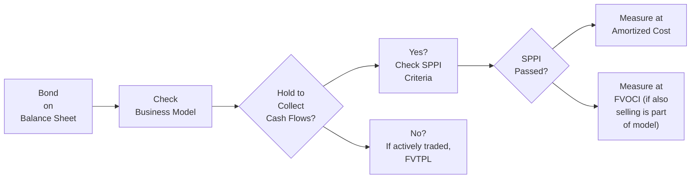
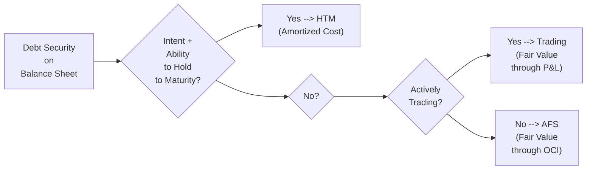

## Introduction

I remember chatting once with a colleague who had just joined the accounting team of a multinational corporation. We were analyzing a cross-border bond issuance, and they were... well, a bit overwhelmed at first by the different financial reporting rules. They had always used US GAAP, but the new environment required IFRS-based statements as well. If you’ve ever found yourself in a similar spot—juggling IFRS 9’s principles-based classification and measurement rules while trying to reconcile them with the US GAAP categories of Held-to-Maturity and Available-for-Sale—take heart. It can feel slightly chaotic at first, but once you set the frameworks side by side, the differences become more manageable.

Below, we’ll explore how IFRS and US GAAP each handle bond classifications and disclosures. We’ll look at the major categories, examine the disclosures required, and consider the practical impact on ratio analysis and overall financial statements. By the end, you should feel comfortable identifying where the rules diverge and how to navigate your next cross-border bond analysis.

## Key Concepts in Classification

A bond might look like a straightforward instrument—pay interest, repay principal. But from an accounting perspective, classification can drastically affect how interest income, fair value changes, and embedded features show up in the financial statements. Both IFRS and US GAAP aim to reflect an issuer’s or investor’s economic reality. Still, their approaches differ.

Under IFRS (particularly IFRS 9), classification depends heavily on two main factors:

• The entity’s business model for managing financial assets.  
• The nature of the asset’s cash flows.

Under US GAAP (for instance, under ASC 320, Debt Securities), classification is split more by the intention and ability of the holder:

• Held-to-Maturity (HTM): If the entity has the positive intent and ability to hold the debt until maturity.  
• Trading: If the primary purpose is short-term resale.  
• Available-for-Sale (AFS): If it doesn’t quite fit HTM or Trading.

It’s kind of like choosing where to file a new puzzle piece—IFRS focuses on the piece’s shape and the overall picture you’re building, while US GAAP focuses on the puzzle collector’s intention (to keep it, trade it, or possibly sell it in the future).

## IFRS Classification Overview

IFRS 9 introduced a more principles-based approach. Each bond is classified as either:

• Amortized Cost  
• Fair Value Through Other Comprehensive Income (FVOCI)  
• Fair Value Through Profit or Loss (FVTPL)

### Amortized Cost

A bond is measured at amortized cost if:

1) The business model is to hold the asset to collect contractual cash flows.  
2) Those cash flows are solely payments of principal and interest (often referred to as the SPPI test).

So, if your bond has no tricky embedded derivative features and you plan to hold it for interest income, it likely ends up in amortized cost.

### Fair Value Through Other Comprehensive Income (FVOCI)

If there’s a business model that involves both holding the bond for interest and potentially selling it, you might use FVOCI. Under FVOCI, interest income, foreign exchange gains or losses, and expected credit losses go to profit or loss, while other fair value changes go directly to Other Comprehensive Income (OCI). When the bond is sold, gains or losses accumulated in OCI are reclassified into profit or loss.

### Fair Value Through Profit or Loss (FVTPL)

If neither amortized cost nor FVOCI conditions are met, the bond goes into FVTPL. This is the default category. For example, if the instrument’s cash flows are not solely principal and interest—perhaps because of a complex embedded derivative—or if the business model includes active trading or short-term profit-making, you’ll use FVTPL. Here, changes in fair value go straight into the income statement, resulting in potentially more volatile reported earnings.

Below is a quick flowchart to illustrate this classification process under IFRS:

## US GAAP Classification Overview

Under US GAAP, the classification scheme for debt securities (often found in ASC 320) follows a more rules-based approach:

• Held-to-Maturity (HTM): If you have the positive intent and ability to hold the bond until it matures, you record it at amortized cost.  
• Trading: If the security is held primarily for short-term resale or if you actively manage it for profit, it goes into Trading at fair value, with unrealized gains/losses in earnings.  
• Available-for-Sale (AFS): If it’s neither HTM nor Trading, you typically classify it as AFS. AFS securities are measured at fair value, with unrealized gains/losses recognized in Other Comprehensive Income until realized.

It’s worth noting that—unlike IFRS—US GAAP does not have a direct FVTPL vs. FVOCI distinction. Instead, US GAAP lumps all fair value changes for Trading instruments into the income statement and all fair value changes for AFS instruments into the equity section (OCI), until disposal or impairment triggers a reclassification to earnings.

We can illustrate this quickly in a separate flowchart:

## Embedded Derivatives and Hybrid Instruments

In IFRS, if a bond has an embedded derivative that isn’t “closely related” to the host contract, you’ve got a hybrid instrument. You either have to separate the derivative or measure the entire instrument at FVTPL. Under US GAAP, the embedded derivative is generally bifurcated if certain criteria are met (ASC 815). If separation is not possible or is impractical, the entire instrument might be measured at fair value. So, the principle is conceptually similar, but the specific rules can differ.

## Measurement and the Effective Interest Method

Under both IFRS and US GAAP, bonds classified under amortized cost are typically measured using the effective interest method. This method systematically amortizes premium or discount over the life of the bond so that interest income is recognized at a constant yield.

But you might see different rates used for discount amortization if, say, the functional currency or the base interest rate environment differs. IFRS 9 is quite explicit about the effective interest method’s calculations, while US GAAP codification references might be more prescriptive. In practice, they often end up in the same place—just keep an eye out for differences in fine details like day-count conventions, especially if you’re analyzing cross-border consolidated statements.

## Disclosures and Presentation

### IFRS Requirements

IFRS 7 (Financial Instruments: Disclosures) and IFRS 9 require disclosures about:
• The classification used for each bond and the balances in each category.  
• Reconciliation of beginning and ending balances for each category.  
• Interest income recognized using the effective interest method.  
• Any expected credit losses recognized.  
• Judgment about whether an embedded derivative is accounted for separately.  
• Fair value measurement inputs and sensitivity analyses if applicable (IFRS 13).

IFRS can feel chatty at times because companies must disclose assumptions and judgments, especially around classification and measurement. The standard setters want transparent insight into how management decided on each classification.

### US GAAP Requirements

The main US GAAP references are in ASC 320 and ASC 825. The disclosures include:
• The classification (HTM, AFS, or Trading) and the fair values for each.  
• The amortized cost basis for HTM and AFS.  
• Gross unrealized gains and losses.  
• Methods and assumptions used to estimate fair value.  
• If a debt is reclassified from AFS to HTM or vice versa, the reason for that reclassification and the effect on earnings.

US GAAP also requires discussion on impairments under ASC 326 (Credit Losses). That said, IFRS’s forward-looking expected credit loss model may cause differences in timing or amounts of impairments compared to US GAAP’s current expected credit loss (CECL) model. Analysts often watch for these differences, especially in times of market stress.

## Impact on Financial Analysis

Differences in classification and measurement can affect:
• Net income: If you classify a bond at FVTPL (IFRS) or as Trading (US GAAP), fair value swings go directly to earnings.  
• Equity: AFS under US GAAP or FVOCI under IFRS place some or all changes in fair value in OCI instead of net income.  
• Key Ratios: Return on Equity (ROE), Debt/Equity, and Interest Coverage might look different across IFRS vs. US GAAP statements.  
• Volatility: Using Trading or FVTPL classification injects volatility into net income, while AFS or FVOCI defers that volatility into equity.

If your role involves cross-border financial statement analysis—whether for portfolio management or credit analysis—be mindful of these potential measurement swings. That was exactly the struggle my colleague faced: “Wait, the same bond is accounted for in two ways?” She discovered that the difference was enough to change some coverage ratios significantly. No wonder it can feel perplexing at first.

## Example: A Multinational Bond Reclassification

Let’s say a company issues a five-year bond in the Eurozone but is headquartered in the US. The bond’s embedded features are straightforward (no special convertible or exotic derivatives). Under IFRS, because the company intends to hold the bond to collect interest income, the bond qualifies for amortized cost. When the same bond is consolidated via the US-based holding company’s financial statements under US GAAP, the company might similarly classify it as Held-to-Maturity if it has the positive intent and ability to hold. Meanwhile, if the corporate treasury in the US has a different strategy—maybe they plan to sell some of the debt after a year—part or all could go into AFS. It completely depends on management’s intention and ability to hold. That difference in classification can cause income statement or OCI fluctuations that an analyst must reconcile.

## Common Pitfalls and Best Practices

• Pitfall: Overlooking embedded derivatives. Always check if there’s a convertible bond feature or a put/call that could trigger fair value treatment.  
• Pitfall: Misinterpreting intention to hold. Under US GAAP, you need documented ability and intent for HTM. Lacking that can push you into AFS or Trading.  
• Best Practice: Document business models. Under IFRS 9, it’s super important to demonstrate your primary objective—holding for interest, or selling, or a mix.  
• Best Practice: Revisit your classification regularly. IFRS and US GAAP each allow reclassification, but the thresholds for “changing your mind” can be strict.  
• Best Practice: Maintain a robust disclosure schedule. Thorough notes explaining classification decisions are crucial for transparency.

## Conclusion

The IFRS vs. US GAAP landscape for bond classification and disclosures can look tricky, but it’s ultimately just two different roads to a similar destination: transparent financial reporting. IFRS focuses on the broader business model and the nature of the bond’s cash flows, while US GAAP emphasizes the holder’s intent and ability to keep or trade the bond. Whichever framework you’re working with, pay close attention to embedded features, the expected credit loss or impairment approach, and the resulting fair value vs. amortized cost measurement. That way, you can structure your fixed-income portfolios—or your analyses of them—in a way that accurately mirrors economic reality.

Keeping these differences in mind not only helps you pass your CFA exams (hint, hint) but also ensures you’re prepared to handle real-world scenarios just like my colleague did. These frameworks are, in many cases, at the heart of bond valuations, debt coverage metrics, and overall risk assessments in global fixed-income markets. 

## References

• IFRS Foundation: https://www.ifrs.org/  
• FASB (Financial Accounting Standards Board): https://www.fasb.org/  
• PwC, “IFRS and US GAAP: Similarities and Differences.”  
• IFRS 7, IFRS 9, IFRS 13  
• ASC 320, ASC 326, ASC 825, ASC 815  

## Exam-Style Questions: IFRS vs. US GAAP Bond Accounting



### Under IFRS, a bond can be classified at amortized cost if:
- [x] The business model is to hold for interest and principal, and the cash flows are solely payments of principal and interest (SPPI).
- [ ] The bond has embedded derivatives that are not closely related to the host contract.
- [ ] Management is actively day-trading the bond.
- [ ] The bond’s interest rate is floating rather than fixed.

> **Explanation:** IFRS 9 states that a financial asset can be classified at amortized cost only if the business model is to hold the asset to collect contractual cash flows and the bond’s contractual terms give rise to cash flows solely in the form of principal and interest.

### Which of the following statements best describes how changes in fair value for an AFS security under US GAAP are recognized?
- [ ] Immediately in the income statement.
- [x] In Other Comprehensive Income currently, and reclassified to earnings if sold.
- [ ] Partly in income, partly in OCI on a quarterly schedule.
- [ ] Only recognized at maturity.

> **Explanation:** Under US GAAP, AFS debt securities are measured at fair value, with unrealized gains and losses recognized in OCI until the security is sold or otherwise disposed of. At sale, accumulated gains or losses are reclassified into earnings.

### Under IFRS, a bond with a complex embedded derivative that is not considered closely related to the host contract is typically:
- [x] Classified and measured at FVTPL.
- [ ] Classified only as FVOCI.
- [ ] Consolidated and measured using equity method accounting.
- [ ] Suspended off-balance-sheet until derivative separation occurs.

> **Explanation:** IFRS generally requires hybrid instruments with embedded derivatives that aren’t closely related to be measured at fair value through profit or loss unless the embedded derivative is bifurcated under specific conditions.

### Under US GAAP, if a company no longer has the positive intent and ability to hold a security previously classified as held-to-maturity, it must:
- [x] Reclassify the security to either AFS or Trading and disclose the circumstances leading to the change.
- [ ] Keep it in the HTM category but mark it to market each quarter.
- [ ] Immediately expense the difference between carrying value and fair value.
- [ ] Cancel the bond’s coupon payments.

> **Explanation:** If the company’s intent or ability to hold an HTM security changes, US GAAP requires reclassification to AFS or Trading depending on the situation, alongside sufficient disclosures.

### A bond’s embedded derivative is more likely to be “closely related” to the host debt instrument if:
- [x] The derivative’s cash flows remain consistent with typical interest and principal patterns.
- [ ] The derivative’s cash flows are unrelated to interest rates or credit risk.
- [x] It behaves like a standard fixed coupon without exotic features.
- [ ] It mandates mandatory conversion to equity at predefined times.

> **Explanation:** “Closely related” typically means the derivative doesn’t significantly alter the bond’s normal interest and principal payments. Standard fixed or floating coupons, for example, are often deemed closely related.

### In IFRS 9, the SPPI test stands for:
- [x] Solely Payments of Principal and Interest.
- [ ] Significant Proceeds, Profit, and Investments.
- [ ] Systematic Payments, Periodic Interests.
- [ ] Statement of Principles and Interpretations.

> **Explanation:** The SPPI criterion means the financial instrument’s contractual cash flows are solely payments of principal and interest on the principal outstanding, a key test in IFRS 9 classification.

### Under US GAAP, unrealized holding gains and losses on Trading securities:
- [x] Are included in current period earnings.
- [ ] Are deferred until maturity.
- [x] Affect the income statement each reporting period.
- [ ] Have no impact on financial statements.

> **Explanation:** A Trading security’s unrealized gains or losses are recognized in earnings the period they occur.

### Which standard dictates the disclosure requirements under IFRS for financial instruments, including bonds?
- [x] IFRS 7.
- [ ] IFRS 5.
- [ ] IFRS 8.
- [ ] IAS 16.

> **Explanation:** IFRS 7 outlines the disclosures required for all financial instruments, including classification, risk exposure, and measurement methodologies.

### In comparing IFRS vs. US GAAP for bond accounting, which statement is correct?
- [x] US GAAP focuses more on management’s intent and ability, while IFRS focuses more on business model and SPPI assessment.
- [ ] IFRS places all debt instruments at FV through profit or loss unless otherwise elected.
- [ ] US GAAP never requires reclassification among categories.
- [ ] IFRS does not allow any bonds to be carried at amortized cost.

> **Explanation:** US GAAP classification is heavily hinged on the company’s intended holding period and ability (HTM vs. Trading vs. AFS), whereas IFRS classification hinges on business model and the SPPI test.

### When a debt security is classified as FVOCI under IFRS, changes in fair value:
- [x] Are recognized in OCI, with interest and impairments in P&L.
- [ ] Flow only through the income statement at each reporting date.
- [ ] Are recognized in OCI but never reclassified to P&L.
- [ ] Must be split between interest rate movements and credit risk, with each portion accounted for differently.

> **Explanation:** Under IFRS, for FVOCI debt instruments, unrealized gains/losses go to OCI, interest income and impairment go to profit or loss, and the cumulative OCI is reclassified to P&L upon derecognition.


