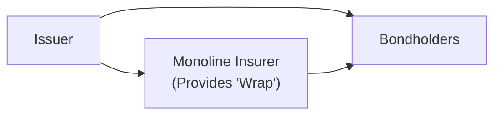
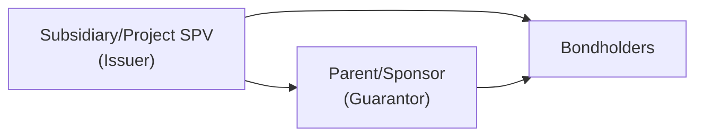

## Overview and Motivation

Imagine you’re evaluating a bond that, on paper, has a pretty shaky credit rating from the issuer alone. Suddenly, you notice a line in the issuance documents: the principal and interest payments are guaranteed by a highly rated third party. Ah—this changes everything! In an instant, the bond’s risk profile might shift from below investment grade to something comfortably higher. That’s the basic idea behind bond insurance (often supplied by “monoline” insurers) and guarantors: to enhance the credit profile of the bond by effectively transferring default risk from the issuer to a stronger external party.

At a high level, bond insurance is a distinct type of credit enhancement. The insurer—who is often referred to as a monoline, because historically they specialized in one line of business—promises bondholders that if the issuer defaults, the insurer will step in and pay. Similarly, a guarantor (frequently a stronger corporate parent, affiliate, or sponsor) contractually promises the same. For investors, it’s reassuring to know that if something goes sour with the issuer, they can still expect to receive their principal and interest from a more creditworthy entity.

That said, as we’ll see, these structures are only as reliable as the guarantor or insurer itself. Indeed, the global financial crisis of 2008 gave us a rude awakening when many monoline insurers found themselves on the ropes—suddenly, the bond insurance “wrap” wasn’t quite as bulletproof as people had assumed. So, let’s explore how bond insurance and guarantors work in practice, how to analyze their credit, and what pitfalls investors need to keep in mind. 

## Understanding Bond Insurance

### Key Concepts

• Monoline Insurer  
• Credit Enhancement  
• Wrap  

When a bond is insured, it’s often described as being “wrapped” by the insurer. This “wrap” coverage typically commits the insurer to cover any missed coupon or principal payments, effectively placing the insurer in the same boat as the issuer. Before we get too excited, let’s remember: the bond is only as good as the insurer’s ability (and willingness) to pay. Monoline insurers, such as those that flourished before 2008, were themselves rated by agencies like Moody’s, S&P, and Fitch. If the insurer is rated AAA, then, in theory, they can “transfer” this AAA rating to the wrapped bond. 

### How It Works in Practice

Let’s go step by step. Suppose a municipality issues a bond at a BBB rating. They want to access the market at lower yields, so they purchase bond insurance from a monoline insurer with a ratings profile of AA or AAA. Now investors see a bond that is “wrapped” by a (formerly) AAA insurer. That might reduce the yield spread for the bond. The municipality pays the insurer a premium for this coverage, but if that premium is small compared to the interest savings from issuing at a higher rating, it’s well worth it.

You might see bond insurance mostly in municipal finance, but it can occur in other sectors too. Internationally, many infrastructure projects with borderline credit rely on insurers or guarantees to gain access to capital at more favorable rates.

Below is a simple diagram of how the structure might look in an insured bond:

In this illustration, Bondholders receive a promise of payment from both the Issuer and the Monoline Insurer.

### Potential Vulnerabilities

So, what could possibly go wrong? Well—if the insurer itself faces a solvency issue, then that wonderful AAA rating evaporates. Suddenly, the bond’s rating often reverts to the underlying rating of the issuer, or something that’s effectively a “blended” rating if the insurer is still on the hook but is now below investment grade. We saw a real-world example of this in the 2008 crisis, when several monolines took huge losses on structured products (like certain collateralized debt obligations, or CDOs). Their ratings were downgraded severely, and many insured bonds lost their credit enhancements or had to find replacement coverage.

## Role of Guarantors

### Corporate Guarantees and Project Finance

What if the entity providing the credit backing isn’t an insurer but another company—often the issuer’s parent or a major sponsor? In that case, we talk about a “parent guarantee” (or a sponsor guarantee). The parent or sponsoring entity signs an enforceable contract to step in if the primary issuer (often a subsidiary) fails to meet its obligations.  

I recall one scenario early in my career: we were analyzing a brand-new infrastructure project in an emerging market. The project’s standalone credit rating was, well, not awesome. But the sponsor was a large multinational corporation. The sponsor guaranteed that if the project couldn’t meet its bond payments, they’d cover the shortfall. That boosted the rating of the bond from something near junk to something more in the investment-grade realm. 

### Evaluating Affiliate, Parent, or Sponsor Guarantees

Now, in order for that guarantee to be truly meaningful, you need to trust the sponsor’s balance sheet. If the parent is only slightly better than the subsidiary, or if it’s reliant on the same project for revenues, we can end up with what’s called a correlation hazard. In other words, if the project fails, the parent’s finances may also take a big hit, thus undermining the entire guarantee.  

When analyzing corporate guarantees, especially for large projects or cross-border structures, you need to confirm:  
1. The parent has the financial resources to honor the guarantee.  
2. The guarantee is legally enforceable in all relevant jurisdictions.  
3. The guarantee is unconditional; i.e., it doesn’t vanish under certain project or sponsor-specific conditions.  

Below is a simplified representation of a parent guarantee structure:

## Financial Strength Ratings and Credit Analysis

### The Insurer or Guarantor’s Credit Profile

Investors often ask: “If the credit enhancement is so powerful, can’t we just rely on it blindly?” Well, no. The insurer or guarantor’s rating matters greatly. You may find rating agencies provide separate “financial strength” ratings for insurers, focusing specifically on the insurer’s balance sheet and their ability to meet claim obligations. For corporate or parent guarantees, you might rely on the sponsor’s corporate rating. Either way, the name of the game is analyzing that entity’s capital adequacy, liquidity, leverage, and managerial track record.

### Correlation and Wrong-Way Risk

Ever experience that uneasy feeling when two credit risks you didn’t think were related turn out to be strongly correlated at the worst possible time? That’s known in risk management circles as “wrong-way risk.” If the performance of the project and the guarantor are heavily correlated (like a sponsor whose entire net worth depends on the success of said project), then any trouble for the issuer almost invariably spells trouble for the guarantor. This correlation was painfully obvious in certain monoline insurers that had guaranteed structured securities primarily backed by mortgages. When housing markets crashed, the monolines’ claims skyrocketed—right as their portfolios cratered.

## Practical Benefits and Costs

### Benefits

1. Enhanced Market Access: By improving credit rating, bond insurance and guarantees allow issuers to tap a wider investor base.  
2. Interest Cost Savings: Issuers often enjoy lower yields.  
3. Liquidity: A higher rating might encourage more trading and potentially better liquidity in the secondary market.  

### Costs

1. Premiums or Fees: Bond insurance premiums can be high, especially if the insurer senses elevated risk.  
2. Reliance on External Entities: If the guarantor or insurer fails, the bond reverts to its underlying risk level.  
3. Regulatory Impact: Some jurisdictions have specific rules about using bond insurance, so compliance can complicate issuance.  

## Strengthening the Security Features

Bond insurance and guarantees are considered forms of external credit enhancement. Other forms of credit enhancement might include:

• Letters of Credit (LOCs): From highly rated banks, promising to pay bondholders if the issuer fails to do so.  
• Collateralization: Placing assets as security.  
• Surety Bonds: Often used in construction, not quite the same as a typical bond insurance policy, but still a third-party guarantee product.  

Each of these methods aims to strengthen the perceived security of the bond. Insurers, LOCs, or surety providers effectively stand in front of the issuer, offering bondholders an additional resource if the issuer reneges on their obligations.

## Real-World Post-Crisis Developments

In 2008, major monoline insurers like Ambac and MBIA, among others, encountered severe pressures. Once the mortgage market collapsed, the claims soared. With their capital eroding, the rating agencies lowered their once-stellar ratings. This event hammered the liquidity of the bonds they had insured. Indeed, the entire concept of “bond insurance as bulletproof” came under suspicion. Since then, the bond insurance industry has consolidated. Many municipalities also began issuing debt without insurance, partly because the cost–benefit equation changed significantly when insurer ratings dropped.

However, pockets of monoline insurance still exist, especially for certain municipal or project finance deals. The takeaway is that, as an investor, you must conduct thorough due diligence on the insurer or guarantor. Relying solely on the label “insured” or “guaranteed” can be misleading if the external entity lacks sufficient financial wherewithal.

## Regulatory and Accounting Considerations

Analysts typically examine IFRS or US GAAP reporting to gauge how the costs or benefits of insurance/guarantees are recorded, though it’s typically on the issuer’s books. Under IFRS 9 and ASC 815 (in US GAAP), you might see certain disclosures about credit enhancements or disclosures for derivative-like insurance contracts. The rating agencies also use separate methodologies for rating wrapped bonds versus unwrapped ones, taking into account both the underlying rating and the insurer’s rating.

In many jurisdictions, insurance regulators supervise monolines with rigorous capital adequacy rules, but the 2008 experience showed that even “rigorous” can fail if the insured portfolio experiences a massive systemic shock. From a bondholder’s perspective, you’ll want to confirm that the insurer or guarantor meets relevant regulatory capital requirements, has a solid reinsurance or risk management strategy, and remains solvent even under stress scenarios.

## Best Practices and Pitfalls

• Tip #1: Always look at the underlying issuer’s credit, even if bond insurance or a guarantee is provided. If the additional coverage goes away, that’s your fallback scenario.  
• Tip #2: Check the insurer or guarantor’s correlation with the issuer. If they are dependent on the same cash flows, watch out.  
• Tip #3: Factor in the insurer’s rating outlook, not just the current rating. If a rating downgrade is imminent, the insurance’s value could plummet.  
• Pitfall #1: Overconfidence in a “wrap.” Investors sometimes treat insured bonds as though they’re truly risk-free. Events in 2008 demonstrated otherwise.  
• Pitfall #2: Legal enforceability. Make sure the guarantee or insurance policy is enforceable under all relevant jurisdictions. Sometimes, subtle contract exceptions or local laws can reduce the coverage significantly.  
• Pitfall #3: Political or regulatory risk. Municipal or sovereign guarantees may be subject to legislative changes, making them less reliable than they look on paper.

## Cross-References Within Fixed Income

• For broader context on credit enhancements, see Section 2.1 (Bond Indentures and Covenants) and Section 2.3 (Embedded Options and Contingency Provisions).  
• To understand how pricing might be adjusted for insured bonds, check out Chapter 6 (Bond Pricing and Valuation Basics) and Chapter 9 (Credit Risk and Credit Analysis).  
• If you’re curious about global government debt structures, see Chapter 4. Understanding how central banks supervise and manage government debt can give you a sense of how government guarantees differ from corporate ones.

## Exam Tips and Conclusion

Given the complexities of analyzing bond insurance and guarantors, be prepared on the CFA exam to:  
• Identify the financial strength indicators of an insurer or a guarantor.  
• Evaluate whether a guarantee is legally and economically effective.  
• Distinguish the difference between an insured bond’s rating and the issuer’s underlying rating.  
• Recognize how a correlation between issuer and guarantor can erode the credit benefit.  

I’ve noticed, too, that the exam often tests whether you remember the meltdown saga of the bond insurers. They might throw a scenario where the insurer’s rating is downgraded, and you have to reevaluate the bond’s risk profile. Another typical exam question might highlight a parent guarantee that turns out to be worthless because the parent depends on the same project for cash flows. In short, watch out for these pitfalls; they’re surprisingly common in real life and in exam scenario questions.

Ultimately, the role of bond insurance and guarantees is to enhance credit quality by providing additional security. They can reduce borrowing costs, open markets, and provide peace of mind to investors—so long as the external party remains creditworthy. The 2008 meltdown taught us that a credit-wrap is only as good as its source.  

## References and Further Reading

• Moody’s, S&P, Fitch ratings criteria on monoline bond insurers and corporate guarantees.  
• Choudhry, M. (2010). “Structured Credit Products: Credit Derivatives and Credit Linked Notes.” Butterworth-Heinemann.  
• A.M. Best ratings for insurance companies’ financial strength: [https://www.ambest.com](https://www.ambest.com)  

--------------------------------------------------------------------------------------------------------------------------

## Test Your Knowledge: Guarantors, Bond Insurance, and Credit Enhancement



### Which of the following best describes the key benefit of bond insurance (the “wrap”) for the issuer? 
- [ ] It grants the issuer higher coupon payments to attract monoline insurers.
- [ ] It reduces the need for disclosure and covenants.
- [x] It allows the issuer to borrow at lower yields by boosting the bond’s credit rating.
- [ ] It permanently removes all credit risk from the bond.

> **Explanation:** Bond insurance can elevate the bond from a lower credit rating to a higher one (based on the insurer’s rating), which typically reduces borrowing costs. However, it does not remove credit risk; it reallocates it to the insurer.

### Which statement accurately captures a major risk associated with monoline insurers?
- [ ] They only insure short-term bonds.
- [ ] They refuse to insure municipal bonds.
- [ ] They diversify through multiple unrelated lines of business, which weakens their capital adequacy.
- [x] They are susceptible to systemic or sector-wide crisis if they concentrate on specific credit exposures.

> **Explanation:** Monoline insurers focus heavily on insuring bonds and can become vulnerable to correlated, sector-wide events (like the 2008 mortgage meltdown). If their insured pools experience large-scale defaults, the insurer faces immense claims.

### A parent guarantee is generally most effective when:
- [x] The parent entity has strong, diversified cash flows and is not overly reliant on the subsidiary’s project success.
- [ ] The parent and subsidiary rely on the exact same cash flows for survival.
- [ ] The parent’s credit rating is only slightly better than the project’s credit rating.
- [ ] The parent can revoke the guarantee if profitability declines.

> **Explanation:** A parent guarantee is strongest when the parent can comfortably step in if the subsidiary defaults. High correlation between the parent and the subsidiary undermines the guarantee.

### “Wrong-way risk” in the context of a guarantor arises when:
- [ ] The guarantor is more highly rated than the issuer.
- [x] The guarantor and the issuer are adversely affected by the same factors that could lead to default.
- [ ] The guarantee covers multiple obligations simultaneously.
- [ ] The issuer unilaterally cancels the policy.

> **Explanation:** Wrong-way risk refers to a situation where the guarantor’s financial condition deteriorates at the same time as the issuer’s, defeating the purpose of the guarantee.

### Which is a primary reason municipal issuers commonly used bond insurance before the financial crisis?
- [x] To issue debt at a rating comparable to that of an AAA insurer, reducing interest costs.
- [ ] Because municipal issuers cannot access capital markets without insurance.
- [x] To reduce mandatory issuance disclosures and skip audits.
- [ ] To bypass regulatory oversight of their bond offerings.

> **Explanation:** Municipal issuers often used insurance to effectively “inherit” the AAA rating of the insurer, thereby lowering borrowing costs. However, insurance does not remove normal regulatory disclosure requirements.

### Which key factor should be examined when evaluating a monoline insurer?
- [x] The insurer’s capital adequacy and solvency under adverse scenarios.
- [ ] The monoline’s potential for future acquisitions of banks.
- [ ] The insurer’s exposure to reinsurance exclusively from foreign markets.
- [ ] The monoline’s presence in equity capital markets.

> **Explanation:** Analyzing the insurer’s ability to remain solvent under stress is critical to ensure the wrap is meaningful. This typically involves reviewing capital reserves, claim-paying resources, and reinsurance arrangements.

### Which statement concerning bond insurance premiums is TRUE?
- [x] The issuer typically pays an upfront premium or ongoing fee for the wrap, and the cost must be weighed against potential interest savings.
- [ ] The bondholders pay the premium to the insurer after each coupon date.
- [ ] The premium is usually borne by rating agencies.
- [ ] Bond insurance premiums are generally waived when the issuer has strong covenants.

> **Explanation:** The issuer (or sponsor of the bond) pays the insurer for the credit wrap. This cost can be offset if the improved credit rating significantly reduces the bond’s yield.

### In assessing a parent guarantee’s enforceability, an analyst should:
- [x] Verify legal enforceability across all relevant jurisdictions and confirm there are no hidden “escape clauses.”
- [ ] Confirm only the corporate rating of the parent, ignoring legal terms.
- [ ] Assume the guarantee automatically ensures a AAA credit profile.
- [ ] Ignore any cross-default conditions or correlated business risks.

> **Explanation:** A legally binding guarantee is key, including jurisdictional enforceability. Correlation between parent and subsidiary is also important: if both are reliant on the same income, the guarantee may be compromised.

### What is one major result when a monoline insurer’s rating is downgraded?
- [x] Bondholders may lose the insurer’s high-grade protection, causing the bond’s rating to revert closer to the issuer’s standalone credit quality.
- [ ] Bondholders immediately receive a windfall payment from the insurer.
- [ ] The issuer’s coupon rate is automatically lowered.
- [ ] The insurer forfeits all collected premiums.

> **Explanation:** When a monoline insurer is downgraded, the bond’s “enhanced” rating may decline, reflecting the insurer’s weakened capacity to pay claims.

### A parent guarantee is effective only if:
- [x] True
- [ ] False

> **Explanation:** A parent guarantee is effective only if the parent has the financial strength to back it up, can withstand relevant stress scenarios, and the legal framework supports the guarantee in a real-world default scenario.


