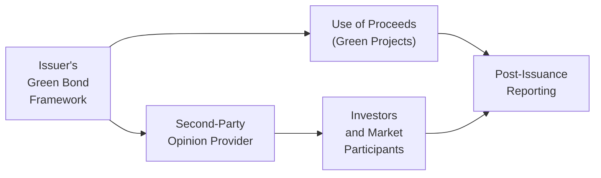

## Introduction

Green bonds, social bonds, sustainability-linked bonds—these instruments often sound impressive, right? The idea is that proceeds directly fund environmental or social projects, like renewable energy or community healthcare. But in reality, well, there’s sometimes a gap between what’s promised and what truly happens. Have you ever heard the term “greenwashing”? It’s when issuers overstate or mislead investors about the bond’s environmental or social credentials. Many people in the market worry that this phenomenon erodes trust in the entire Environmental, Social, and Governance (ESG) bond segment.

This section explores the concept of greenwashing in ESG bond markets, the types of risks it poses to investors, and the practical steps market participants—everyone from regulators to rating agencies—are taking to fight it. The content here connects with prior discussions about ESG-focused bonds (see also “Bonds with ESG Features” in this chapter) and credit due diligence (see “ESG Integration into Credit Analysis” in Chapter 9). While we’re obviously focusing on the perspective of a fixed-income investor, the strategies and frameworks apply broadly across all corners of capital markets that want to champion sustainable outcomes.

## Defining Greenwashing

Greenwashing happens when an issuer claims their bond proceeds will finance green, social, or sustainable projects but provides insufficient or misleading evidence to back up those claims. The classic example is an issuer marketing “green” bonds while continuing to heavily invest in fossil fuel-driven initiatives behind the scenes. Maybe there are big, splashy press releases about saving the planet, but the actual capital usage might have only a minor environmental impact—or worse, none at all.

### Why Does Greenwashing Arise?

• Lack of Standardized Definitions: Although there are emerging regulatory frameworks, for years there was no single global definition of “green” or “sustainable.” This created room for varying interpretations.  
• Marketing Incentives: Issuers can attract a wider investor base or lower funding costs by labeling bonds as green or social, potentially spurring them to stretch the truth.  
• Limited Disclosure Requirements: If external reviews or post-issuance reporting aren’t mandated, an issuer can get away with vague statements about using proceeds sustainably.

## Major Risks to Investors

Investors take on more than financial risk when they buy an ESG-labeled bond. There’s a unique layer of reputational and integrity-based exposures.

### Overpaying for Poorly Credentialed Bonds  
There’s often a “greenium”—a slight premium some investors are willing to pay for green-labeled bonds or sustainability-linked bonds. So, if the project or issuer is misrepresenting green credentials, you might be purchasing the bond at a higher price than you otherwise would. In other words, you’re paying that extra premium for something that isn’t real.

### Reputational Damage  
If a portfolio manager invests client money in a bond touted as protecting the environment, only to find out later that proceeds financed questionable activities, that manager’s credibility can be tarnished. Institutional investors, in particular, have to answer to boards, stakeholders, and sometimes even the broader public. No one wants a scandal where an “ESG fund” is caught supporting polluting industries.

### Performance and Impact Risk  
Opinions differ about whether “genuinely green” bonds outperform or underperform conventional debt, but there’s a performance angle to consider. Over time, if these mislabeled projects fail to improve sustainability metrics, the issuer’s fundamental and reputational risk could worsen. That slump could hurt bond prices, push up yields, and reduce returns.

## The Structural Landscape of ESG Bonds

Before we dive deeper into greenwashing, it helps to understand the typical structure of a use-of-proceeds bond. Many ESG bonds are structured so that the issuer commits to funding specific projects with “sustainable benefits,” such as wind farms or public health initiatives. Once the bond is issued, the issuer should provide regular updates showing how the proceeds are being spent. This is where external review frameworks can help confirm the authenticity of those claims.

Below is a simple diagram of the ESG bond issuance process, from the issuer’s green framework to investor monitoring. This flow demonstrates how greenwashing can creep in if the steps are not transparent or externally verified.

## Common Greenwashing Triggers

Although greenwashing can take many forms, certain red flags pop up repeatedly:

• Vague, Unsubstantiated Claims: Phrases like “environmentally friendly” with no specific project details.  
• Tiny Allocation to Actual Green Projects: Only a small fraction of proceeds is spent on truly sustainable activities.  
• Lack of Ongoing Reporting: Even if an issuer claims to have a plan at issuance, they might fail to disclose updates on tangible outcomes.  
• Misaligned Framework: The issuer’s broader business model might be heavily carbon-intensive, overshadowing any positive green project financed by the bond.  

## Mitigating Greenwashing Risks

### External Reviews and Certifications

Arguably the biggest step in mitigating greenwashing is the introduction of external verification mechanisms. If you’re a buy-side analyst or portfolio manager, you might look at:

• Second-Party Opinions (SPOs): Specialist firms such as Sustainalytics, V.E (Moody’s), or CICERO evaluate an issuer’s green or social bond framework. They provide an opinion on whether it aligns with recognized principles like the International Capital Market Association (ICMA) Green Bond Principles.  
• Climate Bonds Certification: Managed by the Climate Bonds Initiative (CBI), this certification stresses that proceeds align with science-based decarbonization paths consistent with the Paris Agreement.  
• External Audits: Some issuers hire external auditors to verify that the bond proceeds are indeed allocated to the specified projects.

### Taxonomy Regulation

Governments and transnational authorities realize that consistent definitions of “green” or “environmentally sustainable” are essential. The European Union’s Taxonomy Regulation is perhaps the most advanced attempt at creating a standardized system. It outlines criteria for when economic activities can be labeled as environmentally sustainable. Over time, such taxonomies could significantly diminish greenwashing by requiring a consistent standard.

### Post-Issuance Reporting and Transparency

All the talk of frameworks and external opinions is moot if you don’t follow up. Investors should demand robust ongoing reporting—sometimes referred to as “Post-Issuance Reporting.” This includes:

• Detailed Allocation Reports: Show exactly where the money went and how it was spent.  
• Impact Measurement: Provide metrics like CO₂ emissions reduced, energy savings, or social outcomes.  
• Timely Disclosures: Yearly or semiannual updates to ensure accountability.

In fact, failure to provide timely post-issuance reporting is often a telltale sign that something might be amiss. Some ESG rating agencies actively monitor for controversies, negative news, or incomplete reporting, and this can lead to rating downgrades or removal from ESG indices.

### ESG Rating Agencies and Index Providers

Public controversies can bring allegations of greenwashing to the forefront. That’s part of why rating agencies and index providers have become more proactive about screening out questionable claims. For instance:

• Continuous Monitoring: Firms like MSCI ESG and Sustainalytics not only rate an issuer’s overall ESG profile but often zero in on the specific controversies that arise post-issuance.  
• Methodology Enhancements: ESG data providers refine their evaluation frameworks, especially in response to poor transparency or contradictory corporate actions.  
• Index Exclusion: If a bond or issuer is discovered to be engaging in greenwashing, major index providers might remove it from an ESG index. This can significantly reduce the investor base for that security.

## Best Practices for Investors

If you’re an investor in an ESG bond—or you’re thinking about becoming one—how do you protect yourself?

• Conduct Thorough Due Diligence: Don’t just rely on the issuer’s marketing. Look for external verifications and dig into the specific projects.  
• Insist on Clear Use-of-Proceeds Details: Is the issuer specifying categories like renewable energy, public transit, or climate change adaptation?  
• Check Regulatory Alignment: See if the bond framework aligns with recognized taxonomies (EU Taxonomy, for instance) or internationally accepted guidelines from the ICMA.  
• Evaluate Issuer’s Overall ESG Profile: Even if a bond is labeled green, the issuer’s core operations might conflict with the bond’s stated goals.  
• Monitor Publicly Available Disclosures: After issuance, keep an eye on annual or semiannual impact reports, controversies reported in the media, or watch if rating agencies revise their opinions.

## Practical Example: The “Hypothetical Water Project Bond”

Let’s imagine a corporate issuer that claims its new “Water Sustainability Bond” will enhance clean water access in rural communities. The issuer announces a robust set of metrics, such as “improving water quality for 10,000 households,” which looks great on paper. But once the bond is issued, the company reveals minimal updates. A year later, journalists find that only a small portion of the proceeds actually financed the stated water project, and the rest was channeled into standard corporate spending with no environmental or social benefit. Suddenly, this bond is under the greenwashing spotlight. 

If investors had demanded a Second-Party Opinion or climate bond certification upfront—and if they had required detailed post-issuance reporting—these red flags might have emerged earlier. Also, if the issuer’s entire business model is out of sync with the water sustainability mission (e.g., involvement in pollutive activities elsewhere), that’s another signal the bond’s labeling was more marketing than genuine ESG orientation.

## Regulatory Momentum and Future Outlook

We live in times where financial regulators and policymakers see sustainable finance as a long-term priority. They understand that greenwashing poses a systemic threat to the credibility of these emerging markets. As a result:

• Stricter Disclosure Rules: The EU’s Sustainable Finance Disclosure Regulation (SFDR) and the UK’s Sustainable Disclosure Requirements (SDR) are steps toward requiring investment managers to provide transparent reporting about ESG-labeled products.  
• Standardized Taxonomies: Beyond the EU Taxonomy, other regions—like ASEAN member states—are developing their own. Gradually, these frameworks should reduce the “grey area” in which greenwashing thrives.  
• Increased Enforcement: Regulators may start imposing fines or sanctions on issuers that misuse the green or sustainable label. This can deter unscrupulous behavior over the long run.

## Relationship to Other Topics in Fixed Income

ESG considerations underpin many subjects within fixed-income markets. You’ll see potential ties here to:

• Bond Indentures and Covenants (Section 2.1): Additional clauses can ensure the integrity of ESG claims.  
• Real-World ESG Bond Issuances (Section 2.14): Spotting how actual deals structure their frameworks and reporting obligations.  
• ESG Integration into Credit Analysis (Section 9.7): Analysts incorporate greenwashing risk into credit risk metrics and watch for controversies.  

As ESG bond issuance grows, so does the significance of safeguarding investor confidence. A well-functioning ESG market is essential for financing the global transition toward more sustainable environments and societies.

## Final Thoughts and Exam Tips

Greenwashing is arguably one of the biggest threats to the credibility of ESG financing. In exam scenarios (especially scenario-based questions), you might be given a hypothetical ESG bond issuance and asked to evaluate the risk of greenwashing, the adequacy of the issuer’s disclosures, and the role of second-party opinions. 

Be prepared to:

• Suggest relevant external reviews and frameworks.  
• Recommend ways to enhance transparency (like frequent, detailed post-issuance reports).  
• Compare actual usage of bond proceeds against the initial issuance framework.  
• Discuss how controversies can raise doubts about the issuer’s claims, potentially leading to rating downgrades or investor flight.

From a portfolio-management standpoint, you want to show an ability to identify both the financial and reputational implications of greenwashing. Explaining how robust due diligence can mitigate those implications is often an exam highlight.

## References and Further Reading

• European Union Green Taxonomy Guidelines on Sustainable Finance  
• Climate Bonds Initiative State of the Market Reports: https://www.climatebonds.net  
• MSCI ESG & Sustainalytics Frameworks for Evaluating Greenwashing Risk  
• ICMA Green Bond Principles: https://www.icmagroup.org/green-social-and-sustainability-bonds/  
• EU Sustainable Finance Disclosure Regulation (SFDR)  
• CFA Institute: ESG Investing and Analysis (for general ESG integration approaches)

---

## Test Your Knowledge: Greenwashing in ESG Bond Markets



### Which of the following best describes greenwashing in the context of ESG bond issuance?

- [ ] The voluntary disclosure of target carbon emissions.  
- [ ] The legitimate financing of large-scale renewable infrastructure.  
- [x] The practice of misrepresenting or exaggerating sustainability claims.  
- [ ] The complete replacement of standard bond covenants with green covenants.  

> **Explanation:** Greenwashing refers to situations where an issuer overstates or misrepresents a bond’s environmental and social benefits, undermining the bond’s legitimacy and investor trust.

### Which factor is most closely associated with increasing greenwashing risk for investors?

- [ ] Extensive disclosure frameworks enforced by regulators.  
- [x] Limited or vague post-issuance reporting on use of proceeds.  
- [ ] Reduction of external green certifications.  
- [ ] Absence of reputational risk concerns.  

> **Explanation:** An issuer that fails to provide detailed, ongoing disclosures typically raises suspicion that proceeds may not be used as promised, thereby increasing greenwashing risk.

### An investor seeking to mitigate greenwashing in a newly issued green bond would most likely rely on which of the following?

- [ ] Issuer’s press releases alone.  
- [ ] Third-party rating agencies that only publish data upon issuer request.  
- [x] External reviews or second-party opinions from specialized sustainability firms.  
- [ ] Dilution coverage for the entire bond issue.  

> **Explanation:** External reviews or second-party opinions from sustainability-focused firms provide an independent assessment of the issuer’s green bond framework, helping to ensure authenticity of ESG claims.

### A bond issuer that devotes only a small portion of proceeds to the stated “sustainable” activity and the rest to routine corporate purposes is demonstrating:

- [ ] Real economic diversification of capital.  
- [x] Greenwashing risk.  
- [ ] Transition financing aligned with a recognized taxonomy.  
- [ ] Transparent capital allocation for debt servicing.  

> **Explanation:** When a limited portion of proceeds target the advertised green use while the bulk is used for general corporate purposes, that indicates potential greenwashing.

### Which of the following frameworks specifically provides science-based criteria to ensure alignment with the Paris Agreement decarbonization goals?

- [x] Climate Bonds Certification  
- [ ] Second-Party Opinion (SPO)  
- [x] EU Taxonomy  
- [ ] IFRS Accounting Standards  

> **Explanation:** The Climate Bonds Initiative’s certification process and the EU Taxonomy both focus on science-based targets to ensure that green bonds are aligned with international decarbonization goals.

### How might an ESG rating agency respond upon discovering a bond issuer potentially engaged in greenwashing?

- [x] Downgrade the issuer’s ESG rating or place it under review.  
- [ ] Automatically upgrade the issuer for greater visibility.  
- [ ] Suspend all coverage of the issuer.  
- [ ] Ignore controversies unless there is a public lawsuit filed.  

> **Explanation:** Many ESG rating agencies maintain active controversy monitoring and will update or downgrade an issuer’s rating if evidence of greenwashing emerges.

### What is one reason that standardized taxonomy regulations reduce the chance of greenwashing?

- [x] They define transparent criteria for what is considered “green” or “sustainable.”  
- [ ] They eliminate all subjectivity from financial statements.  
- [x] They provide uniform reporting requirements across jurisdictions.  
- [ ] They prevent banks from investing in green-labeled bonds.  

> **Explanation:** By establishing clearly defined thresholds and disclosure requirements for green activities, taxonomies minimize confusion and reduce the likelihood of exaggerated claims.

### In a typical post-issuance report, issuers should:

- [ ] Include no quantitative metrics, focusing on qualitative statements.  
- [x] Provide detailed updates on how proceeds were used, along with impact metrics.  
- [ ] Rely on press releases from financial media outlets.  
- [ ] Publish updates only if asked by government regulators.  

> **Explanation:** Ongoing, transparent disclosures detailing the use of proceeds and quantifiable impacts are crucial to maintaining investor trust.

### Which of the following statements is true about the role of second-party opinion providers?

- [x] Their evaluations often rely on recognized standards, such as the ICMA Green Bond Principles.  
- [ ] They only verify issuer credit quality, ignoring ESG claims.  
- [ ] They are regulated by the U.S. Securities and Exchange Commission.  
- [ ] They set interest rates for all green bonds.  

> **Explanation:** Second-party opinion providers typically focus on verifying alignment with various recognized green bond principles, ensuring the underlying projects genuinely meet sustainability criteria.

### True or False: Greenwashing risk only becomes relevant if the issuer is legally prosecuted for mislabeling the bond.

- [x] True  
- [ ] False  

> **Explanation:** While lawsuits can be a consequence, greenwashing risk is broader than legal exposure—it includes reputational harm, inaccurate pricing, and potential loss of investor trust even if no formal legal action occurs.


