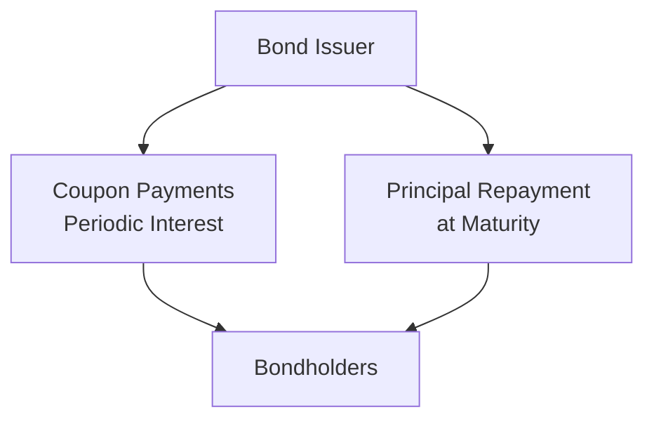

## Overview

I still remember the first time I tried to wrap my head around bond basics—my mentor casually handed me a prospectus and said, “Um, you know, just look for the par value, the coupon rate, and maturity date!” That single sentence captured the core features that define how bonds behave in the market. These key features—principal (par) amount, coupon structure, and maturity—not only determine the bond’s cash flows but also shape its risk and return profile. 

Anyway, there’s a bit more nuance here when you dig into details: step-up coupons, floating rate notes, zero-coupon structures—and each variety can drastically change how you, as an investor, experience gains, losses, and interest rate risk. Let’s explore these central ideas in a relaxed, straightforward way, while still ensuring you have the depth you need for the exam (or for real-world practice).

## The Concept of Principal Amount

The principal amount (also called face value or par value) is basically what the issuer promises to pay you at maturity. In most conventional bond structures, this amount is stamped right onto the bond’s indenture on day one.  

• Par amount is typically set at issuance.  
• Most standard bonds in large markets have a par value of, say, $1,000, though some government issuances come in higher denominations.  
• Under IFRS or US GAAP, the bond’s carrying value on the issuer’s balance sheet might be adjusted for premiums or discounts—but that’s something we’ll dig into later in the text (see Chapter 6 on bond accounting).  

The principal amount is also the basis for calculating the coupon payment. For instance, if the coupon rate is 5% on a bond with a $1,000 par value, the annual coupon is 5% × $1,000 = $50. That’s true whether we’re talking about a big corporate bond or a smaller municipal bond.  

## Types of Coupon Structures

You’ll often hear, “What’s the coupon?” from bond traders, analysts, or even your curious friend who’s new to finance. The truth is, the coupon style can come in several shapes and sizes, so let’s break them down.

### Fixed-Rate Coupons
With a fixed-rate coupon, you know precisely what you’re getting every single period—no hidden surprises:

• The coupon rate is determined when the bond is issued and does not change.  
• Payments might be annual, semiannual, or even quarterly (though semiannual dominates the U.S. bond market).  
• Fixed-rate bonds are straightforward to price because the cash flows are predictable.  

One little side note: if market interest rates drop sharply after you buy a high-coupon bond, your bond’s price will likely rise. The reason? Everyone wants a locked-in, more generous rate. This dynamic underscores how bond valuation (which we’ll see in Chapter 6) ties closely to coupon structure.

### Floating-Rate Notes (FRNs)
Floating-rate notes, or floaters, pay a variable coupon that changes according to a reference rate, such as SOFR, LIBOR (historically), or EURIBOR, plus a spread.

• Example: A floater might say it pays “SOFR + 120 basis points.” If SOFR is 3.00%, the coupon resets to 4.20% for that period.  
• The advantage is that, because the coupon resets, the bond’s market price tends to remain closer to par. The interest rate risk is typically lower compared to fixed coupons.  
• Just keep an eye on credit risk, because sometimes the spread portion might change if the issuer’s credit worsens over time—or if there are covenant triggers in place.

### Step-Up and Step-Down Coupons
These are slightly quirkier:

• Step-up coupons might start low and then “step up” to a higher rate after a predetermined time, or upon certain conditions. You might see these in bonds with special covenant triggers.  
• Step-down coupons do the opposite: they begin higher and then, well, step down.  

Both can address issuer or investor needs—for instance, a step-up structure might help issuers reduce initial borrowing costs, while still compensating investors more generously later on. 

## Maturity Considerations

Maturity is basically the date when the issuer promises to repay the principal:

• Short-term bonds generally have maturities under five years.  
• Intermediate-term is five to ten years (typical corporates).  
• Long-term is anything beyond ten years, with some government bonds hitting 30 or even 50 years.  

Generally, the longer the maturity, the greater the interest rate risk. When we say interest rate risk, we mean how the bond’s price can fluctuate if market rates move. Longer-term bonds will usually have more price sensitivity.  

Also, remember that some bonds come with call or put features (discussed further in Section 2.3). That can shorten or extend effective maturity from an investor’s perspective, depending on whether the issuer calls the bond early or you put it back to the issuer.

## Zero-Coupon Bonds

Zero-coupon bonds (often called zeros) do not pay any periodic interest at all. Instead, they’re issued at a discount to par and then redeemed at par value at maturity:

• A $1,000 par zero-coupon bond might be issued at, say, $600. You pay $600 now, and receive $1,000 when it matures—no in-between coupons.  
• These can be really handy if you have a future liability that aligns with the bond’s maturity (e.g., funding a college tuition payment in ten years).  
• From a risk perspective, be mindful that zero-coupon bonds can show bigger price swings than coupon-paying bonds of the same maturity. No interim coupon means more exposure to reinvestment and interest rate fluctuations.

## The Interplay of Principal, Coupon, and Maturity

It might feel like we’re repeating ourselves, but it’s super important: the combination of par value, coupon structure, and maturity is what sets a bond’s skeleton. If you’re analyzing a bond’s potential place in your portfolio, you’ll want to look at:

• Yield: This is the effective rate of return based on the price you pay and the coupons/ principal you’ll receive.  
• Price Volatility: Longer maturity and lower coupon (or zero coupon) typically bring higher price fluctuation when rates move.  
• Cash Flow Matching: If you need stable periodic income, you might prioritize a higher fixed coupon structure. If you’re worried about interest rates rising, perhaps a floating-rate note might be more your thing.  

Anyway, let’s visually represent how these cash flows look.

In the diagram, coupons move from the issuer to bondholders at set intervals until maturity arrives, at which point the principal is fully repaid to the bondholders.

## Practical Examples and Case Studies

Let’s look at a quick example to ground these concepts:

• A corporate bond has a par value of $1,000, an annual 6% fixed coupon paid semiannually, and a maturity of 10 years.  
• The investor will receive $30 in coupon payments every six months (since 6% annual coupon on $1,000 is $60/year, or $30 per half-year) and the $1,000 principal at the end of 10 years.  
• If market interest rates drop to 3%, the bond’s price will rise above $1,000, since your 6% coupon is now relatively attractive.  

Another scenario:  
• A 5-year floating-rate bond with a coupon of 3-month LIBOR + 100 bps. If the 3-month LIBOR is 2.5% for the current quarter, your effective rate is 3.5% for that period. If next quarter LIBOR is 2.8%, your new rate is 3.8%.  

These differences in coupon structures and maturities can significantly affect your realized returns and risk profile.

## Common Pitfalls and Practical Tips

• Ignoring Accrued Interest: If you buy a bond between coupon dates, you owe the seller accrued interest. Don’t forget to factor that in, especially if you’re using the clean price (i.e., price without accrued interest) rather than the full price.  
• Overlooking Step-Up/Step-Down Timings: For step-up or step-down bonds, watch the schedule carefully—investors can make inaccurate yield projections if they forget coupon changes.  
• Misjudging Reinvestment Risk: Even though zero-coupon bonds have no reinvestment risk for coupon payments, they can come with higher price volatility for rates. Meanwhile, coupon bonds require you to reinvest those coupon payments at the prevailing market rate, which can be higher or lower than you’d like.  

## Exam Relevance

For the CFA Level I exam, you’re typically going to see questions testing your ability to:

• Distinguish between par value, coupon rate, coupon payment, and maturity.  
• Calculate coupon payments, especially if it’s an annual percentage expressed over different payment frequencies (like semiannual).  
• Understand how floaters work, especially referencing those short-term interest rates.  
• Identify the relationship between maturity, coupon size, and price volatility when interest rates shift.  

Being proficient in these fundamentals helps prepare you for advanced valuation perspectives (Chapter 6) and risk management strategies (Chapter 8). You may also encounter scenario questions that mix coupon structures, bond features (e.g., call/put), and different maturity profiles.

## Conclusion

In short, the principal amount, coupon structure, and maturity are the cornerstones of any bond. They define how you receive cash flows, how the bond’s price moves with interest rates, and how it might fit in a broader portfolio strategy. Whether you’re analyzing an ultra-safe government security or a high-yield corporate bond, these elements remain front and center. Keep an eye on how these features intersect with other bond characteristics—like embedded options (in Section 2.3) or regulatory frameworks (Chapter 1)—because the real world isn’t always as straightforward as the textbook examples.

## References and Further Reading

• Tuckman, B. & Serrat, A. (2022). “Fixed Income Securities: Tools for Today’s Markets.” Wiley.  
• CFA Institute. “Reading on Fixed Income Valuation.” Candidate Body of Knowledge.  
• [Investopedia: Understanding Bond Characteristics](https://www.investopedia.com/)  

## Test Your Knowledge: Principal Amount, Coupon Structure, and Maturity



### Which of the following best describes the principal amount of a bond?

- [x] The amount repaid at maturity
- [ ] The total of all coupon payments
- [ ] The bond’s legal maximum price
- [ ] The present value of interest payments

> **Explanation:** The principal or face value is the amount the issuer agrees to repay at maturity, distinct from coupon payments.

### A 10-year bond has a par value of $1,000 and an annual coupon of 5%, paid semiannually. How much is each coupon payment?

- [x] $25 every six months
- [ ] $50 every six months
- [ ] $100 annually
- [ ] $5 every six months

> **Explanation:** The annual coupon is 5% × $1,000 = $50, and because payments are semiannual, each payment is $50 ÷ 2 = $25.

### Which statement about floating-rate notes (FRNs) is most accurate?

- [x] The coupon rate resets periodically based on a reference rate plus a spread.
- [ ] The coupon rate is fixed but changes at maturity.
- [ ] They only pay interest if the reference rate is above zero.
- [ ] An FRN’s coupon is unaffected by changes in market interest rates.

> **Explanation:** Floating-rate notes adjust their coupon payments based on a reference rate such as SOFR, plus a spread, so the coupon rate resets periodically.

### What do step-up coupons typically entail?

- [x] An initially lower coupon rate that increases at set intervals
- [ ] An initially higher coupon rate that decreases over time
- [ ] A coupon rate that floats with market conditions
- [ ] A one-time lump-sum payment at issuance

> **Explanation:** Step-up bonds feature a coupon rate that increases at predetermined times or triggered events.

### Which term refers to the interest accrued since the last coupon payment?

- [x] Accrued interest
- [ ] Imputed yield
- [ ] Discount margin
- [ ] Reinvestment premium

> **Explanation:** Accrued interest accumulates between coupon payment dates and is paid by the buyer of the bond to the seller.

### A zero-coupon bond is characterized by:

- [x] No periodic coupon payments, issued at a discount, redeemed at par
- [ ] Semiannual coupon payments, always trading at par
- [ ] Steadily increasing coupon rates over time
- [ ] Coupons paid in stock rather than cash

> **Explanation:** Zero-coupon bonds are sold at a discount and pay no coupons, offering one lump-sum redemption at par.

### When interest rates in the market decline, prices of existing fixed-rate bonds generally:

- [x] Increase
- [ ] Decrease
- [ ] Remain the same
- [ ] Are irrelevant to bond investors

> **Explanation:** Lower market rates make a bond’s fixed coupon more attractive, causing its market price to rise.

### What is one practical advantage of floating-rate notes for investors?

- [x] Their market value tends to be less sensitive to rising interest rates
- [ ] They never carry default risk
- [ ] They pay higher coupons than fixed-rate bonds in all environments
- [ ] They are always issued at a deep discount

> **Explanation:** Because FRN coupons reset periodically, their market price remains closer to par, reducing interest rate risk.

### A 7-year bond with a high coupon is more likely than a low-coupon 7-year bond to:

- [x] Have lower price volatility
- [ ] Have higher price volatility
- [ ] Yield the same return regardless of interest rate changes
- [ ] Be illegal under IFRS

> **Explanation:** Higher-coupon bonds typically experience less price fluctuation for the same maturity compared to lower-coupon bonds.

### True or False: Maturity is always the same as the call date for a callable bond.

- [x] True
- [ ] False

> **Explanation:** For pricing and investing decisions, the effective maturity of a callable bond can be deemed the call date (if the issuer is likely to exercise the call). The final legal maturity may be beyond the first call date, but many investors treat the call date as the practical maturity.


