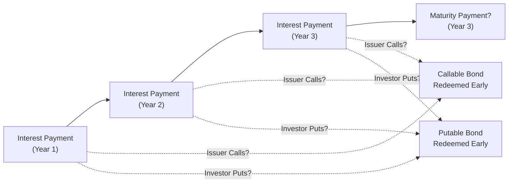

## Introduction
Sometimes, when I first heard about “embedded options,” I pictured a hidden little gem tucked away in a bond’s structure—almost like finding a secret compartment in your friend’s new car. Strange analogy? Maybe. But hopefully it conveys just how these features can suddenly change the bond’s nature, often surprising investors who aren’t paying attention. Embedded options effectively modify the risk and return profile of a bond. Whether that’s beneficial or detrimental depends on whether the issuer or investor holds the privilege to execute the option.

Understanding embedded options is key for a holistic grasp of fixed-income securities. After all, an embedded option can make two bonds with the same coupon and maturity trade at notably different prices. In this section, we’ll dissect everything from basic definitions and types of embedded options (callable, putable, convertible, exchangeable) to the nitty-gritty of how they affect yields, durations, and overall portfolio strategies. We’ll also take a look at contingency provisions like sinking funds and extended maturity mechanisms. By the end, you’ll have a solid mental map of how these features work and how to value them—essential knowledge for both the exam and real-world practice.

## Types of Embedded Options

### Call Options
A call option grants the issuer the right (but not the obligation) to redeem the bond before maturity at predetermined prices on specific dates. Issuers like calling bonds when interest rates drop or their credit profile improves. If they can refinance at a cheaper rate, they’ll typically prefer to buy back the existing bond at the call price.

• Higher Yield Compensation: Because the issuer has the advantage of redeeming early, callable bonds often come with higher yields (or lower prices) to compensate investors for the call risk.  
• Call Protection Period: Many callable bonds include a “no-call” or “call protection” period, during which the issuer cannot exercise the call. This offers bondholders some stability in the early years.  
• Make-Whole Provisions: Occasionally, issuers must pay a make-whole premium if they call the bond, effectively compensating investors for foregone coupon income.

Personal Anecdote: I recall analyzing a callable bond that had a “hard call” date precisely one year after issuance. The issuer survived a rough economic patch and wanted lower interest costs. Sure enough, the bond was called, and our client’s careful yield analysis helped them avoid a big yield disappointment.

### Put Options
A put option is the mirror image: it gives bondholders the right (again, not the obligation) to force the issuer to buy back the bond at a specified price on certain dates. In a sense, it’s protection for the investor if interest rates rise or credit quality deteriorates.

• Lower Yield: Putable bonds typically offer lower yields because the embedded put is valuable to bondholders.  
• Interest Rate Defense: If rates jump and bond prices tank, you, as the investor, can “put” the bond back to the issuer at the predetermined price.  
• Credit Protection: In cases of deteriorating credit, investors might also exercise the put option to exit an unfavorable position.

### Convertible Options
Convertible bonds let the investor convert the bond into a specified number of shares of the issuer’s common stock. Convertibles are a hybrid, combining characteristics of fixed-income investments and equity.

• Upside Potential: If equity prices rise, the upside from converting can be significant.  
• Lower Coupon: Because you have that equity conversion sweetener, coupon rates on convertibles are usually lower than equivalent straight debt.  
• Conversion Ratio and Price: The conversion ratio (number of shares per bond) and the preset conversion price (par divided by conversion ratio) are crucial in valuation.  
• Accounting Considerations: Under IFRS, a convertible bond can be split into liability and equity components. Under US GAAP, the treatment can differ, requiring “bifurcation” if certain conditions apply.

### Exchangeable Options
Exchangeable bonds are similar to convertible bonds, except you can convert the bond into stock of a different company, usually one affiliated with the issuer. That adds another layer of complexity to both the underwriting process and your valuation analysis.

• Different Underlying Company: The investor’s equity exposure is tied to a different firm than the issuer itself.  
• Strategic Holdings: Firms might use exchangeable bonds to monetize large equity stakes they hold in other companies without triggering immediate tax events.

## Impact on Bond Pricing and Yields
Bonds with embedded options are priced differently than otherwise similar “plain vanilla” bonds because the options themselves have value. 

• Callable Bonds: They trade at lower prices (higher yields) relative to non-callable bonds. This stems from the potential that you won’t get to keep your high coupon if interest rates fall. Investors demand compensation for this uncertainty.  
• Putable Bonds: Typically command higher prices (lower yields), reflecting the protective put feature.  
• Convertibles: Depending on the underlying equity volatility, convertibles can trade more like equity (if they’re well in-the-money) or more like a standard bond (if far out-of-the-money).

For example, if interest rates are expected to decline significantly, a callable bond’s price might not rise as much as a regular bond’s, because the call feature caps some upside potential. Meanwhile, a putable bond might see its price remain relatively stable if interest rate volatility spikes, because investors have the right to exit early at the put price.

## Valuation Approaches for Embedded Options
Valuing bonds with embedded options can get pretty mathematical. Often, advanced models like the binomial interest rate tree or Monte Carlo simulations are used to estimate the path-dependent payoff. But the simplest approach for exam comprehension might be:

1. Build a Lattice: Construct an interest rate tree for expected paths of rates.  
2. Factor in the Option: For each node, determine if the issuer (callable) or the investor (putable) would exercise the option.  
3. Discount the Cash Flows: Calculate the present value of the possible payoffs across each node.  
4. Derive the Option-Adjusted Spread (OAS): The OAS is the spread over a benchmark yield curve after factoring in how the embedded option changes the bond’s cash flow pattern.

Practically, people often use specialized software. But for exam day, understanding the conceptual approach is enough. The main lesson is that embedded options add or remove certain payoffs under different interest rate scenarios, so you can’t just plug into a plain discount cash flow formula.

### Simplified Python Snippet for a Binomial Model
Below is a (very abridged) example illustrating how you might handle a simple binomial model for a callable bond. Obviously, real models are more extensive, but let’s keep it short:

```python
import math

face_value = 1000
coupon_rate = 0.05
up_factor = 1.1
down_factor = 0.9
prob_up = 0.5
prob_down = 0.5
discount_rate = 0.03
call_price = 1020

coupon_payment = face_value * coupon_rate

bond_value_up = face_value + coupon_payment
call_value_up = call_price + 0  # 0 extra accrued interest for simplicity
value_up = min(call_value_up, bond_value_up)

bond_value_down = face_value + coupon_payment
call_value_down = call_price
value_down = min(call_value_down, bond_value_down)

expected_payoff = prob_up * value_up + prob_down * value_down
pv = expected_payoff / (1 + discount_rate)

print("Estimated Present Value (one-period model):", round(pv, 2))
```

This snippet calculates a one-period binomial detection of whether the bond would be called in the up or down state. Clearly oversimplified, but it captures the essence: you check the payoff if the option is exercised versus if it isn’t, and then you discount.

## Contingency Provisions Beyond Embedded Options
Embedded options aren’t the only features that can alter a bond’s risk and payoff profile. Other contingency provisions often appear in bond indentures:

### Sinking Funds
A sinking fund requires the issuer to retire a portion of the bond issue periodically. From the investor’s point of view, this can reduce default risk by ensuring there’s some schedule of principal repayment rather than a large bullet payment.

• Partial Redemption: Some bonds require the issuer to buy back a set portion of the outstanding bonds every year (or so).  
• Impact on Price: If the sinking fund is large and reduces default risk significantly, the bond price might be higher.

### Extended Maturity
Some bonds come with an extension feature, letting the issuer or holder extend the maturity. This can be handy if rates shift or if credit conditions change.

### Events of Default Triggers
Indentures may specify triggers such as a drop in certain financial ratios or a missed interest payment. Once these triggers are hit, investors might gain special rights, including accelerating the maturity or demanding collateral.

## IFRS and US GAAP Considerations
Under IFRS, embedded derivatives must generally be separated (“bifurcated”) from the host contract if they are not closely related to the host debt. For convertible bonds, IFRS typically splits the instrument into a liability (the “debt”) and an equity component (the “conversion option”) if it meets certain criteria.

US GAAP can be more nuanced. Certain embedded options, like straightforward calls or puts, may not require separate accounting if they meet “clearly and closely related” rules. But exotic features sometimes do. The net effect is that the bond might appear different on the balance sheet under IFRS vs. US GAAP, which can influence financial ratios and investor perceptions.

## Real-World Examples
• Corporate Issuers with High Volatility: Tesla and other tech innovators sometimes issue convertible bonds to lower their borrowing rates while leveraging high equity valuations.  
• Government Agency Debt: Some sovereign agencies have issued callable or putable structures to manage debt costs more flexibly. Historically, Fannie Mae and Freddie Mac in the U.S. have used callable debt structures for mortgage financing.  
• Exchangeable Bond Case: A multinational conglomerate might hold a substantial stake in a separate listed company. Instead of selling the stake outright, it might issue exchangeable bonds to monetize that holding.

## Best Practices and Common Pitfalls
• Overlooking Negative Convexity of Callable Bonds: When rates drop, callable bonds might struggle to appreciate, limiting your total return potential.  
• Misestimating Volatility: The value of convertible or exchangeable bonds is heavily affected by equity volatility assumptions. Underestimating volatility can lead to an underestimation of the embedded option’s value.  
• Not Checking Covenants: You’d be surprised how often investors skip the fine print, only to find out that the “Call Protection Period” was shorter than they assumed.  
• Focusing Only on Yield: Some participants get fixated on the yield of a callable bond but forget that the bond can be called away at par (or a slight premium), potentially eroding total return if interest rates fall.

## Diagram: Call vs. Put Bond Cash Flow
Below is a simple mermaid diagram illustrating the possible cash flow paths for callable and putable bonds over time.



In a callable bond, the issuer can cut the timeline short, while in a putable bond, the investor can choose to exit. Either scenario changes the bond’s effective maturity.

## Strategies for Exam Success
• Know Your Terms: The definitions of call, put, convertible, and exchangeable features are test-day musts.  
• Practice Break-Even Calculations: For convertible bonds, a typical exam question might ask you to identify at what stock price conversion is profitable.  
• Understand OAS: Be able to articulate how the option-adjusted spread is derived and what it means in terms of risk relative to a benchmark curve.  
• Leverage Scenario Analysis: Describe what happens to bond prices under rising and falling interest rates or changes in the underlying equity value.  

## Final Exam Tips
• Carefully read each question’s details: Check whether the embedded option is issuer-friendly or investor-friendly.  
• Watch for call/put schedules: A bond might not be callable or putable right away. This affects calculations of “effective duration.”  
• Combine Concepts: Embedded option questions might also involve credit risk, liquidity, or IFRS vs. US GAAP. The exam loves to blend topics.  
• Time Management: In item-set or constructed-response formats, outline your thoughts. If the question asks for the effect of a call feature on yield, go step by step—explain conceptually and then illustrate with short math if needed.  

## References
- Fabozzi, F. J. (2021). The Handbook of Fixed Income Securities (9th ed.). McGraw-Hill.  
- Sundaresan, S. (2009). Fixed Income Markets and Their Derivatives. Academic Press.  
- CFA Institute. Overview of Callable and Putable Bonds. Available at:  
  https://www.cfainstitute.org/  

## Test Your Knowledge: Embedded Options and Contingency Provisions



### A bond that grants the holder the right to sell it back to the issuer before maturity is known as:
- [ ] Convertible bond
- [ ] Callable bond
- [x] Putable bond
- [ ] Exchangeable bond

> **Explanation:** Putable bonds allow the investor to “put” the bond back to the issuer at a specific price before maturity, offering downside protection.

### Which of the following best describes why a callable bond generally offers a higher yield?
- [x] Investors require compensation for the risk of having the bond called away
- [ ] The coupon payments are always higher than market rates
- [ ] Callable bonds typically have no reinvestment risk
- [ ] It offers a conversion to the issuer's equity at a premium

> **Explanation:** Callable bonds give the issuer an advantage, potentially causing the investor to lose coupon benefits if the bond is called. Investors demand higher yields to offset this risk.

### In general, which embedded option is most favorable to the issuer?
- [x] Call option
- [ ] Put option
- [ ] Exchangeable option
- [ ] Mandatory conversion option

> **Explanation:** A call option benefits the issuer because they can redeem the bond early when it’s advantageous (e.g., when interest rates drop).

### A convertible bond typically has:
- [ ] Higher coupon payments than a straight bond
- [x] Lower coupon payments than a comparable non-convertible bond
- [ ] No difference in coupon versus a standard bond
- [ ] A guaranteed put feature

> **Explanation:** Convertibility provides potential upside for the bondholder; hence the issuer compensates by paying a lower coupon rate relative to a traditional bond.

### Which statement about exchangeable bonds is accurate?
- [ ] They can be exchanged for the issuer’s own equity
- [x] They can be exchanged for the equity of a different company
- [ ] They carry an automatic conversion feature at maturity
- [ ] They cannot be redeemed early under any circumstances

> **Explanation:** Exchangeable bonds are convertible into the shares of a different entity, often affiliated with or partly owned by the issuer.

### A make-whole call provision differs from a standard call provision in that:
- [x] The issuer pays the present value of future coupon payments as a premium
- [ ] It provides no compensation to bondholders
- [ ] Investors cannot lose coupon payments
- [ ] The bond cannot be called under any circumstances

> **Explanation:** In a make-whole call, the redemption price aims to cover the net present value of future coupons, thus “making the investor whole.”

### Under IFRS, a typical convertible bond is split into:
- [x] A liability and an equity component
- [ ] A current asset and a noncurrent asset component
- [ ] A derivative asset and an operational liability
- [ ] A single liability on the balance sheet

> **Explanation:** IFRS usually requires bifurcation of the bond into a debt component and an equity component representing the embedded conversion option.

### Which scenario best explains negative convexity for a callable bond?
- [x] The bond’s price appreciation is capped once interest rates fall below the call level
- [ ] The bond’s price follows normal bond convexity in a rallying market
- [ ] The bond’s price rises indefinitely as rates drop
- [ ] Negative convexity does not exist; bonds have standard positive convexity

> **Explanation:** When rates fall, the possibility of a call caps the bond’s price potential, creating negative convexity.

### Sinking fund provisions generally aim to:
- [x] Gradually reduce credit risk by paying down principal over time
- [ ] Increase the bond’s coupon after a certain period
- [ ] Convert the bond into common stock at maturity
- [ ] Prohibit early redemption under any circumstances

> **Explanation:** Sinking funds systematically retire portions of the bond issue, reducing principal outstanding and potentially decreasing default risk.

### True or False: Putable bonds usually offer lower yields compared with identical non-putable bonds.
- [x] True
- [ ] False

> **Explanation:** The put option is a benefit to the holder, so investors typically accept a lower yield in exchange for that added protection.


