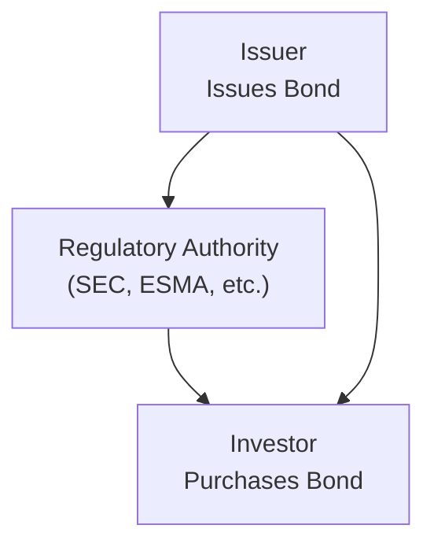
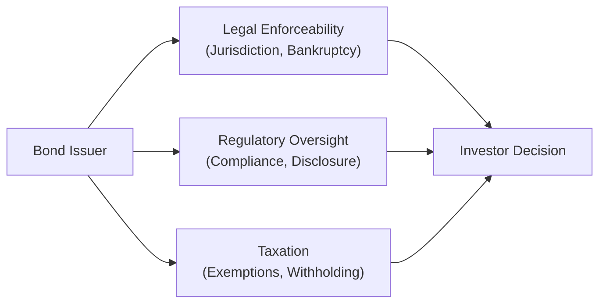

## Introduction

Have you ever felt that moment of confusion when trying to figure out why investors in one country pay certain taxes on bond coupons, while investors elsewhere may not? I know I have. Legal frameworks, regulatory oversight, and tax rules can significantly influence both the issuance of bonds and the returns investors actually take home. Understanding these dimensions can, frankly, save you a lot of headaches (and potentially some money, too).

This section—part of our deep dive into Key Features of Fixed-Income Securities—will help you navigate the often-complicated interplay of legal enforceability, regulatory oversight, and tax structures. Although some of these topics can feel a bit bureaucratic, they are extremely important for analyzing after-tax yields, comparing bonds issued in different markets, and choosing the most effective structures for an investment strategy.

## The Legal Environment

### Legal Framework and Contract Enforceability

When you buy a bond, you’re essentially buying a contract. In other words, you’re trusting the issuer to make interest and principal payments as promised. But contracts aren’t always straightforward, especially when multiple jurisdictions come into play. Various countries have different legal systems, which define creditor rights, the process for claim enforcements, and even how defaults or reorganizations unfold.

• Jurisdiction: Sometimes, a bond might be issued under the laws of New York, London, or Tokyo, even if the issuer is based somewhere else. Why? Because certain jurisdictions are perceived as more creditor-friendly or more stable. Ultimately, the choice of jurisdiction can determine:
  – The procedures for bondholder recourse.  
  – How quickly creditors can access issuer assets in a default.  
  – The complexity and speed of any restructuring or bankruptcy process.

I recall a friend (investor in a high-yield bond) who discovered their bonds were governed under local laws in an emerging market region. Uh-oh. They soon realized that in a severe default, enforcing their claims might involve a lengthy legal battle that would wipe out a significant portion of potential recoveries. Moral of the story? Always check that fine print on the jurisdiction.

### Hierarchy of Claims and Bankruptcy

The “pecking order” during bankruptcy or reorganization is a pivotal aspect of fixed-income investing. Senior bonds typically have first claim on a bankrupt firm’s assets, followed by subordinated debt, and then equity holders. Many jurisdictions have similar structures for creditor hierarchy, but the nuances in domestic bankruptcy codes can vary widely, influencing:

• The expected recovery rate for bondholders.  
• The timeline for when bondholders actually receive payment.  
• The scope for issuers to restructure, impose haircuts, or extend maturities under court supervision.

In quite a few advanced markets, the legal system aims to protect bondholder rights while offering the issuer an opportunity to reorganize. In other markets, the local bankruptcy code might favor employees, government claims, or even specific types of creditors, leaving foreign investors with fewer tools to enforce claims.

## Regulatory Oversight

### Role of Regulators and Disclosure Requirements

In most developed markets, regulatory authorities such as the U.S. Securities and Exchange Commission (SEC) require bond issuers to submit registration statements, produce detailed prospectuses (or offering memoranda), and file regular disclosures (e.g., 10-K, 10-Q in the U.S.). These filings help paint a clearer picture of the issuer’s:

• Financial performance and balance sheet.  
• Governance structures and capital-raising intentions.  
• Potential default risks or liquidity concerns.

Meanwhile, additional regulators, government agencies, or self-regulatory organizations (SROs) may oversee secondary trading, ensuring that broker-dealers comply with ethical standards and that investors receive accurate price quotes. In some cases, regulatory bodies set listing standards for bonds to be traded on major exchanges, specifying minimum issue size, maximum default probabilities, or other listing conditions.

### Global Regulatory Bodies and Cross-Border Issuance

Bonds can also be issued outside the home country of the issuer, sometimes referred to as “Eurobonds,” “Samurai bonds,” or “Panda bonds,” depending on the region and currency involved (see Sections 2.9 and 2.10 for more on these specialized bond types). In such cross-border transactions:

• Issuers must often comply with multiple regulatory frameworks.  
• There may be additional listing requirements or disclosure standards (e.g., local language prospectus).  
• Investors need to be mindful of the potential withholding taxes.  

Regulators like the International Organization of Securities Commissions (IOSCO) and regional authorities such as the European Securities and Markets Authority (ESMA) coordinate standards to some extent. However, differences remain, and ignoring them can lead to unanticipated liabilities or compliance issues.

### Compliance and Enforcement

Failure to adhere to regulations can result in heavy fines, issuance bans, or forced buybacks. From an investor’s perspective, a regulatory breach by an issuer is a red flag, signaling potential higher risk or weaker governance. If you see a pattern of non-compliance for a given issuer or region, that’s your cue to examine whether the bond’s yield (or credit spread) is adequately compensating you for these added risks.  

Below is a simple Mermaid diagram illustrating how regulatory bodies interface with issuers and investors in a typical scenario:

## Tax Considerations

### Tax-Exempt Bonds

In certain jurisdictions, government or municipal bonds may be exempt from federal or central government income taxes. In the U.S., many municipal bonds are free from federal income tax, and often from state or local taxes if you reside in the same issuing state. This can be particularly attractive for high-income investors seeking to minimize their tax liability.

• Muni yields often look lower than corporate bonds, but on an after-tax basis, they can be extremely competitive for some investors.  
• Muni issuances fund local projects (e.g., schools, roads, public utilities) and thus encourage local investment.  
• Always check if the bond is subject to the Alternative Minimum Tax (AMT). Certain munis, such as those funding private activities, may not be entirely tax-free.

### Zero-Coupon Bonds and Imputed Interest

Zero-coupon bonds pay no periodic coupon but are issued at a deep discount. Even though you won’t receive cash payments until maturity, many tax authorities require you to report “imputed” interest each year. Sometimes called “phantom income,” it can be an unwelcome surprise.

I remember being a bit astonished the first time I realized I had to pay taxes on interest I never actually got in hand. It’s like someone sending you a bill for enjoying a service you never used. But that’s the rule. And it can have significant implications for your investment strategy—especially if you’re in a high tax bracket or if you have to source external funds to pay that tax bill.

### Withholding Tax on Cross-Border Investments

Global bond markets are enormous. But before you jump into a cross-border bond, consider local withholding taxes: a portion of your coupon might be withheld by the issuer’s country. Non-resident investors may then need to reclaim the withheld amount by filing with local authorities, or in some blue-sky scenario, they might be eligible for reduced rates under a tax treaty.

• Withholding tax can drastically reduce your net yield, so always do your homework.  
• Different structures, such as using an offshore SPV or issuance under a particular legal framework, might eliminate or reduce withholding taxes.  
• If local authorities change their tax laws, your yield could shift dramatically overnight.

### After-Tax Yields and Investor Preferences

At the end of the day, an investor’s real yardstick is after-tax yield. We can define the “after-tax yield” roughly as:

(1)  

\text{After-Tax Yield} = \text{Yield} \times (1 - \text{Tax Rate})


But in practice, you’ll need to pick apart which parts of the yield are taxed at what rate (is this coupon considered ordinary income, or does it get a special capital gains treatment?). You might also have to factor in possible state and city taxes, or the risk that tax rates themselves change while you hold the bond. For more detailed accounting and reporting considerations, see Section 2.13 (IFRS vs. US GAAP for Bond Classifications and Disclosures).

## Practical Case Study and Examples

Let’s consider a scenario: A U.S.-based investor is choosing between a 5% coupon corporate bond (fully taxable) and a 3.5% coupon municipal bond that’s exempt from federal tax. If the investor is in a 35% marginal tax bracket, then:

• Corporate bond after-tax yield: 5% × (1 − 0.35) = 3.25%  
• Municipal bond after-tax yield: 3.5% (assuming no federal tax) = 3.5%  

So the muni bond actually offers a higher after-tax yield for this investor. That’s why many high-net-worth individuals load up on muni bonds despite the seemingly lower coupon.

Another example: A Japanese investor buying a U.S. corporate bond might lose a portion of the coupon to a U.S. withholding tax unless a tax treaty offers relief. If the treaty rate is 10% and the bond pays a 4% coupon, the investor might only receive 3.6% net, not counting any further local Japanese taxes on foreign bond income. That difference can significantly alter a bond’s appeal.

## Strategic Implications for Investors

• Portfolio Construction: Different tax treatments can tilt portfolio choices. For instance, high marginal tax rate investors might prefer tax-exempt securities, while institutional investors with tax exemptions (like pension funds) might be indifferent.  
• Market Demand: Bonds with favorable tax status can see higher demand, ultimately lowering yields relative to similar taxable bonds.  
• Issuer Behavior: Issuers might choose particular structures (e.g., offering tax-exempt muni bonds) or jurisdictions for cross-border issuance to tap into investor demand and reduce their overall cost of funding.  
• Regulatory Stability: A stable regulatory environment is a plus. Frequent changes in laws or enforcement can erode investor confidence.  

## Flow of Considerations

Consider the combined legal, regulatory, and tax questions that arise when analyzing a single bond:

From a big-picture perspective, these factors act like filters. Each filter can affect your net yield, credit risk, or day-to-day operational burden (like filing tax forms or analyzing legal documents).

## Best Practices and Pitfalls

1. Read the Prospectus Thoroughly: Don’t just skim for the coupon rate. See where the bond is governed, what disclosures are being made, and if the issuer has faced any regulatory sanctions.  
2. Factor in Tax Scenarios: Especially if you’re analyzing multiple clients or planning for your personal accounts, forecast potential changes in tax rates. Don’t be caught off guard by the dreaded “imputed interest” on zero-coupon bonds.  
3. Keep Tabs on Regulatory Changes: Laws can change rapidly, especially in emerging markets. A new capital control or a revised withholding tax might smash your yield.  
4. Diversify Jurisdictionally: Concentrating all your holdings in one jurisdiction may be simpler, but it also subjects you to region-specific legal or tax surprises—like sudden corporate reorganization codes or new taxes.  
5. Use Professionals Where Needed: Tax attorneys, cross-border specialists, or accountants can identify pitfalls in legal or tax structures you might miss.

## Exam Tips

• Identify how legal frameworks (especially in cross-border deals) shape bond seniority, recoveries, and enforceability.  
• Be prepared for item-set questions involving different tax treatments on coupon income or zero-coupon imputed interest.  
• Watch out for scenarios with municipal offerings or unusual regulatory constraints. You may need to compute after-tax yields in multi-step problems.  
• Understand that changes in regulation or tax laws can cause yield to shift in mid-holding period, requiring adjustments in portfolio strategy.

## References and Further Reading

• U.S. SEC:  
  – Official website: <https://www.sec.gov/>  
  – Regulations and disclosure for bond markets.  
• Choudhry, M. (2022). “The Principles of Banking and Finance.” Wiley.  
• International Capital Market Association (ICMA):  
  – <https://www.icmagroup.org>  
  – Standards and best practices for international bond markets.  

--------------------------------------------------------------------------------

## Practice Questions on Legal, Regulatory, and Tax Aspects



### Cross-Border Withholding Tax
- [x] Withholding tax can reduce the effective coupon rate received by foreign investors.  
- [ ] Withholding tax has no impact on the net yield to investors because it is deducted from bond offering proceeds.  
- [ ] Withholding tax is charged only on zero-coupon securities.  
- [ ] Withholding tax never applies if the issuer is a municipality.  

> **Explanation:** Withholding tax generally applies to cross-border coupon payments. Investors must consider this deduction when calculating effective yields.

### Importance of Jurisdiction
- [ ] Jurisdiction is only relevant if the bond is issued by a supranational entity.  
- [x] Jurisdiction determines which legal framework will be used to enforce bondholder rights.  
- [ ] Jurisdiction is not a concern if the coupon is fixed.  
- [ ] Jurisdiction is automatically the investor's country of residence.  

> **Explanation:** Jurisdiction directly affects how a bond contract is enforced, particularly in cases of default or bankruptcy.

### Regulatory Compliance Consequences
- [ ] Regulatory non-compliance has no impact on bond prices.  
- [x] Regulatory breaches can result in fines and undermined investor confidence, potentially raising yields.  
- [ ] Regulatory breaches typically lead to immediate default by the issuer.  
- [ ] Issuers in breach of regulations lose seniority status.  

> **Explanation:** If an issuer fails to meet regulatory standards, it can damage its reputation and creditworthiness, often translating into higher yields demanded by the market.

### Taxation of Municipal Bonds
- [ ] Municipal bonds are never taxed at the federal level, regardless of the investor’s jurisdiction.  
- [x] In the U.S., municipal bonds are often exempt from federal income tax, and sometimes from state tax if the investor resides in the issuing state.  
- [ ] Municipal bond interest is always taxed at the corporate tax rate.  
- [ ] Municipal bonds cannot be purchased by non-resident investors.  

> **Explanation:** U.S. municipal bonds typically offer federal tax exemption and may also provide state tax exemption for in-state residents.

### Zero-Coupon Bond Imputed Interest
- [x] Investors in zero-coupon bonds are often required to pay tax on imputed interest even though no actual coupon is received.  
- [ ] Zero-coupon bonds are always taxed at a lower rate.  
- [x] This tax rule is sometimes referred to as “phantom interest.”  
- [ ] Zero-coupon bonds offer the same effective yield as their coupon-bearing counterparts.  

> **Explanation:** Many jurisdictions require investors to recognize income (even when no cash changes hands) for zero-coupon bonds.

### Bankruptcy Hierarchy
- [x] In bankruptcy, senior bondholders generally have priority over subordinated bondholders.  
- [ ] Equity holders are paid before bondholders in every jurisdiction.  
- [ ] There is no difference between senior and subordinated debt in default recovery.  
- [ ] Bond debt is always discharged automatically.  

> **Explanation:** Senior bondholders are typically first in line to receive recoveries under most bankruptcy codes, followed by subordinated debt, and then equity.

### After-Tax Yield Calculations
- [x] After-tax yield is primarily affected by the investor’s tax bracket and any applicable tax exemptions.  
- [ ] After-tax yield is always the same as the nominal yield.  
- [x] Withholding taxes on the coupon can lower after-tax yield for foreign investors.  
- [ ] Tax rates never change during the holding period of a bond.  

> **Explanation:** When calculating after-tax yield, investors must consider their marginal tax rates, potential exemptions, and withholding taxes.

### Regulatory Environment
- [x] Regulators like the SEC require prospectus filings and continuous disclosure.  
- [ ] Regulatory oversight applies only to publicly listed equities, not bonds.  
- [ ] Self-regulatory organizations do not influence bond trading standards.  
- [ ] Regulatory oversight is consistent worldwide with no regional variations.  

> **Explanation:** Disclosure regulations and ongoing reporting are typical for bond issuers in major markets, although practices can differ regionally.

### Legal vs. Regulatory Distinctions
- [x] Legal enforcement covers contract law and remedies in bankruptcy, while regulatory oversight ensures disclosure and market integrity.  
- [ ] Legal and regulatory guidelines are always identical.  
- [ ] Legal frameworks never vary among countries.  
- [ ] Regulatory oversight displaces any legal protections.  

> **Explanation:** Legal frameworks provide the basis for creditor rights and claim enforcement, whereas regulatory frameworks govern how securities are issued, monitored, and disclosed.

### True or False: Tax Laws Are Static
- [x] True  
- [ ] False  

> **Explanation:** This is a trick statement! Actually, tax laws do change—and frequently. In reality, you should anticipate tax law changes and analyze their impact on bond market returns. The best approach is to remain vigilant and update your analysis as the laws evolve.


