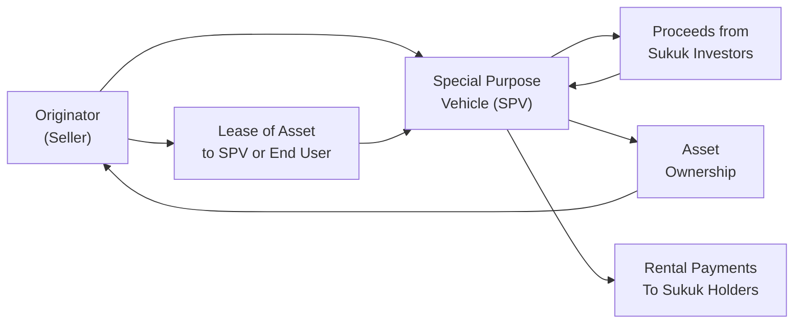
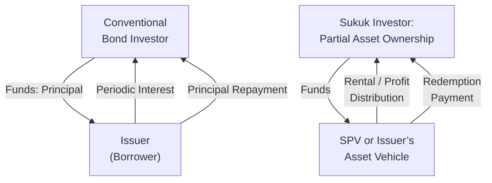

## Introduction  
Have you ever chatted with a colleague who’s just come back from Dubai or Kuala Lumpur and they start tossing around the term “Sukuk”—while you blink a few times wondering what exactly they’re talking about? It’s okay; I’ve certainly been there. Sukuk are essentially Islamic financial certificates that share a few similarities with conventional bonds, but as we’ll see, they have their own distinct quirks rooted in Sharia (Islamic) law. This uniqueness makes them a significant component in global fixed-income markets, especially in regions where conventional interest-bearing instruments are restricted by religious principles.

In conventional bond markets (see other areas of this Volume, such as bond indentures in Section 2.1 or classification under IFRS/GAAP in Section 2.13), a bond typically involves investors lending money to an issuer in exchange for periodic interest payments. Sukuk, however, steers clear of interest (riba) and uncertain/speculative elements (gharar). Instead, Sukuk represents a share of ownership in an underlying asset or project, plus a commensurate share of the profits or rental income it generates. No matter where you stand on the religious or philosophical spectrum, they’re fascinating instruments to study because they open a window into how fixed-income finance can adapt to local cultural and religious norms.

## The Essence of Sharia Compliance  
Islamic finance operates on a set of principles grounded in the Quran and other Islamic texts. The big no-nos include:

• Riba (interest-based payments): Earning money from money alone is frowned upon.  
• Gharar (excessive uncertainty or speculation): Contracts should be clearly defined, and risk must be transparent and shared appropriately.  
• Involvement in non-halal (prohibited) industries: Sharia law excludes industries such as gambling, alcohol, and certain other sectors.

Amid these guidelines, Sukuk are structured to ensure compliance. Rather than a fixed or floating interest payment, you might see a rental payment for leasing (Ijarah Sukuk) or a profit-sharing formula (Mudarabah or Musharakah). A Sharia Supervisory Board—sometimes an in-house team or an external group—reviews and certifies each Sukuk structure to assert that it meets Islamic finance standards. These boards rely on guidance from organizations like AAOIFI (Accounting and Auditing Organization for Islamic Financial Institutions) and the Islamic Financial Services Board (IFSB) to align on best practices.

## Common Sukuk Structures  
There are multiple Sukuk structures you’ll come across, each with its own approach to fulfilling Sharia requirements. Let’s take a closer look at some of the more prevalent formats:

Ijarah (Lease-Based Sukuk)  
Ijarah Sukuk transaction flows can get a bit elaborate, but at a high level, investors (sukukholders) are effectively buying a share in an asset—that could be real estate, machinery, equipment, or even infrastructure. The asset is leased to an end-user, and the lease payments are distributed to the Sukuk investors as “rental income.” At maturity, there’s typically a contractual arrangement to transfer ownership back to the obligor or to renew the lease, depending on the agreement.  

Below is a simplified flow diagram of an Ijarah Sukuk typically seen in practice:

• The Originator sells the asset to an SPV.  
• Investors place funds in the SPV in return for Sukuk certificates.  
• The SPV leases the asset back to the Originator or an end user.  
• Lease/rental payments flow to the SPV, which then distributes them to the Sukuk investors.  
• At maturity, the asset can be sold back to the Originator (or another third party), returning principal to Sukuk holders.

Murabaha (Cost-Plus Financing)  
Murabaha is typically associated with the sale of goods at a markup—disclosing cost and profit margin. In a Murabaha Sukuk, an SPV would buy the commodity or asset and then sell it to the customer at cost plus profit. However, because we want to avoid an “interest-like” situation, Murabaha Sukuk may not be as easily tradable in secondary markets if the underlying transaction is mostly debt-based rather than tangible assets. So, if someone says, “Why don’t I see Murabaha Sukuk trading much?” it's because of the Sharia concerns around trading debt-like claims—a big difference from many conventional asset-backed securities.

Mudarabah or Musharakah (Partnership Structures)  
Under Mudarabah, one party (the rab-al-mal) provides capital while the other (the mudarib) offers management or entrepreneurship. Profits are shared according to a pre-agreed ratio, and losses are borne by the capital provider unless mismanagement is proven. Musharakah, on the other hand, is closer to a joint venture arrangement, where both parties provide capital and share profits (and losses) proportionally. If you see a Musharakah Sukuk, you’ll see language about “sharing in the success of a project,” rather than a straightforward interest deal.

Asset-Backed vs. Asset-Based Sukuk  
Clarifying the “asset-backed” or “asset-based” nature is crucial because it affects risk levels. True asset-backed Sukuk give investors a claim to the underlying asset itself. If the issuer defaults, investors, in theory, may have recourse to those assets. Asset-based Sukuk, by contrast, may rely more on the credit strength of the issuer than on the asset for recourse. For prospective investors, especially from a credit analysis standpoint, it’s essential to confirm how the Sukuk is structured and whether there’s a real or nominal link to the assets.

## Other Sharia-Compliant Arrangements  
Beyond Sukuk, you’ll sometimes see Sharia-compliant structures in project finance or specialized transactional setups. Some finance institutions might place funds into Halal industries under profit-sharing or partnership agreements. They might even brand them as “Islamic windows” in conventional banks, dedicated to clients who require Sharia compliance. This can be reminiscent of syndicated loan structures (check Chapter 5 on Corporate Debt Markets) only with an added layer: a Sharia Board sign-off.

A key difference among Sharia-compliant financing arrangements is the avoidance of pure financial speculation. So, feel free to think of them as ways to harness real assets or real economic ventures, rather than collecting interest in a purely intangible sense. That said, many of these structures require additional documentation and oversight to ensure they remain aligned with Islamic principles.

## Risk and Return Aspects  
At first glance, you might wonder if Sukuk simply pay “interest under another label.” If you’re wearing your bond analyst hat, you’ll want to weigh several factors:

• Profit or rental-based returns replace coupons, but from a yield perspective, it often looks fairly similar.  
• Risk may be more closely tied to the underlying asset or enterprise, particularly in Mudarabah and Musharakah structures, as investors share in both upside and downside.  
• Liquidity can vary widely, much like conventional corporate or government bonds. Some Sukuk issues are quite liquid in regions like the Gulf Cooperation Council (GCC), Malaysia, and other Islamic finance hubs, while others might be illiquid.  
• Credit rating agencies (Moody’s, Fitch, S&P) and specialized Islamic finance rating agencies may assign credit ratings to Sukuk, evaluating both the asset recourse and the issuer’s creditworthiness.

From a purely portfolio management standpoint, Sukuk can diversify global bond portfolios (see “The Role of Fixed Income in Multi-Asset Portfolio Construction,” Section 1.10). Because of their Sharia-compliance screens, they may exhibit different correlations with conventional fixed-income instruments—especially when underlying assets, or the business models, differ significantly.

## Practical Example: Ijarah Sukuk for Infrastructure  
Let’s say a government entity wants to build a toll road but wants to tap into Islamic finance markets. They might structure an Ijarah Sukuk backed by the physical roadway. Investors’ funds go toward road construction and, once complete, the government or an SPV charges tolls. The toll revenues are then used to pay out the Sukuk investors their share of income. This arrangement can last for a specified term, after which the road’s ownership is transferred back to the government. Throughout this period, the government must maintain Sharia compliance. If done correctly, investors effectively earn “rent” from the use of the road rather than interest.

## Diagram Comparing Sukuk vs. Conventional Bond Structures  
Below is a quick comparison to underscore how Sukuk’s profit- or rental-based structure contrasts with conventional interest-based bonds:

In the conventional bond (top part), interest flows directly as a fixed percentage of principal. In the Sukuk model (bottom), the investor is compensated through profits or rental income tied to real economic activities.

## Best Practices and Pitfalls  
Because of the specialized nature of Sukuk, best practices often involve:

• Performing thorough due diligence on the underlying asset or project, since the Sukuk’s cash flows rely on that real asset.  
• Confirming the credibility of the Sharia Supervisory Board. There have been controversies over so-called “fatwa shopping,” where issuers look for more lenient Sharia boards to approve questionable structures.  
• Keeping tabs on local regulations: Some jurisdictions are far more Sukuk-friendly, providing favorable legal frameworks.  
• Watching out for “Sharia risk” if any aspect of the Sukuk is challenged as non-compliant. It can affect investor confidence and possibly disrupt refinancing or redemption.

A common pitfall is simply layering conventional bond structures under a thin veneer of “Islamic terms,” which can lead to reputational damage if discovered. Another issue is a mismatch between the real-world risk-return of the project and what is effectively being promised to investors.

## Sharia-Compliant Glossary  
Sharia (Islamic) Law: A legal framework for the moral, economic, and social guidelines in Islam.  
AAOIFI: A standard-setting body specifically for Islamic financial institutions.  
Ijarah Sukuk: A lease-based Sukuk structure that involves transferring the usufruct (right to use) of an asset.  
Murabaha: A cost-plus arrangement typically used in trade finance.  
Mudarabah: A partnership where one party contributes the capital, another the expertise.  
Musharakah: A partnership where all parties contribute capital and share profits (and losses).  
Asset-Backed vs. Asset-Based Sukuk: Differ in whether Sukuk holders legally own the asset (asset-backed) or simply rely on the issuer’s credit (asset-based).  
Profit-Sharing Ratio: Defines how profits are allocated between Sukuk holders and the originator.  
Halal Industries: Sectors permissible under Sharia, excluding alcohol, gaming, etc.

## Conclusion  
Could Sukuk become more mainstream? It certainly seems so, especially as global fixed-income investors hunt for alternatives and diversification that might offer new risk/return profiles or appeal to investors who abide by Sharia principles. And, sure, while these structures sometimes look like “bonds with extra steps,” the underlying emphasis on tangible assets, risk sharing, and ethical screening can bring distinctive flavors to a fixed-income portfolio.  

If you’re prepping for the CFA® exam or just aiming to broaden your industry knowledge, Sukuk is no longer a niche curiosity. In the next chapters, we’ll see how these instruments tie into broader market structures, risk management strategies, and regulatory frameworks. As Islamic finance grows, staying informed will be a powerful differentiator, so keep exploring!

---

## Exam Tips and Final Thoughts  
• Stay sharp on the differences between Sukuk structures: you might see exam questions testing your ability to identify how Ijarah or Mudarabah differ in profit distributions.  
• Be aware of Sharia compliance oversight. The role of a Sharia Supervisory Board can be tested in scenarios where compliance is at risk.  
• Integrate what you learn about Sukuk with standard bond analysis—especially in terms of duration, credit, and liquidity.  
• Review local vs. cross-border issuance. Some jurisdictions offer distinct tax and legal environments for Sukuk.  

---

## References and Further Exploration  
• AAOIFI Standards on Sukuk: [http://aaoifi.com/](http://aaoifi.com/)  
• IFSB (Islamic Financial Services Board) Publications on Sukuk regulations: [https://ifsb.org](https://ifsb.org)  
• Jobst, A., et al. “Islamic Finance and Sukuk: A Review.” IMF Working Papers, 2019.  
• CFA Institute. (Most current) CFA Program Curriculum for Fixed Income.  

---

## Test Your Knowledge: Sukuk and Sharia-Compliant Structures Quiz



### Which principle is a fundamental component of Sharia-based finance, directly impacting Sukuk structures?
- [ ] Using fixed interest rates to ensure predictable returns 
- [x] Prohibiting riba (interest) and excessive speculation  
- [ ] Encouraging speculation on foreign currencies  
- [ ] Eliminating accountability for asset maintenance  

> **Explanation:** Islamic finance disallows conventional interest (riba) and enters into contracts where risk and return are shared rather than purely interest-driven.

### In an Ijarah Sukuk structure, how do investors typically earn returns?
- [ ] By receiving pre-set interest payments on the borrowed principal  
- [x] By collecting rental income from leased assets  
- [ ] Through dividends on common equity shares  
- [ ] From short-selling government bonds  

> **Explanation:** Ijarah Sukuk are lease-based, so the returns come from rental fees on the underlying asset, which the SPV or issuer then distributes to the Sukuk investors.

### Which Sukuk structure involves the capital provider and the entrepreneur in profit-and-loss sharing, without guaranteeing principal repayment?
- [ ] Ijarah  
- [ ] Murabaha  
- [x] Mudarabah  
- [ ] None of the above  

> **Explanation:** In Mudarabah, the rab-al-mal provides capital, the mudarib manages the venture, and any profit is shared according to a pre-agreed ratio. Principal is not guaranteed.

### How does a Murabaha Sukuk differ from a conventional loan?
- [x] It relies on a cost-plus sale arrangement rather than direct interest charges  
- [ ] It assigns a floating-rate index for interest calculation  
- [ ] It forbids tangible assets from being used as collateral  
- [ ] It exclusively applies to intangible software licenses  

> **Explanation:** Murabaha is a cost-plus-financing style transaction, avoiding direct interest charges. The markup and cost are disclosed, aligning with Sharia principles.

### Which best describes the distinction between “asset-backed” vs. “asset-based” Sukuk?
- [ ] Both structures give investors a direct claim on the issuer’s receivables  
- [x] Asset-backed structures offer direct recourse to the underlying asset in case of default  
- [ ] Asset-based Sukuk removes the link to any real assets  
- [ ] Asset-based Sukuk is not allowed under Sharia standards  

> **Explanation:** Asset-backed Sukuk typically grants investors ownership of the asset and direct recourse. Asset-based relies more on the issuer’s promise to pay rather than giving direct asset ownership.

### A common pitfall in Sukuk issuance includes:
- [x] Inadequate scrutiny by Sharia boards leading to “fatwa shopping”  
- [ ] Excessive usage of standard bond covenants instead of Sharia-compliant agreements  
- [ ] Prohibiting underlying assets  
- [ ] Consolidating multiple Sukuk issues into a single bond  

> **Explanation:** Fatwa shopping occurs when issuers seek compliance judgments from lenient boards, raising concerns about genuine Sharia compliance.

### Why might a purely Murabaha-based Sukuk struggle with tradability in secondary markets?
- [x] The structure can resemble a debt so closely that secondary trading is less permissible under Sharia  
- [ ] Investors are reluctant to purchase asset-backed paper  
- [ ] No rating agencies exist for Murabaha Sukuk  
- [ ] All Murabaha Sukuk are private placements  

> **Explanation:** Under Sharia, trading debt-like claims is often restricted. A Murabaha structure can be considered an underlying receivable, making secondary trade complicated.

### Which organization sets specialized standards for Islamic finance, including Sukuk?
- [ ] FASB  
- [ ] ISDA  
- [x] AAOIFI  
- [ ] PCI-DSS  

> **Explanation:** AAOIFI (Accounting and Auditing Organization for Islamic Financial Institutions) issues guidance and standards for Sharia-compliant financial operations.

### Regarding Sharia compliance in Sukuk, which industry would not be considered Halal?
- [x] A casino operator’s project finance  
- [ ] A mineral water bottling plant  
- [ ] A farmland irrigation project  
- [ ] A sustainable energy infrastructure project  

> **Explanation:** Gambling is generally prohibited under Sharia, making casinos non-compliant.

### True or False: Sukuk investors must rely solely on the creditworthiness of the issuer, with no recourse to any underlying asset or tangible project.  
- [ ] True  
- [x] False  

> **Explanation:** In many Sukuk structures, such as asset-backed Sukuk, investors have partial ownership of an underlying asset or tangible project, providing an additional layer of protection.


