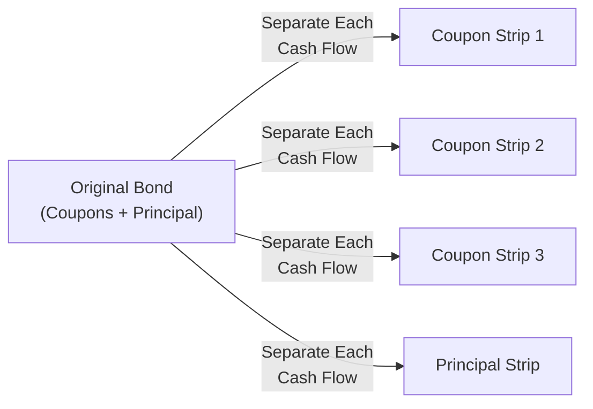
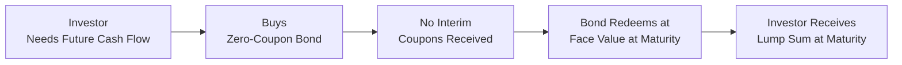

## Introduction
So, I have a small confession: the first time I heard about stripped securities, I had an image in my head of a bond slowly being peeled like an onion, with each coupon payment layer removed. Funny image, right? But in reality, “stripping” has a more serious meaning in fixed income—literally splitting off the coupon payments from the principal repayment, creating separate securities that function as zero-coupon bonds on their own. Zero-coupon bonds, in turn, are offered at a discount and then redeemed at par value at maturity, paying no coupon along the way.

Stripped securities and zero-coupon bonds can spark lots of questions, especially for folks who are used to seeing the usual periodic coupon payments. Why buy a bond that doesn’t give you any interim income? How risky are these contracts? And what’s up with phantom income taxes, anyway? We’ll tackle all those questions in this article to give you a complete look at how these intriguing investments fit into the broader fixed-income world. Along the way, we’ll dip into some personal observations, real-world scenarios, and the occasional cautionary tale.

## Stripped Securities: Concept and Characteristics
When a bond is “stripped,” you’re effectively slicing and dicing a standard coupon-bearing bond into smaller pieces, each representing a single cash flow—whether that’s one of the coupon payments or the final principal repayment. This transformation doesn’t conjure extra wealth out of thin air, but it does repackage the bond’s cash flows into brand-new zero-coupon instruments. Each coupon strip can be traded individually, and the principal-only strip trades by itself as well.

Market participants create stripped securities for reasons like:

• Client customization: Some investors want a single lump-sum payment at a future date without any coupon reinvestment hassle.  
• Yield curve positioning: Traders may individually price each cash flow to exploit yield curve opportunities.  
• Tax or regulatory treatments: Certain jurisdictions or institutional guidelines might favor zero-coupon exposures for accounting or compliance reasons.

Notably, the yield that investors demand on these strips can differ from the yield on the original bond. Factors like liquidity, the shape of the yield curve, and supply-demand imbalances influence strip pricing.

## Transforming a Bond into Strips
In practice, the U.S. Treasury’s STRIPS (Separate Trading of Registered Interest and Principal Securities) program exemplifies this concept. Under the STRIPS framework, Treasury notes and bonds can be taken to a financial institution (such as a government securities broker/dealer) where coupon and principal payments get converted into separate securities, each sold as a zero-coupon note. In other markets, investment banks or other authorized issuers might provide the stripping service for corporate or sovereign bonds.

Below is a simplified Mermaid diagram showing how a single bond can be split into multiple strips:

• Coupon Strips: Each of these is effectively a zero-coupon security that matures on the coupon date for a portion of the bond’s original coupon.  
• Principal Strip: This one matures on the bond’s final redemption date, generally representing the par value of the original bond.

## Zero-Coupon Bonds: A Deep Dive
Zero-coupon bonds—whether newly issued or created via bond stripping—have a straightforward profile: no periodic coupon, purchased at a discount, and redeemed at par (face value) at maturity. If a zero-coupon bond has a face value of 1,000 and trades at 800, you can think of that 200 difference as the investor’s return if they hold the bond until maturity.

### Pricing and Yield Measures
The present value (PV) of a zero-coupon bond can be captured by a simple formula:


\text{PV}_0 = \frac{\text{Face Value}}{(1 + r)^{T}}


• Face Value = Maturity (par) amount  
• \\( r \\) = Yield to maturity (YTM), typically an annualized rate  
• \\( T \\) = Time in years to maturity  

You can see from this formula that any change in the yield \\( r \\) drastically affects the price. Thus, zero-coupon bonds can exhibit higher sensitivity (duration) to interest rate changes than conventional coupon bonds with the same maturity.

### Return Profile
The entire return from a zero-coupon bond arrives at maturity. This lumpsum structure means that the investor is more vulnerable to interest rate fluctuations and, for certain regulatory or tax regimes, might face “phantom” tax bills each year on imputed interest—more on that in a moment.

In my early days, I saw someone in my organization buy a slug of zero-coupon bonds to finance their child’s college tuition, which was due 10 years down the line. They liked how easy it was to see exactly how much money they’d get at maturity. They locked in the yield at purchase, ignoring the coupon reinvestment question that arises with standard bonds.

## Return and Risk Considerations
Both stripped securities and zero-coupon bonds share some hallmark risk characteristics:

• High Duration: Because there are no interim coupons, the bond’s duration approximates its maturity. This means large price swings when interest rates move.  

• Liquidity: Some stripped securities, particularly corporate strips, can be less liquid than on-the-run coupon bonds from the same issuer. Low liquidity may lead to wider bid-ask spreads.  

• Market Condition Sensitivity: In stress scenarios, or when yield curves invert or flatten, zero-coupon bonds may experience heightened volatility.  

• Credit Risk for Corporate Strips: If the underlying is a corporate bond, note that you’re still subject to the issuer’s credit risk, even though the bond has been “stripped.”  

## Tax Implications (Phantom Income and Beyond)
Here’s the big kicker: because zero-coupon bonds and strips don’t distribute coupon cash flows, certain jurisdictions require you to pay taxes on the accrued interest yearly. The logic behind this is that the bond’s discount is effectively “earned” (it accretes) over time. If you’re in a tax bracket that demands it, you might pay taxes on interest income you haven’t actually received yet. This phenomenon is called phantom income, and it can surprise investors who planned for no out-of-pocket expenses until maturity.

• Phantom Income: You’re taxed on imputed interest.  
• Annual Accretion: In the U.S., for example, the IRS sets rules for how that accretion is calculated (e.g., constant yield method).  
• Mitigation: Sometimes, investors who want to avoid annual taxation hold these bonds in tax-advantaged accounts or other structures that offset or defer taxes.

Admittedly, the first time I found out about having to pay taxes on zero-coupon interest I had never “seen” in my bank account, I was a bit annoyed. But that is precisely how some tax codes operate, so you have to plan accordingly.

## Practical Uses in Portfolio Management
• Liability Matching: Zero-coupon bonds let you match exact liabilities at future dates. For example, a pension fund that wants to lock in a liability payment in 15 years can purchase a zero-coupon bond maturing at that same final date.  
• Immunization Strategies: By aligning durations, portfolio managers can immunize a portion of the portfolio from interest rate risks. Strips can be used to fine-tune these durations.  
• Long-Term, Low-Risk “Savings”: Individuals or institutions might prefer the certainty of a lump-sum payoff, even if they sacrifice the liquidity of periodic coupons.  
• Barbell and Other Yield Curve Strategies: Some investors hold zero-coupon bonds on the long end of a barbell strategy to capture higher convexity potential.

## Real-World Examples and Case Studies
• U.S. Treasury STRIPS: One of the most liquid strip markets in the world. Treasury STRIPS are created from T-Notes and T-Bonds, separating each coupon and the final principal. Because the U.S. government backs them, credit risk is minimal (subject to sovereign risk perceptions).  
• Corporate Strips: Financial institutions may strip the bonds of highly rated corporations, turning them into credit instruments that appeal to institutions wanting corporate exposure without coupon reinvestment complexities. These can trade at different yields based on credit rating, liquidity, and supply.  
• Emerging Markets: Some emerging market sovereigns have used zero-coupon structures to attract investor attention. These instruments can be quite volatile because local interest rates are typically more volatile, and the credit risk is higher.

## A Quick Mermaid Visualization
Below is a conceptual diagram of how zero-coupon bonds sit within a portfolio context, highlighting their time-to-maturity focus:

In this flow:

• The investor identifies a future liability or target date.  
• They purchase a zero-coupon bond that matures on or near that target date.  
• No coupon payments occur in the interim.  
• At maturity, the investor receives the face amount for liability coverage.

## Best Practices, Challenges, and Pitfalls
• Understand Tax Liabilities: Be absolutely sure you’re factoring in phantom tax implications. If you’re an individual in a tax-disadvantaged setting, you could face out-of-pocket costs each year.  
• Liquidity Risks: Not all strips or zeros carry the same level of liquidity. Governments typically have the strongest liquidity, while corporate strips can be quite thinly traded.  
• Duration Management: The high interest rate sensitivity can magnify gains, but also loses if rates move up. Manage carefully.  
• Credit Quality: Stripped or not, the security is only as good as the issuer’s ability to make good on the bond’s par value at maturity.  
• Market Access: In some countries, it may be more challenging to purchase stripped securities (or the stripping may not be permitted for certain local issues).

## Exam Relevance and Preparing for Scenario-Based Questions
From a CFA exam standpoint, stripped securities and zero-coupon bonds often appear in questions about:

• Duration and convexity calculations.  
• Scenario analysis for bond portfolios.  
• Impact of yield curve shifts (especially parallel vs. non-parallel) on stripped securities.  
• Tax considerations and the concept of phantom income.  
• Liability-driven investing (LDI) strategies and immunization.

Don’t be surprised if you see a question that gives you a portfolio containing both coupon-bearing bonds and zero-coupon bonds, then asks how an interest rate shift impacts each bond's price. Or maybe you’ll be asked to compare the after-tax yield on a zero-coupon bond relative to a coupon bond in different investor tax brackets. Carefully break down the logic, watch for key details, and practice with enough sample item sets and short-answer questions.

## Key Takeaways and Next Steps
In many ways, stripped securities and zero-coupon bonds exemplify the creativity found in fixed income. Splitting a bond into multiple instruments can enhance precision in matching future liabilities, but it also introduces complexities like phantom income and heightened sensitivity to interest rates. For real-world portfolio managers, the trade-off often revolves around locking in specific future cash flows or capital appreciation potential versus juggling illiquidity and tax wrinkles.

To deepen your mastery, consider exploring:

• Chapter 6 on Bond Pricing and Valuation Basics, which provides more detail on discounting future cash flows.  
• Chapter 8 on Interest Rate Risk to see how zero-coupon bonds factor into scenario analysis and interest rate hedging.  
• Chapter 10 on Securitization and Structured Products—some structured vehicles repackage or embed zero-like features, especially in principal-only mortgage-backed tranches.

## References
- Tuckman, B. (2012). Fixed Income Securities: Tools for Today’s Markets. Wiley.  
- US Treasury STRIPS Program: [https://www.treasurydirect.gov/](https://www.treasurydirect.gov/)  
- CFA Institute. (2023). CFA Program Curriculum, Fixed Income Readings.  

---

## Sample Exam Questions: Stripped Securities and Zero-Coupon Bonds



### A portfolio manager wants to hedge a future liability occurring in 10 years using zero-coupon bonds. Which of the following best describes why zero-coupon bonds are particularly effective for this purpose?

- [x] Their entire cash flow is realized at maturity, closely matching the single-date liability.
- [ ] Their liquidity is always higher than coupon-bearing bonds.
- [ ] They have lower price sensitivity to changes in interest rates.
- [ ] They are not subject to any tax implications until maturity.

> **Explanation:** Because all principal is paid at maturity (with no interim coupon payments), zero-coupon bonds can precisely match the timing and amount of future liabilities. However, zero-coupon bonds typically have high price sensitivity and may involve phantom income for taxes.

### An investor purchases a 10-year zero-coupon bond at issuance with a face value of $1,000 and a discount yield to maturity of 5%. Which of the following statements about the bond is most accurate?

- [ ] The bond’s price will likely exceed its face value when issued.
- [x] The bond’s price will be set below $1,000 to generate the 5% yield upon redemption.
- [ ] The bond distributes semiannual coupons that yield 5%.
- [ ] The bond’s price is protected from interest rate fluctuations.

> **Explanation:** A zero-coupon bond sells at a discount to par in order to achieve the stated yield to maturity. It pays no coupons, and its price is still subject to interest rate fluctuations.

### Which of the following scenarios most accurately illustrates “phantom income” for an investor in zero-coupon bonds?

- [x] The investor owes taxes on accrued interest each year despite not receiving actual coupon payments.
- [ ] The investor receives a coupon payment that is smaller than the accrued interest.
- [ ] The investor’s broker withholds capital gains taxes at maturity.
- [ ] The investor deducts accrued interest on the bond from other income sources.

> **Explanation:** Phantom income arises when an investor must pay tax on imputed interest each year, even though no cash coupon is received during that period.

### A CFO is interested in using stripped securities to gain exposure to specific points along the yield curve. Which stripped securities would represent only the final redemption value of the underlying bond?

- [ ] Coupon strips
- [ ] Index strips
- [x] Principal strips
- [ ] Floating strips

> **Explanation:** Principal strips (often referred to as POs in the mortgage-backed space or simply principal-only strips) represent the final redemption component of the bond.

### If interest rates suddenly increase across the market, how would a large holding of zero-coupon bonds likely affect the current market value of a portfolio?

- [x] The portfolio’s market value would drop significantly due to high duration exposure.
- [ ] The portfolio would be unaffected because zeros have no coupon.
- [ ] The portfolio would benefit from increased coupon reinvestment rates.
- [ ] The portfolio’s market value would rise due to the discount.

> **Explanation:** Zero-coupon bonds, with all cash flow at maturity, have the highest sensitivity to changes in interest rates for a given maturity. A general rise in interest rates would depress their current market prices more dramatically than comparable coupon-bearing bonds.

### Which of the following is a key advantage of using zero-coupon bonds in liability-driven investing (LDI) strategies?

- [x] They help precisely match the timing and amount of a known future liability.
- [ ] They increase the frequency of coupon payments to the investor.
- [ ] They permanently eliminate interest rate risk in a portfolio.
- [ ] They reduce the need for annual valuations under IFRS.

> **Explanation:** The single maturity payment of zero-coupon bonds makes them ideal for matching known future liabilities at a specific date. They do not eliminate all interest rate risks, and they do not pay coupons.

### An investor in the 35% tax bracket holds a U.S. Treasury STRIPS with 15 years to maturity. Which statement is correct regarding the investment’s tax implications?

- [x] Annual accrued interest is taxed at ordinary income rates even though no coupon is received.
- [ ] Payment of taxes on accrued interest is deferred until maturity.
- [ ] Proceeds at maturity are taxed entirely at capital gains rates.
- [ ] The investment is tax-free at federal and state levels.

> **Explanation:** U.S. investors typically owe federal income tax on annual accrued interest for STRIPS at ordinary income rates, creating “phantom income” until maturity. Depending on the state, taxes may vary, but there is no general exemption from federal taxation for STRIPS.

### Which of the following securities offers exposure purely to the coupon payments of an original fixed-rate bond?

- [ ] Principal strip
- [ ] Floating-rate note
- [x] Coupon strips
- [ ] Inflation-linked note

> **Explanation:** A coupon strip represents a zero-coupon security derived from a single coupon payment of the underlying bond. Principal strips correspond exclusively to par redemption value.

### A manager compares the yield on a zero-coupon bond to a coupon-bearing bond of the same maturity and credit risk. In a typical upward-sloping yield curve environment, which yield is often higher, assuming no unusual market conditions?

- [ ] The coupon bond’s yield
- [x] The zero-coupon bond’s yield
- [ ] They have identical yields
- [ ] The zero-coupon bond’s yield is negative

> **Explanation:** Generally, zero-coupon bonds may have a slightly higher yield on an annualized basis than comparable coupon-bearing bonds. The absence of interim cash flow can call for a yield premium, although this can vary with market forces.

### True or False: Stripped securities can only be created from government bonds.

- [x] True
- [ ] False

> **Explanation:** Strictly speaking, many major stripping programs point to government issues (U.S. Treasury STRIPS, for instance). However, in practice, some corporate bonds can also be stripped by authorized institutions or broker-dealers, though this is less common or may require specific conditions.


