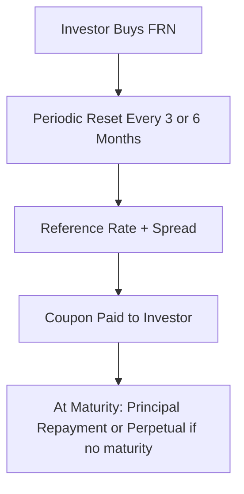
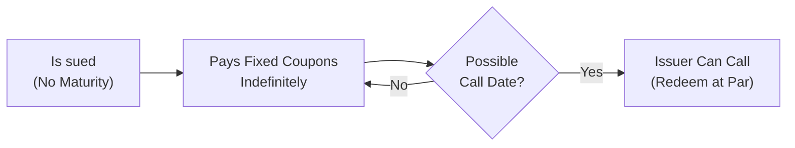

## Introduction

So, you know those times when you're sipping coffee and suddenly realize how interest rates seem to move faster than your to-do list? Well, that’s where variable-rate and perpetual bonds quite literally come into play. These instruments can help issuers—and investors—navigate the choppy waters of changing market yields, regulatory requirements, and everything else life throws at a bond portfolio. If that sounds interesting, grab another cup (or tea if you prefer) and let’s walk through it together.

## Variable-Rate (Floating-Rate) Bonds

### Key Characteristics

Variable-rate bonds, often called floating-rate notes (FRNs), carry coupons that adjust periodically. The coupon is typically tied to a reference rate such as SOFR (Secured Overnight Financing Rate), EURIBOR, or any other commonly accepted index, plus a fixed spread to compensate for the issuer’s credit risk. The big idea here is that as interest rates shift, the coupon resets up or down—usually every three or six months—thereby keeping the bond’s price relatively close to par.

• Coupon Reset Mechanism: The coupon = reference rate + spread.  
• Reset Frequency: Commonly quarterly or semiannual.  
• Purpose: Help issuers manage interest costs and reduce exposure to fast-changing rates.

I remember one analyst joking that an FRN behaves like a boat on the tide: as interest rates rise or fall, the floating coupon “lifts or sinks” with the current, often allowing the bond’s market price to hover around par value.

### Reference Rates and Spread

A floating-rate bond’s coupon rate depends on an external benchmark. Through much of modern bond history, LIBOR was the star player, though it’s now largely replaced by newer rates like SOFR in the U.S. or SONIA in the U.K. The spread (sometimes called a margin) is determined at issuance and reflects the issuer’s credit profile. Fractional changes in that reference rate can impact coupon payments every reset period.

A typical FRN formula looks like:

Coupon at reset date = (Reference Rate at reset) + (Spread)

If at issuance the spread is 50 basis points (bps), and the reference rate is 4.50%, the initial coupon becomes 5.00%. If after six months the reference rate is 5.20%, the coupon resets to 5.70%. 

### Interest Rate Risk and Caps/Floors

You might wonder, “If the coupon floats, do I even have interest rate risk?” The short answer is: sometimes. Because the coupon resets in line with market conditions, an FRN’s market price can remain near par. But there are nuances.

• Caps and Floors: Some floating-rate bonds have a maximum coupon (cap) or a minimum coupon (floor). These features reduce the bond’s sensitivity to extreme movements in the reference rate—but create interest rate risk once the cap or floor is breached.  

• Reset Frequency: If the reset date is far off and rates are rising (or falling) quickly, the bond might temporarily trade at a discount (or premium) until the next reset date.

• Basis Risk: Another subtlety is if the issuer’s actual funding costs or the investor’s liabilities are based on a different rate than the reference. Even though you have a floating rate, it may not perfectly match your actual cash flow needs.

### Valuation Perspective

Because the coupon resets to match market rates, analysts often think of FRNs as trading near par—unless there’s a significant change in the issuer’s credit spread. When you discount expected future coupon payments for an FRN, you typically use a forward curve for the reference rate plus a spread for credit. The net present value is often close to the bond’s par value, especially right after a reset date.

Let’s visualize a simplified structure for an FRN’s cash flows using a Mermaid diagram:

In this flow, every reset re-aligns the bond's coupon with market conditions.

### Practical Applications

• Corporate Financing Tool: Corporations that expect stable or declining rates might prefer floating-rate bonds to pay less over time.  
• Bank Capital Management: Financial institutions often issue FRNs to match assets and manage interest rate risks.  
• Investor Appeal: FRNs can be attractive in a rising rate environment, reducing the potential for capital losses.  

But be cautious. In the wake of recent reference-rate reforms, the reliability of the chosen benchmark is crucial. If it becomes illiquid or replaced (LIBOR, we’re looking at you), the bond’s coupon might not behave as anticipated.

## Perpetual Bonds

### Core Concept

Perpetual bonds, sometimes called perps, have—get this—no maturity date. It’s like they keep the party going forever, paying a steady coupon until the issuer decides to call (redeem) them or simply never redeems. These bonds can be especially appealing to issuers looking to strengthen their regulatory capital base or to maintain a portion of longer-dated, stable financing.

• No Final Maturity: The bond can, in theory, pay coupons indefinitely.  
• Call Feature: Perpetual bonds often come with an issuer call option after a specified period.  
• Investor’s Perspective: The investor is essentially locked into receiving coupons unless the issuer calls the deal or fails to make payments.

### Uses in Banking Sector (Hybrid Capital)

One big application is in the banking sector. Perpetual bonds can count as Additional Tier 1 (AT1) capital—part of a bank’s regulatory capital. Because these securities can be written down or converted to equity if a bank’s capital ratio falls below a certain point, they provide a robust cushion to absorb losses before depositors or senior debtholders are affected. This was especially relevant after financial crises raised global scrutiny over banks’ capital adequacy.

### Valuation of Perpetual Bonds

Valuing a perpetual bond often uses a straightforward perpetuity formula when no call date is in sight:

(1)  
V₀ = C / r

Where:  
• V₀ = Present value (price) of the bond  
• C = The annual coupon payment  
• r = Required yield

But let’s be honest: it’s rarely this simple in the real world. Perpetuals are strongly influenced by changing market yields, credit spreads, and the probability that the issuer might call them at a certain call price (often at par). If the coupon is set too high (relative to market yields) and the bond is callable at par, you might expect the issuer to call the bond as soon as the call date hits. Consequently, you may end up valuing it like a fixed-rate bond with a shorter maturity.

Here’s a Mermaid diagram that illustrates a perpetual bond’s timeline:

If the bank or corporate issuer never calls the bond, the investor keeps receiving coupons indefinitely.

### Risks and Considerations

• Interest Rate Risk: Even though there’s no maturity, interest rate changes can significantly move perpetual bond prices, more so than typical long-term bonds.  
• Credit Risk: If the issuer’s credit quality worsens, the bond’s price can plummet (especially if there’s no maturity date on which you’re guaranteed principal repayment).  
• Regulatory Changes: For banks, changes in regulation can alter how perpetuals are treated in the capital stack.  

From a personal standpoint, I once chatted with a risk manager at a major bank who described exploring perpetual bonds as akin to adopting a giant tortoise—it might be with you for a very, very long time, and you better be prepared for the unexpected across changing environments.

## Similarities and Differences

| Feature                    | Floating-Rate Bonds                                      | Perpetual Bonds                                      |
|----------------------------|----------------------------------------------------------|-------------------------------------------------------|
| Coupon                     | Varies with reference rate + spread                     | Usually fixed, paid indefinitely                     |
| Maturity                   | Defined maturity date, except in rare perpetual FRNs     | None (optional call feature often present)           |
| Price Sensitivity          | Lower sensitivity to interest rate changes (post-reset) | Highly sensitive, akin to very long-duration assets  |
| Issuer Motive              | Reduce/refinance interest cost variability              | Strengthen regulatory capital; access long-term funds|
| Common Sectors             | Corporates, financials, government agencies             | Banks (AT1 capital), some corporates                 |

## Real-World Case Studies

• Barclays Bank’s Contingent Convertible (CoCo) Bonds: A form of perpetual debt that converts to equity or is written down if capital ratios slip below a threshold. During the stressed banking environment in the mid-2010s, these instruments provided an essential buffer for the bank.

• FRNs in a Rising Rate Environment: After the global financial crisis, many investors favored FRNs denominated in U.S. dollars, pegged to 3-month LIBOR. These FRNs benefited from rising short-term rates, but as LIBOR gave way to SOFR, transitional complexities affected pricing mechanisms and documentation. Investors had to scrutinize fallback language to ensure a proper coupon reset under SOFR.

## Potential Pitfalls and Strategies

• Mismatched Reference Rates: If your liabilities depend on a different benchmark than your bond’s reference rate, you could be exposed to basis risk. One strategy is to use swaps to align your exposures.

• Embedded Options: Many perpetual bonds come with call features, which can be tricky to value. Pay close attention to call schedules and step-up provisions in the coupon rate after the call date.

• Credit Deterioration: A perpetual bond with a once-solid issuer can become a headache if the issuer’s fundamentals slip. Even floating-rate bonds can lose value if investors demand a higher credit spread. Thorough credit analysis is essential.

• Regulatory Shifts: Particularly relevant for bank-issued perpetuals. You’ll need to keep tabs on changing rules by bodies like the BIS or local regulators that might revise how such instruments are counted as capital.

## Cross References

• For embedded options like call features, see “2.3 Embedded Options and Contingency Provisions.”  
• Check “3.1 Primary Markets, Underwriting, and Offerings” for how variable-rate bonds and perpetual bonds might be issued, often noting the complexity in underwriting for newly minted FRNs.  
• For IFRS vs. US GAAP considerations regarding classification, see “2.13 IFRS vs. US GAAP for Bond Classifications and Disclosures.”  

## Best Practices

• Conduct robust scenario analysis: Evaluate outcomes under rising, stable, and falling interest rates.  
• Study the fallback language for the reference rate: In the post-LIBOR era, be certain about your benchmark’s continuity plan.  
• Verify the call schedules and step-up provisions on perpetuals: If an issuer’s cost of capital changes drastically, they might call or skip calling the bond, impacting your expected return.  
• Don’t ignore liquidity: Some perpetuals or floating-rate bonds are fairly illiquid, so plan your exit strategy ahead of time.

## Encouraging Critical Assessment

It’s easy to get caught up in the notion that FRNs are “safe” from interest rate moves or that perpetual bonds are “just like equity.” In reality, both require you to analyze interest rate pathways, credit changes, regulatory environments, and call features. Ask yourself:  
- Do I understand all the potential interest rate scenarios that can drive my floating-rate bond’s coupon?  
- Am I prepared for the possibility that a perpetual bond’s price could drop significantly if market yields spike or the issuer faces challenges?

## Concluding Remarks

Variable-rate and perpetual bonds each serve unique purposes in the broad universe of fixed-income securities. Floating-rate bonds can help dampen interest rate risk, while perpetual bonds can offer ongoing coupon streams—at times fulfilling specialized regulatory capital requirements for issuers.

In a world where interest rates and market conditions can pivot unexpectedly, these instruments provide both flexibility and complexity. Keep an eye out for the fine print, reference rates, and embedded features. And remember, no matter how fancy the bond structure might look, fundamental credit and market principles still apply.  

## References

- Choudhry, M. (2004). “Theory and Practice of Floating Rate Bonds.” Butterworth-Heinemann.  
- Bank for International Settlements (BIS) – Guidelines on bank capital instruments.  
- [IMF.org](https://www.imf.org/) – Research on regulatory capital and perpetual bonds.

-----

## Practice Questions: “Test Your Knowledge on Variable-Rate and Perpetual Bonds”



### Which of the following statements best describes the coupon structure of a floating-rate note (FRN)?

- [ ] It pays a fixed coupon throughout its life.  
- [x] It resets periodically based on a benchmark rate plus a spread.  
- [ ] It pays a coupon only when the issuer’s earnings exceed a threshold.  
- [ ] It has a coupon that is solely determined by the issuer’s credit rating.  

> **Explanation:** FRNs reset their coupon at specified intervals (e.g., quarterly, semiannually) to a benchmark rate plus a spread to reflect the issuer’s credit risk.

### In valuing a perpetual bond, which of the following assumptions underlies the basic perpetuity formula?

- [x] Coupon payments continue indefinitely without a maturity date.  
- [ ] The issuer will repay the principal at par value in 5 years.  
- [ ] The coupon remains constant only until the next reset date.  
- [ ] The issuer can convert the bond to equity at any time.  

> **Explanation:** A standard perpetuity valuation assumes an infinite asset life with constant coupon payments (no fixed maturity).

### A key reason why banks issue perpetual bonds is to:

- [ ] Obtain lower borrowing costs than short-term debt.  
- [ ] Temporarily hedge against currency risk in cross-border operations.  
- [x] Boost regulatory capital, particularly Additional Tier 1.  
- [ ] Increase leverage for equity capital calculations.  

> **Explanation:** Perpetual bonds often qualify as Additional Tier 1 (AT1) capital, helping banks meet stricter regulatory capital requirements.

### Which of the following is a common risk associated with floating-rate notes that investors often overlook?

- [ ] Default risk does not exist for FRNs.  
- [x] Basis risk arises if the investor’s liabilities are linked to a different reference rate.  
- [ ] There is zero spread risk after issuance.  
- [ ] FRNs never include caps or floors.  

> **Explanation:** Even though FRNs float, they don’t always match an investor’s liabilities if those obligations are priced off a different rate, creating basis risk.

### When an FRN’s coupon is capped:

- [x] The coupon has an upper limit beyond which it cannot reset.  
- [ ] The coupon payments are locked within a narrow channel of ±25 bps.  
- [x] Investors may still be exposed to interest rate risk if market rates rise above the cap.  
- [ ] The issuer is obligated to repay principal whenever the cap is triggered.  

> **Explanation:** A coupon cap prevents the coupon from exceeding a certain level. This benefits the issuer if rates rise too high, but it also limits the investor’s upside.

### A perpetuity’s price sensitivity to interest rate movements:

- [x] Is typically quite high because there is no maturity date capping price losses.  
- [ ] Is very low because the payments reset to market rates every quarter.  
- [ ] Is zero, given no principal repayment.  
- [ ] Depends strictly on the type of reference rate used.  

> **Explanation:** Without a maturity date, perpetual bonds can have a high duration, making them very sensitive to changes in required yields.

### Which factor most directly influences the spread added to a reference rate in FRNs?

- [x] The issuer’s credit risk profile.  
- [ ] The bond’s day count convention.  
- [x] Current macroeconomic inflation levels.  
- [ ] Investor’s personal liquidity requirements.  

> **Explanation:** The spread compensates investors for the credit risk of the issuer, but broader market conditions (like inflation) can also play a role in the spread’s initial determination.

### Why might an issuer choose not to call a perpetual bond even if interest rates have fallen?

- [x] The issuer may have worsened credit quality, making a new issuance more expensive.  
- [ ] Once interest rates fall, perpetual bonds automatically convert to senior debt.  
- [ ] The bond’s coupon resets to a floating rate when rates fall.  
- [ ] There is no financial consideration in deciding whether to call a bond.  

> **Explanation:** If the issuer’s credit profile deteriorates, the cost of refinancing might be higher, so calling the bond and reissuing at a lower coupon may not be beneficial.

### Analysts often focus on fallback language in FRN documentation because:

- [x] It specifies how coupons will be determined if the original reference rate is discontinued.  
- [ ] It mandates an immediate coupon increase if the issuer’s revenue declines.  
- [ ] It reduces the default probability of the issuer.  
- [ ] It restricts the spread from being adjusted.  

> **Explanation:** Fallback provisions detail how to handle reference rate transitions, which became a hot topic during the LIBOR-to-SOFR shift.

### True or False: A perpetual bond never gives the investor an opportunity to reclaim principal.

- [x] True  
- [ ] False  

> **Explanation:** By definition, perpetual bonds do not have a stated maturity date, so there is no scheduled principal repayment, though issuers may include a call feature.


