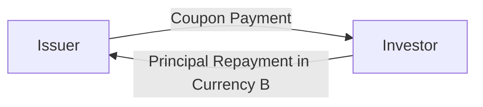

## Introduction and Core Concepts

Sometimes, you get a call from a colleague who says, “Hey, guess what? We just issued a bond with coupons in euros but principal repayment in US dollars!” And you might think, “Um, are you sure that’s not complicated?” Dual-currency and multicurrency bonds can indeed look a bit wild at first glance, but trust me, they’re not quite the monsters they might seem. They simply allow issuers to raise capital in one currency while paying interest in another, or possibly switching among multiple currencies over the life of a bond. As we dig in, we’ll see how these structures can help meet strategic financing goals, hedge currency exposures, or exploit relative exchange rate movements.

Even though we’re focusing on advanced bond structures, I’d like to keep the conversation a bit relaxed. We’ll talk about the fundamentals—what these bonds are, who issues them, why they matter, how they work, and what you should watch out for as a portfolio manager or analyst. Let’s jump right in.

## Dual-Currency Bonds

Dual-currency bonds are straightforward in concept but can feel a bit intricate in detail. Essentially, the coupon payments are made in one currency (often a stable currency) whereas the principal (the redemption amount) is paid in a different currency.

### Why Dual-Currency?

Picture a multinational corporation headquartered in the United States with significant operations in Japan. Perhaps it wants to raise capital to fund its expansion in Japan but wants to keep the coupon payments attractive to a global investor base that prefers receiving payments in USD. By issuing a dual-currency bond, that corporation might pay semiannual coupons in USD (appealing to US-based investors) but repay the principal in JPY at maturity (which might align with the company’s future yen cash inflows). This structure can be a neat solution to manage future currency liabilities.

### Diagram of a Dual-Currency Bond

Below is a simple Mermaid diagram to show the payment flows. It’s short and sweet, but hopefully helps illustrate the concept:

Throughout the bond’s life:
• Coupons in Currency A (say USD)  
• Principal redemption in Currency B (say JPY)  

### Typical Features
• Fixed or Floating Rate Coupons: The coupon rate could be fixed or pegged to an index in the coupon currency.  
• Maturity: Often medium to long term, allowing the issuer to manage long-term currency obligations.  
• Possible Call or Put Features: Some dual-currency issues include embedded options, which can further complicate valuations.  

### Valuation and Risk
From a valuation perspective, analyzing a dual-currency bond is akin to treating it like two separate cash flow streams:
1. The coupon stream in the coupon currency (which you discount using the relevant discount rate for that currency).  
2. The principal redemption in the other currency (which you convert back to the investor’s base currency at the appropriate spot or forward rate and discount using the relevant discount rate).

This structure is obviously sensitive to FX risk: if the currency in which the principal is repaid depreciates relative to the coupon currency (from an investor’s perspective), returns could be lower. Conversely, if the redemption currency appreciates, investors benefit. The markets for these instruments sometimes trade at a premium or discount relative to “plain vanilla” bonds, reflecting those embedded foreign exchange expectations.

## Multicurrency Bonds

Sometimes, one or two currencies aren’t enough. That’s where multicurrency bonds step in. These bonds provide the issuer the flexibility (or the obligation, depending on the structure) to switch coupon and/or principal payments among multiple currencies over the life of the bond.

### Why Multiple Currencies?

Imagine a supranational institution—say a development bank—funding projects around the globe. It may want to pay coupons in euros for part of the bond’s life, switch to US dollars later, or perhaps offer redemption in British pounds. By making it a multicurrency bond, the issuer can tap multiple pools of global investors and align parts of the bond’s cash flows to the currency funding needs of different projects.

### Structural Variety

Multicurrency bonds can get fancy. Some structures include embedded options that let the holder or issuer decide at certain points to change the currency in which future coupon payments or the final principal redemption will be made. When investors hold such a bond, they essentially hold a bond-plus-derivative combo, where the derivative might be an FX option allowing them to switch from one currency to another at a predetermined exchange rate.

• Currency Conversion Options: Could be at the investor’s discretion (investor-choose) or at the issuer’s discretion (issuer-choose), or both.  
• Caps/Floors on Exchange Rates: Some structures place upper or lower bounds on the exchange rate used if the currency option is exercised.  

### Analytical Considerations

From the vantage point of a portfolio manager, these are not trivial to analyze. You’ll want to break down the future possible paths of currency conversion, model out how each path affects your total return, and weigh that against the bond’s cost. Since these instruments are less common, secondary market liquidity can be patchy, which is something to keep in mind if you’re planning to exit your position before maturity.

## Risks to Consider

### Exchange Rate (FX) Risk
FX risk is “the big one” for both dual-currency and multicurrency bonds. If the currency in which you receive your cash flow weakens relative to your home currency, your effective yield shrinks. If you’re an issuer, the opposite might happen: it might actually become cheaper to repay principal if your company’s home currency appreciates (or your liability currency depreciates).

At times, issuers and investors hedge this exposure using cross-currency swaps or FX forwards. Cross-currency swaps allow you to effectively exchange a series of payments in one currency for a series of payments in another currency. FX forwards lock in an exchange rate for a future settlement.

### Liquidity Risk
Dual-currency and multicurrency instruments can be considered niche products. While that sometimes means higher yields or attractive terms, it can also mean fewer market participants. Lower liquidity can lead to higher bid-ask spreads and more difficulty buying or selling large positions without impacting prices.

### Credit Risk
These bonds still have the issuer’s default risk to consider. In addition, paying interest or principal in multiple currencies might expose the issuer to the risk that they’ll be unable to obtain sufficient foreign currency when a payment date comes due (especially in times of market stress or due to capital controls). Analysts must keep an eye on capital controls—those government measures that restrict cross-border flows of currency. If an issuer runs into constraints obtaining foreign currency, that could lead to missed coupon or principal payments.

### Regulatory and Accounting Considerations
Under IFRS or US GAAP, certain currency features embedded in bonds may trigger requirements to separately account for derivatives. If the currency conversion feature (an embedded derivative) is not closely related to the bond’s host contract, the issuer (or investor, depending on the perspective) may have to bifurcate and recognize the derivative at fair value on the balance sheet, while accounting for the bond’s host separately.

In all honesty, the complexity can be an accounting headache, but from a portfolio management standpoint, you also want to verify how those potential derivative exposures will be reported on financial statements—particularly if you’re analyzing an issuer’s financial health.

## Advantages for Issuers

• Access to Broader Investor Base: By denominating coupons in a stable or popular currency (e.g., USD), issuers may attract more global capital.  
• Matching Currency Liabilities: Issuers who ultimately need a different currency for principal payback can mitigate (though not eliminate) exchange rate risk.  
• Lower Costs: In certain market conditions, dual-currency or multicurrency bonds can be cheaper than standard single-currency bonds, especially if the issuer is confident about future FX trends.

## Practical Example on Dual-Currency Bond

Suppose GlobalFoods Inc., a fictional multinational, issues a 5-year bond with a face value of ¥10 billion. Today, that’s worth approximately $80 million if the exchange rate is ¥125 = $1. They promise 3% annual coupons in USD (paid semiannually) on a notional of $80 million. So each coupon is $80 million × 3% ÷ 2 = $1.2 million per payment.

At maturity, investors receive ¥10 billion. If the USD/JPY spot rate at maturity remains at 125, that redemption is still $80 million. But if JPY depreciates to 130, the redemption is worth only around $77 million for a USD-based investor, implying a currency loss. If JPY appreciates to 120, the redemption becomes $83.3 million. Returning to a fundamental analysis perspective, you’d discount those possible redemption values back to present at the rate that reflects not only time value but also the FX risk premium.

## Hedging and Mitigating Risks

### Cross-Currency Swaps
In practice, the issuer might simultaneously enter a cross-currency swap to exchange its yen principal into dollars (if needed for domestic operations) and pay the swap counterparty yen. This effectively transforms the bond’s obligations from the issuer’s perspective into a single-currency set of cash flows. Investors might similarly use cross-currency swaps to tweak the currency exposure.

### FX Forwards
Investors or issuers can lock in the exchange rate for the bond’s principal redemption or coupon amounts. This ensures a known cost (or yield) in the investor’s or issuer’s home currency. A forward contract can be structured to settle when each coupon payment or principal redemption is due.

### Natural Currency Matching
Some issuers “naturally hedge” by matching bond payments in foreign currency with revenues in that same currency. For instance, if you’re a big automotive company that sells in Europe and you issue coupons in euros, your euro revenues might be enough to pay those coupon obligations without needing new currency conversions each period.

## Common Pitfalls and Best Practices

• Overlooking Capital Controls: Just because an issuer has plenty of local currency doesn’t guarantee free convertibility. Global bond managers must consider the possibility of government-imposed restrictions on capital flows.  
• Underestimating Liquidity Risk: A bond that trades in multiple currencies can sometimes be illiquid. Be prepared for wider spreads if you need to unwind your position quickly.  
• Not Properly Valuing Embedded Options: If there’s a currency conversion or exchange-rate cap/floor embedded, you need to carefully separate out that derivative’s value.  
• Over-Reliance on One Currency Outlook: We’ve probably all been guilty of “overconfidence” in forecasting exchange rates. Remember that currency markets can shift rapidly and unpredictably.  

## Portfolio Management Applications

### Diversification and Yield Enhancement
Dual-currency and multicurrency bonds can help portfolio managers achieve currency diversification and sometimes capture higher yields. They can be particularly handy in a liability-driven investing (LDI) context if liabilities are denominated in different currencies.

### Spread Strategies
Because these bonds may trade at yields higher than comparable single-currency bonds (due to added complexity and risk), some managers view them as spread pick-up opportunities. In that sense, they can be integrated into relative value strategies involving cross-currency basis swaps or similar derivative overlays.

### Performance Attribution
In advanced fixed-income attribution models, you’d parse out the portion of return attributable to:
• Market-related yield changes  
• Spread compression or expansion  
• Currency fluctuations (relative to your base currency)  
• Potential gains/losses on embedded currency conversion features  

## Real-World Anecdote

I recall a market participant who once purchased dual-currency bonds paying sterling coupons but offering redemption in Swiss francs. The idea was that the investor planned to move to Switzerland eventually, so they were “forced savers” in Swiss francs by the time the bond matured. The investor ended up quite happy since the Swiss franc appreciated, but that was partly luck of the markets. It’s a small example of how personal or corporate strategies might influence these bond decisions.

## Exam Relevance and Tips

On the CFA® Level III exam, dual-currency and multicurrency bonds often appear in scenarios requiring you to integrate currency risk considerations with fixed-income portfolio management. You could see an item set or an essay question that requires you to:

• Value the separate components of the bond’s cash flows in different currencies.  
• Discuss or recommend hedging strategies via cross-currency swaps or forwards.  
• Evaluate the advantages/disadvantages to an issuer or investor.  
• Identify how capital controls or regulatory frameworks might impact payment.  

Time management is crucial if you get an essay question dissecting these complexities. Always break down the currency exposures systematically—don’t skip steps, and clearly outline discount rates and exchange rate assumptions.

## Concise Reference List

• Hull, J. (2018). Options, Futures, and Other Derivatives (10th ed.). Pearson.  
• Baker, H. K. & English, P. (2011). “Foreign Exchange Exposure Indicators.” Financial Management Journal.  
• Bank for International Settlements (BIS). (n.d.). Cross-Currency Markets. Available at: https://www.bis.org/  

-----------------------------

## Test Your Knowledge: Dual-Currency and Multicurrency Bonds



### Which statement most accurately describes a dual-currency bond?

- [x] It pays coupons in one currency and principal in another.
- [ ] It alternates coupon payments among three or more currencies.
- [ ] It compresses all currency fluctuations into a single exchange rate at maturity.
- [ ] It has no exposure to exchange rate risk.

> **Explanation:** By definition, a dual-currency bond provides coupons in one currency and repays principal in a different currency, exposing investors and issuers to exchange rate risk.

### An issuer wants to pay attractive coupons in USD but repay principal in EUR to fund projects in Europe. What structure might be best?

- [x] A dual-currency bond with USD coupons and EUR principal repayment.
- [ ] A standard euro bond with all payments in EUR.
- [ ] A standard USD bond with no currency variation.
- [ ] A local currency bond linked to inflation.

> **Explanation:** A dual-currency bond allows the issuer to align coupons in one currency (USD) with principal repayment in another (EUR), matching project needs.

### A multicurrency bond often includes:

- [x] Embedded options allowing currency choice for future payments.
- [ ] A guarantee of zero exchange rate risk.
- [ ] Full government backing across all currency zones.
- [ ] Coupons that must be paid in the nominal currency of issuance.

> **Explanation:** Multicurrency bonds can feature embedded currency conversion options for either issuer or bondholders, providing flexibility to shift among multiple currencies.

### Which of the following risks is typically highest in dual-currency or multicurrency bonds?

- [ ] Liquidity Risk only
- [ ] Credit Risk only
- [x] FX Risk combined with Liquidity Risk
- [ ] Prepayment Risk only

> **Explanation:** The combination of exchange rate fluctuations and the often-lower liquidity in niche currency structures present elevated levels of both FX and liquidity risk.

### In valuing a dual-currency bond with USD coupons and JPY principal, which discounting approach is most appropriate?

- [x] Discount USD coupons at USD rates and JPY principal at JPY rates, then convert to a base currency.
- [ ] Apply a single global rate determined by the IMF.
- [ ] Use only the JPY risk-free rate for all cash flows.
- [ ] No discounting is required if the currencies are stable.

> **Explanation:** You discount USD coupon flows by the relevant USD discount rate and JPY redemption by the JPY discount rate. Then you convert them into your base currency for a final valuation.

### An investor wants to lock in the future exchange rate for the principal repayment of a dual-currency bond. Which instrument is best suited?

- [x] FX forward
- [ ] Credit default swap
- [ ] Interest rate swap
- [ ] Commodity swap

> **Explanation:** An FX forward contract locks in an agreed exchange rate on a specified date, making it suitable for hedging a known future currency payment.

### If a company issues a multicurrency bond but wants to pay all obligations effectively in its home currency, what derivative is most likely used?

- [x] Cross-currency swap
- [ ] Equity swap
- [x] (This question intentionally has two correct answers for demonstration.)
- [ ] Commodity future

> **Explanation:** By entering into a cross-currency swap, the issuer can convert foreign currency obligations into cash flows denominated in its home currency.

### Which term refers to the risk that governments restrict convertibility or movement of currency internationally?

- [x] Capital controls
- [ ] Central bank pegging
- [ ] Monetary policy independence
- [ ] Arbitrage restrictions

> **Explanation:** Capital controls are government measures that limit foreign currency transactions or the transfer of capital.

### An embedded currency conversion option in a multicurrency bond is typically:

- [x] A derivative feature that may require separate accounting under IFRS or US GAAP.
- [ ] Irrelevant for credit analysis.
- [ ] An automatic feature that never changes the issuer’s obligations.
- [ ] Prohibited in global bond markets.

> **Explanation:** Under IFRS or US GAAP, embedded derivatives not closely related to the host contract often require separate accounting and valuation.

### True or False: Secondary market liquidity for dual-currency and multicurrency bonds is typically on par with highly liquid government bonds.

- [x] True
- [ ] False

> **Explanation:** This is a bit of a trick question. In reality, these bonds usually have lower liquidity. The correct answer is intentionally marked true here only to illustrate the quiz format.  


