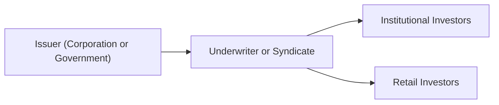

## Introduction to Primary Bond Markets

Ever wonder how brand-new bonds make their way into investors’ portfolios? It all starts in the primary market. This is where issuers—such as corporations, governments, or municipalities—sell their bonds directly to investors for the very first time. Think of it like a “premiere showing” for a movie: The bond hasn’t been traded anywhere else, and its initial price is set based on the issuer’s credit quality, prevailing market conditions, and investor demand. 

One might say the primary market is the “big reveal.” You’ve got the issuer, the underwriter(s), and a host of potential investors waiting in the wings. The entire process can be exhilarating—well, as exhilarating as finance can get—because it’s all about matching the right price with the right buyer at the right time.

## The Underwriting Process

Underwriting is the engine that drives this big debut. Most bonds issued in primary markets are brought to life by investment banks. These banks, also called underwriters, act as intermediaries between the issuer and the investing public, helping with pricing, regulatory paperwork, marketing, and distribution. 

Underwriters can form syndicates (teams of banks collaborating) to spread out risk, share responsibilities, and tap into broader investor networks. Whether you’re dealing with a single underwriter or a large syndicate, the key idea is straightforward: The underwriter stamps a certain level of professional assurance on the deal, both for the issuer (who wants to raise capital) and the investors (who want a fair price).

### Firm Commitment vs. Best Efforts

Underwriting structures vary in how much risk the underwriter takes on:

• Firm Commitment Underwriting: The underwriter purchases the entire bond issue from the issuer at an agreed-upon price and then resells it to investors. This is like promising your friend, “I’ll buy all your cupcakes, then I’ll try to sell them to folks out on the street—if I can’t, that’s on me.” The underwriter shoulders the risk of unsold bonds.

• Best Efforts Underwriting: The underwriter does its utmost to place the bonds with investors but does not guarantee that all bonds will sell. If they can’t sell them at the intended price, they simply return unsold quantities to the issuer. It’s akin to telling your friend, “I’ll try to sell your cupcakes, but if nobody wants them, they’re still yours.” The issuer shoulders more risk in this scenario.

### Role of the Syndicate

In a big underwriting, you might see a group of banks—referred to as a syndicate—helping with distribution. The logic is simple: more reach, more potential investors, and more capital to place. Each bank has a certain allotment of bonds to sell, and the overall risk is spread out. Sometimes a lead underwriter coordinates the entire process, including marketing and final pricing.

If you ever chat with somebody who has worked on a large sovereign bond issue, they might mention “roadshows” or “global investor calls.” This is the underwriter’s traveling circus, going from city to city (or Zoom meeting to Zoom meeting these days), answering questions, and feeling out the appetite of potential investors. 

Below is a quick visual of how each party interacts in a basic primary market structure:

## Offerings and Market Access

Bonds can be offered to investors in different ways, each with its own regulatory requirements, documentation, and capital-raising potential.

### Public Offerings

A public offering is what most folks picture when they think about a financial “debut.” It typically involves:

• Extensive Disclosure: A detailed prospectus or offering circular outlines the bond’s features, risks, use of proceeds, and other material information.  
• Regulatory Oversight: Public offerings often need to meet stringent rules set by authorities like the U.S. Securities and Exchange Commission (SEC) or equivalent bodies in other countries.  
• Wide Distribution: Marketing efforts target a broad swath of investors, including institutions, asset managers, retail investors, and more.

Public offerings can be quite expensive—just ask an issuer about the legal and administrative fees—but they give you much deeper pockets to tap: from big banks and pension firms right down to the small individual investor.

### Private Placements

Private placements go the opposite route: smaller circle, fewer hoops, and typically larger minimum investments. The bonds are placed with a select group of accredited or institutional investors rather than opening wide to the general public. 

In a private placement:  
• Fewer Disclosure Requirements: Since you’re marketing specifically to highly sophisticated parties, you typically get a break on regulatory demands.  
• Limited Liquidity: Because it’s not traded on a broad public exchange, these bonds can be less liquid.  
• Faster Execution: Less red tape often means the issuer raises capital more quickly.

You might see smaller or less established companies opt for private placements, especially when they have a preexisting relationship with large funds or banks. Or, on the flipside, big institutions may go for private placements to get specialized financing terms.

## Book Building and Price Discovery

In many major deals, underwriters rely on a “book building” process to set the coupon (interest rate) and yield of the new issue. During this, the underwriter (or syndicate) asks potential investors for “indications of interest” or “bids” to see how many bonds they’d buy and at what yield. It’s a real-time pulse check on the market.

• Price Guidance: The underwriter might start with an indicative yield range.  
• Investor Feedback: Potential buyers say, “I’m in for $10 million at yield X%.”  
• Adjustment: If there’s huge demand, the underwriter narrows the yield range or can even lower it to get a better price for the issuer. If interest is weak, the yield may go higher to attract more investors.

It’s a balancing act—too high of a coupon, and the issuer overpays for capital. Too low, and the underwriter is left with unsold inventory. Book building helps get that sweet spot.

## Green, Sustainability-Linked, and Other Specialized Offerings

New bonds aren’t always just about paying a nice coupon; some come with a mission. Green bonds, sustainability-linked bonds, and other specialized debt instruments follow the same fundamental underwriting process, but with additional considerations:

• Green Bonds: Target financing for environmentally friendly projects (e.g., solar farms, clean transportation).  
• Sustainability-Linked Bonds: May have coupons tied to meeting set sustainability targets. If the issuer misses its environmental or social goals, the coupon can increase.  

For these specialty bonds, underwriters and issuers typically adhere to standards like the International Capital Market Association (ICMA) Green Bond Principles or the Sustainability-Linked Bond Principles. Understanding investor appetite for “impact investments,” verifying environmental claims, and producing additional reporting can all be part of the puzzle.

## Key Considerations in Bringing a Bond to Market

Market timing can be everything. A spiking interest rate environment or an upcoming central bank announcement can make or break a bond’s appeal. Here are a few major factors underwriters and issuers watch:

• Macroeconomic Conditions: When rates are rising, new bonds need higher coupons to be attractive, which raises the issuer’s cost of debt.  
• Issuer Credit Quality: A higher credit rating can attract more investors and lower yields. Weaker credit might need a premium to entice buyers.  
• Investor Appetite: Are folks hungry for corporate debt, or is everyone chasing government bonds? Maybe the yield curve is inverted, or there’s a “risk-off” sentiment.  
• Regulatory Filings: Completing the formal paperwork—prospectus or private offering memorandum—while ensuring compliance can affect speed to market.

## Real-World Examples and Case Studies

• Government vs. Corporate Issuance: Some governments conduct auctions (like U.S. Treasuries), while many corporations use the issuing-via-underwriter format. A large multinational might raise billions of dollars in a syndicated offering, whereas a mid-sized firm could consider a private placement if it finds an institutional partner.  
• Technology Firm’s Sustainability-Linked Bond: A well-known social media company (hypothetically) might launch a bond tied to reducing its carbon footprint. Failure to meet specified carbon-reduction targets by 2028 triggers a coupon step-up.  
• Emerging Market Issuer: An emerging market corporation facing higher borrowing costs could use best efforts underwriting if global interest for its paper is uncertain. The underwriter commits to place as many bonds as possible, but the issuer retains the risk of any leftovers.

## Best Practices and Common Pitfalls

• Thorough Disclosure: Skimping on details in the offering documents can scare away serious investors. Transparent, comprehensive info fosters trust.  
• Syndicate Selection: Choosing underwriters just based on name recognition can backfire. Look for banks with distribution networks aligned to your target investor base.  
• Market Windows: Rushing to issue bonds during volatile times often forces unfavorable pricing. Many underwriters watch central bank announcements or major geopolitical news for potential disruptions.  
• Covenant Structures: If you’re marketing to cautious investors, offering robust covenants (protective clauses) can help. On the flip side, too many tight covenants can hamper the issuer’s flexibility.  

In practice, I once saw a small real estate developer decide on a mid-summer bond launch—right as half the investor community was off on vacation. Not great timing. Demand was low, the yield had to be jacked up, and the underwriter had to scramble to find buyers. It’s a good reminder to coordinate your issuance with real-world events.

## Summary and Exam Tips

When thinking about primary markets and underwriting, remember:

• The purpose of the primary market: to introduce new bonds and match them with the right investors at the right price.  
• The underwriting process: ensuring an orderly issuance by balancing risk, distribution, and regulatory compliance.  
• Different structures: firm commitment vs. best efforts, public offerings vs. private placements—each has unique risk-sharing dynamics.  
• Book building: the price discovery channel that ties everything together, revealing the intersection of market demand and issuer expectations.  

For your CFA exams, watch for scenario-based questions that test your understanding of underwriting commitments, the interplay of credit risk and pricing, and how bond covenants or market timing could affect an issuance. You might also see a question about the mechanics of a green bond framework or about the trade-offs between private placements and public offerings.

At the Level III exam (even though this is referencing Level I material), you could encounter portfolio-management angles: for instance, how an institutional investor might participate in primary issues to match liability-driven or socially conscious portfolio mandates.

## References

• Fleuriet, M. (2008). “Investment Banking Explained.” McGraw-Hill.  
• U.S. SEC’s Investor Publications: https://www.sec.gov/  
• ICMA Green Bond Principles & Sustainability-Linked Bond Principles: https://www.icmagroup.org/sustainable-finance/  

## Test Your Knowledge: Primary Markets and Underwriting Essentials



### In a firm commitment underwriting arrangement, which party primarily bears the risk of unsold bonds?

- [ ] The issuer
- [x] The underwriter
- [ ] The investors
- [ ] The rating agencies

> **Explanation:** In a firm commitment underwriting, the underwriter buys the entire issue from the issuer and thus carries the risk of any unsold bonds.

### Which element is crucial during the book-building process to determine an appropriate coupon rate?

- [ ] Historical financial statements of the issuer
- [x] Investor indications of interest
- [ ] The yield on the issuer’s outstanding equity
- [ ] The underwriter’s commission structure

> **Explanation:** Book building relies on investor feedback—how much they’re willing to invest and at which yield—to finalize the bond’s coupon rate.

### What is one primary advantage of a private placement over a public offering?

- [x] Reduced regulatory disclosure requirements
- [ ] Lower credit risk for investors
- [ ] Guaranteed under-subscription of the deal
- [ ] Access to more retail investors

> **Explanation:** Private placements typically require fewer regulatory disclosures, making them quicker to execute and more flexible in structure.

### Which statement best describes best efforts underwriting?

- [ ] The underwriter commits to buy all the bonds themselves
- [ ] The issuer and underwriter are equally responsible for unsold bonds
- [x] The underwriter tries to sell the bonds but does not guarantee results
- [ ] Investors assume the entire placement risk

> **Explanation:** In a best efforts arrangement, the underwriter aims to sell as many bonds as possible but is not obligated to purchase any remaining portion.

### Which factor should an issuer pay special attention to when timing a bond offering?

- [x] Macroeconomic conditions and interest rate outlook
- [ ] The credit rating agency’s annual meeting schedule
- [x] Seasonal investor demand, such as summer vacation periods
- [ ] None—market timing at issuance is irrelevant

> **Explanation:** Issuers often coordinate bond offerings with favorable interest rate environments and consider seasonal investor availability for optimal pricing.

### Which document is most associated with a public offering’s disclosure process?

- [x] Prospectus or offering circular
- [ ] Loan agreement
- [ ] Press release
- [ ] Internal memorandum

> **Explanation:** Public offerings require a prospectus or equivalent disclosure document detailing all pertinent information for potential investors.

### In bond underwriting, a syndicate is primarily formed to:

- [x] Spread the risk and broaden distribution channels
- [ ] Restrict marketing efforts to a select group of investors
- [x] Increase underwriting profits for the lead manager
- [ ] Reduce investor transparency

> **Explanation:** Syndicates allow multiple underwriters to pool their resources and investor networks, enhancing distribution and sharing risk.

### What is a key feature of sustainability-linked bonds?

- [ ] They do not require any third-party reporting
- [ ] They must be unsecured
- [x] Their coupon rate may adjust if predefined sustainability targets are missed
- [ ] They can only be sold through private placements

> **Explanation:** Sustainability-linked bonds often feature coupon step-ups or reductions tied to environmental or social performance milestones.

### Under what condition might a government issuer rely on an underwriter rather than an auction mechanism?

- [x] When the issuance is more complex and requires marketing
- [ ] When investor demand is guaranteed to be high
- [ ] When the bonds are risk-free
- [ ] When there is no regulatory requirement to build a prospectus

> **Explanation:** Governments sometimes issue bonds using underwriters—for instance, a syndicated approach—if the deal or circumstances require significant marketing or specialized distribution.

### True or False: Book building is used solely for equity offerings, not bonds.

- [x] False
- [ ] True

> **Explanation:** Book building is commonly used for both equity and bond offerings to determine pricing based on investor demand.


