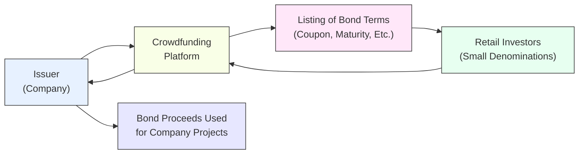

## Introduction and Motivation

Picture this: you’re chatting with a friend who’s super excited because, out of nowhere, she’s invested in a micro-bond issued by a local renewable energy company. Instead of needing a hefty sum of capital, she was able to commit just a small contribution via an online crowdfunding portal. Well, that’s no longer a fantasy for many: crowd-based bond issuance—sometimes called “debt crowdfunding”—and direct market access (DMA) are reshaping how bonds are issued, traded, and owned.

In traditional bond markets, large institutions dominate, while smaller investors typically buy or sell bonds through brokers who may impose minimum purchase sizes. But these newer channels can lower barriers for investors, enhance transparency, and reduce overall costs. From a CFA® exam perspective, you want to understand not only the mechanics—who invests, how funds are raised—but also the deeper implications for market dynamics, liquidity, risk, and regulatory requirements.

## Defining Crowd-Based Bond Issuance

Crowd-based bond issuance is a form of debt crowdfunding in which companies (often small or mid-sized but sometimes larger) raise debt capital by selling smaller bond slices to many individual investors. It’s an offshoot of the general crowdfunding concept, which gained popularity for start-up equity raises or creative project funding.

### How It Works

Online platforms facilitate the process. Issuers create a bond offering—complete with terms like maturity, coupon rate, minimum investment, and associated risk disclosures—and then open it to the “crowd” for subscription. The platform itself might provide:

• Marketing support (pitch decks, investor outreach)  
• Credit screening or due diligence  
• Payment facilitation, ensuring the collection of principal and interest  

Once the offering reaches its funding target, the issuer receives the proceeds. Investors then hold a bond claim on the issuer, and, in return, they expect coupon payments and eventually their principal back at maturity.

### Rationale and Value Proposition

• Democratization: Individuals with smaller capital can purchase denominated “shares” of the debt at face values that might be under US$1,000—and sometimes as low as US$100.  
• Diversification: For smaller investors, these bonds can provide a path to building a more fully diversified fixed-income portfolio.  
• Community Engagement: Some crowd bonds finance local infrastructure, green projects, or social enterprises—allowing investors to align personal values with investments.  
• Speed: Both the issuer and investors benefit from an online platform that consolidates marketing, regulatory documentation, and subscription in one digital environment.

### Potential Pitfalls and Challenges

• Scaling and Liquidity: Because each issuance might be relatively small, secondary market liquidity can be weak. Investors who need to sell early might face poor liquidity or uncompetitive pricing.  
• Credit Risk Transparency: Crowd-based bond buyers can sometimes be less financially sophisticated. If credit risk isn’t communicated clearly by the platform, investors might not accurately gauge default probabilities or potential recovery rates.  
• Regulatory Complexity: Jurisdictions have varying crowdfunding regulations (e.g., the European Crowdfunding Service Provider (ECSP) framework in the EU). That can push platforms to navigate labyrinthine rules regarding investor protections, licensing, and disclosures.  
• Platform Stability: The viability of the crowdfunding platform itself matters (technology risk, platform solvency). A defunct or compromised platform can interrupt interest payments or rightful claims.

## Real-World Example

Let’s say Treetop Solar, a small renewable energy startup, decides to raise US$5 million by issuing a five-year green bond directly via a crowdfunding platform. They set a 6% annual coupon, with a minimum investment of US$500. Thousands of retail investors invest. The bond is oversubscribed in a couple of weeks, and Treetop Solar has the capital to expand its solar panel manufacturing line. Investors receive interest in small monthly increments. The entire process might last just a month or two from marketing to issuance—much faster than a conventional corporate bond offering that demands a lengthy underwriting process.

## Technology & Regulatory Overlaps

What’s interesting (and tested on the CFA® exam) is how crowd-based issuances intersect with broader fintech trends. Digital tokens, blockchain-based settlement, and real-time transaction monitoring can be integrated into crowdfunding. In some cases, the “bond” might be partially recognized as a security token. While the technology is still evolving, it has the potential to speed up settlement, reduce costs, and enhance transparency.

Certain regulators around the world require platforms to register as financial institutions or as recognized crowdfunding service providers. In the EU, the new ECSP regulations unify crowdfunding rules across member states, setting maximum issuance limits and requiring standardized disclosures. Familiarity with these frameworks can help professionals evaluate whether a crowd-based bond is legally regulated and trustworthy.

## Direct Market Access (DMA)

While crowd-based bond issuance centers on smaller (often retail) investors, the concept of direct market access is particularly relevant for institutions and sophisticated market participants. DMA technology lets buy-side firms (e.g., asset managers, pension funds, hedge funds) connect directly to an exchange or OTC trading venue without going through an opaque chain of brokers or dealers.

### Mechanics of DMA

Instead of calling or emailing a broker-dealer to place trade orders, buy-siders with DMA can route trades electronically. Straight-through processing (STP) systems allow orders to flow seamlessly from a portfolio manager’s or trader’s workstation to the market’s order book. This might involve:

1. An agreement with a broker that sponsors DMA for regulatory compliance.  
2. Dedicated connectivity—often through specialized software or FIX (Financial Information eXchange) protocols.  
3. Real-time market data feeds, giving buy-side traders visibility into the full depth-of-market and enabling algorithmic or high-frequency trading strategies.

### Benefits of DMA

• Cost Reduction: With fewer intermediaries capturing trading spreads, DMA can reduce transaction costs.  
• Speed and Control: Traders can see live market conditions and interact with the order book directly. This can improve execution quality, especially for large block trades in less liquid fixed-income instruments.  
• Transparency: Market data is more robust, and buy-side firms have a clearer sense of pricing and liquidity.  
• Opportunities for Innovation: Electronic bond-trading platforms can integrate pre-trade analytics, advanced execution algorithms, and risk-management tools.

### Drawbacks and Responsibilities

• Direct Regulatory Compliance: Firms using DMA must ensure they meet all trading standards, best-execution requirements, and market abuse regulations. No broker is underwriting compliance on their behalf.  
• Technology Complexity: Setting up and maintaining the necessary infrastructure can be expensive. This might involve specialized trading systems, data feeds, robust risk controls, and skilled IT staff.  
• Credit Risk: In certain OTC markets, counterparties rely on lines of credit for settlement. Without strong relationships or clearing capabilities, the firm might still need a prime broker or clearing agent in the chain.  
• Potential Impact on Market Structure: If DMA significantly proliferates, it might reduce the number of traditional dealers, changing pricing dynamics and market liquidity patterns.

## Crowd Issuance and DMA in Fixed-Income Portfolios

### Integrating Crowd Bonds in Multi-Asset Portfolios

From a portfolio management perspective, crowd-based bonds can offer higher yields and some exposure to niche sectors—like microfinance or renewable energy. But watch out for credit risk, illiquidity, and the potential for untested issuers. For a well-diversified multi-asset portfolio, however, such instruments might serve as a small satellite allocation. Their correlation to broader markets might be low, offering some diversification benefits.

### DMA for Fixed-Income Strategy Execution

Institutional portfolio managers often trade large blocks of corporate or government bonds. With DMA, they can place limit orders, hidden orders, or engage in algorithmic strategies to minimize market impact. Sophisticated analytics can watch real-time yields, micro changes in the yield curve, and variations in credit spreads across electronic platforms. This direct approach can reduce slippage and friction, thus improving overall performance, especially for large funds that measure success in basis points.

### Risk and Regulatory Considerations

• Suitability: In many jurisdictions, regulators want to ensure that individuals investing in crowd-based bonds meet certain financial literacy or net worth thresholds (especially if these bonds aren’t insured or aren’t investment grade).  
• Disclosure Requirements: For direct access trading, buy-side institutions must pass “know-your-customer” (KYC) checks and have robust internal compliance set-ups.  
• Market Impact: Could direct trading reduce liquidity if more participants fragment the available bond supply across multiple platforms? Possibly. That’s a question that regulators, central banks, and market operators are examining closely.  
• Systemic Risk: Crowd-based platforms and DMA are heavily reliant on technology. A major cyber-attack or platform failure could cause broader market disruptions, especially if retail participation grows significantly or if big institutional players rely on a single liquidity partner.

## Diagram: Conceptual Flow of Crowd-Based Bond Issuance

Below is a simplified Mermaid diagram illustrating the main parties involved in a crowd-based bond issuance and the typical flow of funds and information:



In this schematic:

• The issuer provides details of the offering to the crowdfunding platform (B).  
• The platform lists these details publicly (C), enabling individual retail investors (D) to subscribe.  
• Collected funds are then transferred to the issuer (A), and the issuer uses them for expansion or project financing (E).  
• Ongoing interest payments and eventual principal repayment flow back from the issuer to investors through the platform.

## Example: Python Snippet for Automated Risk Scoring

Below is a simple (and intentionally very high-level) Python snippet illustrating how a crowdfunding platform might automatically calculate a basic credit risk score for new bond issuers. This score would then be displayed to investors:

```python
import pandas as pd

data = {
    'Revenue': [10_000_000],
    'EBIT': [1_500_000],
    'Debt': [8_000_000],
    'Equity': [2_000_000]
}

df = pd.DataFrame(data)

def compute_leverage_ratio(debt, ebit):
    return debt / ebit

def compute_debt_to_equity(debt, equity):
    return debt / equity

leverage_ratio = compute_leverage_ratio(df['Debt'][0], df['EBIT'][0])
dte_ratio = compute_debt_to_equity(df['Debt'][0], df['Equity'][0])

if leverage_ratio < 5 and dte_ratio < 4:
    risk_score = "Low to Moderate Risk"
elif leverage_ratio < 8 and dte_ratio < 6:
    risk_score = "Moderate Risk"
else:
    risk_score = "High Risk"

print(f"Issuer Risk Score: {risk_score}")
```

Of course, real platforms would involve a deeper credit model—encompassing qualitative factors, industry dynamics, and forward-looking cash flow analyses—but the snippet illustrates the concept of automated credit checks.

## Best Practices and Common Pitfalls

### For Crowd-Based Bond Investors

• Due Diligence: Don’t rely solely on the platform’s marketing material. Review the issuer’s financials and your own capacity for loss.  
• Diversification: Allocate only a small portion of your total investment portfolio to crowd-based bonds, given potential illiquidity and higher default risk.  
• Ongoing Monitoring: Keep track of interest payments, issuer updates, and any platform announcements regarding risks or changes in fees.

### For Institutions Using DMA

• Robust Systems: Ensure you have bulletproof IT infrastructure to avoid downtime or erroneous trades.  
• Trade Execution Policies: Pre-defined risk limits, position limits, and circuit breakers help mitigate unexpected volatility.  
• Regulatory Compliance: In many markets, the buy-side might still need a sponsoring broker for market access. Make sure your legal counsel has thoroughly checked local requirements.

## Practical Exam Pointers

From a CFA exam vantage point, keep these in mind:

• Crowd-based bond issuance signals that new forms of market access can change the yield profile of certain assets and possibly expand opportunities for smaller investors.  
• Direct market access is a cornerstone for advanced trading strategies: it ties in with liquidity risk management, transaction cost analysis, and how dealers and buy-side firms interact.  
• Scenario-based questions might ask you to evaluate an issuer’s credit risk in a crowdfunding environment or to discuss how lower transaction costs from DMA might influence yield spreads and portfolio rebalancing approaches.  
• Ethical and Professional Standards: In the exam, regulators worry about investor protections, while the CFA Institute Code and Standards emphasize transparency and diligence. You might see vignettes on potential conflicts of interest in crowd-based funding platforms or on applying best execution principles when using DMA.

## Conclusion and Final Thoughts

Crowd-based bond issuance and direct market access illustrate the incredible speed at which fixed-income markets are innovating. These developments strive to create more inclusive access (for both small and sophisticated investors), cut transaction costs, and leverage technology in the spirit of open finance. Yet, these same frameworks can introduce new risks: platform failures, cybersecurity threats, and credit complexities that some investors might not fully comprehend.

For Level I candidates, a solid grounding in these evolutions will serve you well, as they resonate across multiple Study Sessions—from fundamental bond valuation to macroeconomic influences on new issuance—and show up in various forms in advanced levels. The classic question for any new market mechanism remains: Does it add real economic value, or is it just a passing fad? The likely answer: while not all platforms or implementations will succeed, the ideas they introduce—democratization, cost efficiency, transparency—have already found a foothold in the future of finance.

---

## References

• Debt crowdfunding regulations: European Crowdfunding Service Provider (ECSP) regulation documents in the EU.  
• Fintech and capital raising: “Handbook of Blockchain, Digital Finance, and Inclusion” by David Lee Kuo Chuen and Robert Deng.  

---

## Crowdfunding and Direct Market Access Quiz



### Which of the following best describes a key benefit of crowd-based bond issuance?

- [ ] It allows only institutional investors to purchase large bond denominators.
- [x] It democratizes the bond investment process by enabling smaller-denomination purchases.
- [ ] It guarantees zero default risk for retail investors.
- [ ] It replaces the need for online platforms entirely.

> **Explanation:** Crowd-based bond issuance opens the door for retail and smaller accredited investors to purchase bond portions in small denominations, thus broadening market participation. It does not guarantee zero default risk, nor does it cater exclusively to large-volume institutional investors.

### What is the primary technological component that enables Direct Market Access (DMA)?

- [ ] Physical trading floors and telephone orders.
- [x] Electronic connectivity that routes buy-side orders straight to exchange or OTC order books.
- [ ] Manual broker confirmations via fax.
- [ ] Door-to-door sales channels for bond certificates.

> **Explanation:** DMA depends on electronic infrastructure—often via FIX protocol or direct software integration—allowing buy-side participants to place orders directly onto the market’s order book.

### An advantage of crowd-based bond platforms from an issuer’s perspective is:

- [x] Quicker access to funding from a broad base of investors.
- [ ] The ability to bypass all regulatory requirements entirely.
- [ ] Fewer investors to manage, ensuring no redemption pressure.
- [ ] Guaranteed ratings upgrades from rating agencies.

> **Explanation:** Crowd-based platforms can streamline the process of raising debt capital by tapping into a larger population of investors, often in a shorter timeframe. Issuers must still comply with relevant regulations, and such issuances do not guarantee rating upgrades.

### One of the possible downsides to crowd-based bond issuance for retail investors is:

- [ ] Guaranteed liquidity and easy secondary market trading.
- [ ] Heavily discounted risk premiums.
- [ ] Bond insurance provided free of cost.
- [x] Illiquidity and limited secondary trading platforms.

> **Explanation:** The absence of robust secondary markets often makes it difficult for crowd-based bond investors to exit their positions early. Liquidity can be a significant concern in these smaller-scale issuances.

### Which risk is more likely to increase when an institution uses DMA for bond trading?

- [x] Operational risk related to technology failures or coding errors.
- [ ] A direct increase in unsystematic risk for the investor’s entire equity portfolio.
- [ ] Elimination of clearing arrangements with counterparties.
- [ ] Full immunity from market volatility.

> **Explanation:** Using DMA means greater reliance on technology systems, leading to potential operational or coding errors. Market volatility and clearing requirements remain relevant, and DMA does not eliminate them.

### If an investor wants to participate in a crowd-based green bond issuance, which aspect is most crucial to evaluate before investing?

- [ ] The investor’s ability to short the bond after purchase.
- [x] The issuer’s creditworthiness and business fundamentals.
- [ ] The 24/7 chat feature of the crowdfunding platform.
- [ ] Whether the bond has a coupon rate above 15%.

> **Explanation:** While the coupon rate is important, the paramount consideration is always the issuer’s underlying credit risk and business fundamentals, especially in smaller, non-traditional issuances like crowd-based green bonds.

### Direct Market Access can help reduce transaction costs by:

- [x] Cutting out intermediaries through direct order routing to the market.
- [ ] Providing free credit insurance.
- [x] Allowing institutions to negotiate their own price/volume brackets.
- [ ] Bypassing anti-money laundering (AML) checks.

> **Explanation:** DMA can reduce execution costs by removing the “middleman” markup. However, it does not exempt participants from AML or other compliance checks. Larger institutions commonly combine DMA with specialized negotiation strategies to find optimal prices.

### A typical responsibility for buy-side firms that adopt DMA is:

- [x] Implementing robust internal risk controls to prevent erroneous trades.
- [ ] Acquiring a bank license to handle public deposits.
- [ ] Eliminating compliance functions within the organization.
- [ ] Guaranteeing all trades clear within microseconds.

> **Explanation:** With DMA, the buy-side firm must bolster internal risk controls and compliance protocols. Speed of execution can be enhanced, but there’s no guarantee of near-instant settlement unless the platform or exchange specifically supports real-time clearing.

### A key regulatory concern for debt crowdfunding platforms is:

- [x] Ensuring that retail investors get adequate disclosures of credit risks.
- [ ] Requiring only institutional investors to participate.
- [ ] Offering full loss insurance for all participants.
- [ ] Restricting all bond maturities to less than one year.

> **Explanation:** Regulators often focus on investor protection—whether the platform adequately discloses issuer risks, such as default probability or collateralization, to retail participants. They do not universally mandate short maturities or require the platform to insure participants against losses.

### True or False: Direct Market Access (DMA) inherently guarantees better liquidity compared to broker-mediated trades.

- [x] True
- [ ] False

> **Explanation:** While DMA can provide faster and more transparent trade execution, liquidity outcomes can vary by market. In many cases, DMA can help participants access tighter spreads, but it is not a universal guarantee in all market conditions.


