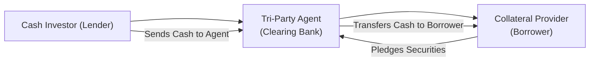

## Introduction

If you’ve ever heard your colleagues mention tri-party repos and wondered, “Why bring a third person into a repo transaction?”—don’t worry, you’re not alone. The tri-party arrangement can feel a bit mysterious at first. But once you see why market participants appreciate the operational ease and enhanced collateral management, it starts to make sense. In this section, we’ll unpack what tri-party repos are, how they work, and why they’re so crucial for short-term funding markets and liquidity strategies. We’ll walk through key mechanics, potential risks, and real-world best practices. Let’s dive in, shall we?

## The Essence of Tri-Party Repos

A tri-party repo is similar to a standard repurchase agreement (“repo”), except it has a third-party agent—typically a large clearing bank—sitting in the middle. This agent handles administrative tasks like collateral selection, daily margining, valuation, and settlement. So, we’re not talking about an entirely new type of contract. Instead, it’s just a specialized arrangement that outsources a lot of the back-office work to make life easier for both the cash lender (the investor or the buyer of the collateral) and the borrower (the seller of the collateral).

### Key Roles

• Cash Investor (Lender): Provides funds to the borrower in exchange for collateral.  
• Collateral Provider (Borrower): Receives cash and pledges securities as collateral.  
• Tri-Party Agent (Clearing Bank): Manages everything from custody of the collateral to daily valuations, margin calls, and ensuring settlement compliance.

Below is a high-level diagram illustrating the flow of funds and collateral in a tri-party arrangement:

In standard bilateral repos, the lender or borrower themselves might handle collateral arrangements directly. But tri-party repos leverage the agent’s expertise. This can significantly reduce the operational burden, especially for large-scale trades that would otherwise require constant manual updates to reflect valuations, changes in volatility, or the replacement of certain securities.

## Why Use Tri-Party Repos?

### 1. Operational Efficiency
Tri-party agents handle “mundane” but critical tasks like marking collateral to market, ensuring the collateral meets the right eligibility criteria, and performing margin calls if needed. This is a major timesaver, and it also lowers the potential for operational errors.

### 2. Collateral Flexibility
Under a tri-party contract, participants set eligibility criteria (like minimum credit rating or maximum maturity). If some pledged assets become ineligible or fluctuate in price, the tri-party agent can automatically substitute collateral to maintain the transaction’s value.

### 3. Enhanced Liquidity
It’s much easier for large institutional investors (e.g., money market funds or pension funds) to engage in the repo market when they can outsource the mechanical aspects to a trusted clearing bank.

### 4. Reduced Counterparty Concerns
The tri-party agent often provides an additional layer of oversight: they verify that each counterparty meets daily margin requirements and that collateral is valued properly. Though the ultimate credit exposure remains between the borrower and lender, the agent’s daily “housekeeping” reduces friction and potential disputes.

## Mechanics of Tri-Party Collateral Management

Let’s get a bit deeper into the step-by-step process. Full disclosure: this can feel somewhat detailed, but it’s important to grasp how the agent’s daily tasks impact credit risk and liquidity.

1. **Trade Agreement**  
   The cash investor and the collateral provider agree on the basic terms of the repo: face amount, interest rate, maturity date, and the type of eligible collateral.

2. **Setup with Clearing Bank**  
   Both counterparties must maintain accounts with the tri-party agent—usually a specialized clearing bank like JPMorgan or BNY Mellon in the US. Ahead of the trade, the agent confirms that all required documentation is in place, and that both sides have the capacity to settle.

3. **Collateral Allocation**  
   The borrower either designates specific securities to pledge or gives the agent discretion to select from a collateral pool, according to the eligibility rules. The tri-party agent “locks” those securities in a segregated custody account, pledging them on behalf of the borrower to the lender.

4. **Daily Mark-to-Market**  
   Every day, sometimes multiple times depending on volatility, the agent marks the collateral to its current market value. If the collateral’s value drops below the margin requirement, the agent issues a margin call. The borrower must then provide additional collateral or cash. If the collateral’s value rises above the threshold, the borrower might get some securities released.

5. **Unwind (At Maturity)**  
   On the repo’s maturity date, the borrower repurchases the collateral (i.e., the same or equivalent securities) from the lender at the original repo price plus the accrued repo interest. The tri-party agent handles all the settlement flows: returning cash plus interest to the lender and releasing securities back to the borrower.

## Margin Requirements and Mark-to-Market

In tri-party repos, margin requirements help protect the lender from market fluctuations or credit deterioration in the collateral. Typically, the margin is a “haircut” on the collateral’s market value. For example, if a security is valued at $100, the tri-party system might only count $98 of that value toward satisfying the collateral requirement. This built-in buffer helps if the collateral prices decline, or if the parties need to liquidate quickly in a default scenario.

Mathematically, margin (or “haircut”) can be expressed as:


\text{Haircut} = 1 - \frac{\text{Loan Value}}{\text{Market Value of Collateral}}


If a lender imposes a 2% haircut on a security with a $100 market value, the lender will provide $98 in cash. If prices swing, that figure gets adjusted daily through mark-to-market.

## Collateral Transformation

Collateral transformation might sound like some fancy alchemy, but it’s basically using a chain of repos to transform lower-grade assets into higher-grade collateral. Imagine a borrower who has high-yield bonds but wants top-quality treasuries to pledge. They might repo out their high-yield bonds (paying a higher repo rate) to get some more “creditworthy” forms of collateral from a counterparty. Then, they use those higher-grade assets for a new repo with a lower interest rate. The tri-party agent steps in, ensuring the transactions remain operationally smooth and that eligibility criteria are satisfied at each stage.

A simplified illustration:

1. Borrower pledges lower-grade fixed-income securities in a repo to Party A.  
2. Party A provides high-grade bonds (or cash) in exchange.  
3. Borrower uses the newly obtained high-grade bonds as collateral for a second repo with Party B at more favorable terms.  

It’s a liquidity management approach—some say it’s a bit like trading up from a used car to a new car by doing multiple partial exchanges. But do note, each leg adds some complexity and cost. It also introduces more counterparties, meaning more credit exposure.

## Risks and Considerations

### 1. Reliance on Tri-Party Agent
If the clearing bank’s systems freeze or come under stress, you could see disruptions in settlement. In extreme cases, if the agent becomes insolvent, the operational arrangements might need restructuring. This is a prime reason regulators keep a close eye on tri-party processes to ensure resilience.

### 2. Collateral Eligibility Disputes
Even though the tri-party agent handles day-to-day tasks, if there’s a disagreement about the quality of a particular security or if the rating changes suddenly, unwinding or substituting it can still cause delays or friction.

### 3. Systemic Risk
In markets like the U.S. tri-party repo market, the daily aggregated exposures can be enormous—hundreds of billions of dollars. Any meltdown in tri-party repo settlement can create systemic ripples. Regulators have introduced reforms to reduce “intraday credit” exposure, especially after the 2008 financial crisis.

### 4. Pricing and Liquidity
Although tri-party repos generally benefit from standardized processes, pricing can still vary based on the collateral type, maturity, haircuts, and market conditions. Rapid interest rate shifts or macro-economic stress can cause wide repo rate swings and unexpected margin calls.

### 5. Collateral Mismanagement
We hope this never happens, but a tri-party agent that mismanages the collateral or fails to mark to market accurately can cause losses for participants or lead to chaotic margin calls.

## Regulatory Developments

Post-2008, the Federal Reserve Bank of New York introduced guidelines aiming to minimize intraday credit in tri-party repos. A main goal was to reduce the clearing banks’ exposure from morning to afternoon as trades rolled over. This included automated processes for margin top-ups and more robust reporting transparency. Meanwhile, in Europe, the International Capital Market Association (ICMA) sets best practices for repos under the Global Master Repurchase Agreement (GMRA), and the European Repo & Collateral Council publishes guidelines to ensure consistency and stability.

## Practical Example: Stress in Tri-Party Repo

Let me share a small anecdote from a friend who was once in the middle of a tri-party arrangement during a major market stress. The borrower’s collateral quickly dropped in price due to volatility. The tri-party agent automatically triggered margin calls. When the borrower struggled to post additional collateral, the agent gave them a short cure period—just a couple of hours—to come up with more securities or cash. The borrower ultimately couldn’t comply, and the agent had to liquidate some collateral. The process was messy but was done systematically, thanks to the tri-party agent’s well-defined procedures. It was a real eye-opener about just how quickly high-quality markets can turn if valuations shift dramatically.

## Best Practices in Tri-Party Repo

• **Ensure Clear Eligibility Criteria**: Both parties should thoroughly agree on what types and grades of collateral are allowed.  
• **Review Collateral Concentration**: Watch out for exposure to a single issuer, region, or sector. Diversification helps.  
• **Daily Reconciliation**: Stay on top of margin calls and reconcile positions daily. Working with the tri-party agent doesn’t mean you stop monitoring your risk.  
• **Stress Testing**: Periodically assess how your tri-party positions hold up under stressed market conditions.  
• **Legal Documentation**: Use robust agreements (e.g., GMRA or relevant local frameworks) that clarify each party’s obligations and default handling.

## Exam Relevance and Final Tips

Tri-party repos often arise in discussions about short-term funding, liquidity management, and collateral optimization. Whether you’re preparing for the CFA exam or dealing with real-world fixed-income challenges, understanding the tri-party structure helps you:

• Evaluate short-term funding strategies in portfolio context.  
• Appreciate how operational risk and collateral management can affect yield spreads.  
• Identify how daily margin requirements can cause liquidity squeezes in times of stress.  
• Comprehend the interplay between repo markets and systemic risk.  

For exam-based scenario questions, remember to consider:

1. **Margin Calls**: How haircuts and mark-to-market protect the lender.  
2. **Collateral Substitution**: The reason and process behind substituting different securities.  
3. **Regulatory Impact**: Occasionally, you might see a question on how tri-party reforms reduce intraday exposures.  
4. **Collateral Transformation**: The potential for multi-layer repos to upgrade the quality of collateral and any resulting increase in counterparty risk.  

Finally, don’t just memorize definitions. Focus on how tri-party repos fit into the bigger picture of market liquidity, credit risk, and regulatory frameworks. That’s where you’ll excel on the exam and in the real job. Good luck, and keep your curiosity alive!

## References

• Federal Reserve Bank of New York: Reports on tri-party repo reforms, available at  
  [https://www.newyorkfed.org/](https://www.newyorkfed.org/)  

• ICMA European Repo & Collateral Council guidelines, available at  
  [https://www.icmagroup.org/](https://www.icmagroup.org/)  

• Global Master Repurchase Agreement (GMRA) documentation for standardized repo frameworks.  

• Additional background on collateral management best practices from various clearing banks (e.g., BNY Mellon, JP Morgan).  

--------------------------------------------------------------------------------

## Tri-Party Repos and Collateral Management: Practice Questions



### Which entity typically holds custody of the collateral in a tri-party repo transaction?
- [ ] The cash lender
- [ ] The collateral provider
- [x] The tri-party agent (clearing bank)
- [ ] A mutual fund

> **Explanation:** In a tri-party repo, the tri-party agent (often a clearing bank) holds and manages the collateral on behalf of both the borrower and the lender.

### Which of the following best describes the "margin call" process?
- [x] Requesting additional collateral when the collateral’s market value falls
- [ ] Demanding the return of cash when interest rates decrease
- [ ] Replacing a defaulted borrower with a new counterparty
- [ ] Lowering the required collateral if the borrower’s credit rating improves

> **Explanation:** Margin calls happen when collateral value dips below agreed-upon thresholds, prompting the borrower to pledge additional securities or pay cash to restore the collateral ratio.

### During a tri-party repo unwind, who is responsible for returning the collateral to the borrower?
- [ ] The borrower’s custodian
- [ ] The lender’s trading desk
- [x] The tri-party agent
- [ ] Government regulatory bodies

> **Explanation:** The tri-party agent orchestrates the return of collateral to the borrower at the end of the repo term, once the borrower has repurchased it by paying the repo principal plus interest.

### What primary operational benefit does the tri-party setup provide compared to a bilateral repo?
- [ ] Eliminates the need for collateral altogether
- [ ] Eliminates credit risk entirely
- [x] Centralized management of collateral valuation and settlement
- [ ] Allows for indefinite rollovers without a closing date

> **Explanation:** The main benefit is that the clearing bank streamlines collateral custody, daily valuation, and operational tasks, reducing administrative burden for both counterparties.

### In a scenario where a borrower attempts “collateral transformation,” what is the typical aim?
- [x] To pledge lower-grade assets first, obtain higher-grade assets, and thereby secure cheaper financing
- [ ] To convert equity into more liquid money-market instruments without borrowing
- [x] To shift from illiquid bonds to more liquid government securities
- [ ] To circumvent all regulatory capital requirements

> **Explanation:** “Collateral transformation” typically involves multiple repo transactions to upgrade collateral quality for more favorable financing terms. The borrower might pledge lower-rated or less liquid assets, obtain higher-grade securities or cash, and then use that higher-grade collateral in another repo.

### Which of the following best characterizes the credit exposure in a tri-party repo?
- [ ] Credit risk exists only for the tri-party agent since it holds the collateral
- [ ] No credit risk since daily margin calls eliminate default risk
- [x] Credit exposure resides between borrower and lender; the agent manages collateral but does not absorb credit risk
- [ ] All counterparties share equal credit exposure

> **Explanation:** Tri-party agents predominantly handle operational tasks and collateral custody. The ultimate exposure to default remains between the borrower and the lender.

### One goal of regulators in the tri-party repo market post-2008 crisis was to:
- [ ] Abolish the use of government securities as collateral
- [x] Minimize intraday credit provided by clearing banks
- [ ] Double the maximum allowable maturity of tri-party repos
- [ ] Encourage unlimited rehypothecation

> **Explanation:** Regulators, particularly the Federal Reserve Bank of New York, sought to reduce the massive intraday credit exposure that clearing banks faced in the daily “unwind-and-rewind” process for tri-party repos.

### What is the "haircut" referring to in collateral management?
- [ ] The transaction fee paid to the tri-party agent
- [x] The difference between a security’s market value and the amount of cash advanced
- [ ] A small penalty fee applied to unsecured lending
- [ ] A fixed coupon discount for bond trades

> **Explanation:** The “haircut” is a discount applied to the collateral’s market value. If the haircut is 2% on a $100 bond, the lender lends $98, leaving that margin cushion for market fluctuations.

### Which of the following is the greatest systemic risk concern in tri-party repos?
- [ ] Inability to originate large repo transactions
- [x] Large daily rollover volumes and reliance on a small number of clearing agents
- [ ] Inability to mark collateral to market daily
- [ ] Difficulty in scheduling settlement at major exchanges

> **Explanation:** The tri-party repo market can involve hundreds of billions of dollars rolling over daily through just a couple of clearing banks. If one fails to operate smoothly, it can have large ripple effects on market liquidity.

### Tri-party repo margins are determined by:
- [x] Negotiation between borrower and lender, subject to minimum haircuts set by the tri-party agent
- [ ] A fixed schedule mandated by central banks
- [ ] The borrower’s internal credit review
- [ ] An unchanging set percentage across all securities

> **Explanation:** Margin or “haircuts” are typically decided by the counterparties. The tri-party agent enforces any agreed-upon guidelines, including minimum haircuts set by regulation or internal risk frameworks, but they don’t unilaterally dictate a single universal rate.



