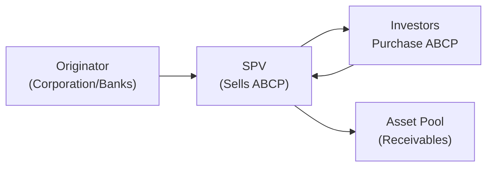

## Introduction and Context

Have you ever had one of those nights where you suddenly remember a payment is due the next day and you haven’t set aside enough funds? In a more sophisticated and, well, large-scale sense, that’s exactly what short-term financing is about for institutions: getting the liquidity they need right now (or in the near term) to bridge any gaps until longer-term funding or receivables come through. Over the years, the good old standbys—like commercial paper (CP) or repurchase agreements (repos)—have done a decent job. But, well, times change. And so do the needs of borrowers, the appetites of lenders, and the regulatory environment. 

In this section, we’ll explore key developments in short-term financing: new variants of commercial paper such as Asset-Backed Commercial Paper (ABCP) and Euro Commercial Paper (ECP), plus specialized liquidity facilities and “sponsored” repos. We’ll see how these instruments can reduce rollover risk, broaden the investor base, and (hopefully) make life less stressful for corporate treasurers and portfolio managers. Of course, we still have to keep an eye on the potential pitfalls, from liquidity crunches to regulatory complexities. Let’s jump in.

## Traditional Short-Term Instruments: A Quick Recap

Before we dive into the newer stuff, it’s helpful to recall how the conventional tools function:

• Commercial Paper (CP): Unsecured promissory notes typically issued by high-quality corporations to fund short-term working capital. Maturities run from a few days up to 270 days (in the U.S.), though they can be slightly longer in other jurisdictions.  
• Repurchase Agreement (Repo): A form of short-term borrowing where one party sells a security (often a treasury) and agrees to repurchase it at a higher price on a specified future date. It’s secured borrowing, with the underlying collateral significantly reducing credit risk.  
• Certificates of Deposit (CDs): Another short-term instrument where a bank or financial institution issues an interest-bearing note, usually shorter than a year, though sometimes out to five years or more.

These instruments are widely used, but as markets have evolved, so have the needs for more flexible, secure, or cost-effective financing solutions. Let’s look at a few of these newer alternatives.

## Asset-Backed Commercial Paper (ABCP)

### Rationale for ABCP

Traditional commercial paper is unsecured—i.e., no specific collateral stands behind it. One major drawback is that if the issuer’s credit quality deteriorates suddenly, investors might worry about whether they’ll be repaid when the paper matures. Asset-Backed Commercial Paper (ABCP) addresses this by securitizing certain asset pools—like trade receivables, auto loans, credit card receivables, or even mortgages—and issuing short-term paper secured by these assets.

### Structure and Key Features

At a high level, ABCP programs are often managed via Special Purpose Vehicles (SPVs). The issuing entity is separate from the sponsor (e.g., a bank or a large corporation), which isolates the credit risk from the sponsor’s business. The SPV holds a pool of assets and issues commercial paper to investors, backed by the expected cash flows from the underlying pool.

A simple depiction might look like this:



• The SPV purchases receivables from the originator.  
• The SPV finances this purchase by issuing commercial paper to investors.  
• Investors draw comfort from the fact that collateral is in place.  

### Rollover Risk and Liquidity Support

Because ABCP typically has short maturities—anywhere from overnight to a few months—it’s frequently “rolled over” at maturity. That means the SPV issues new ABCP to repay the maturing ABCP. If the market is disrupted or if investors perceive too much risk, the SPV may struggle to refinance. To mitigate this rollover risk, most ABCP programs rely on various forms of liquidity support, including:

• Liquidity Lines from Banks: A bank can step in if the SPV is unable to issue new paper.  
• Credit Enhancements: Letters of credit or excess spread from overcollateralization.  

The significant advantage here is that, by bundling an asset portfolio, sponsors can get lower financing costs compared to issuing unsecured CP. However, robust structuring is crucial because, well, if that underlying pool is questionable, or if liquidity lines fail under stress, guess who’s on the hook?

## Euro Commercial Paper (ECP)

### Global Dimensions and Multi-Currency Options

Euro Commercial Paper (ECP) isn’t necessarily denominated in euros—it’s just a label for CP issued in the European markets (often London) that may be in any major currency. ECP has gained prominence as multinational corporations, sovereigns, and even supranationals tap into global liquidity by issuing short-term paper offshore. Some key points:

• Flexible Maturities: While maturities often mirror traditional CP ranges (up to one year), ECP programs can be slightly more flexible in their tenors depending on market conventions.  
• Regulatory Variation: Issuers can sometimes benefit from a more favorable regulatory environment or take advantage of an investor base not constrained by domestic money market regulations.  

For instance, I once spoke with a treasury manager who loved the ECP market’s “24-hour a day” kind of vibe—it let them issue paper in multiple currencies, adjusting quickly to changing funding costs. That can really help if, say, you suddenly need short-term funding in euros for a business deal but want to keep your base currency in U.S. dollars. ECP’s multi-currency dimension is a game-changer.

### Documentation and Settlement

ECP tends to follow the International Capital Market Association (ICMA) standards for documentation. The settlement can be done via Euroclear or Clearstream, prime international clearing systems. This cross-border nature means less friction—borrowers can reach overseas investors, which is often cheaper than focusing solely on domestic markets.

## Sponsored Repos and Specialized Liquidity Facilities

### Sponsoring Mechanisms

Repos are a staple in short-term funding. However, “sponsored” repos have emerged to provide even more targeted liquidity solutions. In a sponsored repo, a recognized sponsoring member—often a major financial institution—enables clients (such as smaller asset managers or corporate treasuries) to access clearing and netting benefits in a central counterparty (CCP) environment. 

In a classic scenario, the sponsor acts as an intermediary, guaranteeing or facilitating the trade so that the repo buyer or seller can net positions within the CCP. This often lowers margin requirements and increases operational efficiency for the smaller participant. 

### Specialized Central Bank Facilities

During times of stress—like what happened during the global financial crisis—central banks sometimes establish specialized short-term liquidity facilities that accept a broader range of collateral or offer more favorable haircuts. These facilities help stabilize funding markets by ensuring participants can obtain short-term liquidity. Over time, some of these emergency facilities become permanent or evolve into new ways central banks influence short-term rates. 

For example, the Federal Reserve in the U.S. introduced additional repo operations in 2019 to smooth out overnight rate spikes. Meanwhile, some European jurisdictions have used targeted longer-term refinancing operations (TLTROs), though these are fairly different in tenor from a typical overnight or weekly facility. The big takeaway is that central bank interventions can shape what short-term instruments are available or viable.

## Innovations Targeting Rollover Risk Reduction

Arguably, the biggest fear in short-term markets is that if an issuer can’t “roll over” their maturing obligations, they face an immediate hit to liquidity—and possibly solvency. Newer instruments and structures aim to mitigate that:

• Dynamic Maturity Management: Some issuers create CP programs with “extendible” features—where the maturity can be automatically lengthened if market disruptions occur (albeit at a higher interest rate).  
• Diversified Investor Base: Issuers can place short-term debt with a broad set of investors (think money market funds, corporate treasuries, insurance companies, and high-net-worth channels) so that demand—hopefully—remains stable.  
• Rapid Securitization Platforms: Some specialized platforms facilitate quick “tap-style” issuance of short-term instruments. Think of it as an Amazon Prime for CP, letting issuers sell smaller amounts frequently to recalibrate their liability structure.

## New Market Platforms and “Blue Chip CP”

Electronic trading platforms bring more transparency and price discovery to short-term instruments. Some jurisdictions have introduced or proposed “Blue Chip CP” platforms—centralized electronic platforms where pre-approved (so-called “blue chip”) issuers can list their short-term paper. Investors can trade these instruments in real time, with central clearing (again reducing counterparty risk). 

This helps reduce pricing inefficiencies and fosters a more liquid secondary market—an area lagging for many CP programs. Such platforms will typically incorporate best-in-class regulatory oversight, ensuring that only high-quality names can be traded, thus reducing the perceived risk for investors.

## Real-World Example: The 2008 ABCP Freeze

Let’s not forget the cautionary tale. In 2008, certain ABCP structures, heavily invested in subprime mortgages, ran into major trouble. The assets behind the paper lost value, liquidity lines were tested, and some investors fled. This triggered a freeze in the broader ABCP market—issuers were unable to roll over maturing paper, forcing them to tap emergency funding or conduct fire sales of assets. 

It was a stark reminder that, although ABCP can mitigate credit risk through collateral, you still need a healthy set of underlying assets and robust liquidity support. If those break down, ABCP’s short-term nature can amplify the crisis.

## Practical Insights and Portfolio Management Applications

• Asset-Liability Matching: One reason short-term instruments exist is to align the liability side of the balance sheet with short-term assets, such as inventory or receivables. By fine-tuning the maturity schedule through instruments like ABCP or ECP, you can more precisely match cash inflows and outflows.  
• Yield Enhancement vs. Credit Risk: Portfolio managers seeking higher yields in the money market sleeve might prefer ECP from stable multinational issuers or ABCP from a well-structured, diversified asset pool. But, always watch out for hidden credit or liquidity traps.  
• Central Bank Policy Impact: If central banks launch liquidity facilities accepting certain forms of short-term paper as collateral, that can reduce yields on those instruments (more demand) and make them safer for investors. Conversely, if facilities are withdrawn, the market might see spreads widen.

## Common Pitfalls, Challenges, and Best Practices

It’s easy to get lured by the potential cost benefits and diversification advantages of new short-term instruments. But caution is warranted:

• Overlooking Collateral Quality: ABCP might be theoretically safer, but only if the underlying assets remain robust. If the sponsor’s credit rating or the pool’s quality deteriorates, the entire ABCP program could unravel quickly.  
• Overreliance on Rollover: Even the best structured short-term instruments need to roll over eventually. If the issuer fails to plan for potential liquidity squeezes, they might face a financing cliff.  
• Regulatory Complexities: Different jurisdictions may have varying rules for issuance, disclosure, or investor eligibility. For instance, cross-border ECP issuance must comply with local securities laws and money market regulations.  

### Best Practices

• DD on Program Structure: Conduct thorough due diligence not just on the sponsor but on the nature, credit quality, and diversification of the underlying collateral pool.  
• Access to Backup Liquidity: If you’re an issuer, keep robust backup credit lines with banks in case the market seizes up.  
• Scenario Analysis: If you’re a portfolio manager, run stress scenarios to see how new short-term instruments might behave under a liquidity crunch or rate spike.  
• Monitoring Regulatory Shifts: Central bank frameworks can evolve rapidly. Keep an eye on changes in what collateral is acceptable and any new liquidity or capital requirements that might affect short-term spreads.

## Diagram: Short-Term Financing Ecosystem

Below is a broad depiction of how various parties interact in a modern short-term financing ecosystem, highlighting some of the new instruments and their linkages:

```mermaid
flowchart LR
    S1["Issuer <br/> (Corporate, Bank, SPV)"]
    I1["Investors <br/> (Money Mkt Funds, Banks)"]
    C1["Central Clearing <br/> Party/Platform"]
    SB["Sponsor Bank <br/> (Repo or ABCP)"]
    CB["Central Bank <br/> Liquidity Facility"]

    S1 -->|Issue ABCP, CP, or ECP| I1
    S1 -->|Repo Transactions| SB
    SB -->|Sponsored Repo <br/> Arrangements| C1
    I1 -->|Secondary Market <br/> (via platform)| C1
    S1 -->|Collateral <br/> Access| CB
    I1 ---- C1
```

1) Issuers create short-term instruments (ABCP, ECP, or standard CP).  
2) Investors purchase these instruments in either primary issuance or via a secondary market platform.  
3) Sponsor banks may intermediate repos or provide liquidity lines.  
4) Central counterparties streamline netting and settlement.  
5) Central banks may step in as a liquidity backstop or define the collateral framework.

## Exam Tips and Strategy

From a CFA exam or real-world test scenario, remember:

• You may see item sets or essay prompts involving how an ABCP program might fail under stress if the underlying assets are impaired.  
• Comparisons of ECP to domestic CP might appear, testing your knowledge of cross-currency issuance, regulatory standards, and investor bases.  
• Rollover risk is always front and center. Be ready to discuss liquidity lines, credit enhancements, and how to handle a short-term financing crisis.  
• Emerging trends like sponsored repos often appear in questions about netting benefits and central clearing risk mitigation.

## References and Further Reading

• ECB Publications on the Commercial Paper Market: Visit the official website at  
  [https://www.ecb.europa.eu/](https://www.ecb.europa.eu/) for detailed reports and data.  
• “Short-Term Financial Management” by Maness & Zietlow.  
• International Capital Market Association (ICMA) guidelines on Euro Commercial Paper.  
• Federal Reserve Board publications on repo market interventions.

## Test Your Knowledge: Short-Term Instrument Financing Alternatives



### Which of the following is a key difference between traditional commercial paper (CP) and asset-backed commercial paper (ABCP)?

- [ ] CP is typically issued with maturities beyond 12 months, while ABCP must be shorter than 12 months.  
- [x] ABCP is backed by a pool of assets held in a Special Purpose Vehicle, whereas CP is unsecured.  
- [ ] CP is issued by banks, whereas ABCP is issued by government agencies.  
- [ ] ABCP requires no liquidity support from third parties, unlike CP.  

> **Explanation:** ABCP is structurally different because it’s collateralized by an asset pool, typically held by an SPV, whereas regular CP is unsecured. CP can be issued by many types of entities (not limited to banks), and ABCP often relies on liquidity or credit support from a sponsoring entity.

### Which of the following best describes Euro Commercial Paper (ECP)?

- [ ] Short-term debt instruments denominated only in euros.  
- [x] Short-term debt instruments issued in Europe that can be denominated in multiple currencies.  
- [ ] A variant of ABCP that central banks issue.  
- [ ] A settlement procedure exclusive to the U.S. market.  

> **Explanation:** Despite its name, ECP isn’t restricted to euro-denominated issuance. It’s a flexible, multi-currency short-term paper mainly in the European markets.

### A key advantage of “sponsored repos” is:

- [ ] They eliminate the need for a collateral fund.  
- [ ] They are always backed by central banks.  
- [x] They allow smaller participants to access clearing and netting benefits through a sponsor.  
- [ ] They offer perpetually fixed interest rates.  

> **Explanation:** Sponsored repos enable smaller or non-clearing members to benefit from a central clearinghouse’s netting and margin efficiencies by working through a recognized sponsoring member.

### How do extendible features in some short-term instruments help issuers?

- [ ] Extendible features permanently convert short-term debt into equity.  
- [x] They allow the maturity to lengthen if market stress prevents rollover.  
- [ ] They place a cap on interest rates in perpetuity.  
- [ ] They guarantee federal insurance on all short-term debt issues.  

> **Explanation:** Extendible maturities help issuers avoid a sudden liquidity crisis by giving them the option—under certain conditions—to automatically roll over debt (often at a higher coupon) rather than face a forced repayment.

### In a stress scenario where ABCP markets freeze, which mechanism typically provides issuer support?

- [ ] Mandatory convertible bonds.  
- [ ] Subordinated equity from the SPV.  
- [x] Liquidity lines from sponsors or banks.  
- [ ] Repo settlement windows.  

> **Explanation:** ABCP programs often rely on liquidity lines provided by banks or sponsors, which can be drawn upon if the SPV cannot issue new paper to roll over maturing amounts.

### One reason central banks might implement specialized liquidity facilities for short-term funding markets is to:

- [ ] Drive short-term interest rates above long-term interest rates.  
- [x] Stabilize the market by ensuring institutions can obtain liquidity and avoid rollover failures.  
- [ ] Eliminate all forms of credit risk in the system.  
- [ ] Restrict funding to only government securities.  

> **Explanation:** Central banks launch specialized facilities to prevent a liquidity crunch and stabilize rates, ensuring institutions can roll over short-term debt even under stress.

### Which of the following is a primary benefit of ECP for multinational issuers?

- [x] Access to a broad global investor base and multi-currency options.  
- [ ] It eliminates foreign exchange risk by definition.  
- [ ] ECP is insured by global agencies.  
- [ ] All ECP issuances are tax-exempt.  

> **Explanation:** ECP gives multinational firms the opportunity to tap a wider investor base and issue in multiple currencies, often at more competitive rates or flexible maturities.

### A common pitfall with ABCP is:

- [ ] Absence of any underlying collateral.  
- [x] Uncertainty over the true quality of the underlying asset pool.  
- [ ] Mandatory indefinite extensions of maturity.  
- [ ] Extremely long maturities, up to five years.  

> **Explanation:** Even though ABCP is collateralized, weaknesses in the underlying asset pool (or a breakdown in the liquidity support mechanism) can undermine investor confidence and make rollover difficult.

### How might “Blue Chip CP” platforms improve the short-term debt market?

- [x] By providing a centralized electronic market with real-time price discovery and transparent trading.  
- [ ] By banning institutional owners from purchasing CP.  
- [ ] By granting permanent central bank guarantees to all issuers.  
- [ ] By eliminating settlement risk through on-chain crypto transactions alone.  

> **Explanation:** Blue Chip CP platforms generally centralize issuance and trading, foster transparency, and reduce spreads and settlement friction for high-quality issuers.

### True or False: Euro Commercial Paper (ECP) is always less risky than ABCP because it’s issued in European markets.

- [ ] False  
- [x] True  

> **Explanation:** This is a trick question. In fact, it should be FALSE because risk depends on issuer credit quality, underlying collateral (for ABCP), and market conditions, not purely geographic issuance. The correct approach is:

> • If we consider the reliability of collateral or sponsor in ABCP, it could be safer or riskier than ECP depending on the specifics.  
> • ECP is not automatically less risky just because it’s in Europe.  


