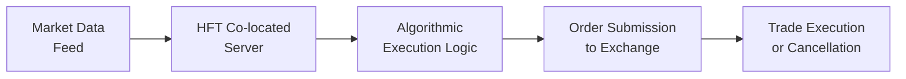

High-Frequency Trading (HFT) is a topic that has stirred quite a bit of debate, fascination, and—depending on who you ask—a little anxiety in financial markets. Often, when people think about HFT, they typically picture frantic activity in equity or foreign-exchange trading, not so much in bonds. But times have changed, and HFT has started to make its mark on certain corners of the fixed-income world.

Some folks in the market swear that these hyperfast traders help make bond transactions cheaper by reducing bid-ask spreads, while others worry about the potential for sudden volatility or even manipulative behaviors (like “spoofing” or “layering”). In this section, we’ll explore what HFT looks like in the bond markets, why it’s more common in some areas (looking at you, on-the-run Treasuries) than others, and how regulators are approaching these speedy participants. I remember early on in my career, hearing about someone who tried coding an HFT-ish strategy for high-yield corporate bonds… yeah, it didn’t go smoothly because liquidity fragmentation was a massive barrier and quotes barely moved fast enough to exploit splits in pricing. But anyway, let’s dig in.

## Understanding HFT in Bond Markets

High-Frequency Trading refers to algorithmic trading that aims to profit from short-lived market opportunities, typically holding positions for extremely short durations—sometimes mere milliseconds. HFT participants often co-locate their servers right next to exchange data centers to reduce latency and gain an edge. In the bond world, the greatest foothold has historically been in highly liquid segments like U.S. Treasury securities.

On-the-run Treasuries (the most recently issued Treasury bonds of a particular maturity) attract HFT for a couple of straightforward reasons: 
• They trade in large volumes.  
• Their price transparency is relatively high.  
• Tight bid-ask spreads make them suitable for capturing even tiny mispricings repeatedly throughout the trading day.

Contrast that, for instance, with a corporate bond issue that trades sporadically. Price quotes for that illiquid bond might show up only a few times a day. For HFT, which is all about speed, it’s impractical to rely on an asset that doesn’t trade frequently. Hence, corporate bond HFT remains limited.

## Technology Infrastructure and Co-location

If you’ve ever wondered why people make such a fuss about data travel times, consider this: Signals traveling at near-light speed can still take a few milliseconds to reach servers located hundreds (or thousands) of miles away. In HFT, a millisecond might as well be an eternity. Firms engaged in HFT will often pay exchanges for premium “co-location” services—essentially renting space for their servers in the same data center as the exchange’s matching engine. That’s how they get their trades to the market as fast as technically possible.  

Below is a simplified diagram showing data flow in an HFT environment (though, ironically, the real connections are far more complex):

In the above process, the firm’s server constantly receives updated market data. The algorithmic logic decides whether to place, cancel, or modify an order. Then, that order hits the exchange’s order-matching system. All of this can happen in microseconds.

## Liquidity Fragmentation Across Bond Markets

One of the big reasons HFT in bonds has not become as ubiquitous as it has in equities or FX is that bond markets are notoriously fragmented. Each individual corporate bond issue can trade on different platforms, with limited standardization in how prices are quoted or how trades are executed. Another challenge: Some issues might be held by long-term bond investors who don’t trade often—so you end up with huge swaths of illiquid slices.

In other words, you might see an HFT firm feasting on micro-differences for on-the-run government securities, but then mostly ignoring a thinly traded corporate issue. It’s not that the technology or the algorithm can’t handle it; it’s just that the liquidity is too spotty. You know how you sometimes see an item on a store’s shelf that rarely gets purchased? That’s kind of like certain corporate issuances—there just aren’t enough daily transactions to justify sophisticated microsecond-level strategies.

## Possible Market Impacts

There’s a reason HFT has drawn so much attention in popular culture and from regulators. In some ways, these firms can benefit the market:

• Tighter Bid-Ask Spreads: Because HFT strategies often compete to post the best prices, we can end up with narrower spreads in the most liquid parts of the bond market—mainly U.S. Treasuries.  
• Enhanced Price Discovery: HFT participants can rapidly update quotes or respond to new information, which helps reflect changing market sentiment in prices more quickly.

But, as folks saw in some equity “flash crash” scenarios, an abundance of HFT can exacerbate short-term volatility. If multiple algorithms either shut down or withdraw from offering liquidity during times of stress, the entire order book can suddenly look like a ghost town. This risk is especially relevant in bond markets, since large institutional trades can come in waves.

At the same time, many illiquid or off-the-run bond instruments may see minimal HFT presence. So you get this interesting dichotomy: On-the-run bonds might experience “HFT overdrive,” while older or lesser-known securities see no real effect. As a result, the bond market can feel more polarized in terms of liquidity—some corners remain extremely liquid, while others languish.

## Regulatory and Oversight Considerations

Regulators worry about market manipulation, particularly techniques known as spoofing (placing large orders without intent to execute, to influence prices) and layering (placing multiple orders at various prices to trick other market participants). In the United States, the SEC and FINRA have been addressing algorithmic and high-speed strategies with rules to monitor ephemeral order activity. In Europe, the European Securities and Markets Authority (ESMA) similarly keeps an eye on automated trading to prevent disruptions.

Enforcement has ramped up significantly. Firms found to be placing deceptive orders face fines and other sanctions. If you’ve seen the coverage of equity HFT manipulations, the bond market is not immune either—though it’s not as wide-scale, partly because fewer bond issues are actively targeted.  

All in all, from passing new regulations to requiring better data reporting, regulators aim to ensure that HFT participants don’t destabilize the market. At the same time, authorities are cautious not to stifle beneficial liquidity enhancements. So it’s a balancing act.

## Real-World Examples and Case Studies

Let’s consider a well-known scenario in the U.S. Treasury market: the “flash crash” in Treasury yields on October 15, 2014. Yields moved dramatically in a short period—a 37-basis-point swing in the 10-year yield, which was massive for Treasuries. Many have highlighted the growing role of high-speed trading algorithms in fueling that wild intraday volatility. Although it wasn’t purely an HFT fiasco, that day underscored how quickly liquidity could evaporate when a large chunk of market participants, often HFT firms, simultaneously pulled back.

In contrast, consider a more routine day in on-the-run Treasury trading (say, the day after a major U.S. jobs report). HFT firms thrive on the fast price changes that happen immediately after the report release. They might receive the data feed, recalculate fair value in a split second, and race to update quotes. The net effect can be narrower spreads and better price continuity for smaller trades—at least in the immediate aftermath.

## Potential Pitfalls and Challenges

For practitioners or students who want to understand HFT from an investment or risk-management angle, there are some cautionary points:

• Technology Costs: Maintaining the fastest connections and robust trading algorithms isn’t cheap. If you’re a smaller firm, it can be tough to compete against well-capitalized players with specialized hardware and direct co-location services.  
• Data Quality Issues: Bond markets can have incomplete or delayed trade reporting (for instance, trades can be reported to TRACE in the U.S. with some time lag). This can hamper the effectiveness of real-time strategies.  
• Volatility Spikes: While HFT might reduce spreads in normal times, these strategies can intensify price swings if they withdraw liquidity in turbulent conditions. This could be a double-edged sword for institutional bond traders who rely on stable markets.  
• Fragmented Market Structures: With so many bonds trading over-the-counter (OTC) and on various electronic platforms, aggregating an accurate real-time picture of the market is extremely tricky.

## Best Practices and Evolving Landscape

Market participants have developed a few best practices:

• Risk Controls and Kill Switches: Many mechanical “shut-off” protocols exist so that if an algorithm malfunctions or the market moves beyond a certain threshold, HFT engines automatically reduce or exit positions.  
• Collaboration with Primary Dealers: Some HFT-like firms partner with major dealers to get better insight into supply-demand flows, particularly when new bonds come to market.  
• Expanded Digital Platforms: As bond trading platforms continue to evolve (see Section 1.5 on Electronic Trading Platforms and Market Innovations), we’re seeing more exchanges and alternative trading systems (ATS) that can handle high-speed strategies.  
• Regulatory Reporting and Transparency: Regulators globally want to see more detailed data on order flow and canceled orders to monitor “bad behavior.” This push for transparency can help strengthen market integrity.

There’s still a lot of speculation on how HFT might eventually transform the fixed-income market. Many believe that as e-trading platforms mature, corporate bond liquidity might become easier to access algorithmically, paving the way for more HFT involvement. Others are skeptical that bonds, with their diverse issuance structures and smaller individual daily volumes, will ever be as automation-friendly as equities. The likely result could be the continued dominance of HFT in the liquid corners of the market—like U.S. Treasuries—while other segments remain less penetrated.

## Bringing It All Together

Ultimately, high-frequency bond trading is no longer a fringe idea. It’s just that it remains concentrated in the most liquid sectors, where participants can actually capitalize on microsecond-level price changes. The rest of the bond universe remains comparatively off-limits, at least for the time being. As the industry fine-tunes advanced electronic platforms and addresses the complexities of bond data standardization, we may see incremental expansion of HFT in other segments. But if you’re expecting the entire bond market to become a hyperactive, HFT-driven environment—well, let’s just say that’s probably not going to happen overnight.

The big takeaway is that HFT can tighten spreads and improve price discovery in well-lit parts of the market, but also create vulnerability during extreme market swings. Regulators want to keep the good stuff (liquidity) while putting guardrails in place to prevent meltdown events. So if you’re stepping into these waters—maybe you plan to design an algorithmic strategy or you just want to know how it might affect your bond portfolio—make sure you understand both sides of the HFT coin.

## References and Further Reading

• “Flash Boys” by Michael Lewis (for a popular perspective on HFT, mostly equity-focused but conceptually relevant)  
• SEC (United States): Official literature and rule proposals on high-frequency trading and market structure.  
• European Securities and Markets Authority (ESMA) at <https://www.esma.europa.eu/> (publications on automated trading and HFT).  
• See also Chapter 1.4 on Secondary Trading, Liquidity, and Market Regulation for a more general discussion of bond market trading mechanics.  

## Test Your Knowledge: High-Frequency Bond Trading



### Which bond segment typically attracts the most high-frequency trading activity?

- [ ] Illiquid corporate bond issues.
- [ ] Covert derivative structures.
- [ ] Emerging market sovereign bonds.
- [x] On-the-run government bonds.

> **Explanation:** On-the-run bonds are the most recent issues of government debt and generally exhibit substantial liquidity and tighter bid-ask spreads, making them ideal for HFT strategies.

### Which of the following best describes co-location in high-frequency trading?

- [ ] Purchasing more server racks in a large data warehouse.  
- [ ] Operating trading algorithms only during off-market hours.  
- [x] Installing trading servers physically close to exchange servers to reduce latency.  
- [ ] Matching trades on multiple exchanges simultaneously.  

> **Explanation:** Co-location places servers in the same data center as the exchange's matching engine, lowering transmission times and improving the speed of trade execution.

### What is a major concern regulators have regarding high-frequency trading in bond markets?

- [ ] Longer holding periods.  
- [x] Potential manipulation of prices via spoofing or layering.  
- [ ] Complete elimination of transaction costs.  
- [ ] Increased corporate bond issuance.  

> **Explanation:** Regulators focus on ensuring HFT firms do not engage in deceptive practices (e.g., spoofing, layering) that can distort market prices and harm liquidity.

### How does high-frequency trading possibly impact volatility in bond markets during stressful periods?

- [ ] It eliminates volatility by providing constant liquidity.  
- [ ] It has no measurable impact on volatility.  
- [x] It can exacerbate volatility if HFT algorithms withdraw quickly.  
- [ ] It guarantees lower volatility through tighter spreads.  

> **Explanation:** If HFT firms detect high risk, they often pull their orders, abruptly removing liquidity and thus potentially magnifying price swings.

### Which of the following is typically a benefit that HFT may bring to liquid bond markets?

- [x] Tighter bid-ask spreads.  
- [ ] Higher trading commissions.  
- [x] Faster price discovery.  
- [ ] Untraceable trade reporting.  

> **Explanation:** One attributed advantage of HFT is that it frequently narrows bid-ask spreads and quickly incorporates new market information, enhancing price discovery.

### Which concept refers to placing and then canceling orders with no plan to actually execute, often used to manipulate other market participants?

- [ ] Wash trading.  
- [ ] Front-running.  
- [x] Spoofing.  
- [ ] Dark pooling.  

> **Explanation:** Spoofing entails creating the illusion of market interest through orders that the trader intends to cancel, thereby misleading other participants.

### Why does high-frequency trading face challenges in corporate bond markets?

- [x] Limited liquidity and sporadic quoting make microsecond-level strategies less feasible.  
- [ ] Corporate bonds are only traded at government auctions.  
- [x] Market fragmentation leads to inconsistent pricing across platforms.  
- [ ] Only institutional investors are allowed to trade corporate bonds.  

> **Explanation:** Corporate bond markets can be fragmented, with many unique issues and relatively lower trading frequency, limiting the opportunity for HFT to profit from small price discrepancies.

### What is a key driver behind the technological arms race among HFT firms?

- [ ] Finding new ways to trade only once a month.  
- [x] Achieving the lowest possible latency in trade execution.  
- [ ] Avoiding any regulatory oversight.  
- [ ] Expanding the overhead costs of co-location.  

> **Explanation:** HFT firms constantly strive to shave off microseconds in data transmission and order placement, making latency reduction a central strategic focus.

### Which of the following statements about HFT in on-the-run Treasury bonds is accurate?

- [ ] HFT spreads are typically wider due to less liquidity.  
- [x] HFT participants often dominate intraday price dynamics because these instruments trade frequently.  
- [ ] On-the-run Treasuries are never used for algorithmic trading.  
- [ ] Retail investors set the primary price signals.  

> **Explanation:** Because on-the-run Treasuries are heavily traded and liquid, high-frequency algorithms can have significant influence over intraday price movements.

### In the context of HFT, which of the following statements is true?

- [x] HFT can improve price discovery in normal times but may withdraw during stress.  
- [ ] HFT strategies primarily target illiquid bonds for profit.  
- [ ] Regulators have zero interest in monitoring HFT in bond markets.  
- [ ] HFT never influences volatility.  

> **Explanation:** HFT participants often benefit liquidity under normal conditions but may pull out of the market during periods of turmoil, which can heighten volatility.


