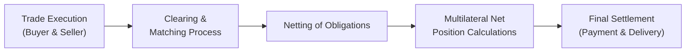

## Introduction and Context

Imagine you’re catching up with a friend who works at a large clearing bank. You ask, “Hey, how do you guys really move all that money around in the middle of the day to settle trades?” They sigh (a good-natured sigh), roll their eyes, and say, “Well, let’s talk about intraday liquidity and netting. It’s both fascinating and exasperating.” Welcome to the insider’s view of bond settlement systems—an area crucial to the stability and efficiency of financial markets, yet often underappreciated until something goes wrong.

Intraday liquidity refers to funds or securities available during the day to settle trades, meet margin calls, and fulfill other obligations. Without sufficient liquidity, trades get delayed—or fail entirely—and that can spiral into bigger problems. Settlement systems that facilitate bond transactions use different mechanisms, ranging from Real-Time Gross Settlement (RTGS) to Deferred Net Settlement (DNS). Each approach has different liquidity demands and distinct risk characteristics.

This section explores how intraday liquidity interacts with netting practices, settlement risk, and cross-border complexities—issues that matter not only to banks and brokers but ultimately to you and me as everyday investors. If bond markets freeze, the ripple effects can reach our pension funds, mutual funds, and broader economic stability.

## Why Intraday Liquidity Matters

Think of intraday liquidity as the “vehicles” you need to get around a busy city. If you don’t have enough buses or cars during rush hour, everyone is stuck. In the financial world, that “rush hour” can be nearly constant throughout the trading day. Different trades settle at different times, and every participant must ensure it has enough funds or securities to meet all of its settlement obligations. Failing to do so raises settlement risk—the possibility that one party won’t deliver the required security or payment on time.

### Settlement Risk: A Quick Refresher

• Settlement risk is the risk that a trade fails to settle as expected.  
• When settlement risk increases, participants demand higher risk premiums, and market confidence can erode.  
• In extreme cases, a single default can trigger a liquidity crisis—especially if there isn’t adequate capital or collateral to cushion the blow.  

If you recall from other sections—like 3.3 on Short-Term Funding (Commercial Paper, Repos)—funding liquidity can dry up quickly when confidence is shaken. Intraday liquidity is thus a major line of defense to ensure that payments flow smoothly, and bond trades settle without a hitch.

## Netting and its Impact on Liquidity

Netting is the practice of offsetting mutual obligations among partners so that only net amounts are exchanged. It’s like splitting a restaurant bill among friends, minus all the back-and-forth about who ordered the extra appetizer. By calculating each participant’s net position—whether net debit or net credit—settlement systems can drastically reduce the total volume of cash and securities that need to change hands.

### How Netting Works

Netting can be handled by a central clearinghouse or settlement system. Here’s a simplified illustration:

• Participant A owes Participant B \$100, and Participant B simultaneously owes Participant A \$70.  
• Rather than both sending full payments, they net this down to a \$30 difference.  
• This reduced payment flow is far more efficient, requiring less cash in circulation.

Netting typically happens at specified intervals. During the netting window, each participant's incoming and outgoing obligations from thousands of trades are aggregated. That means a bank that did 20 bond trades on behalf of its clients might end up settling just one net payment to the clearinghouse or receiving one net payment from the clearinghouse. The effect? Drastically reduced intraday liquidity requirements.

### Example: The Power of Netting

Let’s do a back-of-the-napkin scenario. Suppose a clearinghouse has 5 participants, each with \$1 billion in obligations to each of the other 4 participants. So, total exposures look like this in an unnetted world:

• 5 participants × \$1 billion each × 4 counterparties = \$20 billion in total obligations.  

After netting, assume each participant’s net position is around \$200 million (since some trades offset others). With netting, the total settlement obligations might drop from \$20 billion to \$1 billion, or possibly even less. That’s huge in terms of intraday liquidity savings. This is the logic behind netting’s crucial role in bond markets, derivatives trading, repo transactions, and beyond.

## Real-Time Gross Settlement (RTGS)

In Real-Time Gross Settlement systems, each individual transaction settles continuously and in real time. That means for each payment instruction, funds must be available in the payer’s account at the central bank (or relevant settlement entity) at the moment of settlement. Because nothing is netted intraday, the liquidity demands can be high—participants must maintain adequate balances or credit lines so they can settle transactions one by one as they occur.

### Advantages of RTGS

• Reduces Settlement Risk: Since each transaction is settled irrevocably in real time, there’s minimal buildup of deferred obligations.  
• Immediate Finality: Once a transaction is settled in an RTGS system, it’s final. That can help participants gauge their intraday cash positions with certainty.  

### Challenges of RTGS

• High Liquidity Requirements: You need a substantial intraday balance or a credit facility to handle potential surges in payments.  
• Operational Complexity: Continuous settlement can be more operationally intensive and cost-prohibitive for smaller institutions.  

RTGS is well suited for high-value, systemically important transactions—like large government bond settlements or interbank payments that could pose big systemic risks if they fail. Central banks typically operate or closely supervise RTGS systems because they’re essential for financial stability.

## Deferred Net Settlement (DNS)

In Deferred Net Settlement systems, trades (or payment instructions) are collected and netted over a specified period. Settlement happens in batches at one or more set times during the day—often at the end of the day. Because obligations are netted, participants don’t need as much intraday liquidity compared to RTGS.

### Advantages of DNS

• Lower Liquidity Requirements: Netting reduces overall payment outflows, enabling participants to commit less capital.  
• Efficient for Large Volumes: By batching settlements, the system can handle high transaction volumes at lower cost.  

### Challenges of DNS

• Settlement Risk Accumulation: Obligations accumulate until the net settlement session. If a participant defaults late in the cycle, it can cause significant disruption.  
• Intraday Uncertainty: Participants have less real-time visibility into final settlement outcomes. That can complicate liquidity forecasting.  

Most major bond settlement platforms, especially those handling large daily volumes, incorporate aspects of DNS. Nevertheless, many also have intraday “partial” settlement windows to reduce settlement risk.

## Cross-Border Settlement Complexities

Bond markets are increasingly global. A single corporate issuer might have bonds listed in multiple markets, cleared through different central clearinghouses (e.g., Euroclear in Belgium or Clearstream in Luxembourg). Cross-border settlement involves dealing with:

• Different time zones  
• Divergent operating hours and cut-off times  
• Varied regulatory environments and standards  

### Example: Euroclear and Clearstream

If you’re settling Euro-denominated bonds, you might use Euroclear. For German government bonds, Clearstream might be your main pipeline. Each clearing service has its own netting processes, intraday credit facilities, and risk controls. A participant transacting in multiple systems faces potential mismatches in cut-off times and daily liquidity needs. It’s a bit like juggling multiple airline schedules when you’re trying to connect flights in different cities.

## Maintaining Liquidity: Strategies and Best Practices

Firms and settlement institutions employ a variety of strategies to ensure intraday liquidity:

• Intraday Credit Lines: Central banks often provide collateralized intraday credit. Banks can also source credit from other participants.  
• Real-Time Monitoring: Continuous tracking of payment flows and available liquidity, often with automated tools.  
• Collateral Management: Using repo transactions or pledging securities to obtain funding; see also references to short-term funding in Section 3.3.  
• Partial Settlements: Some systems allow partial settlement if a participant can’t fully settle at a specific point, greatly reducing gridlock.  

### Potential Pitfalls

• Overreliance on Intraday Credit: If banks systematically rely on central bank credit lines, that could lead to moral hazard.  
• Operational Glitches: Delays in data feeds or system outages can quickly create backlogs.  
• Inadequate Contingency Planning: Without a robust plan for unexpected disruptions, liquidity shortfalls can become crises.  

Managing intraday liquidity is not a “set it and forget it” process. Firms must remain vigilant, especially during volatile market conditions or macroeconomic stress.

## A Quick Mermaid Diagram: Netting Flow Overview

Below is a simplified Mermaid.js diagram illustrating how bond trades flow from trade execution to net settlement at a central clearinghouse.

• “Trade Execution” refers to the initial agreement between buyer and seller.  
• The trades are “Cleared and Matched” so both sides confirm trade details.  
• In “Netting of Obligations,” the clearinghouse offsets buyer and seller obligations with other trades.  
• After netting, the “Multilateral Net Position Calculations” determine each participant’s net payables or receivables in cash and securities.  
• Finally, “Final Settlement” occurs, either in real time (RTGS) or at designated intervals (DNS).

## Reflecting on a Personal Experience

I remember a friend explaining to me how their trading desk once faced a near-blockage in mid-afternoon when a large coupon payment from a sovereign bond didn’t arrive on time. As a result, the entire liquidity chain got squeezed, and trades started piling up. They scrambled for intraday loans, collateral was posted, and everything resolved fairly quickly. But it was a stark reminder of how even a small timing mismatch can snowball into big issues. The moral? Always keep an eye on your intraday liquidity coverage. Markets don’t wait.

## Regulatory and Risk Management Perspectives

Regulatory bodies (like the BIS—Bank for International Settlements) have published multiple guidelines on the safe operation of payment systems. Central banks, through frameworks such as the Committee on Payment and Market Infrastructures (CPMI) and the International Organization of Securities Commissions (IOSCO), set standards to ensure that systemically important payment systems maintain robust risk management.

• Principles for Financial Market Infrastructures (PFMIs): Provide guidance on how to manage liquidity and settlement risk.  
• Capital Requirements: Regulatory frameworks frequently require banks to have capital buffers for settlement and liquidity risk.  

In your career as an investment professional or even as a participant in bond markets, you’ll constantly hear about stress tests to gauge whether a firm can withstand intraday shocks. Understanding these regulatory frameworks is key to analyzing the risk profile of major market participants.

## Tying It All Together

Intraday liquidity and netting mechanisms are the unsung heroes of bond settlement systems. By ensuring that cash and securities are in the right place at the right time, they keep the gears of the bond market turning—even during periods of high volume or market stress. RTGS offers robust, real-time settlement but comes with higher liquidity demands. DNS, on the other hand, provides efficiency via netting but can accumulate settlement risk.

Balancing these trade-offs is central to effective market function. The next time someone drops the phrase “intraday liquidity,” you can smile knowingly and say, “Ah, you must be dealing with settlement flows and netting. Good luck with that!”

## Final Exam Tips

• Familiarize yourself with the mechanics of both RTGS and DNS. Exam questions often focus on comparing and contrasting the settlement risk or liquidity demands of each.  
• Understand how netting drastically reduces settlement flows. You might face a scenario-based question that requires a quick netting calculation.  
• Remember that cross-border settlement complexities can introduce timing mismatches and additional liquidity demands.  
• Keep track of guidelines from the BIS and relevant central banks, as exam topics often reference regulatory frameworks and risk management best practices.

## References and Further Reading

• Bank for International Settlements: www.bis.org (Publications on payment and settlement systems)  
• ECB Payment and Settlement Systems Report (ecb.europa.eu)  
• BIS: Principles for Financial Market Infrastructures  
• CPMI-IOSCO reports on financial market infrastructure resilience  

--------------------------------------------------------------------------------

## Test Your Knowledge: Intraday Liquidity and Netting in Bond Settlement Systems



### Which of the following statements best describes intraday liquidity?

- [ ] It is the total capital a bank must hold at all times to meet regulatory requirements.  
- [ ] It is the amount of overnight lending capacity offered by central banks for emergency support.  
- [x] It is the cash or securities readily available throughout the trading day to settle transactions.  
- [ ] It is the annual profit distribution paid by issuers to their shareholders.  

> **Explanation:** Intraday liquidity is specifically about having funds or securities on hand during the day for settlement purposes.

### RTGS systems require higher intraday liquidity primarily because:

- [x] Each payment is settled individually and in real time.  
- [ ] All payments are netted before settling.  
- [ ] Settlement is delayed until the next business day.  
- [ ] Central bank guarantees every transaction.  

> **Explanation:** In RTGS, participants settle transactions on a gross, real-time basis. Each transfer requires adequate liquidity at the time of settlement.

### One main advantage of Deferred Net Settlement (DNS) systems is:

- [ ] Reduced operational efficiency due to continuous settlement.  
- [ ] Elimination of default risk.  
- [ ]);
- [x] Lower liquidity requirements because of netting.  

> **Explanation:** DNS allows obligations to be netted, reducing the total volume of cash needed to settle transactions.

### What is the key risk associated with DNS systems?

- [ ] Lack of any netting process.  
- [x] Accumulation of obligations until final settlement.  
- [ ] Requirement of high intraday balances.  
- [ ] Immediate and irreversible finality of payments.  

> **Explanation:** Because payments are settled in batches, default by one participant near settlement time can have widespread effects on the entire system.

### Cross-border settlement complexities often arise because different clearing systems:

- [x] Have varying operating hours and settlement cut-off times.  
- [ ] Require the same currency for every transaction.  
- [ ] Are fully automated, leaving no room for manual interventions.  
- [ ] Typically share identical risk management protocols.  

> **Explanation:** Divergence in time zones and cut-off schedules can complicate liquidity planning and synchronization between systems like Euroclear and Clearstream.

### Netting reduces which of the following?

- [ ] The frequency of coupon payments.  
- [ ] The need for collateral.  
- [x] The gross volume of payments exchanged.  
- [ ] The number of clearinghouse participants.  

> **Explanation:** The primary function of netting is to offset mutual obligations, reducing the gross amounts that must be transferred.

### In an RTGS environment, liquidity shortfalls are most likely to lead to:

- [x] Delayed or failed settlements on a transaction-by-transaction basis.  
- [ ] Automatic extension of the settlement day to cover shortages.  
- [ ] No impact because net settlement will handle the shortfalls at day-end.  
- [ ] Immediate netting to reduce daily exposures.  

> **Explanation:** RTGS requires full funding for each transaction. If liquidity is insufficient, settlements get delayed or fail outright.

### An effective way to manage intraday liquidity risk is to:

- [x] Use real-time monitoring tools to track settlement flows.  
- [ ] Rely solely on end-of-day netting.  
- [ ] Cancel all trades as soon as liquidity tightens.  
- [ ] Avoid trading in international markets.  

> **Explanation:** Real-time monitoring and liquidity forecasting are essential to handle fluctuating payment flows and avoid gridlock.

### Which of the following is true regarding “settlement risk”?

- [x] It refers to the possibility that one party fails to deliver securities or payment.  
- [ ] It is the risk that credit card payments are refused at a point of sale.  
- [ ] It only applies to equity transactions.  
- [ ] It is negligible in DNS systems.  

> **Explanation:** Settlement risk arises in any market where a party may fail to make good on payment or delivery, particularly near settlement times.

### True or False: Intraday credit lines provided by central banks can reduce liquidity pressures but may introduce moral hazard if overused.

- [x] True  
- [ ] False  

> **Explanation:** While intraday credit lines ease liquidity constraints, excessive reliance can reduce participants’ incentive to hold sufficient liquidity themselves.


