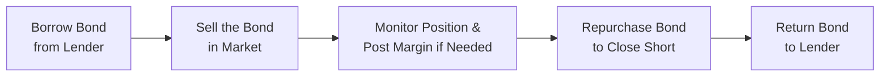
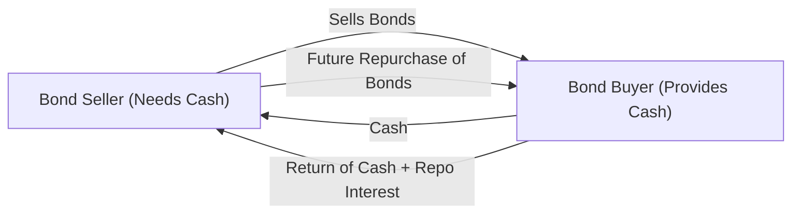

## Introduction

I remember the first time I realized fixed-income securities could be sold short—bonds always seemed like such straightforward, “buy-and-hold” investments. You know, you lend money to a government or corporation, collect coupons, and then get your principal back at maturity, right? But, as it turns out, short selling in fixed-income markets is actually a significant part of how traders position for changing interest rate environments, credit events, and other market swings.

Sure, short selling in equities might be more widely known, but bond short selling—especially when backed by the repo (repurchase agreement) market—can be a powerful tool for both speculation and hedging. And, yes, the complexities are real: from finding a bond to borrow, to navigating recall risks, to making sure your short remains correctly funded.

Below, we’ll explore the mechanics of short selling in fixed-income, how the repo market facilitates these trades, the interplay between these two dimensions, and the associated risks and regulatory considerations. We’ll also go through some case studies, best practices, and exam-relevant tips.

## The Mechanics of Short Selling in Fixed Income

### Overview of Short Selling

Short selling in bonds might sound like something only sophisticated hedge funds do, but in principle, it’s just the same as shorting a stock. You borrow a security (the bond), sell it in the open market, and hope that the price goes down so you can repurchase (cover) at a lower price. Finally, you return the borrowed bond. Meanwhile, you pay a borrowing fee—which acts similarly to interest on a loan—for the time you hold the security short.

If the bond’s price goes up instead of going down, you’ll pay more to buy it back, and you could face significant losses. There’s also the possibility that your lender will demand the bond back at any time (recall risk), which can force an unwanted early close. Even so, many portfolio managers and traders do consider short positions to hedge interest rate exposure, to benefit from expected credit spread widening, or to arbitrage price discrepancies.

### Step-by-Step Mechanics

Let’s visualize this using a mermaid diagram:

1. Borrow Bond from Lender: The short seller arranges to borrow the bond, typically via a repo or securities lending agreement. They agree to pay a fee and post collateral.  
2. Sell the Bond in the Market: The short seller sells the borrowed bond, receiving cash proceeds.  
3. Monitor Position and Post Margin: If the bond’s price moves against the short (i.e., it goes up), the short seller might have to post additional collateral.  
4. Repurchase the Bond: When ready to close the short, the short seller buys the same issue in the open market.  
5. Return the Bond to Lender: The trader returns the borrowed bond and ends the arrangement, paying any outstanding fees.

As you might imagine, each step can be influenced by the complexities of the repo market, daily margin calls, and supply/demand for the bond in the market.

## Motivations for Short Selling Bonds

### Speculation and Profit from a Price Decline

Some market participants anticipate that prevailing interest rates will spike or that a particular issuer’s credit quality will deteriorate, causing bond prices to fall. Short selling allows them to profit from that dip. It’s not necessarily cynical—sometimes bond markets can get overheated, and short sellers provide a balancing force.

### Hedging Interest Rate or Credit Exposure

Many institutions hold large bond portfolios. If a manager expects interest rates to rise modestly over a short period, it’s often too costly or impractical to sell their entire bond position. Instead, they can short sell a smaller position in an appropriate benchmark bond or possibly use interest rate derivatives. The short acts as an offset, limiting interest rate risk. Similarly, traders might short a corporate bond to hedge credit exposure if they foresee a sector-wide downturn.

### Arbitrage and Relative Value Trading

Bond markets can become dislocated. A trader might see that one bond issue is trading rich or cheap relative to another. By shorting the overvalued bond and simultaneously going long the undervalued bond, the trader can potentially lock in a spread. Such relative value arbitrage strategies rely heavily on the availability and cost of borrowing the shorted bond, which ties directly into the repo market.

## The Repo Market: Foundation for Short Selling

### Understanding Repo Agreements

A repurchase agreement (repo) is a transaction in which one party (the “seller”) sells securities (most often high-quality government bonds) to another party (the “buyer”) with an agreement to repurchase them at a fixed date in the future, at a stipulated price. For the buyer, this is effectively a secured loan, backed by the collateral of the bond. For the seller, it’s a means to finance short-term liquidity needs.

Here is a simplified mermaid diagram of a typical repo transaction:

- Day 1: The bond seller hands over the bond and receives cash.  
- Maturity (e.g., overnight, one week, longer): The seller repurchases the bond at the initial cash price plus an agreed-upon “repo rate.”

### Key Role of Repo in Short Selling

When you short sell a bond, you typically borrow it from someone else. That “someone else” might be a securities lending desk or a financial institution engaged in repo transactions. The liquidity and capacity of the repo market thus directly affects how easy or challenging it is to borrow a specific bond (and at what cost).

Sometimes bonds are in high demand for shorting—this can drive the repo rate down below typical market rates. Such bonds are said to be “on special.” The short seller effectively reaps a benefit from holding them in a repo transaction because they pay a lower financing cost. Conversely, if a bond is less in demand, it trades as “general collateral,” meaning it doesn’t command a special lower rate.

## Interplay Between Short Selling and Repo Markets

### Why Repo Is So Critical

- Access to Securities: Without the repo market (or a securities lending market), short sellers would have no reliable source of the bonds they want to short.  
- Pricing Efficiency: Repo transactions provide real-time insight into how much it costs to finance a short position. This financing cost is a key part of determining whether a short sale is profitable.  
- Market Liquidity: Short selling, facilitated by repos, helps ensure that bonds trade in a more continuous manner. It can also mitigate price dislocations by permitting traders to express negative views.

### Short Selling’s Effect on Repo Market Dynamics

- Enhanced Demand for Securities: Short selling increases the demand for borrowing certain bonds, driving the repo rates or lending fees in that security.  
- “Specials”: If many market participants want to short the same bond, lenders can charge a premium or pay less interest on cash in the repo. This is known as the bond “going on special.”  
- Potential Squeeze: If short sellers flood into the same bond and the supply of that bond for lending is limited, the borrowing fee can skyrocket. This may cause short sellers to cover or shift to alternative strategies.

## Risks and Challenges

### Price Risk

The biggest risk in any short sale is that the bond’s price moves up instead of down. Because bonds have no upper limit in price (well, practically it’s somewhat constrained by yields, but theoretically can keep climbing if rates plunge), short sellers can be carried away in large losses.

### Recall Risk

With short selling in fixed income, recall risk is tricky. The bond’s owner might recall the security unexpectedly. If you’re forced to buy the bond back at unfavorable prices, that can hurt. This uncertainty is a key difference from simply selling a bond you already own.

### Funding and Liquidity Risk

Short selling depends on the availability and cost of funding. Repo rates can fluctuate day to day—especially during turbulence. If the repo market seizes up, your short position might become prohibitively expensive or you might not be able to roll it over. This can be particularly troublesome when bond market liquidity is drying up during periods of systemic stress.

### Regulatory Constraints and Ethical Considerations

Some jurisdictions temporarily ban short sales during a crisis to curb downward pressure on asset prices. Others require additional reporting and transparency for short positions. Ethically, short sellers can face scrutiny if their short positions are perceived as driving excess volatility. According to CFA Institute’s Code and Standards, market participants should act fairly and in a way that upholds market integrity. While short selling is widely accepted as a legitimate practice for price discovery, it’s important to keep an eye on compliance with relevant regulations, margin requirements, and disclosure rules.

## Real-World Applications and Case Studies

### Treasury Bond Short for Interest Rate Outlook

Consider a portfolio manager who expects a moderate increase in U.S. Treasury yields. Rather than unloading an entire portfolio of long-term Treasuries—possibly incurring large transaction costs—they might short a nearby Treasury future or short-sell specific Treasury bonds they believe are the most overvalued. They borrow these Treasuries via the repo market, pay the borrowing fee, and profit if yields do indeed rise and bond prices fall.

### Corporate Credit Widening

Suppose a high-yield corporate issuer has teetering fundamentals, but the bond is still trading well. A credit hedge fund might short-sell that bond, anticipating a downgrade or missed earnings guidance. They borrow the high-yield bond through securities lending, short it, and if the issuer’s spread widens considerably, the bond price slides, generating profits on the short.

### “Basis Trade” Gone Wrong

A well-known fiasco occurred when hedge funds shorted Treasury securities against long positions in futures or cash bonds, trying to exploit small mispricings. During times of liquidity stress, the cost of repo soared, and some short sellers had to deliver bigger margin payments. This triggered forced unwinds, turning the initially “small” mispricing into a fiasco with major losses. It’s a reminder that shorting is not just about the direction of bond prices—it’s also about stable funding.

## Best Practices and Common Pitfalls

### Maintaining Adequate Liquidity

If you’re short a bond that suddenly comes into high demand, your financing costs might go up. Position sizing and stress-testing are critical. Always have enough liquidity or the ability to tap credit lines in case margin calls accelerate.

### Monitoring Repo Rates Closely

A bond might be cheap to short on day one, but if the supply tightens and the bond goes “on special,” your daily financing costs might blow out. Tracking real-time repo rate data can help you avoid nasty surprises.

### Diversifying Lending Sources

Relying on a single counterparty for borrowed securities can be risky. If they recall the bond or face their own liquidity issues, you could be forced to cover. Spreading the short across multiple lenders can mitigate this risk.

### Understanding Regulatory Requirements

Some markets impose short-sale constraints during extreme volatility. Others require disclosure above certain thresholds. Always remain current on the rules in your specific jurisdiction, and, if cross-border, the rules in your target markets too.

## Summary and Exam Relevance

Short selling in fixed-income markets is a robust mechanism that relies heavily on the liquidity and structures provided by the repo market. It serves various essential functions—allowing traders to profit from expected price declines, hedge interest rate risk, and engage in arbitrage. However, the complexity of daily financing costs, recall risk, and regulatory restrictions cannot be overemphasized.

In exam scenarios, you could be asked to:  
• Outline how a short sale in bonds is implemented.  
• Show how the repo market influences short-selling feasibility.  
• Identify key risks and how to mitigate them.  
• Contrast short-selling strategies for speculation vs. hedging.  
• Evaluate how short selling can affect market liquidity and price discovery.

Understanding these concepts is vital for any candidate aiming to master fixed-income strategies and how they integrate with broader portfolio decisions.

## References for Further Study

• CFA Institute Research Foundation: “Primer on Securities Lending.”  
• Asquith, P., Pathak, P. A., & Ritter, J. R.: “Why Short Sellers Are Essential for Markets.”  
• International Capital Market Association (ICMA): Resources on Repo and Collateral.  
• CFA Institute Code of Ethics and Standards of Professional Conduct.  

--------------------------------------------------------------------------------

## Test Your Knowledge: Short Selling and Repo in Fixed Income



### Which of the following best describes the core reason short sellers rely on the repo market?

- [x] It allows them to borrow the bonds they need for a short sale.
- [ ] It provides a way to buy bonds cheaply.
- [ ] It lets them circumvent trading regulations.
- [ ] It eliminates the risk of interest rates rising.

> **Explanation:** Short sellers primarily need to source bonds for sale, and the repo market provides them with that borrowing mechanism.

### Which of the following is a direct risk of short selling a bond?

- [ ] The short seller might earn unexpected coupon payments.
- [x] The lender can recall the security at any time.
- [ ] The short seller collects the bond’s principal upon maturity.
- [ ] The short seller is free from interest rate fluctuations.

> **Explanation:** Recall risk is a significant concern in short sales because the lender may demand the security back earlier than anticipated.

### A bond that is "on special" in the repo market typically:

- [ ] Has higher yield relative to similar maturities.
- [ ] Is rarely borrowed by short sellers.
- [x] Trades at a lower repo rate due to high short-selling demand.
- [ ] Sells at a discount only in the primary offering.

> **Explanation:** When many short sellers want to borrow a specific bond, it goes “on special” and commands a lower repo rate than general collateral.

### Which of the following best explains a “basis trade” in fixed income?

- [x] Shorting one bond and going long a related instrument to exploit a price misalignment.
- [ ] Holding a bond until maturity to capture all coupon payments.
- [ ] Buying a long-term bond and issuing a short-term bond to hedge the spread.
- [ ] Borrowing bonds in the repo market for immediate profits.

> **Explanation:** A basis trade involves offsetting long and short positions aimed at capturing mispricings. Often, it’s a small spread that becomes profitable with leverage.

### Which statement about short-selling strategies is correct?

- [x] Short selling can be used to hedge interest rate risk in a portfolio.
- [ ] Short selling only applies to investors looking for maximum leverage.
- [ ] Regulators generally prohibit all short sales in government bonds.
- [x] Short selling is exempt from margin requirements in most markets.

> **Explanation:** Fixed-income managers commonly use short selling to reduce or hedge risk. However, short sales are subject to margin requirements in most jurisdictions.

### Which of the following is true about recall risk in the context of bond short selling?

- [x] It can force a short seller to cover at an unfavorable price if the lender demands the bond back.
- [ ] It guarantees a short seller an automatic profit if the bond's price moves against them.
- [ ] It only applies to equity short selling, not bond short selling.
- [ ] It refers to the risk of a bond issuer recalling the bond prior to maturity.

> **Explanation:** The lender’s right to demand the return of the borrowed security can lead to forced covering at prices detrimental to the short seller.

### From a risk management perspective, which is a recommended best practice for short sellers in the fixed-income market?

- [x] Diversify borrowing across multiple counterparties.
- [ ] Use a single lender to consolidate collateral obligations.
- [x] Ignore the daily repo rates until just before the trade matures.
- [ ] Focus solely on price changes and not on financing costs.

> **Explanation:** Working with multiple counterparties reduces the chance of forced recalls and can help manage financing cost spikes.

### How does a rising repo rate typically affect a short position?

- [ ] It has no impact on the profitability of a short position.
- [x] It increases the cost to maintain the short position.
- [ ] It makes the bond price decrease automatically.
- [ ] It reduces recall risk.

> **Explanation:** Since the short seller must borrow the bond in the repo market, a higher repo rate raises their costs, decreasing net profitability.

### A trader who anticipates a decline in the price of corporate bonds due to credit spread widening is likely to:

- [x] Borrow the corporate bonds via a securities lending arrangement and sell them short.
- [ ] Buy more corporate bonds and hold to maturity.
- [ ] Lend the bonds to another trader in a repo transaction and collect interest.
- [ ] Invest in the same bonds with longer maturity to benefit from more coupon payments.

> **Explanation:** To profit from a projected price decline, short selling is the direct strategy—borrowing and selling now, repurchasing later at (hopefully) a lower price.

### A bond that is heavily shorted and has limited supply in the lending market may exhibit:

- [x] True
- [ ] False

> **Explanation:** Such a bond is more likely “on special,” meaning the repo market conditions favor lenders and increase costs for short sellers.


