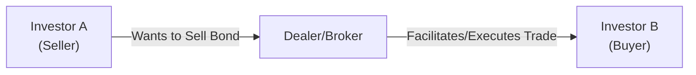

## Introduction

Secondary bond markets provide a venue where investors buy and sell existing debt securities. If you ever bought a used car and then resold it later, you might understand this idea right away: The car is the same car—only ownership changes. In secondary markets, the original issuer doesn’t receive additional funds from these subsequent trades; instead, the trades happen among investors themselves. Despite that, the vitality of these markets is crucial for the overall health of the fixed-income landscape. A bond that’s easy to buy or sell (i.e., it’s liquid) is a bond that many investors feel comfortable holding. That comfort contributes to efficient price discovery, lower transaction costs, and, ultimately, a more attractive investment environment.

Anyway, from a CFA® perspective, we want to see how trades are arranged, how prices are quoted, and which market structures can exist. Secondary market transactions can look very different depending on whether you’re dealing with highly liquid government bonds or specialized private placements. The knowledge you gain here will help you navigate trading mechanics, figure out how prices are formed and discovered, and appreciate the complexities of bond liquidity.

## Over-the-Counter (OTC) Bond Trading

Most of the world’s bond volume trades over the counter. You could say OTC bond markets have their own unique energy, a lot like a bustling bazaar—except it’s largely electronic these days. The “bazaar” analogy holds because participants negotiate directly (or via intermediaries such as dealers) rather than through a centralized exchange order book. Here’s a brief rundown of some of the key players that animate the OTC scene:

- Dealers: These are firms—often banks or broker–dealers—who stand ready to buy from or sell to clients. Dealers typically quote two prices: a bid price (the price they’ll pay if they’re buying the bond from you) and an ask price (the price at which they’ll sell the bond to you). The difference between these two prices is the bid-ask spread, which compensates dealers for taking on inventory risk.
- Brokers: Unlike dealers, brokers don’t maintain an inventory of bonds. They help locate potential counterparties and match buy-sell orders for a fee or commission. Think of them like real estate agents searching for the right property or buyer.
- Institutional Investors: Large asset managers, pension funds, endowments, sovereign wealth funds, and insurance companies often need to trade big blocks of bonds. If you’ve ever been in a situation where your single-lot order for a bond took a while to fill, you can imagine how big institutions need to coordinate carefully with dealers to ensure they can move large volumes without severely affecting prices.
- Inter-Dealer Platforms: These are electronic trading systems that dealers use to trade with each other. They’re somewhat like chat rooms, but for very large bond trades, typically with real-time price indications. Traders can see quotes, respond to them, and conclude deals quickly.

### OTC Market Characteristics

Because OTC trading is decentralized, transparent pricing data is sometimes less readily available than in exchange-traded markets. For instance, if you’re used to equity markets (with readily visible quotes on an order book), bond markets can feel more opaque, as the trading often happens bilaterally. Despite efforts from regulators and market participants to increase transparency, you still might not always see an official “last traded price” as easily as you could for a stock. Instead, you rely on indicated quotes from multiple dealers, electronic platforms, or third-party data sources.

Here’s an illustrative diagram of a typical OTC transaction flow:



In practice, the broker or dealer stands in the middle, quoting a price to Investor A and a price to Investor B, then matching or warehousing the bond. This arrangement means transaction costs can vary, especially if the bond in question is illiquid or rarely traded.

## Exchange-Traded Bond Markets

Although OTC markets dominate bond trading, a portion of certain government bonds, corporate bonds, or specialized debt instruments can trade on organized exchanges. Think of how equity shares commonly trade on the NYSE or LSE. An exchange-traded bond market has a central location (physical or electronic), with standardized listing requirements, real-time public quotes, and typically stricter regulatory oversight (e.g., listing rules, reporting requirements, etc.).

### Advantages of Exchange Trading

- Transparency: Exchanges often publish real-time quotations, trading volume, and detailed trade history. That can be reassuring if you’re new to bond investing and want more clarity on the transaction process.
- Counterparty Risk Mitigation: Trades executed on exchanges are usually cleared and settled by a central counterparty (CCP). This can reduce the risk that one side of the trade might fail to deliver the cash or the bonds.
- Well-Defined Rules: Exchange-traded markets follow standard conventions and listing requirements. If you’re used to the OTC bond market’s more flexible, “relationship-based” nature, then an exchange environment might feel more structured and straightforward.

Still, let’s be honest, exchange trading for corporate bonds is quite small compared to OTC. One reason is that bonds often have unique features—coupon structures, maturities, embedded options—and may not fit standardized exchange-traded contracts well. That’s partially why government bonds, especially short-term Treasury bills or notes from certain developed markets, are more likely to be exchange-traded than specialized corporates or emerging-market issues.

## Pricing Conventions in Bond Markets

Pricing in the bond world can get complicated pretty fast. That said, there are some general frameworks that help keep things coherent. In many major markets, bond prices are quoted as a percentage of par value (face value). For instance, you might see a quote of 99.75 or 105.50. Occasionally, you’ll see fractional quotes in increments of 1/32 (especially in U.S. Treasury markets) or decimalized quotes in a more modern format.

### Clean Price vs. Dirty Price

The most common confusion for new entrants into the bond market is, “Why is the final settlement price different from the quote on my screen?” The short answer is accrued interest. The quoted price (often called the clean price) doesn’t include accrued interest. But when you settle the trade, you pay or receive the dirty price (also known as the full price), which includes accrued interest.

Mathematically, the relationship is often expressed as:


\text{Dirty Price} = \text{Clean Price} + \text{Accrued Interest}


The accrued interest typically accumulates daily from the last coupon payment date up to (but not including) the settlement date. Day count conventions vary by market—some use Actual/Actual, others might use 30/360 or Actual/365—but the principle remains that the buyer compensates the seller for the interest the seller earned up to the transaction date.

In a typical environment, if you see a corporate bond quote at 102.00, that might just be its clean price. The actual price you pay could be 102.18 or 102.23 once accrued interest is added. Over the life of a trade, you’ll see that clean price remain stable following coupon payments, while accrued interest builds up between coupon dates. The dirty price is used for actual trade settlement because it represents the total amount of money changing hands.

### Yield Quotations

Sometimes, especially for government securities, you’ll see trades expressed directly in yield terms. For example, a U.S. Treasury might be quoted at a yield to maturity of 3.20%. Market participants then use yield-price conversions to figure out the actual transaction price. This approach is common for money market instruments as well (like T-bills, commercial paper, or certificates of deposit), where discount yield or bond equivalent yield might be used instead of a direct price quote.

Regardless, you should be comfortable flipping back and forth between price and yield quotes. A bond’s yield moves inversely to its price, so as yields go up, prices go down, and vice versa. If you’ve done any equity-level finance, you’re sure to remember that key inverse relationship. The big difference in bond markets is that the yield measure typically accounts for coupon payments, reinvestment assumptions, maturity, and potential embedded options. For exam and real-world practice, you should be able to apply standard yield conversion formulas and verify that a given yield quote translates to the correct bond price. 

Here’s a tiny snippet of Python code that might give a sense of how yield to price conversions can be automated (a simplistic approach, ignoring day count specifics and compounding frequencies beyond annual):

```python
def bond_price(face_value, coupon_rate, yield_rate, years_to_maturity):
    """
    Calculate approximate bond price using a simplistic discounting approach.
    :param face_value: e.g., 1000
    :param coupon_rate: e.g., 0.05 means 5% annual coupon
    :param yield_rate: e.g., 0.04 means 4% YTM
    :param years_to_maturity: integer or float
    :return: approximate bond price
    """
    coupon_payment = face_value * coupon_rate
    present_value_coupons = 0
    for t in range(1, int(years_to_maturity)+1):
        pv_coupon = coupon_payment / ((1 + yield_rate)**t)
        present_value_coupons += pv_coupon

    present_value_maturity = face_value / ((1 + yield_rate)**years_to_maturity)
    return present_value_coupons + present_value_maturity
```

In a real trading system, you’d need more precise day count conventions, coupon frequency, settlement date adjustments, yield compounding assumptions, possible embedded options, and more. But hopefully this snippet shows how straightforward yield-based price calculations can be when you abstract away the numerous real-world wrinkles.

## Quote-Driven vs. Order-Driven Markets

### Quote-Driven Markets

Many bond markets around the world operate as quote-driven venues—particularly the OTC ones. In quote-driven systems, dealers post bid-ask quotes. Investors wanting to execute a trade must accept a dealer’s quote (or negotiate). The advantage here is immediacy: if a dealer can manage the inventory risk, you might get filled quickly.

One caveat: The bid-ask spreads can be wide, especially for less liquid issues. But hey, that’s the cost of participating in a market where the dealer is taking on risk of holding that bond until they find another buyer or seller at an acceptable price.

### Order-Driven Markets

In an order-driven market, all buy and sell orders funnel into a central limit order book, matching trades when a buy price meets (or betters) a sell price. You’ve seen this in equity markets—like the big electronic boards. Certain exchange-traded bond markets also adopt this mechanism for specific issues, typically the most liquid government securities. The appeal here is transparency: you see orders in real time, so you can gauge supply and demand directly.

However, order-driven systems in bond markets can suffer from limited liquidity if the order flow is sparse. For that reason, many corporate bond markets stay primarily quote-driven, reliant on dealers that can provide liquidity, especially for large institutional trades.

## Practical Examples and Dynamics

Think of a big pension fund that wants to offload $50 million worth of a certain corporate bond with 15 years remaining to maturity. This is a large trade—too big to “chip away at” on a public order book (lest the fund risk pushing the price down on itself). Instead, the fund’s portfolio manager typically calls or messages multiple dealers, obtains quotes, and might then negotiate with the dealer who offers the best price. That negotiation might take minutes or hours, depending on the market’s liquidity, the size of the block, and the overall environment.

Or imagine a scenario where a retail investor in Europe is looking to buy a small lot (say, €5,000) of a local government bond. The investor might be directed to a local exchange platform, see published bid-ask quotes, and place a limit order. That order then sits in the order book until matched with a seller’s asking price or the inverse.

The important thing to remember is that these structures (OTC vs. exchange, quote-driven vs. order-driven) can coexist, often for the very same bonds. As a result, you may see slightly different quotes in different venues, but usually not enough difference that you could easily “arbitrage” to profit risk-free—dealers and high-frequency traders keep the markets fairly tight.

## The Role of Bid-Ask Spreads

No discussion of bond market microstructure is complete without mentioning the bid-ask spread. Essentially, the spread is the dealer’s compensation for providing liquidity and bearing inventory risk. Less liquid bonds, or those with uncertain credit prospects, typically exhibit wider spreads. So do complicated structured instruments. Meanwhile, highly liquid government bonds or large, actively traded investment-grade credits can have narrower spreads.

Sure, it might look like a fraction of a percentage at times, but the spread can be a huge factor in large trades. Even a 0.10% difference (10 basis points) on a $10 million trade can translate into a $10,000 cost. Over time, that cost can add up, which is why institutional traders might shop around with multiple dealers or attempt to trade on the more transparent portion of the market if possible—particularly for large blocks.

## Regulatory Considerations

Especially since the 2008 financial crisis, global regulators have stepped up efforts to bring transparency and stability to bond trading. Regulatory initiatives, such as the EU’s Markets in Financial Instruments Directive II (MiFID II) or the U.S. FINRA Trade Reporting and Compliance Engine (TRACE) system, have increased post-trade reporting requirements. This means trades get reported and released to the public within a short time window, allowing participants to see recent transaction prices.

For IFRS or US GAAP reporting, you’d classify bonds on the balance sheet at fair value through profit or loss (FVTPL), amortized cost, or fair value through other comprehensive income (FVOCI), depending on the entity’s business model and the characteristics of the instrument. This classification can influence how frequently you mark these bonds to market, which in turn compels you to care about the day-to-day or even intraday changes in secondary market quotes.

From an ethical standpoint (and as guided by the CFA Institute Code and Standards), practitioners must deal fairly and objectively with clients, especially when offering bond quotes or executing trades on their behalf. A portfolio manager or an investment adviser must aim for best execution, diligently seeking the best price while balancing other relevant factors like order size, speed, and market conditions.

## Common Pitfalls and Best Practices

- Underestimating Liquidity Risk: Just because a bond has a great yield doesn’t necessarily mean you can exit easily. Watch out for large bid-ask spreads in less liquid issues.
- Without Enough Quote Sources: Looking at quotes from only one dealer might lead to suboptimal pricing, especially in obscure or high-yield segments.
- Confusing Clean and Dirty Prices: A frequent mistake is assuming the screen-quoted price (clean) is the amount you’ll actually pay. Don’t forget to factor in accrued interest.
- Not Checking Yield Conversions: Particularly for money market instruments, the difference between yield types (bond equivalent yield, discount yield, etc.) can cause confusion. Double-check your math!
- Overlooking Regulatory Disclosure: Failing to comply with post-trade reporting obligations can lead to compliance headaches and possible fines. It also breaks the trust that underpins fair and orderly markets.

## Exam Tips and Integration

If you’re preparing for the CFA exam, especially at advanced levels, expect to see scenario-based questions. Be ready to:

- Convert between price and yield, including any day count conventions and coupon compounding frequencies.  
- Distinguish clean versus dirty price in a multi-part item set: they might ask you to calculate accrued interest or show you a scenario where a partial period complicates the settlement date.  
- Identify differences in how trades might be executed: you could be given a list of quotes from multiple dealers or an order book and be asked to pick the best execution strategy.  
- Explain how regulatory frameworks (like TRACE or MiFID II) enhance transparency in bond trading.  

A typical exam question might read: “A pension fund needs to liquidate $10 million of a thinly traded corporate bond in 48 hours. Describe the likely secondary market execution method and the considerations affecting price.” You’d want to highlight that an OTC approach with multiple dealers is the typical route due to the bond’s illiquidity, that the portfolio manager might have to accept a wider spread, and that regulation or post-trade reporting could influence the eventual price discovery.

## References

- Harris, Larry. “Trading and Exchanges: Market Microstructure for Practitioners.” (Especially useful for a robust overview of how trading markets are structured and the differences in microstructure among them.)  
- Fabozzi, Frank. “Bond Markets, Analysis, and Strategies.” (Great resource covering the mechanics of bond issuance, trading protocols, pricing, and yield analytics.)  
- CFA Institute. “Global Investment Performance Standards (GIPS)” and “CFA Institute Code of Ethics and Standards of Professional Conduct.” (Relevant for understanding best execution and ethical obligations.)  
- MiFID II Regulation (European Union) and FINRA TRACE (U.S). (Details on bond market transparency requirements.)

---

## Test Your Knowledge: Secondary Bond Markets and Pricing Quiz



### Which feature most distinguishes an over-the-counter (OTC) bond market from an exchange-traded bond market?

- [x] OTC is decentralized with bilateral negotiations between dealers and investors.  
- [ ] OTC trades must be cleared through a central counterparty.  
- [ ] Exchange-traded bond markets typically involve complex embedded options.  
- [ ] OTC and exchange-traded markets have identical transparency requirements.  

> **Explanation:** OTC markets rely heavily on bilateral negotiations and decentralized networks of dealers, unlike exchange-traded markets that often use a central limit order book with standardized rules.

### What is the most likely reason corporate bonds tend to trade over the counter rather than on an exchange?

- [ ] Exchanges ban all corporate bond listings.  
- [x] Corporate bonds often have less standardization and lower liquidity.  
- [ ] OTC platforms charge lower transaction fees than exchanges.  
- [ ] Exchange trading is less reliable for bond settlement.  

> **Explanation:** Corporate bonds vary widely in structure and liquidity, making them less suitable for standardized exchange trading compared to the highly uniform and liquid nature of many government bonds.

### In a quote-driven market, a bond trader is primarily interacting with:

- [x] Dealers who post bid and ask prices.  
- [ ] A central limit order book collecting buy and sell orders.  
- [ ] A single automated matching engine.  
- [ ] A regional exchange’s listing committee.  

> **Explanation:** Quote-driven markets, typical in fixed-income, rely on dealers posting bid and ask quotes. Investors or traders execute trades by accepting or negotiating those quotes.

### A bond is quoted at 101.50 (clean price). Accrued interest is 0.60. Which of the following is the dirty price (full settlement price)?

- [x] 102.10  
- [ ] 101.50  
- [ ] 101.24  
- [ ] 100.90  

> **Explanation:** The dirty or full price = clean price + accrued interest (101.50 + 0.60 = 102.10).

### Which of these statements about bid-ask spreads in bond markets is most accurate?

- [x] Less liquid bonds tend to have wider bid-ask spreads.  
- [ ] More liquid bonds usually trade with wider spreads to compensate dealers.  
- [x] Higher credit risk often results in wider spreads.  
- [ ] Government securities typically exhibit the widest spreads due to minimal default risk.  

> **Explanation:** Illiquid and higher-risk bonds tend to show wider spreads to compensate dealers for inventory and risk exposure, whereas government securities typically have narrower spreads.

### Why might post-trade reporting requirements (e.g., FINRA’s TRACE) be important for bond trading?

- [x] They increase transparency by publishing trade prices and volumes.  
- [ ] They replace the need for centralized clearing.  
- [ ] They force all bond trading onto exchange platforms.  
- [ ] They ensure that only registered investment advisors can trade.  

> **Explanation:** Post-trade reporting systems publish transaction data (price, volume, time), improving transparency and understanding of current market conditions.

### In an order-driven market, how are trades primarily executed?

- [x] By matching buy and sell orders in a central limit order book.  
- [ ] Through direct negotiation with a single dealer.  
- [x] By automated requests for quotes from multiple dealers.  
- [ ] By an auction at the end of each trading day.  

> **Explanation:** Order-driven markets use a central limit order book to match buy and sell orders. For a bond to trade, an opposing order must be present at the same or better price.

### Which of the following is an accurate statement about clean and dirty bond prices?

- [x] Clean price excludes accrued interest, while dirty price includes it.  
- [ ] Dirty price excludes accrued interest but includes coupon rate changes.  
- [ ] Clean price and dirty price are always the same in day-to-day trading.  
- [ ] Dirty price is only used for new issues on underwritten deals.  

> **Explanation:** Clean price does not factor in accrued interest. The dirty (settlement) price is what the buyer actually pays—clean plus any accrued since the last coupon.

### An investor sees a Treasury bond quoted at a yield of 2.85%. What must the investor do to determine the bond’s price for settlement?

- [x] Use a yield-to-price conversion method with specified day count and coupon assumptions.  
- [ ] Multiply the yield by the face value and add accrued interest.  
- [ ] Subtract the coupon rate from 2.85% and multiply by face value.  
- [ ] Compare the yield to an equity index and estimate the risk premium.  

> **Explanation:** A yield quote requires a yield-to-price calculation. The investor applies the bond’s coupon, maturity, compounding frequency, and day count convention to derive a full settlement price.

### True or False: In many bond markets, the reported price you see on screen already includes accrued interest.

- [x] True  
- [ ] False  

> **Explanation:** It varies by market, but in many cases (particularly one heavily impacted by local conventions), the displayed “traded” price might be a full price that includes accrued interest. However, you should verify whether the price is quoted clean or dirty, as conventions differ by region and bond type.


