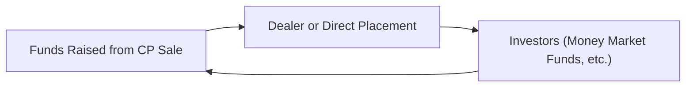
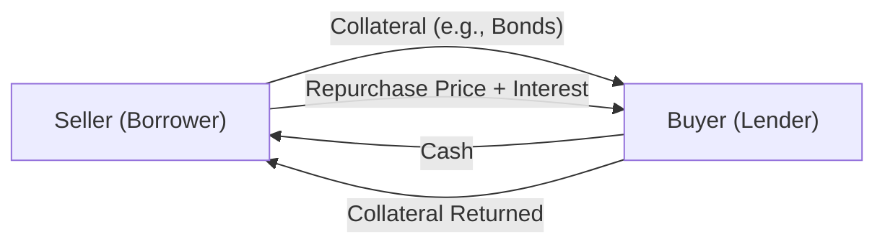

## Introduction

I remember the first time I went searching for short-term funding solutions for a corporate client—boy, did I feel like I’d been dropped in a maze of finance acronyms. Terms like “CP,” “repo,” and “haircut” were thrown around so casually that I was almost embarrassed to ask what they meant. Eventually, I learned Commercial Paper was basically corporate IOUs for short tenors, and Repos were, well, more or less like pawning bonds for quick cash and promising to buy them back. As we go along, I’ll share that story in more structured detail—for now, let’s unravel the intricacies of these key money market instruments in a way that’s practical, exam-driven, and yes, a bit friendly.

Below, we’ll dive into:
• Commercial Paper and its role as a short-term funding tool.  
• Repurchase Agreements (Repos) and Reverse Repos, focusing on structure, collateral, and risk considerations.  
• The interplay between such instruments and the broader fixed-income markets.  
• Accounting, regulatory, and credit considerations that every future CFA charterholder should be tuned into.

## Commercial Paper: Key Concepts

### Definition and Purpose
Commercial Paper (CP) is an unsecured short-term debt instrument issued by corporations to finance immediate operating needs (think: payroll, inventory, or bridging short-term obligations). Because it’s unsecured, only firms with high credit standings can typically tap the CP market at competitive rates.

In most markets, CP can mature anywhere from overnight out to 365 days. In the United States, there’s a legal limit of 270 days—mainly to avoid the more rigorous securities registration requirements that apply to longer-dated instruments. Trust me, if you’re an issuer, the difference between staying under that 270-day threshold and exceeding it can mean a world of regulatory paperwork.

### Issuance and Mechanics
When a firm first issues Commercial Paper, it can do so either:
• Directly: marketing the CP to investors itself (more common for big-name corporations who have well-established relationships).  
• Via Dealers: investment banks or other financial intermediaries place the paper with investors.

Investors in CP—often money market funds, banks, or corporations with excess cash—prefer it for its safety (big, stable companies are the usual issuers) and short maturity (meaning less interest rate or liquidity risk). Pricing is typically at a discount to par, with the implied yield being the difference between the purchase price and the face (redemption) value.

Mathematically:


\text{Discount Yield} = \frac{\text{Face Value} - \text{Purchase Price}}{\text{Face Value}} \times \frac{360}{\text{Days to Maturity}}


Or, if you want the bond-equivalent yield that is more directly comparable to other instruments:


\text{Bond Equivalent Yield} = \frac{\text{Face Value} - \text{Purchase Price}}{\text{Purchase Price}} \times \frac{365}{\text{Days to Maturity}}


Either way, the yield is typically lower than bank loans or other longer-term credit instruments because CP is short-dated and tied to the strength of the issuer’s credit.

### Credit Risk Considerations
Because CP is unsecured, creditworthiness looms large. If a corporation faces a credit downgrade, it can choke off its CP issuance channel or drive interest costs way up. During times of market stress—like the 2008 financial crisis—investors in CP get jittery, and issuers might struggle to roll over maturing obligations. Governments and central banks often step in (via special facilities) to keep this critical short-term market afloat.

### Practical Example
Let’s say Consolidated Tools Inc. needs $50 million for 60 days to purchase raw materials. Rather than drawing on a line of credit, they issue CP with a face value of $50 million, sold to investors at $49.85 million (discount). On day 60, Consolidated Tools pays back the full $50 million, netting investors $0.15 million in interest.

### A Quick Mermaid Diagram
Below is a simple diagram illustrating CP issuance:



## Repurchase Agreements (Repos)

### Definition and Basic Structure
A Repurchase Agreement, also called a “repo,” is essentially a short-term loan backed by securities as collateral. The seller (borrower) agrees to buy back the securities at a later date (often the next day) at a higher price, which reflects the interest on the loan. From the lender’s perspective, it’s known as a “reverse repo” deal, because they’re effectively buying the collateral, then returning it later.

If you’ve ever pawned something or watched a pawn shop reality show, a repo is somewhat similar: you hand over an item of value (in finance, typically government bonds), receive some cash, and you vow to pay back that cash plus a bit extra if you want your item returned.

### Why Repos Matter
Repos help banks, broker-dealers, and other market participants finance positions in securities—especially government or corporate bonds. It’s a key plank for liquidity in the fixed-income market. Dealers use repo financing to hold large inventories of bonds, which they can then trade with their clients without tying up all their own capital.

### How the Money Flows
Here’s the basic flow in a repo transaction:  
• The seller delivers securities to the buyer.  
• The buyer pays cash to the seller.  
• On the repurchase date, the seller gives back the cash plus interest, and the buyer returns the same securities.

We can visualize it:



### Pricing and Haircut
Just like with CP, there’s an implied interest rate on the cash you borrow via repos. But one big difference is that repos are secured lending, so the collateral’s quality matters. To protect the lender from a decline in collateral value, a “haircut” is often applied. A haircut is the percentage by which the collateral’s market value exceeds the cash borrowed. For instance, if the haircut is 2%, you might have to pledge $102 million worth of Treasuries to borrow $100 million.

Generally, the haircut depends on factors like:  
• Collateral type (U.S. Treasuries vs. corporate bonds)  
• Collateral maturity and liquidity  
• Counterparty credit risk  
• Market volatility at the time

If you’re dealing with high-quality government bonds in a stable market, haircuts can be very small. Lower-rated or highly volatile instruments tend to command higher haircuts.

### Types of Repos
Repos and reverse repos come in different tenors:  
• Overnight repo: matures next business day.  
• Term repo: matures in more than one day, possibly extending to weeks or months.  
• Open repo: no fixed maturity date; can be terminated by either party on any day.

### Accounting and Regulation
Under both IFRS and US GAAP, a standard repo is typically accounted for as a secured financing transaction (i.e., the securities stay on the seller’s balance sheet, and a corresponding liability is recorded for the cash borrowing). That said, the fine print of “true sale” vs. “secured financing” can get complicated if the terms deviate from standard market norms (like, for instance, if there is no genuine repurchase obligation).

Banking regulators keep a close eye on repo activities because they are central to system-wide liquidity. The Fed, ECB, or other central banks often intervene in repo markets to stave off liquidity crunches. For example, during times of stress, you might see historically low or high repo rates, reflecting supply-demand imbalances for cash or collateral.

## Repos and Market Liquidity

Market makers and dealers use repos to:
1. Finance bond inventories.  
2. Manage short-term liquidity positions.  
3. Hedge or speculate on interest rates.

When repo markets function smoothly, dealers can hold larger inventories of bonds and actively trade them, boosting liquidity in the market. However, if repo funding dries up—for instance, from a sudden rise in haircuts—the entire fixed-income market can seize up. In the 2008 crisis, the meltdown in repo markets contributed to a huge liquidity squeeze.

## Analyzing Risk in Short-Term Funding

### Credit and Counterparty Risk
• CP is unsecured, so the creditworthiness of the issuer is paramount.  
• In repos, the collateral reduces some counterparty risk, but the buyer of the repo also faces the risk that the collateral might lose significant value before they can liquidate it (in the event the seller defaults).

### Liquidity Risk
• Rolling CP: Issuers must continuously replace maturing CP with new issuances. If the market closes or rates spike, they can’t roll over.  
• Repo liquidity: In a stressed market, collateral haircuts can rise sharply, forcing massive deleveraging (sometimes called a “margin call” scenario in the repo world).

### Operational Risk
• CP issuance requires robust internal controls for settlement and documentation.  
• Repo transactions can involve complex tri-party arrangements (where a third-party agent holds collateral). Mishandling or documentation errors can lead to legal disputes, especially regarding collateral ownership.

## Typical Example: Yield on Repo

Let’s say you have a $10,000,000 overnight repo arrangement with a 2% annualized interest rate. The interest cost for one day’s borrowing is:


\text{Interest} = \$10,000,000 \times 2\% \times \frac{1}{360} = \$555.56


(Using a 360-day convention often used in money markets.)

## Python Snippet for Quick Repo Rate Calculations

You can do quick yield or interest calculations in Python:

```python
principal = 10_000_000
annual_rate = 0.02
days = 1
interest = principal * annual_rate * (days / 360)
print(f"Overnight interest cost: ${interest:,.2f}")
```

In real life, you’d scale this up for multi-day or multi-week repos and factor in any haircut if you’re the borrower.

## Maturity and Collateral Range

In short-term markets, “short” can mean overnight, a few days, or a few months. CP rarely extends beyond a year, while repos can be structured from overnight to 12+ months (though the majority are still overnight or term up to a few weeks). Collateral in repos can vary from top-tier government securities (like U.S. Treasuries) to corporate bonds or asset-backed securities. The better the collateral, the easier it is to negotiate lower interest rates and smaller haircuts.

## IFRS vs. US GAAP: Key Takeaways

• Commercial paper generally appears as a short-term liability for the issuer. Under IFRS and US GAAP, the discount on issuance is recognized as interest expense over the life of the paper.  
• For repos, the standard practice in both accounting regimes is to treat these transactions as secured borrowings if the seller retains substantially all the risks and rewards of the collateral. The securities remain on the balance sheet, and a corresponding “borrowed” liability is recognized.  

In extremely unusual scenarios (e.g., if certain conditions for “true sale accounting” are met), the transaction might be classified differently, but that’s borderline exam trivia.

## Frequently Seen Pitfalls

1. Confusing CP with Bankers’ Acceptances (BAs). CP is purely corporate-based and unsecured, while BAs have an acceptance from a bank and often revolve around trade finance.  
2. Misunderstanding the difference between discount yield and bond-equivalent yield for CP. A discount yield is based on face value; a bond-equivalent yield is based on purchase price.  
3. Overlooking haircuts in repo transactions. The margin or haircut is crucial to understanding the real leverage.  
4. Failing to recall that in IFRS/US GAAP, standard repos remain on the balance sheet of the seller. Some exam takers mistakenly think a repo is a sale of securities.  

## Real-World Anecdote

I once saw a regional bank that heavily depended on repo funding for its day-to-day liquidity. One morning, rumors circulated about the bank’s solvency, and the overnight repo market dried up for them. The bank had to scrounge up more expensive sources of capital, which caused a spike in their funding costs. In less than a week, depositors got spooked, the share price tanked, and the bank ended up being acquired.

Moral of the story: short-term funding is a lifeline for many market players, but it can vanish in a heartbeat if the market’s faith in a counterparty collapses.

## Conclusion: Short-Term Funding in Practice

Commercial Paper and Repurchase Agreements are the bedrock of short-term funding in fixed-income markets. CP serves as a straightforward, unsecured tool to finance working capital, while repos enable secured financing, particularly for bond market participants. Together, they are vital cogs in global liquidity.

As you gear up for the CFA exam, remember to:  
• Know the basic math behind CP yields (both discount and bond-equivalent).  
• Understand repo’s “form,” the role of collateral, haircuts, and the difference between a repo and a secured loan.  
• Keep in mind how credit quality underpins CP issuance.  
• Appreciate how central these instruments are for liquidity and how quickly things can unravel if trust erodes.

## Final Exam Tips

• Pay close attention to how yields are calculated for short-term instruments (especially the 360-day vs. 365-day year).  
• Repos, especially triparty repos, are a frequent source of short-answer or item-set questions highlighting credit, collateral haircuts, and market liquidity.  
• Be prepared to interpret a firm’s balance sheet presentation for CP or repos under both IFRS and US GAAP—particularly the classification of short-term liabilities.  
• In essay (constructed-response) questions, demonstrate a clear understanding of how adverse market scenarios (rising haircuts, credit downgrades) can disrupt short-term funding markets.  
• Watch out for subtle details: exam vignettes often incorporate a reference to a “downgrade trigger” that might accelerate CP maturity or restrict a company’s issuance capabilities.  

References  
- Stigum, Marcia. Stigum’s Money Market. New York: McGraw-Hill.  
- International Capital Market Association (ICMA). (n.d.). Repo and Collateral Publications. https://www.icmagroup.org/  

------------------------------------------------------------------------------

## Practice Questions on Short-Term Funding Instruments



### Assessing the Characteristics of Commercial Paper
- [x] Commercial Paper typically carries no collateral and relies on the issuer’s credit rating.  
- [ ] Commercial Paper is usually always secured by inventory.  
- [ ] Commercial Paper is legally limited to under 30 days in the U.S.  
- [ ] Commercial Paper can never exceed an interest rate of 5%.  

> **Explanation:** CP is an unsecured money market instrument with maturities predominantly up to 270 days in the U.S. The lack of collateral is a hallmark.

### Understanding Repo vs. Reverse Repo
- [x] In a repo transaction, the seller effectively borrows cash and pledges securities as collateral.  
- [ ] In a repo transaction, the buyer is the one that needs short-term funding.  
- [ ] Reverse repo is when an issuer sells CP in the secondary market.  
- [ ] Reverse repo transactions are uncollateralized.  

> **Explanation:** Repo is a secured lending arrangement (seller borrows). The reverse repo is the lender’s side of the trade, receiving collateral for cash.

### Haircut Rationale
- [x] The haircut compensates the lender for potential declines in collateral value.  
- [ ] The haircut is an additional fee charged by the borrower.  
- [ ] The haircut means the borrower receives more cash than the collateral’s market value.  
- [ ] Haircuts have no relationship to collateral quality.  

> **Explanation:** A haircut ensures the lender has a buffer if the collateral’s price falls. Higher-quality collateral typically implies a smaller haircut.

### Overnight Repo Tenor
- [x] An overnight repo typically matures the next business day.  
- [ ] An overnight repo matures in 30 days.  
- [ ] An overnight repo refers to a 24-year bond.  
- [ ] Overnight repos cannot be used for government bonds.  

> **Explanation:** By definition, an overnight repo is an agreement that terminates on the next business day, making it extremely short term.

### CP Yields
- [x] CP is often issued at a discount, and yield is derived from that discount.  
- [ ] CP is always issued at a premium.  
- [x] CP yield can be annualized on a 360-day or 365-day basis.  
- [ ] CP must pay a fixed coupon.  

> **Explanation:** Most CP is zero-coupon (priced at a discount). Yield calculations can be handled using either a 360- or 365-day convention, depending on market norms.

### Accounting Treatment (IFRS and US GAAP)
- [x] Repos are generally treated as secured borrowings on the balance sheet.  
- [ ] Repos transfer securities off-balance sheet in most cases.  
- [ ] CP issuance is accounted for as an equity transaction.  
- [ ] Repos are typically intangible assets.  

> **Explanation:** Under both IFRS and US GAAP, standard repo transactions are seen as secured financing; the collateral remains on the seller’s balance sheet.

### Liquidity Risk in Short-Term Funding
- [x] Issuers of CP must roll it over continuously or repay it as it matures.  
- [ ] CP rarely needs to be repaid.  
- [x] Repos can become expensive if haircuts rise suddenly.  
- [ ] Repo markets can never be disrupted, even in a financial crisis.  

> **Explanation:** Both CP and repos can face significant liquidity squeezes if market conditions change or confidence erodes.

### Role of Central Banks
- [x] Central banks sometimes intervene in the repo market to ensure liquidity.  
- [ ] Central banks disallow repo transactions among commercial banks.  
- [ ] Central banks underwrite all CP in the market.  
- [ ] Repos are illegal in most major economies.  

> **Explanation:** Central banks often enter the repo market to maintain stable short-term interest rates and liquidity, particularly during crises.

### Maturity Limitations for CP in the U.S.
- [x] CP typically has a maturity under 270 days to avoid certain regulatory hurdles.  
- [ ] CP can only be issued at exactly 1 day.  
- [ ] All CP must have at least a 5-year maturity.  
- [ ] CP cannot have credit ratings associated with it.  

> **Explanation:** In the U.S., CP is generally issued with maturities no longer than 270 days to remain exempt from certain SEC registration requirements.

### True or False: Commercial Paper is Always Secured by the Issuer’s Assets
- [ ] True  
- [x] False  

> **Explanation:** CP is unsecured debt, relying on the issuer’s overall credit rating and financial strength rather than specific collateral.


