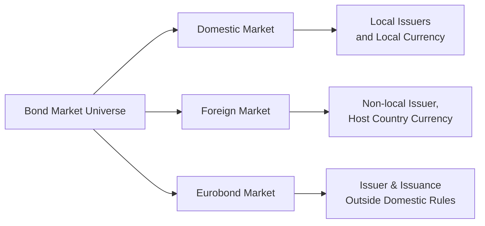

## Introduction and Big Picture

So, believe it or not, I once had a friend—let’s call him Dave—who got absolutely lost trying to figure out where to invest in bonds globally. He was excited because he’d heard of “Eurobonds,” “Samurai bonds,” “Maple bonds,” and more. But after a few days of research, he was totally confused: Are these bonds all just random fancy names, or are they truly different in risk, currency, or something else?

If we zoom out, the global bond market is huge—some say it’s even bigger than the global equity market. With so much variety, segmentation is inevitable. Some markets are carved out by geography and currency, others by rating or sector. That’s what this section is all about: helping you see the big segments so that you can navigate them with confidence, whether you’re investing in domestic markets or venturing across borders.

## What Does “Global Bond Market Segmentation” Actually Mean?

Global bond market segmentation basically means that bonds are grouped (or “segmented”) according to certain traits. Common categories include:

• Geography: Domestic vs. Foreign vs. Eurobond.  
• Currency: USD, EUR, JPY, GBP, etc.  
• Credit Rating: Investment Grade vs. High-Yield (a.k.a. junk bonds).  
• Issuer Sector: Sovereign, Corporate, Supranational, Municipal, Agency, and so on.  

Each segmentation has its own reasons—like regulatory differences, tax treatment, or the underlying credit risk. No wonder Dave got confused. But once you understand how these segments are structured, you’ll start seeing the entire market as more of a big mosaic rather than random pieces.

## Key Segments: Domestic, Foreign, and Eurobond

### Domestic Market

The “domestic” market is basically your home turf. For instance, in the U.S., that’s the huge market for U.S. Treasuries (government-issued) and U.S.-based corporate bonds. Generally, when you buy bonds in your domestic market:

• The bonds are issued in your local currency.  
• The issuers are established under local law and subject to local regulations.  
• The investor base tends to be heavily local, although there can be substantial foreign participation.  

In the U.S., you’ll see domestic corporate bonds subject to SEC regulations, while in Germany, you might see euro-denominated corporate or government bonds subject to EU and BaFin oversight. The positives? Familiarity with regulation, presumably stronger legal recourse, and simple tax considerations (at least in theory). The downside? You might be missing out on global diversification if you only stick to your domestic market.

### Foreign Market

The foreign market involves bonds issued in the currency of a host country by an issuer that hails from somewhere else. Classic examples include:

• Yankee Bonds: USD-denominated bonds issued in the U.S. by non-U.S. entities.  
• Samurai Bonds: JPY-denominated bonds issued in Japan by non-Japanese entities.  
• Bulldog Bonds: GBP-denominated bonds issued in the UK by non-UK entities.  

In foreign markets, the host country typically imposes local regulations. For example, a Yankee bond—despite being issued by, say, a European bank—still has to comply with all relevant U.S. securities rules. Sure, there’s currency risk for the foreign issuer (if it doesn’t naturally hold assets in USD), and also for the local investor if the investor is not originally a USD-based investor. But for you, if you’re a local investor, it could provide returns that differ from purely domestic bonds while staying in your home currency. One word of caution: foreign issuers might not be as thoroughly covered by local analysts or rating agencies, so you’ll want to do extra research on credit risk.

### Eurobond Market

Now, the Eurobond market often confuses folks—especially the name. Eurobonds aren’t just bonds denominated in euros. Actually, a Eurobond is any bond that’s denominated in a currency different from the country in which it’s issued. So you might have USD-denominated bonds issued in London or Swiss franc–denominated bonds issued in Luxembourg. 

Why do some issuers bother with Eurobonds? Several reasons:

• Lighter Regulation: Eurobonds often face fewer regulatory hoops compared to the strict domestic frameworks of certain countries.  
• Global Scale: Issuers can access a broader international investor base.  
• Tax and Regulatory Arbitrage: By going offshore, issuers may find more favorable tax treatment or less restrictive capital controls.  

This last point gets interesting. Some issuers choose a particular financial hub (like London or Luxembourg) because the local regulations there allow more flexibility or potentially lower issuance costs. Investors also appreciate not being locked into local laws that might be more restrictive.

To help visualize these segments, check out this simple flowchart:

The chart shows how these markets segment based on issuer domicile and currency. Each path involves unique regulations, currency exposures, and investor base considerations.

## Why Segmentation Matters: Currency, Regulation, and Beyond

### Currency Risk

Imagine you’re a euro-based investor buying Japanese yen bonds. If JPY depreciates severely relative to EUR, your EUR-based returns might plummet even if the bond pays all its obligations in full. On the flip side, if JPY appreciates, you get a welcome currency bonus. So, segmenting by currency is absolutely critical when it comes to understanding overall portfolio risk.  

Many large institutional investors do some sort of currency hedging when they buy foreign bonds. But hedging can be expensive and not always straightforward. Retail investors might skip the hedge and absorb the volatility.

### Regulatory Differences

Each country has its own rules for issuance, disclosure, and investor protection. Domestic issuance usually requires going through the local regulatory bodies (like the SEC in the U.S.), which can be both a cost and a safeguard. Foreign or Eurobond issuance often results in lighter regulation but can create challenges if something goes wrong—for instance, if there’s a default, how do you legally pursue recourse in an offshore jurisdiction?

### Legal Structures and Tax Treatment

Tax considerations can be a real headache. Interest income might be taxed differently depending on the investor’s country of residence versus the issuer’s country. Some markets have tax treaties that reduce withholding taxes on interest. Others have double taxation unless you fill out a ton of forms (ask me how I know!). Many investors weigh the net-of-tax yield in deciding where to invest or issue.

If you’re looking to invest cross-border, it’s critical to check:

• Local withholding tax on coupon payments.  
• Potential capital gains taxes.  
• Any special tax treaties your home country has with the issuer’s country.  

### Investor Appetite

Different investor bases have different preferences. For instance, Japanese households historically have loved domestic Japanese Government Bonds (JGBs) because they trust the government and want minimal risk. Meanwhile, investors with higher yield appetite might look at emerging market sovereigns, high-yield corporate bonds, etc. Understanding who’s buying these bonds can offer clues about liquidity and price dynamics. For example, if there’s a big wave of foreign interest in Yankee bonds, yields might get driven down from an influx of demand, or vice versa.

## Navigating the Risk-Return Trade-Off

Every segment has its risk-return profile:

• Domestic Investment-Grade: Usually stable, lower yield, fewer regulatory or currency surprises.  
• Foreign Market Bond: You might get a credit or yield bump, but also more complexities (i.e., regulatory environment, currency risk).  
• Eurobond: Lighter regulation can mean more flexibility for issuers, potentially higher yields for investors. But do your homework on credit risk.  
• High-Yield (Junk): Offers bigger yields, but default risk can be substantial.  

You'll want to factor in your portfolio’s overall objectives, risk tolerance, and hedging strategies. If you’re building a diversified global bond portfolio, you might combine domestic, foreign, and Eurobonds to balance yield, credit, and currency exposures.

## Practical Examples and Case Studies

### Case Study 1: A Japanese Company Issuing a Dollar Bond in London

Say a major Japanese automotive giant wants to borrow USD for expansion in the U.S. Instead of issuing a samurai bond (which would be yen-denominated) in Japan, they might issue a USD-denominated bond in London—effectively a Eurobond. The company avoids certain U.S. issuance regulations, taps into a wide global investor base, and obtains the currency (USD) needed for investment in the U.S. Meanwhile, investors get exposure to a large, well-known issuer but might accept slightly higher risk because it’s an offshore issuance.

### Case Study 2: A European Investor Buying Yankee Bonds

A European asset manager wants exposure to the U.S. corporate sector but doesn’t want to buy strictly local euro-denominated bonds. So, they purchase Yankee bonds—dollar-denominated corporate bonds from an overseas issuer, but sold within the U.S. market framework. They like the yield advantage and the diversification benefits. However, they remain mindful of the EUR/USD exchange rate, which might bump up or erode their returns.

## Common Pitfalls and How to Avoid Them

• Ignoring Currency Risk: Seriously, ignoring currency risk can be a big mistake. Hedge it if it’s material to your portfolio goals; at least be aware of how it can swing returns.  
• Overlooking Liquidity: Some foreign or Eurobond placements can be thinly traded. Liquidity risk is real. Check secondary market conditions before you jump in.  
• Regulatory Surprises: Each market’s laws and rules differ. It’s easy to get tripped up by withholding tax or registration requirements. Do your legal homework.  
• Failing to Diversify: Sticking to just one region or segment can be comfortable, but may miss out on potential returns or risk mitigation.  
• Chasing Yield Without Due Diligence: High yield might sound great, but that typically means higher default risk. Depth of research matters.

## Best Practices for an International Bond Portfolio

1. Define Objectives Clearly: Are you seeking income stability, capital preservation, or total return?  
2. Diversify Across Sectors and Regions: Spread your bets among domestic, foreign, and Eurobond segments.  
3. Use Currency Hedging Strategically: Decide whether to hedge currency risk or take a view based on your macro outlook.  
4. Stay Updated on Regulatory Changes: Some markets frequently modify listing requirements or tax regulations—keep an eye on the news.  
5. Examine Credit Quality and Issuer Fundamentals: Ratings are a start, but always look deeper—especially for non-domestic issuers with less coverage.  

## A Quick Word on Cross-Border Settlement

One pesky challenge with foreign or Eurobonds: cross-border settlement. Different countries’ clearing systems (such as Euroclear or Clearstream) have their own processes. Settlement can get delayed or complicated by national holidays, mismatching regulations, or just old-school paperwork. As an investor, you typically rely on your brokerage or custodian to handle this. But be aware that delays or additional costs aren’t unusual, especially if you’re venturing into less-developed markets.

## Final Thoughts and Taking the CFA Exam Angle

In the broader context of fixed income (and referencing other sections in this Volume), it’s essential to recognize how primary issuance (Chapter 3.1) and secondary trading mechanisms (Chapter 3.2) mingle with the segmentation of global bond markets. Understanding how bonds are categorized domestically, internationally, or in offshore markets is crucial when analyzing yield differentials or credit spreads.

From a CFA exam standpoint, you could see scenario-based questions about an institutional investor who must decide among domestic vs. Eurobond issuance based on cost, regulation, or liquidity constraints. They might ask you to evaluate currency risk management or analyze how regulatory differences influence bond structure and yield.

As you practice sample problems, keep your eyes open for “Yankee bonds,” “Samurai bonds,” or “Eurobonds” as examples. Making sure you can label and compare these can earn you easy points on exam day.

## References and Further Exploration

• Solnik, B. and McLeavey, D. “Global Investments.” (For an in-depth look into international capital markets, including fixed income.)  
• Bank for International Settlements (BIS) Quarterly Reviews. (These regularly cover cross-border issuance trends and international debt securities data.)  
• Chapters 1–2 of this Volume. (For basics on bond markets, participants, and features.)  

## Test Your Knowledge: Global Bond Market Segmentation Quiz



### Which of the following best describes a Yankee bond?

- [ ] A bond denominated in yen and issued in Japan by a Japanese issuer.  
- [x] A USD-denominated bond issued in the United States by a non-U.S. issuer.  
- [ ] A EUR-denominated bond issued outside the Eurozone.  
- [ ] A bond issued in any currency by a domestic U.S. company.  

> **Explanation:** Yankee bonds are foreign bonds denominated in U.S. dollars and issued in the U.S. by a non-U.S. entity, subject to U.S. regulations.

### Which of the following is a typical advantage for issuers using the Eurobond market?

- [ ] Greater regulatory scrutiny and fewer tax benefits.  
- [x] The possibility of lighter regulation and broader global investor pool.  
- [ ] Guaranteed lower interest rates than in domestic markets.  
- [ ] Mandatory denominating in euro currency.  

> **Explanation:** Eurobond issuers often face lighter regulations and can reach a global investor base, which can be attractive compared to stricter domestic rules.

### An investor who purchases a Samurai bond typically invests in:

- [ ] A U.S.-based corporate bond subject to local U.S. laws.  
- [ ] A euro-denominated bond in an offshore center.  
- [x] A yen-denominated bond issued in Japan by a non-Japanese issuer.  
- [ ] A GBP-denominated bond issued in the U.K. by a non-British issuer.  

> **Explanation:** Samurai bonds are JPY-denominated and issued in Japan by a foreign (non-Japanese) issuer. The investor is thus exposed to Japan’s regulations and yen currency fluctuation.

### Which statement regarding foreign bonds is most accurate?

- [ ] Foreign bonds are always issued in an issuer’s home currency.  
- [ ] Foreign bonds are typically issued in offshore financial centers.  
- [ ] Foreign bonds are typically subject to no local regulations.  
- [x] Foreign bonds are issued in a host country’s currency by a foreign issuer.  

> **Explanation:** A foreign bond’s hallmark is that it’s issued in the currency of the host country, not the issuer’s home currency, and must follow the host’s regulations.

### In global bond markets, what is a primary reason for regulatory arbitrage?

- [x] Issuers seek to minimize costs by exploiting differences in regulations.  
- [ ] Investors hedge currency risk using derivatives.  
- [ ] Issuers prefer to default on domestic investors.  
- [ ] It reduces the overall bond supply.  

> **Explanation:** Regulatory arbitrage occurs when issuers exploit differences in rules and regulations across jurisdictions to reduce compliance costs or taxes.

### Which of the following best illustrates a domestic market issuance?

- [x] A French company issuing euro-denominated bonds in France subject to AMF (French financial regulator).  
- [ ] A Canadian company issuing USD bonds in the U.S. by registering with the SEC.  
- [ ] A U.S. company issuing EUR bonds in London.  
- [ ] A Japanese company issuing USD bonds in Tokyo.  

> **Explanation:** A domestic issuance happens when an issuer sells bonds in its own country and in its own currency subject to local regulations.

### Which factor most significantly differentiates domestic bonds from Eurobonds?

- [ ] Eurobonds are exclusively government bonds.  
- [ ] Domestic bonds lack any credit rating.  
- [x] Eurobonds are denominated in a currency different from the country in which they are issued.  
- [ ] Domestic bonds are only available to local investors.  

> **Explanation:** Eurobonds are characterized by being issued outside the country whose currency is used, often allowing for less regulation and broader investor participation.

### A potential disadvantage for investors buying high-yield foreign bonds could be:

- [ ] The lower coupon rate compared to government bonds.  
- [x] Combined default and currency risks on top of complex regulations.  
- [ ] A lack of any yield advantage over investment-grade domestic bonds.  
- [ ] Minimal difference in credit risk relative to domestic Treasuries.  

> **Explanation:** High-yield foreign bonds combine credit risk (higher chance of default) plus currency and regulatory complexities, which can heighten overall risk.

### Which of the following steps is considered a best practice when building an international bond portfolio?

- [x] Conduct thorough due diligence on both credit quality and local regulations.  
- [ ] Avoid hedging currency risk to preserve maximum upside potential.  
- [ ] Invest solely in your domestic market.  
- [ ] Over-allocate to a single high-yield sector for diversification.  

> **Explanation:** When investing internationally, best practices include researching credit quality and local regulations to navigate any legal or tax pitfalls effectively.

### True or False: Eurobonds must be denominated in euros.

- [x] False  
- [ ] True  

> **Explanation:** Despite the name, “Eurobonds” can be denominated in various currencies, not necessarily the euro. A USD bond issued in London is a Eurobond if it is issued outside the U.S.


