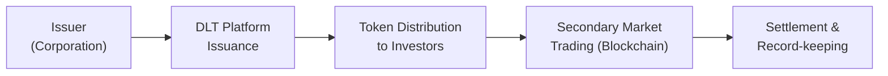

## Overview
Innovations in bond issuance have never been more exciting—honestly, I’m still amazed at how quickly we’ve gone from physical bond certificates (yes, the ones with coupons you literally clipped) to high-speed electronic platforms. Now, we’re taking yet another leap: digital and tokenized bonds. These approaches aim to boost market efficiency, reduce costs, and open up new ways for global investors to access fixed-income instruments.

Over the past few years, widespread adoption of distributed ledger technology (DLT) and blockchain-based solutions has opened doors for markets to streamline issuance, settlement, and custody. If you recall from Chapter 1, we introduced the broad ecosystem of fixed-income markets. Here, in Section 3.5, we’re zooming in on the novel issuance techniques that leverage DLT or “tokenization” to offer a new spin on the old concept of debt financing. In many ways, digital bond issuance is the next phase of modernizing the entire bond market value chain, from underwriting and distribution to secondary trading and settlement.

## Digital Bond Issuance
Digital bond issuance refers to delivering bond instruments electronically—potentially in near–real time—by using specialized fintech or blockchain platforms. Many of the fundamental concepts remain the same as in traditional debt issuance: you still have an issuer, underwriter (sometimes), and investors. However, the difference is the technology behind the scenes. Issuance and settlement happen on a shared digital ledger, reducing the friction or delays you’d typically see in a conventional process.

Some of you might remember the complexities we discussed in Chapter 1.5 regarding electronic trading platforms. Well, digital bond issuance takes that further by applying DLT. The potential benefits of DLT-based issuance include:

• Real-Time Settlement: Instead of the established T+2 or T+3 settlement, digital issuance can settle transactions the same day, or even within minutes.  
• Lower Costs: By removing layers of intermediaries—custodians, manual record-keepers, and multiple clearinghouses—issuers can reduce expenses.  
• Transparency: A shared ledger displays ownership records, transaction history, and contract terms more openly.  
• Auditability: Regulators or auditors can track issuance and transactions on a distributed ledger with minimal friction.

That said, it’s not all sunshine. Digital bond issuance also introduces technology risk (e.g., hacking or software bugs), and market acceptance is still an uphill battle. Many institutions remain cautious because, let’s face it, trust in a new technology can take time to build.

### How Digital Bond Issuance Works
The process is conceptually similar to a standard bond offering. The issuer works with a platform provider that sets up the smart contract logic for the bond instrument. The business terms—coupon rate, maturity, redemption schedule—are coded into the digital system or embedded as conditions in a smart contract. Investors then purchase the bond through that platform, and their holdings are recorded on the shared ledger.

Below is a simple visualization:

It’s straightforward on paper (or on your screen), but in real life, every stage demands robust technology, regulatory approvals, compliance checks, and secure integrations with payment systems.

## Tokenized Bonds
A tokenized bond is essentially a digital representation of a bond (or even fractions of it) on a blockchain. Picture a situation where a US$1,000 par value bond is represented as, say, 1,000 tokens, each valued at US$1. That means you can literally buy or sell just $10 worth of the bond if you want 10 tokens. This fractional ownership aspect is, in my opinion, a game-changer. It invites smaller investors or those who want more fine-grained portfolio adjustments.

### Potential Advantages of Tokenized Bonds
• Fractional Ownership: As we learned in Chapter 2, you typically purchase entire bond lots. Tokenization breaks that rule by dividing fixed-income instruments into small, tradeable units.  
• Liquidity Enhancement: Because tokens can be traded on secondary markets (subject to regulatory constraints), historically illiquid instruments (like private placements) might see better price discovery and investor reach.  
• Efficient Global Access: Even cross-border transactions can be smoother—no more complicated settlement chains and time zone constraints.  
• Smart Contract Automation: Coupon payments or redemption can be automated using smart contracts. As soon as the payment date hits, the contract triggers a distribution of principal or coupon to holders.

Of course, we have to remain realistic. If the underlying bond is illiquid to begin with, simply tokenizing it might not magically create liquidity. Also, tokenization requires investor confidence in the underlying technology. A minor coding error in the smart contract can produce major headaches—like paying the wrong coupon or restricting legitimate ownership transfers.

## Regulatory Considerations
Regulation is a big deal and is continuously evolving. Most jurisdictions treat tokenized bonds similarly to traditional bonds. Why? Because from a legal standpoint, they represent the same economic interest—a claim on the issuer’s cash flows. So, “traditional” securities laws typically still apply, whether your certificates come in paper form or as digital tokens.

In the United States, for example, the Securities and Exchange Commission (SEC) tends to view tokenized securities as standard securities offerings. Issuers will likely still need to register or qualify for exemptions under Rule 144A private placements. The same is true in Europe, but certain countries (Switzerland, Germany, Luxembourg) have introduced laws or frameworks specifically guiding DLT-based securities. For instance, the Swiss Federal Act on the Adaptation of Federal Law to Developments in Distributed Ledger Technology clarifies the nature of ledger-based securities.

When it comes to IFRS vs. US GAAP treatment, the classification of digital bonds follows many of the same rules as other financial instruments. IFRS 9 provides guidelines on recognition and measurement of financial assets, so a tokenized bond would typically still appear as a financial asset on the balance sheet. The main difference is in how you handle the technical aspects of holding these digital assets (e.g., cybersecurity, custodial solutions, intangible asset classification if the token isn’t recognized as a standard security under IFRS principles). In practice, though, standard bond classification and disclosure remain relevant.

## Practical Implementation
Implementing a digital or tokenized bond issuance requires close coordination among issuers, underwriters (or issuance platforms), technology providers, and regulators. Many banks are experimenting with private blockchain solutions, while fintech startups offer tokenization platforms with integrated compliance modules. And let me tell you, bridging traditional compliance processes with distributed ledger technology is a major hurdle.

Key steps often include:  
• Structuring the Offering: Terms, credit enhancements, covenants (Chapter 2.1).  
• Creating the Smart Contract: Automating bond features, coupon schedules, or call options (Chapter 2.3).  
• Onboarding Investors: Conducting KYC/AML checks, ensuring regulatory compliance.  
• Establishing Custody: Determining how tokens are stored (e.g., institutional wallets, regulated custody providers).  
• Execution & Settlement: Once the smart contract is activated, allocations are recorded in real time.

## Case Studies
1. Swiss SIX Digital Exchange (SDX): One of the frontrunners in Europe, SDX launched a fully integrated digital asset trading and settlement infrastructure. They showcased a digital bond issuance, allowing faster settlement and automating certain back-office tasks.

2. European Investment Bank (EIB): The EIB issued a series of digital bonds on the Ethereum blockchain, highlighting how major institutions are adopting DLT to reduce costs and settlement times.

3. Smaller Private Placements: I’ve heard colleagues rave about tokenizing real estate bonds, enabling smaller investors to get exposure to large property deals. Fractional ownership—particularly relevant to those with only, say, a few thousand dollars to allocate—expands the investor pool significantly.

## Challenges and Potential Solutions
While the promise of digital and tokenized bonds remains strong, there are challenges:

• Technology Risk: Blockchain code vulnerabilities, hacking attempts, private key mismanagement.  
• Market Adoption: Institutional investors often move cautiously. Adopting new settlement processes and custody solutions can be slow.  
• Interoperability: Different blockchains may not “talk” to each other, fracturing liquidity.  
• Legal Certainty: If a dispute arises, can the terms coded in a smart contract hold up in court? Perhaps, but the frameworks are still being tested.

Best practices and emerging solutions include rigorous testing of smart contracts, insurance on digital assets, collaboration with regulators, and industry-wide standardization. Some platforms are exploring cross-chain bridges or standard asset token protocols to address interoperability.

## Future Outlook
The future is bright if the industry can calibrate the technology to meet regulatory requirements and investor expectations. We might see more central banks releasing digital currencies (CBDCs, discussed in Chapter 4.16), making on-chain settlements increasingly seamless. Imagine an entire ecosystem where you can buy a newly issued corporate bond at 10:00 a.m. and see it settle in minutes, with your coupon paid automatically in digital currency on the due date. That’s the dream scenario.

Yet, mainstream acceptance likely hinges on continued collaboration between regulators, financial institutions, and technology providers. As regulators get more comfortable with the technology and standards mature, we may see an explosion in tokenized bond issuances—extending well beyond pilot programs to become a staple in global fixed-income markets.

## Glossary
• Distributed Ledger Technology (DLT): A decentralized database shared by a network of participants, enabling secure and transparent record-keeping.  
• Tokenized Security: A digital representation of a real-world asset (here, a bond) recorded on a blockchain or other DLT.  
• Smart Contract: Self-executing code with the rules for an agreement embedded. In a bond context, it can automate coupon or principal payments.  
• Fractional Ownership: Allowing investors to hold smaller portions (tokens) of a single security, lowering the investment threshold.

## References and Further Reading
• World Economic Forum: Reports on “The Future of Capital Markets: DLT and Tokenized Securities.”  
• Swiss SIX Digital Exchange (SDX): Official Press Releases and Whitepapers.  
• European Investment Bank (EIB): Case Study on Digital Bond Issuances.  
• IFRS 9: International Accounting Standard for Financial Instruments.  
• SEC Resources: Guidance on Digital Assets and Securities Regulatory Frameworks.

## Practical Exam Tips
• Be prepared to compare and contrast digital vs. traditional bond issuance in an essay question.  
• Understand how fractional ownership affects liquidity, credit risk distribution, and market depth.  
• Practice scenario-based questions where you identify the regulatory implications of a tokenized bond offering.  
• Expect to see short cases referencing how “smart contracts” automate coupon payments or redemption schedules.

## Test Your Knowledge: Innovations in Digital and Tokenized Bond Issuance



### Which of the following is the biggest advantage of digital bond issuance using DLT as opposed to traditional issuance?
- [ ] Less reliance on regulatory oversight
- [ ] Fruition of T+5 settlement
- [ ] Guaranteed returns for investors
- [x] Real-time or near-real-time settlement

> **Explanation:** The primary advantage of DLT-based issuance is faster settlement, often near real-time. This automation and transparency reduce both time and cost.

### Tokenized bonds typically allow for:
- [x] Fractional ownership of a bond
- [ ] Guaranteed higher coupon rates
- [ ] Exemption from all securities regulation
- [ ] Automatic immunity from credit risk

> **Explanation:** Tokenization permits fractional ownership, enabling smaller denominations of bond investments. Other aspects like coupon rates, regulation, and credit risk remain subject to traditional frameworks.

### Under US regulations, a tokenized security:
- [x] Generally still falls under existing securities laws
- [ ] Is not regulated
- [ ] Is tax-exempt if traded on a blockchain
- [ ] Doesn’t require investor accreditation

> **Explanation:** The SEC views tokenized bonds as securities under existing securities laws, meaning they remain subject to similar registration or exemption requirements as traditional securities.

### One potential drawback of tokenized bonds relates to:
- [x] Technology risks in smart contracts
- [ ] Immediate, unconditional investor acceptance
- [ ] Inability to fractionalize denominated bond lots
- [ ] Guaranteed default risk

> **Explanation:** While tokenization offers new benefits, it brings technology-related risks (e.g., smart contract errors, hacking). Fractionalization is actually a benefit, and acceptance and default risk remain separate considerations.

### Which scenario best illustrates the concept of fractional ownership in bond tokenization?
- [ ] Purchasing 100% of a bond in an over-the-counter trade
- [x] Acquiring ten tokens that represent 1% each of a larger bond issuance
- [ ] Converting a traditional bond to equity shares
- [ ] Bundling multiple bonds into a traditional mutual fund

> **Explanation:** Fractional ownership means you can acquire smaller, tokenized units of a single bond, rather than the traditional lot size.

### Smart contracts in tokenized bond issuance can:
- [x] Automate coupon payments and redemptions
- [ ] Eliminate all need for regulatory oversight
- [ ] Provide an issuer with complete anonymity
- [ ] Inflate coupon rates arbitrarily

> **Explanation:** Smart contracts allow for automated execution of certain contractual terms, such as timely coupon or redemption payments. Regulation and oversight remain crucial, and coupon policies still need compliance with offering documents.

### A key difference between a digital bond issuance and a traditional one is:
- [ ] The total elimination of underwriting fees
- [x] The use of a DLT platform for issuance and settlement
- [ ] Guaranteed investor returns
- [ ] Removal of the need for any legal documents

> **Explanation:** A “digital” bond issuance relies on DLT for issuance, settlement, and record-keeping, distinguishing it from traditional processes involving multiple intermediaries.

### Why might tokenizing previously illiquid debt instruments increase liquidity?
- [x] Fractional units can attract smaller investors and facilitate secondary trading
- [ ] Each token becomes a separate legal entity
- [ ] Large institutional investors are prohibited from buying them
- [ ] Ratings agencies do not rate tokenized bonds

> **Explanation:** Fractional ownership opens the door to a wider investor base, potentially raising trading volume and liquidity. The rest of the options do not reflect standard practice or reasoning.

### In the context of IFRS 9, a tokenized bond is generally treated:
- [x] As a financial instrument similar to a traditional bond
- [ ] As a cryptocurrency asset with no disclosure requirements
- [ ] As intangible self-created goodwill
- [ ] As an equity instrument regardless of contractual cash flows

> **Explanation:** IFRS 9 classifies tokenized bonds similarly to traditional bonds, given they represent a contract for future cash flows from the issuer. Disclosure and measurement requirements align with financial instrument standards.

### True or False: Smart contracts can replace all traditional legal documentation in bond issuance, removing the need for legal frameworks to govern issuance disputes.
- [ ] True
- [x] False

> **Explanation:** While smart contracts automate certain processes, legal documentation and frameworks remain essential. Disputes, defaults, or unforeseen events often require legal remedies beyond automated code.


