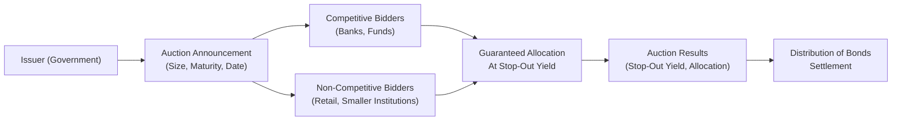

## Introduction

Auction mechanisms and syndication are two of the most critical methods issuers employ to bring new bonds to market. They help match governments or corporations wanting to raise capital (the issuers) with investors looking for stable, predictable returns. You might be thinking, “Well, how different can these two processes be?” Actually, they vary significantly in how prices are set, investor participation is managed, and how the deal is ultimately executed. 

This section explores two main routes for issuing bonds: auctions (typical for government securities and some quasi-government agencies) and syndicated offerings (often used by corporate issuers and, in certain cases, by governments too). Along the way, we’ll look at real-world examples, practical case studies, a few personal lessons learned on trading floors, and best practices to help you navigate these topics in both theory and practice. 

## Auction Mechanisms in Bond Issuance

Auctions are a primary means used by many governments—such as the US, UK, and Japan—to issue debt instruments (e.g., Treasury bills, notes, bonds). The issuer (often the Treasury or Finance Ministry) announces an auction date, the size of the offering (or a range), and the security’s maturity. Institutional investors, dealers, and sometimes retail investors, then submit bids indicating what yield or price they’d be willing to accept. 

Some of the most common government bond auction formats:

• Dutch (Single-Price) Auction  
• Multiple-Price Auction  

Price discovery in either approach is influenced by the market’s perception of inflation, central bank policy, overall investor demand, and macroeconomic data. Many governments rely on a network of primary dealers—banks or large financial institutions officially recognized for their active participation in auctions and secondary market-making—to ensure liquidity and smooth distribution of bonds.

## Dutch Auction (Single-Price Auction)

In a Dutch auction, all successful bidders (that is, those whose bids fall below or at the stop-out yield) pay the same price. The stop-out yield is effectively the highest yield (lowest price) at which the total auction amount is just filled. For instance, consider you’re an investor who has bid for a 10-year government bond at a 4.00% yield, and the final stop-out yield ends up being 4.10%. Because 4.00% is below 4.10% (meaning you were willing to accept a lower yield and pay a higher price), you get your desired allocation at the single clearing price determined by 4.10%. This “one-price-for-all” approach is intended to promote fairness and encourage bidders to bid their true valuations. 

I recall my early days as a junior analyst when I first saw this mechanism in action: there was a bit of suspense in the trading room, as we’d all guess the final stop-out yield. It ended up clearing at a surprising level—slightly higher yield than we had anticipated—a testament to the unpredictability of demand in large auctions.

## Multiple-Price Auction

In a multiple-price auction, each successful bidder pays the price corresponding to the yield they bid. If you submitted a bid at 3.90% yield (again, for a 10-year bond issuance), and your bid is accepted, you pay the price implied by that 3.90% yield. If another participant bid 4.00% and also got allocated, they pay a slightly lower price (because they demanded a higher yield), while yet another bidder might pay an even lower price for an even higher yield. 

The multiple-price format can sometimes encourage more aggressive bidding. However, it may also introduce a psychological phenomenon where less-sophisticated investors wonder if they’re overpaying relative to what others end up paying in the same auction. For some governments, administering a multiple-price auction can feel more complicated from a communications standpoint. 

## Non-Competitive Bids in Government Auctions

One neat feature of many government auctions is the non-competitive bid option. If you’re a small investor (or an institution that doesn’t want the hassle of setting a competitive rate), you can submit a non-competitive bid and be guaranteed a certain allocation at the final stop-out yield. The advantage is that non-competitive bidders don’t need to figure out the “right” yield to bid. Instead, they accept the final yield determined by the market. This ensures broader participation, including retail investors who simply want a piece of the new issue without delving into the complexities of yield calculations.

## Syndicated Bond Offerings

Whereas auctions are often associated with governments, syndicated offerings dominate the corporate bond world (and appear in certain government-issued deals, too). A syndication involves an underwriting group, typically led by one or more lead managers (often large investment banks), who market the bond to potential investors, conduct “roadshows” or investor presentations, and build a book of demand (known as book-building). 

The issuer collaborates with the lead manager(s) to decide the size of the issuance, the coupon, and the yield range. The lead manager organizes a syndicate—basically a team of banks or financial institutions that share the underwriting risk and distribution duties—to reach as many investors as possible. 

## Book-Building and Price Discovery

In syndicated transactions, the process of book-building is central to price discovery. The underwriter markets the security to institutional investors—like pension funds, insurance companies, and asset managers—and collects indications of interest. In these indications, big investors will specify how many bonds they want at various yield or spread levels. After analyzing the overall demand, the lead manager can advise the issuer on the final yield or spread over a benchmark, ensuring that the bond is not mispriced. This method is almost like an auction but done quietly in the background through direct negotiation with key investors. 

If the books are oversubscribed—meaning orders exceed the amount of bonds available—the issuer may decide to tighten the yield or increase the issue size, or both (depending on their funding and pricing objectives). If the books are undersubscribed, the issuer and lead manager might have to sweeten the yield to attract more investor interest or reduce the deal size. 

## Personal Anecdote: Roadshow Surprises

A few years ago, I tagged along on a roadshow for a regional corporate issuer that was new to the international bond market. We visited major financial centers—London, New York, Hong Kong—to pitch the credit story to institutional investors. After the pitch in London, we discovered demand was far stronger than expected. Well, that was a pleasant surprise. We ended up tightening the spread by about 15 basis points from the initial price talk, which saved the issuer a tidy sum in annual interest costs. This is the power of book-building and direct investor engagement.

## The Role of Primary Dealers and Market Participation

Primary dealers are often the keystone to ensuring robust participation in sovereign bond auctions. Governments typically maintain a list of such dealers who meet certain requirements (e.g., financial strength, demonstrated capacity to place large volumes). These dealers must bid in every auction, help distribute securities to end investors, and support the secondary market by quoting buy and sell prices. 

In syndicated deals, primary dealers can still play a role, but the lead managers and co-managers typically originate from large banks with strong corporate finance and debt capital markets divisions. The distribution networks are critical: a wide network can connect to pension funds, mutual funds, insurance companies, and high-net-worth clients globally.

## Visualizing the Auction Flow

Below is a simplified Mermaid.js diagram illustrating the flow of a government bond auction in a Dutch Auction format:

## Comparing Dutch and Multiple-Price Auctions

Below is a brief table comparing the two common auction methods:

| Aspect                    | Dutch (Single Price)                      | Multiple-Price                      |
|---------------------------|-------------------------------------------|-------------------------------------|
| Price/Yield Determination | Single stop-out yield for all winners    | Each winning bidder pays their bid  |
| Key Advantage             | Encourages sincere bidding, simpler       | Allows more granular bidding        |
| Key Disadvantage          | Some believe bidders “shave” bids         | Can be more complex for participants|
| Outcome                   | Everyone pays (roughly) the same price    | Different winners pay different prices|

## Common Pitfalls and Challenges

• Misestimating Demand: Whether in auctions or syndications, it’s easy to misjudge investor appetite. Under-subscription forces issuers to raise the yield (lower price) unexpectedly.  
• Overly Tight Timelines: Auctions happen on a set schedule for government bonds—if macro conditions shift suddenly (say, central bank surprise announcements), the final clearing yield might deviate greatly from expectations.  
• Book-Building Overhype: Sometimes, lead managers overly hype demand. Investors might scale back their orders if they suspect an inflated “order book.”  
• Market Volatility: A sharp rate movement or geopolitical shock can take place right in the middle of a bond issuance. This can have a big impact on final pricing, so underwriters need contingency plans.

## Exam Tips and Practical Advice

When you study auctions and syndications, focus on:

• Understanding how bids are submitted and how yields clear (especially the distinction between Dutch and multiple-price auctions).  
• Knowing the role of “stop-out yield” and how non-competitive bids work.  
• Appreciating the scope of book-building: how marketers “build” a book of orders and subsequently decide the final bond pricing.  
• Knowing which method is more typical for certain issuers (e.g., governments vs. corporations).  

On the CFA exam, be prepared for scenario-based questions:  
• They may show a partial order book or data on bids at various yields. You might need to calculate average price or yield in a multiple-price setting, or the single clearing price in a Dutch Auction.  
• A question might describe a corporate bond roadshow. You’d have to identify steps in the syndication process or how the final coupon is set.  
• You could be asked about the role of primary dealers in ensuring liquidity post-auction and how that might affect government financing costs.

## Conclusion

Auction mechanisms and syndication are two central paths for bond issuance in the global fixed-income market. Dutch and multiple-price auctions facilitate transparent, competitive price discovery, particularly in government markets. Syndication leverages underwriting expertise, broad investor networks, and book-building to match supply and demand for corporate or specialized government bonds. Whichever method is used, the ultimate objective is to secure funding as efficiently as possible while offering fair market-based yields to investors.

A solid grip on these processes is essential not just for the CFA exam but for practical capital market operations. Whether you’re an analyst evaluating new government auctions, a portfolio manager sizing up a new corporate issuance, or an underwriter leading a team—recognizing the nuances of auctions and syndications helps you interpret market signals, manage risk, and ultimately add value in the bond market.

## References and Further Reading

• Government auction mechanisms: U.S. Treasury Auction Methods and FAQs. Retrieved from  
  https://www.treasurydirect.gov/  
• Ross, Stephen A., Randolph W. Westerfield, and Jeffrey Jaffe. Corporate Finance. New York: McGraw-Hill.  
• Official CFA Curriculum, “Fixed Income and Debt Issuance,” accessible through the CFA Institute Learning Ecosystem.  

## Test Your Understanding: Auction Mechanisms & Syndication in Bond Issuance



### In a Dutch Auction for government bonds, which statement best describes the final pricing?
- [ ] Each winning bidder pays the price they individually bid.  
- [x] All winning bidders pay the price determined by the highest accepted yield (lowest price).  
- [ ] Non-competitive bidders pay a higher price to compensate for less risk.  
- [ ] The final price is always the midpoint of all accepted bids.  

> **Explanation:** In a Dutch Auction, also known as a single-price auction, each successful bidder pays the same clearing price based on the stop-out yield.

### Which of the following is typically a key advantage of using a multiple-price auction over a Dutch Auction?
- [ ] Less aggressive bidding.  
- [x] Ability for investors to pay the specific price that they bid.  
- [ ] Single clearing price for all bidders.  
- [ ] Increased simplicity for the issuer.  

> **Explanation:** Multiple-price auctions can allow more granular bidding because successful bidders pay according to their specific bid.

### What is the main purpose of a non-competitive bid in government bond auctions?
- [ ] To allow large institutions to dominate the auction.  
- [ ] To reduce the issuer’s borrowing cost.  
- [x] To enable smaller investors to secure an allocation at the final stop-out yield.  
- [ ] To signal the lowest acceptable yield in the auction.  

> **Explanation:** Non-competitive bids guarantee an allocation without requiring the bidder to specify a yield. They are used to broaden participation, especially for smaller or retail investors.

### In syndicated bond offerings, what is the primary goal of “book-building”?
- [ ] Determining the day-count convention for bond pricing.  
- [ ] Producing an official sales document for regulators.  
- [ ] Dividing aggregator fees among co-managers.  
- [x] Gauging investor demand and determining the bond’s final pricing.  

> **Explanation:** Book-building is the process through which underwriters and issuers collect institutional orders to set the final price or spread.

### Which statement best summarizes the rationale behind an issuer using a syndication approach rather than a public auction?
- [x] Syndication allows for active marketing and price negotiation to meet institutional demand.  
- [ ] Syndication requires less time and fewer resources than auctions.  
- [ ] Syndication is strictly limited to government bonds.  
- [ ] Syndication ensures a single, uniform clearing price for all investors.  

> **Explanation:** The syndication route often involves a more marketing-oriented approach, typically engaging underwriters to reach a wide range of investors and negotiate final pricing.

### Which of the following elements is most crucial for maintaining orderly distribution and liquidity in primary government bond auctions?
- [x] Primary dealers.  
- [ ] Non-competitive bidders.  
- [ ] Roadshows.  
- [ ] Excess supply.  

> **Explanation:** Primary dealers are critical for maintaining liquidity. Governments rely on them to place sovereign bonds, quote prices, and continuously participate in auctions.

### When government auctions are consistently undersubscribed, which outcome is the most likely?
- [ ] The issuer permanently withdraws the offering.  
- [ ] The auction is labeled a “failure,” but non-competitive bids remedy the entire shortfall.  
- [x] The issuer must offer a higher yield to attract sufficient demand.  
- [ ] The issuer extends the timing of the settlement date.  

> **Explanation:** Undersubscribed auctions typically require the issuer to accept higher yields to clear the market.

### In a Dutch Auction for new sovereign bond issuance, how is the “stop-out yield” defined?
- [ ] The average yield of all submitted bids.  
- [x] The highest accepted yield that just allows the entire issue to be sold.  
- [ ] The lowest yield bid by the largest primary dealer.  
- [ ] The yield determined by the weighted average of non-competitive bids.  

> **Explanation:** The stop-out yield is the highest yield accepted that enables the issuer to sell the total amount of bonds offered.

### What is a major risk for underwriters during the book-building process in a syndicated corporate bond sale?
- [ ] The risk that non-competitive bidders will dominate the book.  
- [ ] The risk that the issuer sets the coupon above market expectations.  
- [x] The risk of overstating investor demand, leading to inflated order books.  
- [ ] The risk that primary dealers refuse to make a market.  

> **Explanation:** Overstating demand can hinder accurate price discovery and potentially embarrass the issuer if final allocations need to be scaled back significantly.

### True or False: In a multiple-price auction, all successful bidders will pay the same price.
- [ ] True  
- [x] False  

> **Explanation:** By definition, a multiple-price (discriminatory) auction means each successful bidder pays the price/yield they bid, so winners pay different prices.


