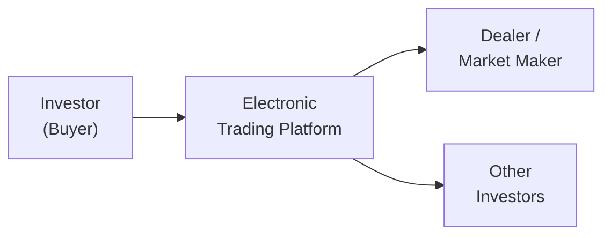

## Introduction

Market microstructure is all about the nitty-gritty of how trades get done. It dives into the actual processes and costs—often hidden from a distance—that govern the flow of buy and sell orders, the resulting bond prices, and the liquidity investors can realistically depend on. If you’ve ever tried to trade an obscure corporate bond and found yourself, well, stumbling around a bit, you’ve experienced these market frictions firsthand.

But let’s be honest: bond market microstructure can feel a bit less straightforward than, say, the equity market. There’s less centralization, less transparency in some corners, and more influence from major dealers. The good news is that understanding these mechanics can help you anticipate costs, improve trade execution, and manage risks more effectively in a fixed-income portfolio—exactly the sort of insight you’ll need for the CFA exam and your real-world practice.

Below, we’ll unpack the core elements: what drives the bid-ask spread, how transparency (or lack thereof) shapes the market, and how technology—like high-frequency trading—fits into the big picture. Along the way, we’ll sprinkle in some examples (and maybe a tale or two) to keep things grounded.

## Understanding Market Microstructure in Fixed Income

Market microstructure is essentially the study of how trading takes place. It examines the platforms, rules, and players that influence bond liquidity, price formation, and overall market efficiency. Although government bonds can trade on electronic order books resembling equity exchanges, many segments of the bond market still rely heavily on over-the-counter (OTC) negotiations. These negotiations center on a network of dealers or brokers who quote prices and match buyers with sellers.

Market microstructure research helps answer questions like:
• How is the “right” price discovered in a somewhat opaque market?  
• Why might two trades of the same bond occur at slightly different prices just minutes apart?  
• What drives bid-ask spreads to widen or narrow?  

Grasping these nuances helps you see beyond the yield quote. You learn to anticipate hidden or indirect frictions that could eat into your returns.

## Key Components of Fixed-Income Market Microstructure

### Dealers and Brokered Markets  
In many fixed-income markets, dealers stand ready to buy from or sell to investors out of their own inventories. This “principal-based” model differs from pure agency trades in equities, where exchanges match public buy and sell orders directly. Because many bonds aren’t traded frequently, dealers offer liquidity by maintaining inventories and quoting two-sided markets (bid and ask prices).

In less liquid bond segments, a single dealer’s quote might be your only price indication. That can lead to wide bid-ask spreads if there’s limited competition or if the dealer is hedging credit and duration risks.

### Electronic Trading Venues  
Electronic trading platforms have been gaining traction, especially for government bonds and major corporate issues. Though still not as dominant as in equities, these e-platforms can increase pre-trade transparency by publicly displaying quotes and trade interest from multiple dealers or investors. Some venues allow all-to-all trading—where any participant can interact with others’ quotes—which may reduce the reliance on traditional dealer intermediation.

Here’s a simple flow of how trades can move through a modern electronic platform:

### Transparency and Post-Trade Reporting  
Regulatory initiatives like FINRA’s TRACE (Trade Reporting and Compliance Engine) in the U.S. require reporting of corporate bond trades after execution. This enhances price transparency for market participants, which is generally viewed as a factor that narrows bid-ask spreads over time. Why? Because more transparent trade data reduces asymmetric information between dealers and investors. However, some argue that, for large block trades, public dissemination of trade size and price can worsen liquidity if dealers become overly cautious about the market impact of handling big orders.

### High-Frequency Trading in Bonds  
High-frequency trading (HFT) is more common in equity and currency markets, but it’s creeping into highly liquid bond sectors, such as U.S. Treasuries and European sovereign debt. Automated market makers post tight bid-ask spreads, profiting from tiny price discrepancies across venues. This can improve liquidity and reduce transaction costs for short-term, smaller trades. However, critics worry HFT might amplify volatility during stressed market conditions—creating “flash events” where prices momentarily swing wildly.

## Transaction Costs: Beyond the Bid-Ask Spread

Transaction costs in bond trading typically come from:
• Bid-ask spreads (most visible).  
• Commissions or markups charged by brokers.  
• Settlement or clearing fees.  
• Price impact (i.e., how your trade moves the market if it’s large).  

### Bid-Ask Spread

The bid-ask spread is the most straightforward cost and is especially relevant in less frequently traded (or more complex) bonds. For example, let’s say you’re buying a bond quoted at 99.50–99.80 (bid-ask). If you buy at 99.80 and immediately sell at 99.50, you lose 0.30 points—equivalent to $0.30 per $100 par value. That’s the direct spread cost, not even accounting for any commissions or slippage.

Smaller issuers or distressed securities might see spreads of 1–2 points or more, reflecting price uncertainty and limited supply-demand channels.

### Commissions, Markups, and Clearing Fees

Institutional clients often negotiate commissions or markups with brokers/dealers, but retail investors might face additional minimum fees or higher markups. Clearing fees (paid to clearinghouses that settle trades) are typically small relative to the spread but can matter in high-volume trading or if you execute many smaller transactions.  

### Price Impact

Price impact can become significant if you want to move a large block of bonds—especially in a thinly traded issue. As you flood the market with a sizable sell order, you might push the price down preemptively because dealers anticipate the extra supply. The cost difference between a small trade and a large one can be startling in illiquid bonds.

## Liquidity and Its Impact on Costs

Liquidity is, in essence, how easily and quickly you can trade a security at (or close to) its current market price. In many segments of the bond market—think municipal bonds, emerging market bonds, or complex structured notes—liquidity can be sporadic. You might go days or weeks without a single trade. So if you need to sell right away, expect a hefty discount.

As a rule of thumb:
• Lower liquidity → higher bid-ask spreads and bigger price impact costs.  
• Higher liquidity → narrower spreads and more modest market impact.  

Sometimes you’ll see a paradox: certain bonds that should be comparable (in terms of credit risk and maturity) trade differently because one is more “on the run” (recently issued, widely held, more frequently traded) and the other is “off the run.” The on-the-run bond tends to exhibit narrower spreads.

## Execution Quality and Best Practices

Execution quality boils down to how favorable—on average—a trade’s price is relative to current market conditions. To improve it, you might:
• Seek multiple quotes from different dealers.  
• Use electronic platforms that aggregate quotes, giving you more competition.  
• Break down huge block orders into smaller pieces to reduce market impact (though this can raise total commissions).  
• Time your trades to avoid peak volatility moments, such as major economic announcements.  

Also, don’t overlook the practical side of relationships: dealers often show their best prices to clients who have consistently brought them business in the past (though in some regulated markets, fairness rules may mitigate these favoritism effects).

## Technology’s Role in Shaping Market Structure

If you’re curious whether bond markets will eventually mirror the near-instantaneous trade execution of equities, the shift has already begun in some corners:

• Algorithmic Trading: Large asset managers use algorithms to slice and dice bond orders to minimize execution costs and signaling risks.  
• Direct Market Access (DMA): Some platforms let institutional clients bypass traditional dealer desks, interacting directly with the order book.  
• AI and Natural Language Processing: Tools that scan large sets of news, company filings, or macro data for signals that inform bond trades.  

Still, the diversity of issuers and the largely OTC nature in many bond markets create structural barriers to full electronification.

## Practical Example: Trading a Less Liquid Corporate Bond

Imagine a scenario: You’re holding a B-rated corporate bond that rarely trades—maybe one or two trades every week. Out of the blue, you learn some negative news about the issuer’s sector. You panic a bit and decide to sell immediately. Unfortunately, your dealer can only find one or two potential buyers, and they’re asking for a 2-point discount for immediate liquidity. Meanwhile, the “market price” from last week’s trade was higher, but that was for a tiny transaction that might not reflect current sentiment.

You call around three dealers:  
1. Dealer A quotes 96.00–98.00 (a 2-point spread).  
2. Dealer B quotes 95.75–97.90.  
3. Dealer C can't even quote right now—they're waiting for updated research.  

Given your urgent need, you might accept Dealer B’s 95.75 bid. That’s effectively a 4+ point difference from the price you might have gotten a couple of weeks ago. But in a thinly traded market, you pay for speed and execution certainty.

## Regulatory Considerations

Regulations can help or hinder bond liquidity and transparency:

• TRACE in the U.S. reveals post-trade data (price and volume) to the public soon after trades are executed. This has enhanced transparency in corporate and agency debt markets.  
• In the EU, MiFID II (Markets in Financial Instruments Directive) initiatives have aimed to raise pre- and post-trade transparency in bond markets, though with complexities around delayed reporting for large trades.  
• Capital requirements for banks (Basel III) can influence how much bond inventory dealers are willing to hold, thereby affecting liquidity.

For the CFA exam, expect to see scenario-based questions linking regulation to how market participants might alter their behavior.

## Risk Management and Market Stress

Market stresses can occur during economic shocks, credit events, or global pandemics—yes, we all remember those moments of heightened volatility. During such stress events, even once-liquid government bonds might see spreads jump as dealers step aside, uncertain about how to price risk. For corporate or emerging market bonds, the effect can be even more pronounced.

Stress events highlight the importance of robust market microstructure. Healthy amounts of capital at dealer desks, transparent reporting, and stable clearing mechanisms all help reduce the potential for abrupt liquidity freezes. That’s exactly why regulators pay close attention to how bond market microstructure evolves over time.

## Exam Relevance and Tips

In a CFA exam scenario, you might be asked to evaluate the factors influencing transaction costs for a particular bond portfolio trade, or to discuss how changes in transparency regulations shape bid-ask spreads. You could also see item sets focusing on execution quality metrics, or essay questions requiring you to recommend strategies for mitigating the impact of illiquidity (e.g., staggering trade orders, using electronic platforms, or negotiating with multiple dealers).

Keep these best practices in mind:
• Relate market structure (dealer-based vs. exchange-based) to potential transaction costs.  
• Recognize that regulation-driven transparency typically narrows spreads unless it deters liquidity providers in block trades.  
• High-frequency trading can narrow spreads but might exacerbate volatility in extreme conditions.  
• In your answers, demonstrate awareness of real-world forces—like risk aversion and inventory financing costs—that shape dealer quotes.

## References for Further Study

- CFA Institute Research Foundation, “Trading and Electronic Markets: What Investment Professionals Need to Know.”  
- FINRA Market Data Center (https://www.finra.org/) for empirical bond transaction data and regulatory reports.  
- MiFID II/ MiFIR regulatory framework for an EU perspective on transparency and market structure.  

--------------------------------------------------------------------------------

## Test Your Knowledge: Market Microstructure and Transaction Costs



### For a corporate bond trading over-the-counter, which of the following factors is most likely to increase the bid-ask spread?

- [ ] High frequency of trades and multiple active dealers
- [x] Very low trading frequency and limited dealer participation
- [ ] Transparent post-trade reporting requirements
- [ ] Strong credit ratings and stable economic environment

> **Explanation:** Limited trading frequency and fewer dealer quotes generally lead to wider bid-ask spreads due to higher inventory risk and uncertainty about the bond’s fair value.

### Which of the following statements best describes the impact of post-trade transparency systems, such as FINRA’s TRACE, on the bond market?

- [x] They improve price discovery and potentially narrow bid-ask spreads
- [ ] They increase the time required to settle trades
- [ ] They make it more difficult for investors to verify executed prices
- [ ] They have no measurable effect on bid-ask spreads

> **Explanation:** Post-trade transparency enhances information flow regarding recent trades, improving price discovery and often resulting in narrower spreads.

### A trader notices that a large, illiquid corporate bond issue is frequently quoted with a 1.5-point bid-ask spread. Which is the most direct cause of this higher spread?

- [x] Limited secondary market activity and dealer inventory risk
- [ ] Excessive central bank intervention in government bond markets
- [ ] High coupon rates and short maturity
- [ ] Presence of high-frequency trading algorithms

> **Explanation:** Infrequent trading (low liquidity) leads dealers to quote wider spreads because they face a higher risk of price movements while holding inventory.

### Which of the following best describes why high-frequency traders are more active in government bond markets than in many corporate bond markets?

- [x] Government bonds often have higher liquidity and standardized structures
- [ ] Corporate bonds typically are shorter in maturity
- [ ] Government bonds have no default risk
- [ ] High-frequency trading is not permitted in corporate bond markets

> **Explanation:** HFT thrives on high liquidity and consistent trade conventions, conditions more prevalent in government bond markets compared to the fragmented and less liquid corporate bond space.

### When markets experience significant volatility, what is the most likely outcome for bond transaction costs?

- [x] Bid-ask spreads widen as dealers seek to limit pricing risk
- [ ] Bid-ask spreads automatically narrow due to automated quotes
- [x] Execution times for large block trades may increase
- [ ] TRACE requirements are suspended to avoid distress to investors

> **Explanation:** During volatility, dealers often widen their spreads or reduce trade size commitments to manage risk. Choppy markets also slow execution times for large trades as liquidity can dry up.

### An investor seeking to minimize price impact on a large block trade in a relatively illiquid bond is most likely to:

- [x] Break the order into multiple smaller trades
- [ ] Execute everything immediately at the prevailing ask price
- [ ] Rely on a single dealer for a large, one-time quote
- [ ] Stop trading altogether, as it’s not possible to reduce price impact

> **Explanation:** Dividing the trade into smaller chunks can help spread the order flow over time, potentially reducing immediate price impact and drawing multiple counterparty interests.

### Which best characterizes the effect of enhanced market transparency on liquidity providers?

- [x] It can reduce information asymmetry, thereby incentivizing more participation
- [ ] It guarantees dealers always post narrower spreads
- [x] It may deter block trading if trade sizes are immediately disclosed
- [ ] It erodes all advantages dealers have in the market

> **Explanation:** While transparency reduces information asymmetry and can promote narrower spreads, immediate disclosure of large trades might deter block activity or force dealers to limit their risk exposure.

### How can electronic trading platforms reduce transaction costs for market participants?

- [x] By centralizing quotes and matching orders more efficiently
- [ ] By removing the need for regulatory reporting
- [ ] By limiting the number of dealers in the market
- [ ] By guaranteeing that all trades are executed at the mid-price

> **Explanation:** Electronic platforms aggregate quotes from multiple dealers and investors, facilitating price discovery and competition, which can reduce transaction costs.

### What is the impact of capital requirements (e.g., under Basel III) on bond market liquidity?

- [x] They can reduce dealer inventories, potentially widening bid-ask spreads
- [ ] They have no effect on dealer willingness to hold bonds
- [ ] They ensure narrower spreads by setting strict maximum inventory limits
- [ ] They only affect trading in equity markets

> **Explanation:** Higher capital requirements can make it more expensive for dealers to hold large inventories, which often reduces their willingness to offer tight two-sided markets, leading to wider spreads.

### True or False: High-frequency trading always narrows the bid-ask spread in corporate bond markets.

- [x] True
- [ ] False

> **Explanation:** While HFT participation can narrow spreads in highly liquid segments, it may not be present or effective in more illiquid issues. In the context of certain short-term, high-grade markets (like on-the-run Treasuries), HFT often does tighten spreads.


