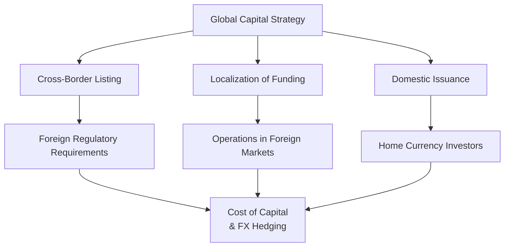

## Introduction

Cross-border listing—where an issuer floats its debt securities on a foreign exchange or in a foreign market—can be a game-changer for both large multinationals and smaller firms with global ambitions. The objective is straightforward: tap new investor bases, reduce the cost of capital, diversify risks, and sometimes even build a global corporate image. Meanwhile, “localization of funding” means raising capital in the local currencies of foreign markets where a firm actually operates, often to match currency outflows (e.g., paying local employees, building supply chains, or servicing local mortgages on property). Think of it like funding a holiday home in euros if you spend all your time in the south of France—you wouldn’t want to juggle exchange risk, or at least you’d like to minimize it.  

In practice, cross-border listing and localization of funding offer enormous benefits but also introduce additional layers of complexity, from foreign exchange risk to local regulatory compliance. I once spoke to a CFO who joked that after listing her company’s bonds in three different countries, she felt more like an international tax attorney than a finance professional. That’s not too far-fetched—navigating multiple rulebooks and exchange controls can be overwhelming. Yet, with the right strategy, the gains can outweigh the pain.  

Below, we’ll explore key motivations, mechanics, challenges, and best practices for cross-border listings, followed by how localization of funding fits into multinational funding strategy. We’ll also highlight how these concepts can play out in a Level III–style exam setting, tying them back to broader portfolio management, fixed income risk analysis, and the global regulatory environment.  

## Why Cross-Border Listing?

• Broader Investor Base: A firm offering its bonds in overseas markets often gains access to a deeper pool of investors who might have more appetite for specific risk-return profiles, particularly if the home market is limited. This may be especially true for high-yield issuers looking for pockets of demand among niche investors abroad.  

• Lower Cost of Capital: Depending on global interest rate environments and the respective credit conditions, it might be cheaper to raise money in a foreign currency (such as euros, yen, or renminbi) than in the home currency. From a purely mechanical standpoint, if domestic yields are high but yields in a foreign country are lower, an issuer might reduce its overall cost of debt by listing abroad—though you have to weigh that benefit against any new currency hedging costs.  

• Branding and Reputation: Cross-border listing can serve as a marketing tool. Your name is out there on international exchanges, your brand might become more familiar to global investors, and perceptions of transparency often rise when a firm meets a second set of listing requirements. Some CFOs find that after listing abroad, they receive more attention from institutional investors and have greater credibility in negotiations with global suppliers.  

• Diversification of Funding Sources: Relying on just a single home market can be risky. A credit crunch or economic downturn at home could restrict your access to capital. By tapping into multiple foreign exchanges or over-the-counter (OTC) markets, a firm diversifies its potential capital sources.  

• Strategic Access to Foreign Currencies: Sometimes the firm needs funding in the foreign currency to invest in local projects—this is where cross-border listing merges with localization. If your manufacturing subsidiary is in Mexico, for instance, it might make sense to raise pesos through a local issuance on the Mexican Stock Exchange.  

## Localization of Funding: The Next Step

Localization of funding goes hand in hand with cross-border listing, but it’s a slightly different concept. Instead of just “listing in foreign markets,” it focuses on “sourcing capital in the currencies or markets where operations exist.” This can be more cost-effective over the long run—imagine building a factory in Malaysia while servicing ringgit debt with ringgit revenues. You bypass a good chunk of currency mismatch risk.  

Localization is especially relevant when:

• The company has a large operating presence overseas that generates local-currency revenues to service local debt.  
• There are interest rate arbitrage opportunities in local fixed income markets.  
• The local currency is expected to strengthen, and the issuer wants to hedge or partially hedge that risk by borrowing in that currency.  
• The issuer wants to establish a standing relationship with local regulators, investors, and counterparties for future expansions or acquisitions.  

## Key Regulatory and Disclosure Requirements

One of the biggest hurdles in cross-border listings is compliance with foreign disclosure standards. Exchanges in various countries, from London Stock Exchange to the Singapore Exchange, have their own listing rules, ongoing compliance frameworks, and corporate governance codes. 

• Disclosure and Transparency: Firms must typically produce financial statements in alignment with IFRS or local GAAP, along with detailed prospectuses that meet the host market’s standards. A discrepancy arises if your home country uses U.S. GAAP or IFRS that slightly differs from the version the host jurisdiction recognizes.  

• Regulatory Approval: Expect thorough scrutiny from regulatory bodies, such as the U.S. SEC, the U.K. Financial Conduct Authority (FCA), or similar authorities worldwide. Approvals can take many months, and you have to comply with rules around insider trading, major shareholding disclosure, and ongoing corporate reporting.  

• Cross-Registration or 144A Offerings: In some cases, you can list debt in the U.S. under Rule 144A if you meet certain institutional investor requirements. This is popular among international issuers who want to tap U.S. institutional capital without meeting the full rigors of a public SEC-registered offering.  

• Investor Relations and Communication: Publication of annual and interim reports in a language accessible to local investors may be mandatory. The heightened communication demand can be a challenge for smaller companies that lack robust investor relations (IR) teams.  

Let’s visualize this in a simplified workflow:

## Motives for Localization of Funding

Localization isn’t just about matching currency outflows—though that’s a major factor. In practice, you might see any combination of:  

• Mitigating FX Volatility: By fundraising in the currency of your future expenditures, you reduce the risk of exchange rate fluctuations eroding your margins or undermining your ability to service debt. If you’re earning euros, you’d rather owe euros.  

• Political and Regulatory Considerations: Some governments encourage local issuances through preferential tax treatment or by relaxing certain regulatory constraints. Others impose capital controls giving domestic issuance a clear advantage in bringing money in (and sometimes not letting it easily flow out again).  

• Tapping Into Specialized Investor Appetite: Some local bond markets have distinctive investor clienteles. For instance, pension funds in certain emerging markets have mandates to invest in local-currency corporate bonds. If you list locally, you open the door to that captive capital.  

• Portfolio Effects & LDI Strategies: From an institutional manager’s vantage point (e.g., pension funds, insurance companies), local currency debt can be convertible into a stable income stream that matches local liabilities, facilitating liability-driven investing (LDI).  

## Potential Challenges and Risks

### 1. Foreign Exchange Risk

Naturally, the biggest worry is: “What if the exchange rate moves against me?” For instance, imagine a U.S. firm listing in the eurozone. If revenues remain largely in USD while debt service is in EUR, any substantial appreciation of the euro can bite into the company’s profit margin. Many of these risks can be hedged with cross-currency swaps or forward contracts, but those add costs.  

### 2. Regulatory and Political Risk

Rules change, particularly in emerging markets. If a local regulator decides to impose new constraints—maybe capital controls or sudden shifts in repatriation rules—you could find your funds locked up. Political instability can also make local issuance more complicated.  

### 3. Tax Complexities

Tax treaties, double taxation, withholding taxes—these issues can significantly affect the net cost of debt. Timely repatriation of profits is often subject to local tax laws. During exam-style questions, expect to parse through scenarios comparing overall costs after factoring in cross-border transfer taxes or local withholdings on coupon payments.  

### 4. Liquidity Constraints

A local market may not be as liquid as the issuer’s home market. This can manifest in higher bid-ask spreads, limited secondary market activity, and overall higher transaction costs. Over time, illiquidity can erode some of the cost-of-capital advantages if bondholders demand a premium.  

### 5. Market Sentiment and Brand Attachment

“Foreign firm” might still raise eyebrows among local investors, especially if they’re more comfortable investing in domestic names. Overcoming that sentiment may require additional marketing, lower pricing, or other sweeteners like high coupon rates.  

## Case Study: Latin American Expansion

Imagine a mid-sized U.S. construction conglomerate, InfraBuild Co., planning to expand into Brazil. They decide to issue Brazilian real-denominated bonds in São Paulo (BM&FBOVESPA) for two main reasons:  

• They need BRL funding to pay local suppliers, contractors, and employees.  
• Brazilian investor appetite for infrastructure bonds is strong, buoyed by local pension funds seeking stable, long-term yields in BRL.  

InfraBuild Co. files the relevant disclosures per Brazil’s CVM (Comissão de Valores Mobiliários), adapts its financial statements to IFRS with a local GAAP reconciliation, and meets all the prospectus requirements. 

The final coupon is set at 8.5%, which is quite competitive compared to high USD rates at home (given global macro conditions, let’s just say the U.S. rate environment is around 9% for similarly rated corporates). Fees are also slightly lower than in New York. InfraBuild Co. hedges around 30% of the currency risk with cross-currency swaps, given it still has partial revenues in USD.  

A year later, the CEO claims the move saved around 100 basis points in overall cost, plus established brand recognition in the local market. However, the finance team initially struggled with the tax intricacies; the local withholding rules for corporate coupons turned out more complicated than they expected. If you were analyzing this for a CFA Level III exam question, you might be asked to compute the after-tax yield, factor in cross-currency swap costs, and evaluate the net advantage of this cross-border listing strategy.  

## Strategies to Manage FX and Political Risks

• Currency Hedges: Forward contracts or cross-currency interest rate swaps to lock in exchange rates or manage interest rate differentials.  

• Local Partnerships: Partner with local firms or create a joint venture. Sometimes local sponsors can mitigate political/regulatory risk.  

• Diversification: Issue debt in multiple currencies to spread the risk, especially if your revenues are also diversified.  

• Diplomatic and Reputational Steps: Building a track record of compliance, forging local philanthropic initiatives, or engaging with local regulators can smooth the path for future transactions.  

## Cross-Border Listing, Portfolio Management, and LDI

From a portfolio management perspective—especially for institutional investors—cross-border listings introduce an expanded investable universe. A domestic fixed income portfolio that only invests in local bonds might see reduced diversification benefits, while cross-border issuance in an index can create new opportunities for alpha generation and risk mitigation.  

Meanwhile, liability-driven investors (LDI) such as pension plans often aim to match liabilities denominated in multiple currencies. Accessing cross-border corporate or government bonds that match these currency liabilities helps them hedge. For example, if a European pension plan has obligations to retirees living in Latin America, it might prefer local-currency Latin American corporate bonds.  

## Diagram: Linking Cross-Border Listing to Overall Capital Strategy

## Common Pitfalls and Best Practices

• Underestimating Regulatory Timelines: Some firms assume approvals will be quick. Delays can be costly if you miss windows of favorable interest rates.  

• Over-Reliance on Short-Term Hedges: Hedging currency exposure is typically a recurring cost. If firms don’t plan for rolling these hedges or structuring them appropriately, they might get caught by a big currency swing mid-tenure.  

• Limited Investor Relations Efforts: Firms sometimes fail by not cultivating trust with the foreign market’s investors. Investor roadshows, local media outreach, and ongoing disclosure updates can help.  

• Inadequate Tax Planning: It’s crucial to analyze net-of-tax yields, double taxation treaties, and repatriation constraints.  

## Exam Tips for CFA Candidates

• Show Your Calculations: If asked to compare the cost of capital across multiple currencies, break it down to show nominal yield, expected exchange rate movements, and hedging costs.  

• Incorporate Scenario Analysis: The exam might include interest rate changes or currency shifts. Show how each scenario impacts after-tax returns or debt service capabilities.  

• Think About Risk and Return Holistically: Cross-border listing can reduce certain costs but may amplify currency or regulatory risk. State these trade-offs clearly.  

• Address Ethical and Professional Standards: Cross-border deals often raise disclosure and fair dealing concerns (CFA Institute Code of Ethics and Standards of Professional Conduct). For instance, you should treat all investors fairly in terms of receiving critical factual information.  

• Remember LDI Approaches: Understand how cross-border bond issuance can fit into an LDI framework. If a sponsor has liabilities in multiple currencies, local-currency issuance could lower mismatch risk.  

## References and Further Reading

• Eiteman, D. K., Stonehill, A. I., & Moffett, M. H. (2021). Multinational Business Finance. An essential reference for the intricacies of cross-border financial structures.  
• World Bank (https://www.worldbank.org/). Offers extensive data on international capital flows and cross-border bond issues, plus country-by-country regulatory info.  
• CFA Institute Level III Curriculum (Fixed Income and Risk Management sections). Detailed coverage of multi-currency fixed income strategies, currency risk management, and yield curve analysis.  

--------------------------------------------------------------------------------

## Test Your Knowledge: Cross-Border Issuance and Localization Strategies



### Which of the following is the primary motivation for a firm to list its bonds on a foreign exchange?

- [ ] To avoid all regulatory compliance in its home country.  
- [x] To tap into broader and potentially cheaper sources of capital.  
- [ ] To eliminate all forms of currency and political risk.  
- [ ] To shield corporate operational data from investor scrutiny.  

> **Explanation:** One of the chief advantages of cross-border listings is capturing a broader investor base and potentially reducing funding costs. Regulatory scrutiny often increases rather than decreases with a foreign listing, and currency or political risks are not automatically eliminated.

### In cross-border debt issuance, what key challenge arises from sourcing funds in a different currency while having revenues in the home currency?

- [ ] Lower financing costs at all times.  
- [ ] The need for fewer financial disclosures.  
- [x] Exposure to foreign exchange fluctuations that can impact coupon and principal payments.  
- [ ] Guaranteed stronger demand for the issuer’s bonds.  

> **Explanation:** When there is a currency mismatch between revenues and debt obligations, the issuer faces FX risk. Hedging can offset part of this risk, but it adds cost and complexity.

### Which of the following best describes localization of funding?

- [ ] Raising capital exclusively from institutional investors in the home country.  
- [ ] Issuing equity shares to foreign investors but restricting proceeds to only be spent at home.  
- [x] Securing funds in local markets and currencies where the company operates to match revenues and expenses.  
- [ ] Creating a synthetic currency position using derivatives without a formal issuance.  

> **Explanation:** Localization of funding refers to obtaining financing in the local markets and currencies, aligning with operational cash flows in those locales.

### A multinational corporation (MNC) is considering a cross-border listing. Which benefit most directly enhances the corporation’s brand?

- [ ] Use of different accounting standards for each listing.  
- [x] Increased visibility and credibility through listing on a major foreign exchange.  
- [ ] Elimination of market risk in the home country.  
- [ ] Reduced translation risk on consolidated statements.  

> **Explanation:** Listing on a recognized foreign market often elevates a company’s profile and global brand perception, while risk elimination is never guaranteed.

### An issuer with significant overseas operations primarily wants to minimize its foreign exchange risk exposure. Which strategy aligns best with this goal?

- [x] Issuing debt in the same currency as the firm’s local operational cash flow.  
- [ ] Issuing debt in the home currency, irrespective of local revenue currency.  
- [ ] Settling all transactions in U.S. dollars regardless of market location.  
- [ ] Engaging no hedging contracts and relying purely on spot markets.  

> **Explanation:** Aligning debt currency with operational revenues helps naturally hedge currency risks by matching cash inflows and outflows.

### Which of the following issues often complicates cross-border debt issuance?

- [x] Varying regulatory requirements and potentially lengthy approval processes.  
- [ ] An automatic discount in bond prices due to foreign investor skepticism.  
- [ ] Complete elimination of interest rate risk once listed overseas.  
- [ ] Excessively simplified tax structures in foreign jurisdictions.  

> **Explanation:** One of the biggest complexities is navigating different regulatory regimes with potentially lengthy and stringent approval processes.

### A U.S. firm issues euro-denominated bonds but does not hedge its euro exposure. Which of the following is a TRUE statement regarding potential outcomes?

- [x] If the euro appreciates against the dollar, the firm’s effective cost of debt service increases in dollar terms.  
- [ ] If the euro depreciates, the firm’s dollar cost of debt service will increase.  
- [ ] Currency movements do not affect coupon payments for euro bonds.  
- [ ] The issuer can easily renegotiate coupon rates after issuance.  

> **Explanation:** Without hedging, an appreciating euro means the firm must spend more dollars for coupon and principal payments.  

### Which measure can help a foreign issuer build local investor confidence?

- [ ] Reducing all public disclosures to avoid confusion.  
- [ ] Bypassing local rating agencies.  
- [x] Adopting host-market disclosure standards and engaging in regular investor communications.  
- [ ] Ignoring local underwriting standards in favor of home-market rules.  

> **Explanation:** Aligning with local market disclosure norms and communicating openly bolster investor trust and acceptance.

### How might a multinational enterprise manage political or regulatory risk associated with cross-border funding?

- [ ] Rely solely on home-country diplomatic interventions.  
- [x] Form strategic joint ventures with local partners who better understand and navigate local regulations.  
- [ ] Declare immunity from local laws in the bond indenture.  
- [ ] Disregard capital controls because cross-border listings override them.  

> **Explanation:** Forming partnerships or joint ventures in the host country often mitigates regulatory and political risk by leveraging local expertise and relationships.

### When evaluating cross-border listings in a Level III exam context, which of the following is MOST essential to include in your analysis?

- [x] Scenario-based calculations of total costs, including hedging, tax considerations, and ongoing disclosures.  
- [ ] Avoiding mention of any exchange rate fluctuations to simplify calculations.  
- [ ] Offering purely qualitative discussion with no numerical detail.  
- [ ] Immediately concluding that cross-border listings are always cheaper.  

> **Explanation:** Depth of analysis with scenario-based calculations and recognition of all relevant costs (hedging, taxes, compliance) is crucial to a robust Level III–style answer.


