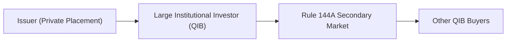

## Introduction

Private placements can feel a bit like an exclusive gathering—only a signed invitation gets you in. But that exclusivity doesn’t exist just for fun. These deals allow companies to raise capital by selling securities to a select group of investors, often large institutions, accredited individuals, or so-called Qualified Institutional Buyers (QIBs). Because they don’t require a full-blown public offering, private placements can happen faster and stay out of the public eye. However, the trade-off is reduced liquidity and higher risk for the investors. In the United States, Rule 144A has come to the rescue by providing a secondary market mechanism for these private deals, giving QIBs more freedom to trade among themselves.

Anyway, let’s dig into the nuts and bolts of private placements and the Rule 144A market, taking a slight informal approach, because let’s face it—reading through reams of regulatory text can sometimes be mind-numbing. I hope to make it a bit more approachable.

## The Nature of Private Placements

A private placement is a company’s direct sale of debt or equity securities to a limited number of private (often institutional) investors without the need for a public offering. This might be done by a startup searching for initial capital or an established firm that wants to dodge the complexities and potential scrutiny of a public issuance.

Companies that use private placements can range from mega-corporations to smaller businesses. For instance, I once got a peek at a small manufacturing firm’s private placement: This company needed fresh capital for new machinery. Rather than doing an IPO or even a bond issuance in the public market, they offered a short-term note to a few local pension funds. The legal docs were fewer and simpler (though still not exactly bedtime reading), and the investors got a slightly higher yield due to the bigger perceived risk.

### Key Terms

• Private Placement: A non-public issuance of securities sold to a limited group of investors (e.g., institutional buyers, accredited individuals).  
• Accredited Investor: In many jurisdictions, these are investors who meet certain net-worth or income thresholds and are deemed sophisticated enough to handle potentially higher risks.  
• Liquidity Risk: The risk that a holder can’t sell the security promptly without taking a significant price hit.  

## Why Companies Choose Private Placements

1. Faster Process: Without needing to issue a public prospectus or register with certain regulatory bodies, a private placement can be arranged more quickly—helpful if a company wants funding right now.  
2. Lower Disclosure Requirements: Private placements often require less-detailed financial disclosures. This helps preserve confidentiality around strategies, product lines, or expansion plans.  
3. Flexibility in Structure: Since you’re dealing directly with investors, you can craft more tailored agreements—maybe embed special covenants or adjust the coupon schedule.  
4. Avoiding Market Volatility: If the public markets are choppy, a private deal can circumvent the drama (though of course, you often give up something in pricing or yield).

On the flip side, let’s not ignore the potential downside. Sure, from the issuer’s perspective, fewer disclosures might be an advantage, but from an investor’s point of view, that also means more risk because you do less independent verification. Plus, the security may be illiquid if you ever want out.

## The Mechanics of a Private Placement

The simpler documentation and the direct negotiations usually mean private placements come together more directly. Rather than going on a “roadshow,” an issuer (often with an investment banker’s assistance) will pitch the security to a smaller circle of investors who meet certain regulatory and financial requirements. The terms can be hammered out in-person, over calls, or by email from lawyers—there’s no big marketing blitz.

Because of narrower distribution, the deal might require a higher yield to compensate for illiquidity or less transparency. Once placed, the securities can’t simply trade on a public exchange—after all, they are privately offered. This is where Rule 144A can be a game-changer, so let’s talk about that next.

## An Overview of Rule 144A

In the U.S., Rule 144A was introduced by the Securities and Exchange Commission (SEC) to provide a “safe harbor” for the resale of privately placed securities among QIBs. Under this rule, QIBs can trade these securities among themselves without sinking into the regulatory quicksand that usually accompanies non-registered securities transactions. 

In short, if you’re a QIB, such as a mutual fund or pension fund with at least $100 million in securities under management, you’re allowed to buy and sell 144A securities fairly easily. This fosters a secondary market for otherwise illiquid private placements, adding a shot of liquidity—though we shouldn’t overstate that liquidity; it’s still nowhere near the hustle and bustle of a public exchange.

### QIB Criteria

Qualified Institutional Buyers are large entities that meet specific thresholds, typically:  
• At least $100 million in securities under discretionary management (for most institutions).  
• Registered broker-dealers with at least $10 million in securities owned or managed.  

The thinking is that these big guys (and gals) presumably have the sophistication and resources to analyze risk and handle limited disclosures. So, hey, the SEC is basically saying: “If you can handle it, go for it.”  

## Real-World Example of Rule 144A

Imagine an issuer—a mid-sized software company—wants to raise $200 million quickly without making all the company’s data public. They do a private placement with large institutional investors (like insurance companies and hedge funds). These institutions, all QIBs, take sizable chunks of the offering. Then, if after a few months a big hedge fund decides it needs to reallocate capital and no longer wants that software firm’s note, it can sell the position to another QIB via a Rule 144A-compliant broker-dealer. 

This transaction happens more smoothly than a typical private resale would, thanks to Rule 144A’s safe harbor. Of course, the security is still not open to every investor—only the QIB crowd. But from the hedge fund’s perspective, any liquidity is better than no liquidity.

## Documentation and Due Diligence

Yes, private placements tend to reduce certain formalities compared to a public offering, but it’s not a lawless frontier. Documents like the private placement memorandum (PPM) layout the key deal terms, risk factors, financial data, business models, and so forth. Investors absolutely demand that the issuer provide enough clarifying information to inform the deal.

Due diligence is a big part of these transactions. Without the robust disclosures of a publicly filed document, QIBs have to do their homework—analyzing everything from the issuer’s financial statements (audited or sometimes unaudited) to their corporate governance. If the private placement is cross-border (say, a foreign issuer tapping U.S. QIBs), it can add extra complexities like currency risk or local legal frameworks.

## Regulatory Considerations Beyond the U.S.

While Rule 144A is U.S.-centric, the concept of privately placed debt or equity extends worldwide. In the EU, for example, there are private placement frameworks like the Euro Private Placement. The specific rules differ, but the general pattern is the same: a small circle of investors is invited, with less regulatory friction but also less liquidity and more risk.

As a global investor, you’d want to look at how local rules define a “private offering” or sophisticated investor. Some markets are more flexible, while others require more extensive documentation. Nonetheless, the fundamental dynamic is consistent: privately placed securities typically have less liquidity, fewer mandatory disclosures, and they rely on investor sophistication to fill those gaps.

## Liquidity and Trading

Typically, private placements don’t offer a robust secondary market, especially if there’s no mechanism like Rule 144A to facilitate trading between major institutions. But with Rule 144A, QIBs have a recognized platform to buy and sell these securities among themselves:

As you can see, the presence of this “144A Secondary Market” node opens up a route for QIBs to transact among themselves. Without it, many private placements would be locked up until maturity or forced to rely on complicated resale exemptions.

## Typical Investors and Use Cases

• Insurance Companies: Often invest in private placements to grab slightly higher yields than they might get in publicly traded investment-grade issues, while still aiming to stay comfortable on the credit risk side (depending on the deal).  
• Pension Funds: Some actively look for stable yield instruments and might be okay with locking up capital longer.  
• Hedge Funds: Might want short-term or medium-term opportunities in private deals if they see a chance for decent returns or if they’re comfortable with deeper credit analysis.  

From an issuer’s viewpoint, private placements are popular for simply bridging financing gaps, funding expansions, or even acquisitions. Schools, hospitals, and municipalities have also used private placements to raise money in a more streamlined way.

## Advantages and Challenges

### Advantages
• Speed: Fewer regulatory hurdles often mean faster fund-raising.  
• Confidentiality: The public gets less insight into sensitive business details.  
• Flexible Structures: Terms can be tailored to a smaller group’s needs.  

### Challenges  
• Higher Funding Costs: Investors demand higher yields for lesser liquidity and fewer disclosures.  
• Limited Liquidity: These instruments can be harder to sell or value.  
• Regulatory Complexity: Even though it’s less than a public offering, the due diligence process and legal structuring can be complex.  

## Risk and Return Dynamics

If you’re analyzing these securities for a fixed-income portfolio, you need to weigh credit risk, interest rate risk, and especially liquidity risk. Many private placements come with higher yields compared to publicly traded bonds of a similar credit profile, reflecting that an investor can’t easily exit. This yield “boost,” in theory, compensates you for the unique risk exposures.

For some exam-style context, you might see a question that asks you to compare the yield on a 10-year public bond from the same issuer to a 10-year private placement. The private placement might have an extra 40–50 basis points (or more) to account for the illiquidity premium. Over time, this difference can be significant.

## Pitfalls to Avoid

• Overlooking Covenant Details: Private placements might have special clauses that significantly alter credit risk.  
• Underestimating Liquidity Constraints: It’s not a typical bond you can sell in a flash. Even with Rule 144A, liquidity is limited to QIBs.  
• Failing to Do Sufficient Due Diligence: Fewer standard disclosures can hide issues. If you’re used to publicly available data, adjusting your research approach is essential.  

## Best Practices

• Diversify: Private placements can be attractive in yield terms, but holding too much can create a portfolio liquidity crunch.  
• Stay Updated on Credit Quality: Ongoing monitoring is crucial because you often don’t have daily updated public filings.  
• Evaluate Secondary Market Options: Check Rule 144A or other local mechanisms to gauge potential liquidity.  

## Brief Anecdote 

Long ago, I chipped in on a due diligence team for a private issuance from a real estate developer. Everything looked straightforward. The meltdown came when we discovered halfway through that half the developer’s land was entangled in a zoning dispute. Public reporting might have forced earlier disclosure, but in a private placement, it wasn’t so front and center. That near miss taught me that you have to roll up your sleeves on every single detail—there’s no hand-holding from the public market or from a big-time underwriter’s standard prospectus.

## Exam Applications

Within a CFA-style context, private placements and Rule 144A might come up on exams in the form of:

• Calculations requiring you to distinguish yield differences between public issues and private placements.  
• Liquidity risk scenarios analyzing how an investor’s required return changes if a security has limited secondary market potential.  
• Credit analysis vignettes focusing on how limited disclosure affects risk assessment.  
• Potential integrated cases where you dissect a portfolio’s asset allocation that includes a private placement and you must measure its effect on the portfolio’s overall risk/return.  

## Final Thoughts

Private placements fill a special niche in the fixed-income universe. They let issuers tailor deals to smaller pools of investors, often more quickly and less publicly. Meanwhile, investors confront higher risk—but sometimes higher returns as well. Rule 144A helps bridge the liquidity gap by carving out a marketplace for QIBs to trade among themselves. Is it perfect? Definitely not, but it offers a partial solution for those comfortable with the unique trade-offs. In short, keep your eyes open and do the research—private placements can be rewarding if you know exactly what’s behind the curtain.

## References and Further Reading

• SEC Rule 144A guidelines:  
  https://www.sec.gov/rules/final  
• SIFMA (Securities Industry and Financial Markets Association) resources on private placements:  
  https://www.sifma.org  
• CFA Program Curriculum, Fixed Income sections on issuance, markets, and regulations (CFA Institute)  
• Various global private placement frameworks, e.g., Euro PP (European Private Placement)  

## Private Placements and Rule 144A Market Exam-Style Practice Questions



### Which of the following best describes a private placement?

- [x] A non-public issuance of securities targeted to a select group of institutional or accredited investors.
- [ ] An initial public offering of equity shares on a national exchange.
- [ ] A publicly traded bond registered with the SEC and rated by major rating agencies.
- [ ] A mandatory offering to all shareholders of record.

> **Explanation:** Private placements are non-public issuances directed to select groups, which require fewer disclosures than public offerings.

### Relative to public offerings, private placements:

- [x] Can have fewer regulatory requirements and less required documentation.
- [x] Often command higher yields due to illiquidity and risk factors.
- [ ] Offer seamless liquidity comparable to publicly listed bonds.
- [ ] Usually require extensive global rating agency coverage.

> **Explanation:** Private placements typically have fewer disclosure requirements and lower liquidity. To compensate, issuers often offer higher yields.

### Which investor type is most commonly involved in purchasing Rule 144A securities?

- [ ] Retail investors seeking stable returns.
- [ ] Individual day traders operating through online platforms.
- [x] Qualified Institutional Buyers (QIBs) that meet certain asset thresholds.
- [ ] Accredited individuals with annual incomes exceeding $50,000.

> **Explanation:** Rule 144A securities can only be sold to QIBs, which are institutional investors with significant assets under management.

### When an issuer decides to do a private placement instead of a public offering, the primary reason is often:

- [ ] They want broader distribution of their securities to retail investors.
- [x] They prefer a faster, less public means of raising capital with streamlined documentation.
- [ ] They seek to comply with stricter disclosure obligations.
- [ ] They intend to list on a major stock exchange.

> **Explanation:** Private placements enable companies to quickly raise funds while keeping the details more confidential and limiting the investor base.

### In a Rule 144A transaction, the key benefit is:

- [ ] No documentation or disclosure is required at all.
- [ ] Retail investors can trade the security freely on a national exchange.
- [x] Enhanced liquidity among large institutional investors who can trade privately placed securities among themselves.
- [ ] Public registration requirements become stricter.

> **Explanation:** Rule 144A improves the secondary market for private placements by permitting QIBs to resell privately placed securities to other QIBs, enhancing liquidity within that subset of the market.

### How does Rule 144A generally mitigate liquidity risk for private placements?

- [x] By providing a recognized secondary market for QIBs to trade these securities.
- [ ] By allowing securities to be sold to any individual with a brokerage account.
- [ ] By disclosing all financial metrics to the general public in real time.
- [ ] By converting private placements into public market listings automatically.

> **Explanation:** Rule 144A doesn't eliminate illiquidity but does offer a mechanism for large, sophisticated investors to trade these securities.

### Which of the following is a potential disadvantage for issuers using private placements?

- [ ] Faster funding process.
- [x] Higher yield cost relative to compared public market issuances of similar credit quality.
- [x] Restricted liquidity for investors.
- [ ] Broader marketing to retail investors.

> **Explanation:** While private placements are often quicker to execute, the issuer typically has to offer investors higher yields to account for the more limited liquidity and disclosures.

### A primary reason that private placement documentation is usually less extensive than that of a public offering is:

- [ ] Overreliance on rating agencies to conduct due diligence.
- [x] Fewer regulatory disclosure requirements, given the limited investor base and exemption from public registration.
- [ ] The SEC’s regulation mandating minimal documentation for all bond issuances.
- [ ] Public listing rules automatically apply.

> **Explanation:** Private placements don’t require the same level of disclosures and registration as public offerings because they are sold to a restricted group of investors.

### Suppose an investor purchases a private placement bond through a Rule 144A offering. The investor’s biggest ongoing concern is likely:

- [ ] Low risk of default because private placements are typically guaranteed by governments.
- [x] Limited liquidity if they need to sell the bond, despite the secondary market for QIBs.
- [ ] Excessive regulatory obligations requiring frequent disclosures.
- [ ] The bond is subject to daily price transparency on a major exchange.

> **Explanation:** Even with 144A facilitating some secondary trading, private placements remain relatively illiquid and less transparent.

### True or False: Under Rule 144A, a retail investor with no special qualifications can normally buy and sell the private placement securities directly.

- [ ] True
- [x] False

> **Explanation:** Rule 144A restricts trading of privately placed securities to QIBs that meet specific institutional asset thresholds.


