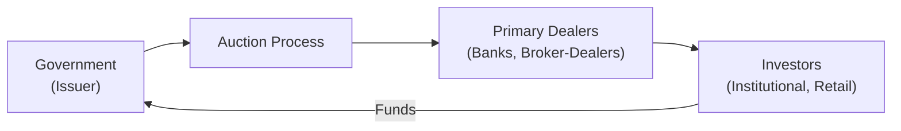
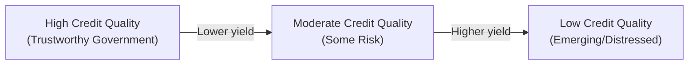

## Introduction
Sovereign debt—often described as bonds or notes issued by national governments—plays a pivotal role in the global financial markets. You might even say these instruments set the tone for all other debt in the economy. They’re typically used to raise money for public expenditures such as infrastructure development and social programs. However, they also anchor interest rates, set benchmarks for broader fixed income pricing, and act as a “risk-free” barometer against which other securities are often measured.

There’s a reason so many observers call U.S. Treasury securities the “risk-free asset.” Of course, nothing in finance is truly zero-risk, but due to the U.S. government’s strong economic standing and reliable tax revenue, markets generally treat these bonds as free from default risk. Anyway, let’s dive into the world of sovereign debt—both advanced and emerging market sovereign bonds—and explore issuance methods, maturities, credit considerations, and everything in between.

## Why Governments Issue Sovereign Debt
It might seem obvious, but governments don’t just print money and hope for the best. They issue bonds (or other forms of debt instruments) to finance:

• Infrastructure projects (roads, schools, health facilities)  
• Government services (social programs, defense, public welfare)  
• Budget deficits that arise when expenditures outpace revenues  
• Refinancing of maturing obligations to manage their liabilities over time  

Governments also use sovereign debt to support broader policy objectives: you’ll see central banks use bond issuance and buyback operations to influence liquidity conditions, inflation, and sometimes even exchange rates.

## Key Characteristics and Market Role
Sovereign debt can come in an array of shapes and sizes:

• Short-term bills (like 3-month, 6-month T-bills)  
• Medium-term notes (2-year, 5-year, etc.)  
• Long-term bonds (10-year, 30-year, or even 50-year in some countries)  

The yield on such securities is generally considered a reflection of the country's economic outlook, inflation forecasts, and perceived credit risk. Governments that issue in their own currency (especially if they have strong monetary policy frameworks) tend to carry lower credit risk compared to those issuing in a foreign currency or with weaker economic fundamentals.

Sovereign bonds often serve as reference points— benchmarks—for pricing other bonds. For instance, a 10-year government bond yield might serve as the yardstick for determining appropriate yields on 10-year corporate bonds or municipal bonds in that same market. And this reference extends well beyond national borders: if you’re analyzing global debt, you’ll typically compare yields to major sovereign benchmarks like U.S. Treasuries or German Bunds.

## Credit Quality and Risk Factors
A government’s ability to repay its debt depends on its:

• Economic performance (GDP growth, unemployment, productivity)  
• Tax base and policy (tax collection efficiency, reliable revenue streams)  
• Governance structure (political stability, low corruption)  
• Debt track record (history of timely repayment or restructuring)  
• Monetary policy framework (independence and credibility of the central bank)  

This is why countries with robust institutions and governance—like the United States, Germany, or Japan—can borrow at lower rates. Meanwhile, emerging market issuers (think Argentina or Turkey) might face higher yields to compensate investors for higher risks, including currency volatility and possible default scenarios.

You know, it’s interesting: when rating agencies assign a credit rating to a national government, they pour over those macroeconomic indicators, fiscal policies, external debt levels, and political dynamics. A sudden shift in political leadership or unexpected economic turbulence could put credit ratings at risk.

## Local Currency vs. Foreign Currency Bonds
Sovereign debt may be issued in the country’s local currency or in a foreign currency. Examples of foreign currency debt might include a developing nation issuing USD- or EUR-denominated bonds. The local-currency issuance is typically seen as safer—for the government—because the issuer controls the printing press for its own currency. However, local investors might still fear inflation risk if the government is too ready to print money for redemption. Foreign-currency debt can be more perilous for the issuer if its local currency depreciates significantly, making repayment more expensive in local terms.

## Maturities and Structures
Maturities of sovereign bonds can be short, medium, or long. Some countries even issue “century bonds” that mature in 100 years—an awe-inspiring notion if you think about how the next generation will be dealing with that debt. Meanwhile, structures can vary:

• Zero-coupon government securities (like certain discount T-bills and STRIPS in the U.S.).  
• Serial bonds that pay down principal gradually.  
• Fixed or floating-rate notes that tie coupon rates to a reference index.  
• Inflation-linked bonds (the U.S. TIPS or UK’s Inflation-Linked Gilts), adjusting coupons and/or principal for inflation.  

## Market Perceptions and Yield Dynamics
Investors typically see high-grade sovereign debt (like U.S. Treasuries, German Bunds, or Japanese Government Bonds) as providing a “risk-free rate.” In practice, the yield on these bonds is considered a baseline from which other risk premia are stacked. In other words, a corporate bond paying 5.5% might be offering 2% above a comparable sovereign yield at 3.5%.

In emerging markets, sovereign yields reflect perceived economic and currency instability. If you check the yield on a 10-year bond from an emerging economy, you might see a fairly large spread compared to, say, a 10-year U.S. Treasury. Investors demand that extra yield to compensate for country-, currency-, and credit-specific risks. It’s the old “no free lunch” adage: higher yield typically means higher risk.

## How Governments Issue Sovereign Debt
Issuance conventions vary—some rely on auctions, others use a syndication process.

• Auction Process: Many countries (for example, the United States) conduct regular auctions. In a multiple-price auction, winners pay the price they bid. In a uniform-price (Dutch) auction, everyone pays the cut-off yield price.  
• Syndication: Some governments (the UK, for instance, in certain circumstances) use a syndicate of banks to place new bonds in the market, particularly for large or complex offerings.  
• Tap Issuance: Countries might reopen (“tap”) an existing bond issue, adding to its outstanding size, which can help boost liquidity.  

If you’re ever studying yield curve data, it’s super helpful to understand how a sovereign’s primary issuance process affects coverage ratios, auction tails, and secondary market liquidity.

Here’s a simple Mermaid diagram to illustrate how money flows in a typical auction-based issuance:



In this flow:  
1) The government announces a new bond issue and holds an auction.  
2) Primary dealers or designated banks submit bids.  
3) The bond gets allocated.  
4) Investors ultimately provide the funds, which flow back to the government.  

## Practical Example of U.S. Treasury Auction
Let’s say the U.S. Treasury announces a $50 billion auction for 2-year notes. Competitive bidders (banks, broker-dealers) indicate how much they’re willing to buy and the yield they want. Non-competitive bidders (like small investors) simply submit the amount they want, and they automatically receive the average yield from the auction. Suppose the cutoff yield ends up at 2.5%, meaning supply meets demand at that yield level. Everyone who bid a yield higher than 2.5% might not get a full allocation.

Being aware of the auction format (multiple-price vs. single-price) helps in analyzing the final allocation results and potential impacts on the secondary market yield.

## Example Formula for Pricing a Sovereign Bond
Maybe you’re curious about the basic bond pricing formula. In simplified KaTeX form:


\text{Price} = \sum_{t=1}^{T} \frac{C}{(1 + y)^t} + \frac{\text{FaceValue}}{(1 + y)^T}


Here:  
• \\( C \\) = Coupon payment per period  
• \\( y \\) = Yield (per period)  
• \\( T \\) = Total number of coupon periods until maturity  

Sovereign bonds are often quoted in terms of yield-to-maturity rather than price, but this framework is consistent for any coupon-paying bond.

## Python Example: Estimating Sovereign Bond Price
If you want to code a basic bond-pricing routine, you could do something like this:

```python
def price_bond(face_value, coupon_rate, yield_rate, periods):
    """
    Calculate the price of a sovereign bond assuming no embedded options.
    
    face_value: face or par value of the bond
    coupon_rate: annual coupon rate (decimal)
    yield_rate: yield per period (decimal)
    periods: number of coupon periods
    """
    coupon_payment = face_value * coupon_rate
    present_value_of_coupons = sum([coupon_payment / ((1 + yield_rate) ** t) 
                                    for t in range(1, periods + 1)])
    present_value_of_face = face_value / ((1 + yield_rate) ** periods)
    return present_value_of_coupons + present_value_of_face

bond_price = price_bond(1000, 0.05, 0.03, 10)
print(f"Estimated Sovereign Bond Price: ${bond_price:.2f}")
```

Feel free to adjust coupon rates, yields, or the number of periods to explore different bond valuations.

## Serial Bonds and Benchmark Issues
Although many sovereigns use a bullet structure (where all principal repays at maturity), some countries issue serial bonds that repay parts of the principal at different times. This can be appealing when a government wants to reduce its refinancing risk or better match the timing of certain cash flows (though serial issues are more common at local municipal levels).

On the other hand, “benchmark issues” involve large, regular issuances in specific maturities (e.g., the 10-year note in the U.S.). A liquid benchmark is prized by the market because it’s easy to trade, widely followed, and fosters tight bid-ask spreads.

## Emerging Market Sovereign Debt and Higher Yield
When you see, say, Brazil or Indonesia issuing bonds, you might notice yields that are substantially higher than U.S. or European equivalents. The extra yield compensates for:

• Perceived political risk (potential for abrupt regime changes)  
• Currency risk (volatility in foreign exchange markets)  
• Economic risk (possible recessions, inflation spikes)  
• Policy uncertainty or weaker central bank independence  

Investors looking for higher potential returns may well add emerging market sovereign bonds to their portfolios, but they have to accept the greater volatility and possible default risk.

## Common Pitfalls and Best Practices
• Over-reliance on the phrase “risk-free”: Even the top sovereign issuer can face pressures.  
• Ignoring currency mismatch: A government issuing foreign currency debt is more exposed if its currency value plummets.  
• Underestimating political risk: Sovereign bonds can react sharply to political unrest, elections, or abrupt policy shifts.  
• Not diversifying: Even in sovereign debt markets, spreading exposures across regions and maturities can help dampen volatility.  
• Failing to track macroeconomic signals: Growth, inflation, and monetary policy changes can all shift yield curves in unexpected ways.  

A helpful approach is to pay close attention to central bank communications (e.g., Federal Reserve in the U.S., ECB for the Eurozone, Bank of Japan, etc.). Their policy stances can significantly change the interest rate environment, impacting sovereign bond valuations.

## Real-World Anecdote
I recall following the Greek debt crisis in the early 2010s. Investors didn’t fully appreciate how quickly a “safe” sovereign could turn risky if debt levels soared and economic output stagnated. Bond yields spiked sharply, and suddenly Greek bonds traded at a steep discount, reflecting massive default risk. Even though Greece is part of the Eurozone, the fear of restructuring or euro exit made investors nearly panic. It was a rude awakening for many who thought all Eurozone debt was more or less risk-free.

## Diagram: Sovereign Debt Yield vs. Credit Quality
Here’s another quick diagram showing how yield tends to increase as credit quality declines. This is a simplified conceptual chart:



## Linking to Other Fixed-Income Topics
• After reading this, you might want to cross-reference Chapter 6: “Bond Pricing and Valuation Basics” for calculations of discount factors and yield-based methods.  
• If you’re curious about sovereign default and restructuring, check Chapter 9: “Credit Risk and Credit Analysis.”  
• For the role central banks play in government debt management, see Chapter 4.6: “Central Bank Operations and Influence on Government Debt Markets.”

## Summary
Sovereign (national) debt instruments hold a critical place in the fixed-income universe. They are typically used to fund a government’s fiscal needs and establish benchmark yield curves. Their perceived creditworthiness can vary widely depending on economic fundamentals, political stability, and currency dynamics. As a Level I candidate (and beyond), understanding these instruments helps you grasp the broader fixed-income landscape because sovereign yields influence nearly all other debt valuations.

Along the way, remember that no bond is entirely free of risk, but sovereign debt from strong, stable countries does come pretty close—or at least that’s the market’s collective judgment most of the time. For investors, sovereign debt offers a range of maturities, credit risk profiles, and yield possibilities, from short-term T-bills to exotic ultra-long maturities. Keep an eye on government policies, economic data, and rating agency outlooks, and you’ll have a decent handle on what moves these markets.

## References and Further Reading
• Fabozzi, F. J. (Ed.). (2012). The Handbook of Fixed Income Securities. New York: McGraw-Hill.  
• CFA Institute: “Fixed Income” readings in the CFA® Program Curriculum.  
• International Monetary Fund (IMF) publications on sovereign debt sustainability, https://www.imf.org  
• U.S. Treasury Auction FAQs, https://www.treasury.gov  

## Test Your Knowledge: Sovereign Debt Fundamentals



### Which factor most often distinguishes “risk-free” status for a sovereign issuer?

- [ ] A consistent trade surplus.  
- [ ] A large population base.  
- [x] Strong economic fundamentals and robust governance.  
- [ ] High levels of external debt issuance.  

> **Explanation:** The market typically grants “risk-free” status to sovereigns that demonstrate a reliable history of economic stability, strong institutions, and governance frameworks supporting timely debt repayment.

### One advantage for a government issuing debt in its local currency is:

- [x] The ability to control monetary policy and currency supply.  
- [ ] Less inflation sensitivity compared to foreign currency debt.  
- [ ] Reduced investor demand in the domestic market.  
- [ ] Guaranteed lower yields relative to foreign currency debt.  

> **Explanation:** Issuing in local currency allows the sovereign to manage its debt without the added risk of meeting payment obligations in a foreign currency. However, local-currency obligations can still face inflation or currency devaluation if monetary policies are not well managed.

### What is a distinctive feature of inflation-linked sovereign bonds?

- [ ] They always come with floating interest rates.  
- [x] They adjust coupon or principal based on inflation changes.  
- [ ] They have a guaranteed real yield of zero percent.  
- [ ] They are usually not traded in secondary markets.  

> **Explanation:** Inflation-linked bonds (like TIPS in the U.S.) link either the principal or coupon payments to an inflation index, helping investors preserve purchasing power.

### When markets refer to a government bond as a “benchmark issue,” they imply it:

- [x] Has high liquidity and is regularly issued, making it a reference for pricing similar maturities.  
- [ ] Can never trade below par value.  
- [ ] Is only available to institutional investors.  
- [ ] Is a zero-coupon security by definition.  

> **Explanation:** Benchmark sovereign bonds are typically large, frequently traded issues that the market references to price other instruments of similar maturity.

### The yield difference (spread) between an emerging market sovereign bond and a similar U.S. Treasury bond best reflects:

- [ ] Currency swap preferences.  
- [x] The additional credit and country risk premium that emerging market issuers face.  
- [ ] The cost of carrying currency hedges.  
- [ ] The difference in coupon payment frequencies.  

> **Explanation:** The spread is essentially the extra yield investors demand for taking on higher credit, currency, and geopolitical risks.

### A government conducting a multiple-price auction for sovereign bonds means:

- [ ] All investors receive the same yield.  
- [x] Each winning bidder pays the price (yield) they specifically bid.  
- [ ] Retail investors are excluded from the process.  
- [ ] The issuer sets a single yield and ignores all other bids.  

> **Explanation:** In a multiple-price auction (also called a discriminatory auction), each successful competitive bid is awarded at its own respective bid price. Uniform-price (Dutch) auctions, by contrast, assign a single clearing price to all successful bidders.

### Which of the following is a common pitfall when assessing sovereign risk?

- [ ] Reviewing multiple sources of macroeconomic data.  
- [x] Ignoring political instability and focusing solely on economic indicators.  
- [ ] Adjusting for currency risk in foreign-denominated debt.  
- [ ] Evaluating historical repayment patterns.  

> **Explanation:** A country’s political or policy environment can drastically impact its ability to repay debt, so ignoring politics can lead to underestimating sovereign risk.

### One reason governments might reopen (tap) existing bond issues is to:

- [ ] Reduce the bond’s maturity date.  
- [x] Increase the outstanding size and improve liquidity.  
- [ ] Give preference to foreign investors.  
- [ ] Change the currency denomination.  

> **Explanation:** Tapping an existing issue raises more capital while enlarging the bond’s total float, typically improving its market liquidity.

### From a CFA perspective, the term “risk-free rate” is most closely associated with:

- [x] The yield on a high-credit-quality sovereign bond in its own currency.  
- [ ] A guaranteed municipal bond.  
- [ ] A AAA corporate bond.  
- [ ] Floating rate notes from a major commercial bank.  

> **Explanation:** Although not truly without risk, the yield on a top-tier sovereign bond (like U.S. Treasuries in USD) is often used as the closest proxy to a “risk-free” rate for valuation purposes.

### A sovereign bond price is determined primarily by:

- [x] Discounting future coupon and principal payments at the market yield.  
- [ ] Multiplying the face value by the current yield.  
- [ ] Dividing the bond’s coupon by its maturity.  
- [ ] Adding total coupon payments without discounting.  

> **Explanation:** A sovereign bond’s fair price is the present value of its future coupon and principal cash flows, discounted at the bond’s yield (or appropriate discount rate).


