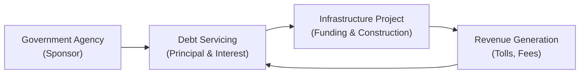

## Introduction

Imagine that your hometown desperately needs a new bridge, and the government is partnering with a private construction firm to get it built faster. If you find yourself wondering who is putting up the money for such a big project, chances are a government-sponsored entity (GSE) might be involved. GSEs are essentially special organizations—often with implicit or explicit government backing—that help channel funds into critical areas of the economy, including infrastructure. Because infrastructure might require billions of dollars and 20 or 30 years to recoup its cost, specialized financing mechanisms through GSEs play a vital role in making these massive projects feasible.

Infrastructure debt financing is further complicated by an array of risk and return considerations. Large public works, such as highways or renewable energy facilities, are famously stable after completion, but the build-out phase can be fraught with everything from construction delays to cost overruns. That’s why many GSE-sponsored loans or bonds come with credit enhancements and government oversight. The stable cash flows from these projects—think user fees, tolls, or guaranteed payments—make the eventual bond structure attractive to both local and global investors seeking long-maturity, lower-volatility allocations in fixed income portfolios.

This section dives into how GSEs facilitate infrastructure deals, how the bonds are structured, and how private investors can get in on them. We’ll also highlight some of the key risks and the best frameworks for analyzing those risks in a real-world, portfolio management context.

## The Role of GSEs in Infrastructure Financing

Government-sponsored entities often function as bridges (pun intended) between public policy goals and private market resources. They typically have a mandate to provide liquidity or capital to markets that might not otherwise be served efficiently—or sometimes at all—by purely private capital.

Examples abound:

• In the United States, agencies like Fannie Mae and Freddie Mac are major GSEs in the housing sector.  
• For infrastructure, though, you might see specialized entities such as the Asian Infrastructure Investment Bank (AIIB), the European Investment Bank (EIB), or agencies within a country that are structured similarly to GSEs.  
• These entities can raise capital at favorable terms due to their perceived—or actual—government backing, and channel that capital into large-scale projects like highways, tunnels, and clean energy facilities.

Many infrastructure projects have extremely long useful lives but require significant initial capital. This is where GSE debt instruments step in with long maturity profiles, which can align perfectly with the long-term revenue streams of the project. By offering better financing rates, partial or full government guarantees, and sometimes a specialized regulatory or operational structure, GSEs reduce the perceived risk for investors, making it easier for private capital to flow into these essential undertakings.

## Key Features of GSE-Sponsored Infrastructure Debt

GSE backing can take several forms, each with unique implications for risk, yield, and market perception. Understanding these subtleties is essential, especially for fixed-income investors who might be considering adding infrastructure debt to a portfolio.

Long Maturities  
Infrastructure debt often carries maturities of 15, 20, or even 30+ years. The rationale? Infrastructure assets—like a toll bridge or an energy transmission line—take a while to pay off. This long duration is especially relevant for asset-liability management in insurance and pension funds, which often prefer matching their long-term liabilities with these predictable cash flows.

Credit Enhancements  
Many GSE-sponsored bonds come with enhancements such as revenue pledges or guarantees up to a certain percentage. For example, a toll road project might secure a partial guarantee from the GSE in case toll revenues underperform. Sometimes monoline insurers provide additional coverage—the so-called “wrap.” This helps lower the credit risk premium demanded by investors.

Predictable Cash Flows  
It’s not unusual to see stable, contracted revenues underpinning GSE-led infrastructure debt. Tolls, user fees, or government-purchase agreements can all be used to secure coupon payments. So, even though the upfront development risk is higher, once the project is operational, the revenue stream tends to be robust and less correlated with typical economic cycles.

Multiple Funding Mechanisms  
GSEs may use multiple funding mechanisms: from direct loans to the project company, to bond issuance guaranteed by the GSE, or even to packaging infrastructure loans into asset-backed instruments. Each structure brings its own risk, return, and regulatory considerations.

Below is a simple diagram illustrating how capital might flow in a GSE-sponsored infrastructure deal:

## Public-Private Partnerships (PPPs)

Infrastructure finance often involves a blend of public and private roles. Public-Private Partnerships (PPPs) typically mean that a private consortium (which might include construction firms, operators, and financial backers) joins a public entity, sometimes supported by a GSE. In many cases, the GSE’s role is to provide or channel financing, mitigate certain risks, or offer moral suasion (i.e., the comfort that the government is closely involved, which often reassures investors).

PPP Structures  
One common PPP structure is the concession agreement, in which the private partner designs, finances, and constructs the project and then operates it for a given period. During that concession period, the private entity can collect revenues from user fees or availability payments (regular payments from the government for keeping the facility operational). After the term ends, ownership may revert to the government.

Why GSEs Matter Here  
Thanks to their access to cheaper funding in debt markets—due to an implicit or explicit government guarantee—GSEs can provide more favorable interest rates. This way, the private consortium in a PPP arrangement can enjoy lower financing costs while the public sector shifts much of the construction and operational risk onto the private partner. Typically, GSE involvement also signals that project oversight will be stricter, alleviating some potential moral hazard with the private sponsors.

Construction and Operational Risks  
Remember: there is no free lunch here. PPPs can face cost overruns or scheduling delays. I recall a project (I won’t name specifics, but it involved a major metropolitan area’s new light-rail system) that was so delayed the debt service obligations kicked in before the line even started operating! In that scenario, bondholders took comfort from a partial government backstop. But those hiccups can still create headaches for project sponsors and managers.

## Quasi-Government Backing and Investor Appeal

From an investor’s standpoint, GSE-sponsored debt can be quite attractive due to its quasi-government backing. While not always as safe as pure sovereign paper, these bonds can offer a yield pickup for slightly higher risk—and the portfolio diversification benefits of having exposure to a sector that’s not perfectly correlated with the broader corporate credit cycle. The underlying project revenues (think toll booths, payment availability from government budgets, or regulated user fees) provide stable cash flows over the long run.

In some jurisdictions, infrastructure debt financed by GSEs is also exempt from certain taxes or subject to more favorable regulatory capital treatment for banks and insurance companies. This can further bolster demand and boost liquidity.

## Risks and Mitigation in Infrastructure Financing

Yes, GSE involvement lowers some risk, but it doesn’t eliminate everything. Let’s talk about some of the major risk factors investors and sponsors must grapple with:

• Construction Risk: Delays or cost overruns plague many large infrastructure projects. Labor disputes, environmental lawsuits, you name it. GSEs may require thorough cost analysis and contingency reserves.  
• Operational Risk: Once built, the facility must be operated and maintained. If you’re expecting a certain volume of traffic (tolls) or usage (utilities), real-world usage may be lower than forecast.  
• Political/Regulatory Risk: Governmental changes can lead to new regulations, renegotiated concessions, or even expropriation (in the worst-case scenario).  
• Liquidity Risk: Some infrastructure bonds trade thinly in secondary markets, though the presence of a GSE guarantee can improve liquidity relative to purely private deals.  
• Interest Rate/Duration Risk: Because infrastructure bonds are long-dated, they can experience significant price volatility if interest rates move sharply.

To mitigate these risks, GSEs often require strict project appraisals, third-party feasibility studies, and conservative loan-to-value or debt service coverage ratios. Some deals also incorporate performance-based incentives or phased disbursements to ensure that sponsors don’t receive all the funds up front and then slack off.

## Example of a Toll Road Financing

Let’s imagine a GSE, call it “Highway FinanceCorp (HFC),” is mandated to support transportation infrastructure in a particular region. A private consortium wants to build and operate a toll highway connecting two major cities. Key steps:

• The consortium obtains a concession agreement from the government to construct and operate the highway for 25 years.  
• HFC issues long-term bonds—20 years at a fixed rate—and sets aside a portion of the proceeds to guarantee part of the interest payments if toll revenue falls short.  
• Construction funds flow to the project SPV (Special Purpose Vehicle), which oversees building the road.  
• Toll revenues once the highway is operational primarily go to service the debt, with any surplus distributed among equity investors.  
• Investors holding HFC-issued bonds benefit from relatively stable cash flows, with partial coverage by HFC if the toll revenue is temporarily insufficient.  

Once complete, the project not only fosters economic growth but also repays on schedule, leveraging the GSE’s credit standing to get favorable financing terms. Sure, there may be small bumps or shortfalls in usage estimates—like less traffic on weekends. But typically, the partial guarantee combined with stable ridership helps keep bondholders comfortable.

## Best Practices and Common Pitfalls

It’s easy to talk about the benefits, but as with any major financial undertaking, you want to keep your eyes open:

Best Practices
• Due Diligence: GSEs typically sponsor a thorough feasibility study, evaluating legal, technical, and financial aspects.  
• Transparent Governance: Project sponsors and the GSE often set up robust reporting and monitoring protocols, ensuring you don’t discover issues too late.  
• Risk-Sharing Mechanisms: PPP contracts frequently clarify who bears construction delays, cost overruns, or revenue risk.  

Common Pitfalls
• Over-Leveraging: Excessive debt could cripple cash flows if user fees decline.  
• Political Shifts: If the underlying government changes mid-project, policies might shift, increasing regulatory or renegotiation risk.  
• Complex Structures: Some deals get so elaborate that the layering of SPVs, credit enhancements, and guarantees can obscure the true risk, both for the sponsor and the investors.

## Concluding Thoughts

Infrastructure debt financing through government-sponsored entities stands at a unique crossroads of public policy and private investor demand. Let’s face it, those roads aren’t building themselves—which is why these structures are essential for ensuring that capital flows to serve the greater public good. For investors comfortable with long-term horizons, these GSE-sponsored bonds offer stable yields, potential diversification, and yes, a decent yield pickup over pure government securities. Just be mindful of the project, regulatory uncertainties, and the complexities of the bond covenants themselves.

This interplay between governments, private entities, and specialized agencies is a classic example of how finance can facilitate real economic growth. The next time you drive across a newly built highway or see fresh wind turbines spinning along the horizon, chances are that GSE-backed financing may have played a part in making it happen.

## Final Exam Tips

• Be prepared to compare yields of GSE-sponsored infrastructure bonds with those of sovereign and corporate bonds. Look for reasons behind yield differentials (credit enhancements, risk appetites, etc.).  
• Understand how long-dated maturities influence interest rate risk, particularly in a rising-rate environment.  
• Familiarize yourself with the concept of concession agreements, revenue pledges, and partial guarantees, as they are likely to appear in exam scenarios.  
• Practice scenario-based questions, especially around potential construction delays or changes in government policy, and how these would impact credit spreads or yield.  
• Don’t forget to incorporate ethical or governance considerations—for instance, stakeholder rights and the transparency of cash flow usage.

## References

• Engel, E., Fischer, R., & Galetovic, A. (2014). The Economics of Public-Private Partnerships. Cambridge University Press.  
• World Bank Group resources on PPP frameworks: https://ppp.worldbank.org  
• GSE Websites (e.g., Fannie Mae, Asian Infrastructure Investment Bank)  
• CFA Institute Level I & Level III Curriculum—Fixed-Income Readings on Government and Agency Debt  

## Test Your Knowledge: Infrastructure Debt Financing and GSEs



### Which of the following is the primary benefit of government-sponsored entities (GSEs) in infrastructure financing?

- [ ] They eliminate all operational risks for infrastructure projects.  
- [x] They often provide credit enhancements or partial guarantees that reduce financing costs.  
- [ ] They transfer full project ownership to private stakeholders.  
- [ ] They allow construction firms to pay no interest costs during the project phase.  

> **Explanation:** GSEs typically offer enhancements such as partial guarantees or revenue pledges, lowering the project’s risk premium and helping reduce borrowing costs. They don’t eliminate all risks, and they don’t simply hand over ownership.

### What is one reason a GSE-sponsored infrastructure bond might have a lower yield relative to a purely private corporate bond of similar maturity?

- [ ] Infrastructure bonds typically have no default risk.  
- [x] Implicit or explicit government support reduces credit risk.  
- [ ] Investors always prefer shorter maturities.  
- [ ] GSEs do not need to repay principal if revenues are insufficient.  

> **Explanation:** GSE-sponsored debt often benefits from stronger credit quality due to government involvement, resulting in lower risk premiums and yields when compared to similar private corporate debt.

### In a Public-Private Partnership (PPP), which of the following best describes the function of a concession agreement?

- [ ] It establishes working capital for the private partner.  
- [ ] It transfers all liabilities to investors.  
- [x] It grants the private partner the right to build, operate, and collect revenues for a defined period.  
- [ ] It ensures tax exemptions for the contractor.  

> **Explanation:** A concession agreement defines the private partner’s right to construct, operate, and collect revenues (e.g., tolls) during a specified period, after which ownership may revert to the public sector.

### Which risk is most closely tied to potential changes in toll revenues due to fluctuating demand for a toll road project?

- [ ] Liquidity risk  
- [ ] Political risk  
- [ ] Construction risk  
- [x] Operational risk  

> **Explanation:** Once the asset is built, fluctuations in usage or demand (like daily drivers on a toll road) directly affect operational revenues, hence the category is operational risk.

### Which of the following is a typical funding mechanism employed by GSEs for infrastructure projects?

- [ ] Issuing only short-term commercial paper  
- [ ] Equity-based crowdfunding  
- [x] Long-term bond issuance with partial credit guarantees  
- [ ] Only providing tax-free grants  

> **Explanation:** GSEs commonly issue long-dated, partially guaranteed bonds for infrastructure, matching the long lifespan of projects. Short-term or purely equity-based options aren’t the standard approach for these large capital needs.

### What is the primary advantage of matching the long maturity of infrastructure debt to the project’s expected cash flows?

- [x] It aligns debt service obligations with the asset’s long-run revenue generation profile.  
- [ ] It guarantees investors higher yields regardless of project performance.  
- [ ] It eliminates default risk immediately.  
- [ ] It ensures that no capital is repaid until project completion.  

> **Explanation:** Matching the debt’s maturity to the project’s life cycle helps ensure that the revenue stream during operation overlaps with the repayment schedule, reducing refinancing risk and volatility.

### A monoline insurer in the infrastructure debt market typically provides:

- [x] A guarantee of timely interest and principal payments.  
- [ ] Full equity financing for the project.  
- [x] Marketing campaigns to increase user fees.  
- [ ] Bridge financing during the construction phase.  

> **Explanation:** Monoline insurers specialize in guaranteeing bond principal and interest payments, increasing investor confidence and often resulting in lower borrowing costs.

### Which best describes a potential pitfall in GSE-sponsored infrastructure financing?

- [ ] Overly simple project structures that are too transparent.  
- [ ] Automatic coverage of all unexpected costs by the GSE.  
- [ ] Immediate and full funding of the project at zero interest.  
- [x] Complex layering of credit enhancements that can obscure actual risk.  

> **Explanation:** A notoriously tricky aspect of structured financing is that it can obscure who is really on the hook if something goes awry. Overly complex structures may hide or shift risks in ways investors fail to understand.

### From a portfolio management perspective, one reason to invest in infrastructure debt is:

- [ ] High correlation with equity markets.  
- [x] Stable, long-term cash flows that can help match liability profiles.  
- [ ] Guaranteed double-digit returns, backed by a national government.  
- [ ] Absence of any major credit risk.  

> **Explanation:** Infrastructure bonds can provide stable, long-horizon cash flows, which is valuable for investors like pension funds aiming to match their liabilities. It’s not about guaranteed double-digit returns or zero credit risk.

### True or False: All government-sponsored infrastructure debt is effectively risk-free.

- [x] True  
- [ ] False  

> **Explanation:** This is actually a tricky question. Some might argue false on the grounds that “risk-free” typically applies only to full-faith-and-credit sovereign obligations. However, exam nuances aside, many GSE obligations are often perceived as “virtually risk-free” due to government backing. Nonetheless, be aware that “risk-free” in a strict sense is rarely an absolute term outside of short-term government treasuries. On exams, read carefully how the question is framed, as GSE debt is usually “very low risk” but not necessarily guaranteed risk-free in every jurisdiction.


