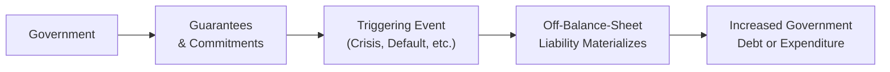

## Introduction and Context

It’s often tempting to focus strictly on a government’s explicit public debt figure when analyzing sovereign credit risk. But, oh boy, that can lead us down a pretty misleading path. When I first started looking at government finances, I was amazed to discover that a big chunk of risk can hide in contingent liabilities and off-balance-sheet obligations that, you know, only show up when things go sour. These liabilities are tricky because they don’t appear front and center like standard bonds or treasury bills. Yet they can quickly morph into substantial fiscal burdens if certain events occur—kind of like a dormant volcano that suddenly erupts.

In this section, we’ll explore the concept of government contingent liabilities and off-balance-sheet obligations, why they matter for credit analysis, and how to identify and measure them. If you’re preparing for the CFA Level III exam, or you just want to be the “know-it-all” in fixed-income discussions (in a good way), stick around. We’ll walk through definitions, frameworks, real-life examples, and some advanced considerations to keep your knowledge both broad and deep.

## Understanding Government Contingent Liabilities

Contingent liabilities are potential commitments that become actual obligations only if certain predetermined events or triggers occur. Some of the more common forms of these contingencies include guarantees for failing banks, rescue packages for state-owned enterprises, or shortfalls in public pension plans. Think of them like an emergency safety net the government extends—except that the net’s existence isn’t always clearly spelled out in the official debt statistics.

• Loan Guarantees (for Infrastructure or Industrial Projects): Governments might guarantee loans for megaprojects—say, a large infrastructure endeavor with a private partner. In normal times, if the project is successful, no one even remembers the guarantee was there. But if revenues don’t materialize (maybe toll roads see fewer cars than expected), the guarantee can suddenly transform from a footnote into a real payment obligation.

• Public Pension Obligations: Defined benefit pension plans promise a specified payout to retirees. When they are underfunded—and, well, in many jurisdictions they are—those shortfalls may eventually require a hefty cash infusion. If we ignore that possibility in analyzing the government’s finances, we might underestimate the sovereign’s actual credit risk.

• Support for State-Owned Enterprises (SOEs): State-owned companies sometimes carry a quasi-explicit understanding that if they get in trouble, the government steps in. While these potential bailouts aren’t always listed as debt in national accounts, rating agencies and bond investors increasingly factor them in because they can significantly impact fiscal sustainability.

• Insurance Programs: Public insurance programs (deposit insurance, flood insurance, and so on) can represent a big line item if triggers are met. Take deposit insurance: in a banking crisis, governments might have to allocate massive sums to repay insured deposits, adding unforeseen burdens to public finances.

### The Idea of a Fiscal Risk Statement

Some governments publish a “Fiscal Risk Statement,” which attempts to lay out, as transparently as possible, the key contingent liabilities. It’s not always mandatory or standardized. But for keen analysts, it’s often a gold mine of data to get a clearer sense of what hidden risks might lurk beyond the official debt figures. If you haven’t already, it might be worth perusing an example from, say, the New Zealand government. They’ve historically been quite transparent in enumerating these contingent obligations. Other International Public Sector Accounting Standards (IPSAS) frameworks also encourage best practices in disclosure.

## Off-Balance-Sheet Obligations

Off-balance-sheet obligations are closely related to contingencies, but the key difference is that they typically do not appear on the government’s primary balance sheet at all—unless or until certain conditions force them on. They’re a measure of fiscal risk that can suddenly “jump” onto the books.

Examples include:

• Special Purpose Vehicles (SPVs) and Project Financing: Governments might create SPVs that shoulder certain liabilities, effectively removing them from direct government borrowing. But if the SPV defaults, the government often feels compelled (legally or politically) to step in.

• Public-Private Partnerships (PPPs): Under a PPP arrangement, private firms often build and operate infrastructure projects, while the government provides some form of guarantee—whether revenue guarantee or cost overrun coverage. The obligation is “hidden” until project cash flows fall short of projections.

• Implicit Guarantees in the Banking System: A government might not formally write down that it will back all large banks. But during the global financial crisis, we saw that major systemic institutions received government support in many countries. That wasn’t “on the books” initially but became a big liability that required debt issuance or direct outlays when the crisis unfolded.

### Why Off-Balance-Sheet Obligations Can Be So Dangerous

Well, it’s a bit like drifting through life thinking your health insurance covers everything. Then you discover a situation (some rare, uncovered procedure) that leads to massive bills. Off-balance-sheet obligations can stealthily balloon the moment triggers are met. The government, which might have looked fiscally disciplined, suddenly sees its debt metrics blow up. Investors, rating agencies, and, yes, all of us in the financial community, need to pay attention.

## Hidden Liabilities and Their Impact on Effective Debt Burden

Many times, we assume that the government’s “official” debt ratio to GDP is the main barometer of fiscal strength. But that ratio can be misleading if it excludes these potential bombs. For instance, if the projected cost of unfunded pension liabilities alone is, say, 30% of GDP, that effectively raises the government’s debt ratio once we factor in the real obligation. This distinction is crucial for bond investors because perceived creditworthiness can shift drastically once these hidden liabilities are fully recognized.

In crisis situations, contingent liabilities often materialize simultaneously. For example, an economic downturn might cause:

1. More people to retire early (or at least claim pension benefits).  
2. A meltdown of banks that calls in deposit insurance.  
3. A decline in infrastructure project revenues, activating PPP guarantees.  

All these hits can happen in a concentrated period, making the government’s finances quite vulnerable.

## Key Areas of Analysis

Evaluating government contingent liabilities and off-balance-sheet obligations can be a bit more art than science. Still, there are frameworks (and practical tips) that help:

• Scale of Pension Underfunding: Assess how large the gap is in the government’s defined benefit plans. Look at official statements, and see if they use realistic assumptions about discount rates and life expectancy. An unrealistic discount rate (like using a high expected rate of return on pension assets) can mask the true liability.

• Explicit vs. Implicit Guarantees: Governments might publish a list of so-called explicit guarantees (e.g., a formal document guaranteeing a loan), but many implicit obligations arise from policy or reputational imperatives. Sometimes, rating agencies or the IMF can give clues in their official bulletins where they suspect governments to be carrying implicit obligations for, say, local governments or large systemic companies.

• Insurance Programs: Understand the triggers in deposit or flood insurance programs. If a “1-in-100-year” flood event or widespread bank failure occurs more frequently than expected, the contingent liability is more likely to pop.

• Stress Testing: Many analysts “stress test” potential scenarios—like a deep recession, a natural disaster, or a financial panic—and estimate how much these events could cost. That scenario-based approach is more realistic than a single best-estimate approach because real shocks rarely come one by one.

### Advanced Tip—Modeling the Probability of Default

Some advanced practitioners might use structural models or reduced-form credit models to incorporate the contingent liabilities. For instance, they might introduce scenario-based probabilities that trigger bailouts or guaranteed payments, layering those probabilities over a risk-neutral default model. If you’re aiming for top-tier analysis (particularly relevant for exam questions on multi-asset portfolio strategies or government-credit hedging), it’s worth exploring how these factors can alter a sovereign’s implied spread in the markets.

## Real-World Examples and Case Studies

It’s all well and good to talk theory, but there’s nothing like real examples to drive home the point:

1. The Global Financial Crisis (2008–2009): Several governments were forced to take on enormous liabilities to rescue major banks. Ireland is a notable example, where bank bailouts dramatically increased the country’s debt, turning what looked like a strong fiscal position into a crisis scenario basically overnight.

2. Puerto Rico Pension Crisis: Puerto Rico’s public pension system was severely underfunded, eventually forcing tough political decisions. Although Puerto Rico isn’t a sovereign state, the challenges illustrate how pension shortfalls and quasi-governmental structures can intensify a debt crisis.

3. Infrastructure PPP Shortfalls: In some emerging markets, toll roads and other large PPP projects ended up far below revenue projections. Governments had to cover the shortfalls, thereby converting an off-balance-sheet “guarantee” into very real debt. This taught many governments (and rating agencies) to be more vigilant in assessing PPP contract terms.

4. State-Owned Enterprises in China: Investors often assume there’s an implicit government guarantee for large Chinese SOEs. While the Chinese government has allowed some defaults, the general market belief is still that they will back many key firms, which in turn influences how bond spreads are priced. If that notion changes, it could spark significant re-pricing.

## Diagram: Potential Activation of Contingent Liabilities

Here’s a simple Mermaid diagram showing how contingent liabilities might materialize into actual obligations:

In normal conditions, governments hold these commitments in the background (node B). If a crisis hits or some contractual threshold is breached (node C), the potential liability (node D) can become an outright budgetary expense, increasing the public debt load (node E).

## Implications for Bond Investors

Bond investors typically focus on solvency, liquidity, and the overall risk profile of an issuer. Contingent liabilities complicate that analysis in multiple ways:

• Yield Spreads: Sovereign yields might not fully reflect the risk of hidden liabilities until negative events occur (or appear likely). A government that looks top-grade might experience a sudden leap in spreads if the market re-evaluates the probability of contingent liabilities becoming real.

• Credit Ratings: Rating agencies have become more sophisticated about contingent factors, but it’s never an exact science. If rating agencies suspect large off-balance-sheet items, they might place a government on negative watch, leading to a rating downgrade if evidence of an increased risk emerges.

• Portfolio-Level Risk Management: Managers of multi-asset portfolios should incorporate scenario analysis or sensitivity checks for these hidden liabilities, especially if they hold significant allocations to government debt. Correlation factors might change if a major government faces a meltdown scenario due to sudden bailout obligations.

## Managing and Mitigating Contingent Liabilities

Some governments are moving toward better policies:

• Transparent Disclosure: Producing a detailed “Fiscal Risk Statement” that enumerates all known (and potential) guarantees or uninsured exposures.

• Reserve or Guarantee Funds: Setting aside a contingency reserve or funding an insurance mechanism to account for probable triggers. For example, certain commodity-producing countries create sovereign wealth funds partly to cushion sudden revenue shortfalls or guarantee calls.

• Closer Monitoring of SOEs: Enacting stronger corporate governance standards for state-owned enterprises, limiting the moral hazard where those entities assume that the government will always bail them out.

• Restructuring Pension Schemes: Transitioning from purely defined benefit to defined contribution systems reduces, though doesn’t eliminate, the government’s long-run liability. This often becomes a politically sensitive process—nobody wants to be the politician who cuts retirement benefits. But from a debt management perspective, it’s an important structural reform.

## Best Practices & Common Pitfalls

### Best Practices

• Frequent Stress Testing: Regularly run multi-scenario analyses. What if economic growth stalls, or there’s a shock to the banking sector?  
• Realistic Actuarial Assumptions: For pension liabilities, avoid the trap of using inflated expected returns.  
• Clear Legislative Guidelines: Spell out precisely when government guarantees apply. This reduces confusion and moral hazard in the event of a crisis.  
• Cross-Referencing: Combine official data with analyses from organizations such as the IMF, World Bank, credit rating agencies, and foreign investor bulletins.

### Pitfalls

• Underreporting or Non-Disclosure: Failing to mention implicit or partial guarantees can erode market confidence if discovered.  
• Overreliance on “Official” Debt Figures: Ignoring the fine print in government financial statements.  
• Underestimating Correlation: Multiple contingent claims can be triggered by the same event. Overlooking that correlation can lead to a serious underestimate of total liability.

## Preparing for the CFA Exam

If you’re taking the CFA Level III exam—especially the constructed-response (essay) portion—you might get scenario-based questions where a government’s creditworthiness is tested by potential bailouts or pension shortfalls. Some points to keep in mind:

• Understand how to incorporate these liabilities into sovereign spread analysis.  
• Be ready to propose strategies for risk mitigation or solutions for bridging underfunded retirement obligations.  
• Keep references to IFRS/IPSAS or recognized guidelines in your back pocket. They can help you anchor the “best practice” approach to disclosure and recognition.

On multiple-choice (item set) questions, you might see a mini case describing a sovereign “X” with puzzlingly low reported debt but large guaranteed debt for public utilities. The question could easily revolve around calculating an implied debt ratio or re-evaluating the implied credit rating once these liabilities are recognized.

## References and Further Reading

• International Monetary Fund (IMF), “Government Finance Statistics Manual”: Provides guidelines on recognizing and reporting contingent liabilities.  
• International Public Sector Accounting Standards (IPSAS): See https://www.ipsasb.org/ for updates on disclosure requirements.  
• Rating Agency Reports from Moody’s, S&P, Fitch: They often discuss a sovereign’s contingent liabilities in their credit opinions.  
• Case Studies in Sovereign Debt Restructuring: Great for seeing how contingencies wreak havoc in real-world defaults.

---

## Test Your Knowledge: Government Contingent Liabilities and Off-Balance-Sheet Obligations



### Which of the following best describes a contingent liability?

- [ ] A debt instrument that must be reported on governmental balance sheets at issuance.
- [ ] A type of liability that automatically increases reported debt without specific triggers.
- [x] A potential obligation that becomes a real liability only if certain events or triggers occur.
- [ ] A guaranteed perpetual bond issued by a government entity.

> **Explanation:** By definition, contingent liabilities do not appear as actual obligations until a specific event takes place, such as a default or a shortfall in revenue related to an underlying project.

### Why are off-balance-sheet obligations dangerous for sovereign debt analysis?

- [x] They are not always accounted for in official debt figures but can quickly materialize under adverse conditions.
- [ ] They are a new type of perpetual debt that the IMF endorses.
- [ ] They only matter when debt-to-GDP ratios are above 100%.
- [ ] They have no impact on the government’s credit rating.

> **Explanation:** Off-balance-sheet items do not show up in standard debt metrics, which can lull investors into a false sense of security. When triggered, they may cause rapid increases in government liabilities.

### What is one common example of an off-balance-sheet liability for governments?

- [ ] Regular coupon payments on sovereign bonds.
- [x] Public-Private Partnership (PPP) guarantees.
- [ ] Salaries of government employees.
- [ ] Annual discretionary spending in a national budget.

> **Explanation:** PPPs typically involve some kind of government backstop. If project revenues fall below expectations, the government may be obligated to cover the shortfall.

### A defined benefit pension plan underfunded by 30% of its obligations is an example of:

- [ ] A non-governmental corporate liability and irrelevant to sovereign risk.
- [ ] An obligation fully recognized in the government’s annual budget.
- [ ] A standard operating cost without long-term implications.
- [x] A contingent or potential liability if the government needs to cover shortfalls in pension payouts.

> **Explanation:** The shortfalls in a defined benefit pension scheme create a potential liability if the government must step in to fund the promised benefits.

### When assessing contingent liabilities, why do rating agencies often reference deposit insurance programs?

- [x] Deposit insurance can represent a large liability if a banking crisis triggers extensive deposit payouts.
- [ ] They are immediately recorded as debt in normal economic conditions.
- [ ] They guarantee the government will never have a liquidity crunch.
- [x] They have no bearing on government contingent liabilities.

> **Explanation:** Deposit insurance programs, though off the official books during stable times, can quickly create large liabilities if a systemic banking collapse forces the government to pay out insured depositors.

### Which of the following is considered a best practice in managing sovereign contingent liabilities?

- [x] Releasing a detailed Fiscal Risk Statement.
- [ ] Completely ignoring pension underfunding until it is triggered.
- [ ] Issuing more short-term debt to cover potential obligations.
- [ ] Keeping contingency funds secret to avoid press coverage.

> **Explanation:** Publishing a Fiscal Risk Statement that outlines and quantifies potential triggers is a vital element of transparent government financial management.

### If a government is known to back major state-owned enterprises (SOEs) implicitly, how might this affect its credit rating?

- [x] The government’s rating may incorporate a risk premium to account for potential bailouts.
- [ ] Rescuing SOEs is considered free money creation by the government.
- [x] The credit rating is unaffected because implicit guarantees do not show on the balance sheet.
- [ ] Rating agencies view implicit guarantees as speculative, so they ignore them.

> **Explanation:** Rating agencies consider possible contingencies for state-owned enterprises, which can add risk to the sovereign’s overall debt profile.

### How can a stress test help in analyzing contingent liabilities?

- [x] By modeling how multiple adverse events could trigger various guarantees simultaneously.
- [ ] By guaranteeing the government will not face unexpected liabilities.
- [ ] By calculating the annual coupon payments of standard government bonds.
- [ ] By correlating risk factors to determine immediate debt service cost only.

> **Explanation:** Stress testing can reveal vulnerabilities, such as multiple off-balance-sheet items being activated at once, dramatically altering the government’s debt sustainability.

### What is a common pitfall when governments report their debt levels?

- [x] Not accounting for pension underfunding or deposit insurance liabilities.
- [ ] Double counting both on and off-balance-sheet liabilities.
- [ ] Reporting all potential liabilities as part of official debt.
- [ ] Inflating the official debt to appear weaker financially.

> **Explanation:** Often official debt figures do not incorporate unrecognized contingent liabilities, which can mislead investors and policymakers regarding the true fiscal position.

### True or False: Governments can avoid all negative impacts of contingent liabilities by purchasing deposit insurance from private insurers.

- [x] True
- [ ] False

> **Explanation:** This statement is not accurate. While private insurance may shift some of the exposure, governments typically remain the ultimate backstop. Realistically, there is no all-encompassing hedge that absolves governments from broader systemic risk if insurers also become insolvent during a widespread crisis.


