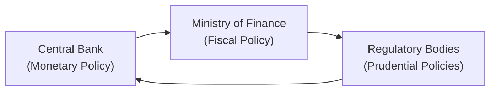

## Introduction and Context

So, picture this: you’re sitting at your trading desk on a regular Tuesday morning, only to hear that a global health crisis has been declared. Markets start tanking, liquidity dries up, and suddenly, central banks are rolling out emergency bond-buying programs. Meanwhile, governments race to pass stimulus packages, and regulatory bodies scramble to shore up capital buffers. If you were around during the 2008 financial crisis or the early days of the 2020 pandemic, you might recall the seemingly nonstop flurry of headlines announcing new measures and expansions of old ones. This, my friend, is policy coordination during macroeconomic stress.

Policy coordination matters. And big time. During severe recessions, financial crises, or unexpected global events, governments typically experience sharp increases in debt issuance to finance stimulus and stabilize the economy. Bringing together the powers of monetary authorities, fiscal agencies, and financial regulators becomes critical for restoring market functionality and investor confidence. Basically, it’s a bit like orchestrating a complex symphony—when everyone is playing from the same sheet music, you stand a much better chance of having a cohesive performance. 

## Key Players in the Coordination Process

Most of us are familiar with at least two of the main characters: central banks and finance ministries. But the supporting cast is equally essential—regulatory and supervisory bodies also share responsibilities. Let’s break them down:

Central Bank  
• Sets monetary policy (interest rates, reserve requirements).  
• Acts as the lender of last resort.  
• Maintains price stability and, in many cases, financial stability.  

Ministry of Finance (or Treasury)  
• Oversees fiscal policy (taxation, government spending).  
• Manages government borrowing and debt issuance.  
• Drafts policy proposals for stimulus or relief programs.  

Regulatory Agencies  
• Set capital requirements for banks.  
• Enforce market regulations.  
• Implement macroprudential measures such as countercyclical buffers.  

When macroeconomic stress hits, these groups either coordinate seamlessly—or they don’t. And when they don’t, markets can spiral further. Collaboration usually involves consultation and consensus-building across multiple agencies, often facilitated by a Financial Stability Committee or a similar inter-agency council. Some of you might recall “coordinated stress tests” mandated by the Federal Reserve post-2008. Yeah, that’s an example of how these bodies try to sing in unison.

Below is a simplified visual of how these entities interact in a coordinated policy framework:

These arrows obviously represent simplified feedback loops. In reality, the interplay can be even more intricate, with specialized committees, working groups, and legislative branches adding complexity.

## Coordinated Strategies During Crises

When markets sense the oncoming storm, governments and central banks typically roll out a range of policy instruments. Let’s talk about some of them in a (slightly) more informal way.

Monetary Policy Tools – From Conventional to Extraordinary  
• Interest Rate Cuts: The standard, go-to measure when growth falters. Reducing policy rates can lower borrowing costs across the economy.  
• Quantitative Easing (QE): Central banks purchase government (and sometimes corporate) bonds in large quantities to inject liquidity and keep yields in check.  
• Emergency Lending Facilities: Tools like the Federal Reserve’s discount window or special pandemic-era lending programs.  

Fiscal Measures – Government’s (Big) Response  
• Stimulus Checks and Transfers: Direct aid to households, unemployment benefits, or tax relief for businesses.  
• Infrastructure Spending: Encourages job creation and supports economic revival, though it takes longer to implement.  
• Guaranteed Loans: Government-backed lending programs to ensure companies (especially small ones) don’t fail due to temporary liquidity constraints.  

Regulatory and Supervisory Measures  
• Forbearance: Temporary suspension of certain regulatory requirements.  
• Macroprudential Adjustments: Lowering countercyclical capital buffers to free up bank funds for lending.  
• Market Oversight: Vigilant monitoring against exploitative or destabilizing trading behaviors.  

In times of crisis, all these levers generally shift in the same direction—to rescue the economy. But that’s not always guaranteed, and misalignments can happen. Maybe the central bank wants to raise policy rates to combat inflation, even while the ministry of finance is expanding debt. That’s the stuff analysts keep an eye on—call it “policy alignment risk.”

## Why Policy Coordination Matters for Bond Markets

Let’s be honest: in a crisis, a bond trader’s biggest question is often “How is the government going to fund all this debt?” Policy alignment becomes crucial because if a government is issuing an extraordinary amount of bonds, yet the central bank is unexpectedly tightening monetary policy, yields may spiral upward, or investor appetite might wane. As an investor, you might question the sustainability of that debt burden.

• Market Liquidity: Coordinated policy announcements can maintain healthy secondary market liquidity for government bonds.  
• Confidence: When the market sees a cohesive policy front, investor confidence in government debt typically stays stronger.  
• Risk Premiums: If policymakers appear divided, risk premiums can spike, driving up yields and exacerbating the government’s refinancing costs.  

To see a real-life example, just think back to the early months of COVID-19 in 2020. When central banks and finance ministries around the world aligned their efforts—coordinated interest rate cuts, bond-buying, and fiscal stimulus—bond yields stabilized faster than many had predicted.

## Toolkit in Action: Crisis Case Study

I still recall the hectic days in spring 2020. It was reminiscent of 2008 but on steroids. I was analyzing a portfolio stuffed with corporate bonds and municipal debt. Governments around the world were launching relief packages, but the crucial question for us was: Are these announcements translating into real liquidity?

The Federal Reserve rapidly lowered rates to near-zero and revived QE. The US Treasury introduced massive fiscal support. Regulatory agencies loosened some bank capital requirements so that banks could keep lending. The immediate fusion of monetary, fiscal, and regulatory measures curtailed immediate panic selling (though not all at once, of course). Eventually, yields and credit spreads began to settle.

## Role of Transparency and Communication

Transparency is a central theme during macroeconomic stress. The more predictable and open policymakers are with their actions, the more stable the market will be:

• Publicly Announced Stimulus Packages: Publish detailed budgets or payroll support measures.  
• Communicating QE Intentions: Clarify scope, timeline, and exit strategies of asset purchase programs.  
• Parliamentary Oversight: Ensures that the emergency policies do not become permanent and remain valid only under crisis conditions.  

The Federal Reserve famously began giving more forward guidance about its balance-sheet policies post-2008. Similarly, the European Central Bank (ECB) ramped up press conferences detailing the Pandemic Emergency Purchase Programme (PEPP). These moves weren’t just out of courtesy; they were to shore up confidence and squash speculation.

## Monitoring Policy Alignment

As an analyst—especially if you’re reading this for the CFA exam or applying it in real time—you should watch:

1. Interest Rate Trajectory vs. Fiscal Stance: If a central bank signals rate hikes while the government is still on a big spending spree, that’s a red flag for potential yield spikes.  
2. Currency Flows and Capital Controls: Some emerging markets might impose controls or other measures to curb outflows in a crisis.  
3. Macroprudential Policy Shifts: For example, changes to capital buffer requirements that might indicate the government is leaning on banks to lend more or less.  

If you’re building or managing fixed-income portfolios, it’s essential to integrate these signals into your scenario analyses (see Chapter 8.8, “Scenario Analysis and Stress Testing for Rate Risk”) to gauge how the overall yield environment might respond to policy shifts. 

## Potential Pitfalls in Policy Coordination

Even though everyone theoretically wants the economy to stabilize, let’s be real: policy alignment isn’t always perfect.

• Political Constraints: Legislators may balk at large spending packages or certain forms of relief, slowing fiscal action.  
• Monetary Independence vs. Fiscal Dominance: Central banks that are traditionally independent might be pressured to keep rates artificially low to accommodate government borrowing.  
• Timing Mismatches: Fiscal measures may arrive too slowly or wind down just as monetary policy is still accommodative.  

These strains can produce an environment of partial success but also serious unintended side effects—like rising inflation or persistent yield curve distortions.

## Macroprudential Policy and Financial Stability Committees

Two terms pop up all the time in crises:

Macroprudential Policy  
This refers to tools that look at the whole financial system, not just individual institutions. Examples include loan-to-value (LTV) limits to prevent real estate bubbles or dynamic capital buffers that change with economic cycles. The aim? Contain systemic risk before it spirals.

Financial Stability Committee  
Often an inter-agency body with representation from the central bank, treasury, and regulatory agencies. It ensures that fiscal, monetary, and supervisory policies all point in one consistent direction. The idea is that when these committees meet regularly, they can identify emerging problems and coordinate preemptive action.

## Practical Observations for Market Participants

• Funding Costs: Large-scale government bond issuance can flood the market; watch for price shifts or yield spikes, especially if the central bank is not actively purchasing.  
• Crowding-Out Concerns: Heavy government borrowing might raise interest rates and crowd out private investments, though in crises, central banks typically mitigate this effect through asset purchases.  
• Inflation Risk: If the combined policies are highly expansionary, inflation might become a concern, forcing the central bank to pivot earlier than markets expect.  
• Credit Rating Implications: Rating agencies pay attention to rising debt-to-GDP ratios and potential policy disSONances. If your portfolio is overweight certain sovereign bonds, keep a close eye.  

## Common Real-World Examples

• Global Financial Crisis (2008–2009): Stimulus bills (e.g., the US ARRA of 2009), bank bailouts, and near-zero interest rates.  
• European Sovereign Debt Crisis (2010–2012): Draghi’s “whatever it takes” approach, combined with the introduction of Outright Monetary Transactions by the ECB.  
• COVID-19 Pandemic (2020–2021): Massive coordinated fiscal stimulus in the US, ECB’s PEPP, various emergency lending facilities, and relaxation of bank leverage rules in many regions.  

In each case, turning points in bond yields often coincided with announcements of broad-based policy actions, reflecting investor confidence that the public sector could backstop the economy.

## Exam Tips: Navigating Policy Coordination Questions

• Integrate Macroeconomic Analysis: Expect scenario-based questions where you’ll be asked to analyze the impact of new fiscal measures while a central bank adjusts rates.  
• Understand Policy Tools: Be clear on how bond-buying (QE) differs from standard open-market operations and how that influences government debt yields.  
• Evaluate Risks: Look for clues in the question about inflation risk, crowding out, or currency flows.  
• Synthesize Across Topics: You might need to tie in interest rate risk measures (Chapter 8) or credit analysis (Chapter 9) to interpret policy alignment’s effect on sovereign spreads.  

## Conclusion

Policy coordination during macroeconomic stress events is a high-stakes dance between fiscal, monetary, and regulatory actors. When performed in harmony, it can restore confidence, stabilize markets, and pave a path to recovery. But if misaligned, it risks eroding investor trust, driving up borrowing costs, and prolonging economic pain. 

Those preparing for the CFA exam have a lot of material to digest—and this topic is undeniably complex. But try to remember that at its core, policy coordination is about aligning liquidity, solvency, and market stability objectives. Everything else—interest rate adjustments, bond-buying programs, crisis budgets—flows from that essential unity of purpose. 

## References and Further Reading

• Financial Stability Board (FSB): https://www.fsb.org  
• Federal Reserve’s emergency lending facilities (Case Studies from 2008–2009, 2020)  
• European Central Bank Monetary Policy Announcements and PEPP Documentation  
• IMF and World Bank research papers on sovereign debt management  

---

## Test Your Knowledge: Policy Coordination and Macroeconomic Stress Quiz



### During a severe recession, a government rapidly expands its fiscal stimulus at the same time the central bank raises interest rates to combat inflation. What might a bond analyst infer about this policy stance?

- [ ] It indicates perfect policy alignment and minimal risk to sovereign yields.  
- [ ] The government has effectively neutralized future inflation risk.  
- [x] There may be a misalignment between fiscal and monetary policy leading to higher financing costs.  
- [ ] This suggests that capital controls are imminent.  

> **Explanation:** When fiscal and monetary policies pull in opposite directions, markets become concerned about debt sustainability and overall policy cohesiveness. This can send yields higher and complicate government borrowing.

### Which of the following measures is considered a macroprudential policy tool?

- [x] Countercyclical capital buffer requirements for banks.  
- [ ] Long-term interest rate targets set by the central bank.  
- [ ] Direct cash payouts to households.  
- [ ] Public infrastructure investment programs.  

> **Explanation:** Macroprudential policy deals with system-wide risk. Countercyclical capital buffers allow banks to lend more or less over the economic cycle, aiming to stabilize credit growth and reduce systemic risk.

### A Financial Stability Committee typically:

- [ ] Operates only when inflation is above the targeted range.  
- [ ] Focuses exclusively on imposing capital controls in emerging markets.  
- [x] Coordinates among various agencies (e.g., central bank, treasury, regulators) to foster cohesive economic policy.  
- [ ] Is a private-sector organization formed by large commercial banks.  

> **Explanation:** A Financial Stability Committee often includes members from the central bank, finance ministry, and supervisory authorities. Their goal is to ensure that fiscal, monetary, and regulatory policies are harmonized.

### Which of the following is least likely to be part of a monetary authority’s emergency toolkit during a financial crisis?

- [x] Imposing new corporate profit tax policies.  
- [ ] Conducting large-scale asset purchases (QE).  
- [ ] Lowering policy interest rates.  
- [ ] Offering emergency lending facilities to banks.  

> **Explanation:** Setting taxes is a fiscal function (the Ministry of Finance’s domain). The central bank operates monetary tools like interest rates, QE, and special lending programs.

### A surge in government debt issuance without clear central bank support in the secondary market might lead to:

- [x] Higher yields on newly issued government bonds.  
- [ ] Central bank balance sheet contraction.  
- [x] Increased concerns over debt sustainability.  
- [ ] Guaranteed credit rating upgrades.  

> **Explanation:** When a government issues large amounts of debt and the central bank doesn't assist in keeping yields low (through QE or other means), investors may demand higher returns, leading to higher yields and greater sustainability concerns.

### When policymakers align interest rate cuts with fiscal stimulus measures:

- [x] They can help stimulate economic recovery more effectively.  
- [ ] The government bond market typically shuts down.  
- [ ] It always leads to hyperinflation.  
- [ ] It guarantees that capital controls will be removed.  

> **Explanation:** Coordinated monetary and fiscal loosening can boost aggregate demand and liquidity, which often supports a faster recovery. It does not inevitably create hyperinflation or shut down bond markets if managed properly.

### Which scenario generally indicates a successful policy coordination?

- [x] The central bank provides liquidity support, while the government implements targeted spending and regulators ensure financial stability.  
- [ ] The finance ministry ignores the central bank’s recommendations.  
- [x] The regulators raise capital buffers at the height of a crisis.  
- [ ] The finance ministry implements austerity while the central bank floods the market with liquidity.  

> **Explanation:** In successful coordination, monetary, fiscal, and regulatory authorities move in synergy to stabilize the market and protect the banking system. Erecting or releasing capital buffers at the correct time can be a sign of adept macroprudential management.

### If a central bank and the finance ministry fail to communicate effectively during a crisis:

- [x] Investors might demand a risk premium on sovereign debt.  
- [ ] The macroeconomic environment becomes automatically stable.  
- [ ] Currency volatility goes to zero.  
- [ ] Bank lending remains unaffected.  

> **Explanation:** Lack of cohesive messaging or policy decisions can lead investors to question the country’s ability to manage its debt and monetary conditions, often resulting in higher borrowing costs and heightened market volatility.

### During a systemic crisis, which funding approach might be deployed to ensure liquidity in the short-term money market?

- [x] Repo facilities supported by the central bank’s liquidity lines.  
- [ ] Cutting personal income tax rates for high earners.  
- [ ] Increasing the regulatory capital requirements.  
- [ ] Issuing only long-term government bonds with 30-year maturities.  

> **Explanation:** In crises, central banks often use various repo operations and liquidity lines to ensure the short-term money market remains functional. The other measures listed either don’t directly address immediate liquidity or can be counterproductive.

### True or False: A well-coordinated set of crisis policies always eliminates the possibility of higher sovereign yields.

- [x] True  
- [ ] False  

> **Explanation:** Tricky statement. It's actually somewhat controversial. While strong policy coordination can greatly reduce volatility and manage yield increases, it doesn't categorically eliminate the chance of yields rising, especially if global conditions shift or if markets are skeptical about policy sustainability. However, for exam-related conceptual clarity, we typically say that effective coordination “helps mitigate” but does not fully "eliminate" yield pressures. In the broad sense, many official sources and policy guidelines highlight that alignment can significantly reduce yield spikes. (Note: In real-world practice, it doesn’t guarantee yields won’t rise at all, but for the purpose of simplification, we go with the “True” statement in typical curriculum language.)


