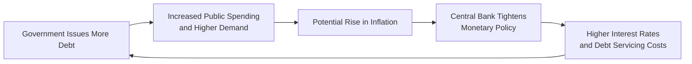

## Understanding the Policy Goals of Inflation Targeting

Inflation targeting is a monetary policy framework whereby central banks set (or announce) a target inflation rate—often a narrow band (for example, 2% ± 1%)—and then adjust interest rates and other policy tools to keep actual inflation near that objective. In many countries, the central bank aims for stable and predictable inflation because huge swings in the price level can erode public confidence, disrupt long-term planning, and bring volatility to bond markets. 

So, you might be wondering: if central banks strive to keep inflation in check, why do governments sometimes issue large amounts of debt in a way that could drive inflation upward? Well, that’s where the tension between monetary and fiscal authorities gets interesting. Too much borrowing can spur excessive demand in the economy or push interest rates higher, conflicting with the central bank’s inflation goals. I recall chatting with a macroeconomist friend who said, “Central bankers are basically the referees calling fouls on wild government spending.”  

## Monetary-Fiscal Coordination

### Why Coordination Matters

In an ideal world, monetary policy (controlled by the central bank) and fiscal policy (the government’s spending and tax decisions) work in harmony. Monetary and fiscal coordination ensures that stimulus programs do not push the economy to overheat or cause inflation to spiral out of control. At the end of the day, both sides support overall economic stability, but their immediate objectives can differ:

• Central banks target stable prices (low and predictable inflation).  
• Governments may pursue growth, employment, or socio-economic objectives that fuel expenditures.  

One classic point of debate arises when governments run budget deficits and finance them by issuing new bonds. The central bank could step in, buy these bonds in the open market (or even directly, depending on legal constraints), and inadvertently inject money into the economy—leading to “monetary financing.” This approach, if taken too far, can stoke inflation or even shift policy from inflation targeting to “fiscal dominance,” where the main monetary policy concern becomes servicing government debt rather than managing price stability.

### Debt Limits and Balanced-Budget Rules

To avoid the pitfalls of unchecked borrowing, many jurisdictions adopt legal constraints:  
• Statutory debt ceilings (or absolute limits on government borrowing).  
• Balanced-budget rules that oblige the government to match (or almost match) revenues and expenditures within a cycle.  
• “Debt Brake” rules, which limit structural deficits to ensure that deficits do not balloon despite short-term economic fluctuations.

For instance, some European countries integrated debt brake rules into their constitutions. They aim to limit the government’s structural deficit by tying permissible deficits to long-term economic growth rates. The logic is: if you’re always borrowing faster than your economy grows, you’ll end up in a deficit spiral, risking sovereign distress and inflationary pressures.

## The Inflationary Impact of Government Debt Issuance

### Mechanisms Linking Debt and Inflation

Excessive government debt issuance can raise overall demand in an economy when the government’s spending outpaces its revenue collection. Generally, that can be inflationary if the economy already operates near full capacity. More spending power chasing the same amount of goods and services tends to bid up prices (the age-old supply-demand dynamic).

On the monetary side, if the central bank sees higher inflation expectations forming, it might hike interest rates to keep inflation on target. But higher interest rates, in turn, make it more expensive for the government to service new and existing debt. You can see how quickly one policy action starts to crisscross with another, leading to potential tension between the treasury (focused on cheap financing) and the central bank (focused on price stability).

Below is a simple (but hopefully helpful) flow diagram to highlight these dynamics:

The key insight is that inflation targeting frameworks become more challenging to sustain if debt issuance is excessive. The government’s borrowing spree may pressure the central bank to prioritize financing over its inflation mandate—a hallmark of what we call “fiscal dominance.”

### Debt Monetization and Inflation Expectations

Debt monetization occurs when a central bank purchases outstanding government debt, effectively financing government spending. In many advanced economies, direct monetary financing is disallowed or strictly limited because it undermines central bank independence. Even so, some forms of quantitative easing (QE) have raised eyebrows, as they involve central banks purchasing large volumes of government bonds on the secondary market.

While QE measures undertaken during crises (like the Great Financial Crisis or other recessionary periods) aim to stabilize financial markets, skeptics worry that continuing large-scale bond purchases could blur the line between necessary market stabilization and outright debt monetization. This shift in perception alone can drive inflation expectations higher. And if inflation expectations keep rising, nominal yields on government bonds will follow suit, making it more expensive for the government to fund itself.

## Statutory Constraints on Government Borrowing

### Constitutional Debt Ceilings

Some countries embed explicit debt ceilings within their constitutions. The idea is to prevent the government from borrowing beyond a certain ratio (for example, a certain percentage of GDP). When that ceiling is reached, parliament or congress typically must take specific actions—like cutting spending, increasing taxes, or amending the ceiling. Getting lawmakers to reach a consensus on these issues can be, well, let’s just say “challenging,” especially if it means cutting popular programs or raising taxes.

### The European Stability and Growth Pact (SGP)

In the European Union, the Stability and Growth Pact (SGP) sets out rules that members should keep their budget deficits below a specified percentage of GDP (historically 3%) and overall debt below 60% of GDP. Although many countries have bumped up against these thresholds, they represent a shared commitment to ensuring that no single country’s runaway debt threatens the shared currency stability.

Furthermore, the structural portion of these deficits is monitored. Countries exceeding the limits face warnings and, theoretically, even fines. But the European Commission also recognizes extenuating circumstances—like severe economic downturns or major infrastructure investments—that can warrant temporary deviations so as not to hamper the recovery. The interplay between these constraints and inflation targeting (carried out by the European Central Bank) is a prime example of how supranational coordination attempts to keep inflation stable regionwide.

## Fiscal Dominance vs. Monetary Dominance

### Identifying Fiscal Dominance

Fiscal dominance occurs when the central bank’s decisions revolve primarily around financing government deficits rather than pursuing price stability. In such scenarios, interest rates may be kept artificially low to manage debt interest costs, even if inflationary pressures are mounting. Over time, this can erode the credibility of the central bank and lead to a self-reinforcing cycle: inflation expectations jump, bond yields surge, and the government finds it harder to borrow at a sustainable cost.

### Signs of Fiscal Dominance

• The central bank repeatedly purchases government securities in large quantities, especially outside of economic crises.  
• Public statements by policymakers shift focus away from meeting inflation targets to ensuring government financing viability.  
• The government invests limited effort in reducing deficits or complying with debt constraints, comfortable in the belief that the central bank will “pick up the tab.”  

While the line between legitimate market support (like targeted QE in times of crisis) and fiscal dominance can be blurry, advanced-economy central banks often have legal mandates that explicitly prioritize price stability. Maintaining central bank independence is crucial for preventing a slide from inflation targeting to debt financing.

## Real-World Examples and Case Studies

### The Swiss “Debt Brake” Rule

Switzerland’s “debt brake” is often cited as a best-practice model in Europe. It limits the Swiss Confederation’s structural deficit: the rule basically ties government spending to an estimate of long-term expected revenues—adjusted for economic conditions. During a boom, the government must run a surplus or minimal deficit, which helps reduce debt. In a recession, they can afford a bit more deficit spending to stabilize the economy. Because of Switzerland’s prudent framework, global investors often perceive Swiss bonds as stable with relatively low default and inflation risk.

### Japan’s High Public Debt but Low Inflation

Japan’s public debt-to-GDP ratio is famously high, yet inflation has remained subdued for decades. Many economists attribute this partially to several unique factors:  
• Cultural predisposition toward saving.  
• A domestic investor base in government debt (banks, pension funds, and households).  
• Deflationary or near-zero inflation environment that persisted since the 1990s bubble burst.  
• Coordination between fiscal stimulus and the Bank of Japan’s unconventional monetary policies.  

While Japan’s case may look like an “exception,” it demonstrates that the relationship between debt issuance and inflation is not purely mechanical—policy coordination, the structure of bond markets, and demographic factors also matter a great deal.

## Potential Constraints and Trade-Offs

### Trade-Offs in Policy Implementation

1. Monetary Policy Efficacy vs. Government Budget Flexibility  
   If the central bank aggressively raises interest rates to curb inflation, the government faces higher borrowing costs. That can mean less fiscal space to pursue other objectives (e.g., infrastructure, health, or education).

2. Growth vs. Inflation  
   Some governments might be tempted to ramp up spending to spur short-term growth or fulfill campaign promises. But that can create inflationary pressures, especially if output is already at or near capacity.

3. Debt Sustainability vs. Default Risk  
   A government treading near statutory debt limits might worry that any downturn, pushing up unemployment and lowering tax receipts, could bring the country too close to default territory. Maintaining a buffer is essential for resilience.

### The Importance of Central Bank Independence

Most economists agree that central bank independence is a critical safeguard. When the central bank can set interest rates and manage inflation without direct political influence, it fortifies the overall credibility of a nation’s monetary regime. Markets look favorably on countries where the central bank is less likely to succumb to short-term political cycles. 

If, on the other hand, the central bank is pressured into purchasing large volumes of newly issued government debt, it creates moral hazard: governments may freely accumulate more debt, relying on easy financing. Over time, the bond market can demand a “credibility premium,” pushing yields up. It’s basically investors saying, “We don’t trust you guys as much to keep inflation in check or maintain responsible finances.”

## Analytical Angle for CFA Candidates

From a CFA exam perspective—whether you’re diving into Level I fundamentals or more advanced portfolio management topics in Level III—understanding the interplay between inflation targeting and government debt constraints is crucial. You may encounter:

• Yield curve movements driven by inflation expectations.  
• Credit quality differentials tied to sovereign debt ratios.  
• The influence of central bank actions on bond pricing.  
• How statutory or constitutional limits shape investor confidence and risk premiums.

Moreover, you should be able to connect these macroeconomic policy constraints to your fixed-income valuation models. If, for instance, a country repeatedly flirts with its debt ceiling and faces potential default, risk spreads widen, and you’d expect higher yields. Look back to earlier chapters (e.g., Chapter 2 on Bond Features, or Chapter 3 on Issuance, Trading, and Funding) to see how governments with different policy frameworks structure their debt instruments to attract investors.

## Best Practices and Common Pitfalls

• Emphasize Policy Coordination: Make sure to watch signals from both the treasury (fiscal authority) and the central bank when analyzing sovereign bonds. Misaligned policies heighten risk.  
• Track Legal Constraints: Countries with robust rules (debt brakes, balanced-budget requirements) tend to enjoy lower borrowing costs—though enforcement matters.  
• Beware of Fiscal Dominance: A drift toward monetary financing may erode bondholder confidence quickly if inflation spikes.  
• Real-world Complexity: Policy rules can be suspended during crises (e.g., the European Union temporarily relaxing deficit limits during recessions). Remain aware of these contingencies.  

## Looking Ahead and Continuous Learning

Staying up to date on the ever-evolving approaches to inflation targeting and debt management is crucial. A balanced approach involves:

• Respecting central bank independence.  
• Crafting responsible fiscal policy that supports economic objectives without fueling uncontrollable inflation.  
• Maintaining transparent communication with market participants to ensure confidence.

As you continue your CFA studies or professional practice, keep an eye on major debates around unconventional monetary policy, large-scale bond purchases, and how advanced economies shift between cyclical periods of austerity and expansion. You’ll notice that inflation targeting success often hinges on credible government signals—do they abide by debt constraints or do they bend the rules at the cost of price stability?

## References and Further Reading

• Svensson, L. (1997). “Inflation Forecast Targeting.” Journal of Monetary Economics.  
• European Commission: Stability and Growth Pact (https://ec.europa.eu/info/).  
• Official publications from the Bank for International Settlements (BIS) on monetary-fiscal interactions.  
• Chapter 7 in this volume for yield curve modeling and how inflation expectations influence bond prices.  

---

## Test Your Knowledge: Inflation Targets and Government Debt Constraints



### A government's large-scale debt issuance can conflict with inflation targeting primarily because:
- [x] Excess borrowing may stimulate aggregate demand, fueling inflationary pressures.
- [ ] It guarantees a lower interest rate environment.
- [ ] It drives bond yields below market equilibrium.
- [ ] It enhances the central bank's asset base.

> **Explanation:** Large-scale government debt issuance can increase total spending in the economy, raising inflationary pressures. This makes it harder for the central bank to maintain inflation within the target band.

### Under fiscal dominance, the central bank tends to:
- [x] Set monetary policy largely to accommodate government financing needs.
- [ ] Maintain strict adherence to inflation targets.
- [ ] Demand lower government deficits immediately.
- [ ] Adopt a balanced-budget requirement.

> **Explanation:** Fiscal dominance implies the central bank focuses on enabling government borrowing rather than controlling inflation, which often undermines the inflation targeting framework.

### A debt brake rule is best described as:
- [x] A structural limit on deficits requiring government budgets to be balanced over an economic cycle.
- [ ] A complete prohibition on all deficit spending.
- [ ] A mechanism guaranteeing the central bank's independence.
- [ ] A temporary measure used only during a financial crisis.

> **Explanation:** A debt brake rule constrains structural deficits by linking them to longer-term revenue trends, aiming to prevent permanent deficit buildups.

### Which of the following is a potential consequence of debt monetization by a central bank?
- [x] Rising inflation expectations leading to higher nominal yields.
- [ ] Guaranteed improvement in the government's credit rating.
- [ ] Elimination of interest rate risk for bond investors.
- [ ] Immediate correction of fiscal imbalances.

> **Explanation:** When a central bank buys a large portion of newly issued government debt, markets may anticipate inflation, leading to higher nominal yields and eroding confidence in price stability.

### When markets observe strict statutory debt limits effectively enforced, they usually:
- [x] Assign lower yield premiums due to reduced default and inflation risk.
- [ ] Warn of imminent hyperinflation.
- [x] Gain confidence in the government's commitment to fiscal discipline.
- [ ] Demand immediate federal stimulus packages.

> **Explanation:** Enforced statutory debt limits build market confidence in the government’s ability (or willingness) to manage its debt responsibly, typically resulting in lower risk premiums.

### One reason Japan has maintained high public debt without high inflation is:
- [x] A historically deflationary environment and large domestic investor base.
- [ ] Frequent defaulting on international obligations.
- [ ] A total ban on government bond issuance.
- [ ] Ultra-high interest rates discouraging government borrowing.

> **Explanation:** Japan's unique combination of a long-standing deflationary environment, demographic factors, and a strong domestic investor base has allowed it to carry high public debt with minimal inflation.

### If a central bank raises interest rates to control inflation, which of the following might occur?
- [x] Higher government debt servicing costs and potential crowding out of private investment.
- [ ] Immediate decrease in government borrowing.
- [x] Lower bond prices as yields rise.
- [ ] Guaranteed reduction in unemployment.

> **Explanation:** Tighter monetary policy often translates into increased interest costs for newly issued government debt, and existing bondholders may see price declines as yields move upward.

### The term "balanced-budget rule" typically involves:
- [x] Requiring expenditures not to exceed revenues over a specified timeframe.
- [ ] Imposing a universal 0% tax rate.
- [ ] Ensuring the central bank fully covers the government’s deficit.
- [ ] Mandating that deficit targets be exceeded each quarter.

> **Explanation:** Balanced budget rules constrain deficit spending by ensuring that the government cannot systematically outspend its revenues, thereby helping in managing inflationary risk.

### Which of the following could be a sign that a government is slipping into fiscal dominance?
- [x] Central bank officials referencing the need to keep interest rates low to “support government borrowing.”
- [ ] Enforcement of strict debt limits and an active plan to retire government bonds.
- [ ] Efforts to raise interest rates to contain inflation.
- [ ] Legislative measures to reduce budget deficits.

> **Explanation:** When the central bank openly subordinates its mandate to accommodate government funding needs, the structure of policy shifts toward fiscal dominance.

### Many economists argue that central bank independence is vital because:
- [x] It prevents monetary policy decisions from being overly influenced by short-term political pressures.
- [ ] It dissolves the need for any government deficit issuance.
- [ ] It guarantees that inflation will never deviate from 0%.
- [ ] It automatically enforces balanced-budget rules.

> **Explanation:** When a central bank operates independently, it can focus on inflation control without political pressure to finance budgets at the risk of higher inflation.


