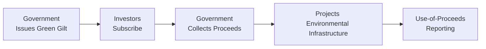

## Introduction

Ever found yourself swapping stories at a finance conference about the latest market innovations, only to be surprised when someone mentions “Green Gilts” as if it’s the most obvious thing in the world? I remember a few years back, I was chatting with an old colleague who casually said, “Well, you know, the new green gilt might actually yield less, but at least I can feel good about it.” Honestly, at first, I thought he was joking around—why would the government name a bond differently just because it’s used for climate projects? Then it hit me: the official impetus behind Green Gilts is rapidly reshaping sovereign debt markets.

Green Gilts are government-issued bonds intended to fund sustainable, environmentally friendly projects. While high-level discussions of climate action can be super complicated, the basic idea of Green Gilts is pretty straightforward: they channel capital into projects like renewable energy, clean transportation, and pollution reduction. The proceeds are “earmarked,” meaning they should be used specifically for climate-related or other sustainability initiatives. But let’s dig deeper to see how all of this fits into the bigger picture of government debt, ESG principles, and evolving investor demand.

## Key Concepts and Definitions

• Green Gilts  
  Sovereign bonds designated to finance green or climate-focused projects. In the UK, these instruments have come to be known as “Green Gilts.” Other nations may use slightly different branding (e.g., “Sovereign Green Bonds” in some parts of Europe or Asia), but the concept remains consistent: issue a bond with proceeds pledged to green initiatives.  

• Climate Finance  
  An umbrella term describing funds directed toward reducing greenhouse gas emissions or boosting resilience to climate impacts. Green Gilts fit snugly under this category because they channel capital into such activities.  

• Green Bond Principles (GBP)  
  These are voluntary guidelines, published by the International Capital Market Association (ICMA), that encourage transparency and proper disclosure for issuers of green bonds. The goal is to ensure that the capital raised is genuinely going toward green projects.  

• Use-of-Proceeds Reporting  
  This reporting approach tracks where exactly the bond proceeds are flowing. Investors want reassurance that their money actually ends up supporting real-world sustainable projects like wind farms or waste management facilities. 

## The Role of Green Gilts in Government Debt Markets

Governments issue debt for myriad reasons—covering budget deficits, funding infrastructure, providing emergency relief, and so forth. Green Gilts (or more broadly, climate-focused government debt) are a specialized subset created to support environmentally or socially beneficial projects.

Here’s why they’re gaining traction:

• Alignment with ESG Objectives:  
  Many investors nowadays consider environmental, social, and governance (ESG) metrics when allocating funds. A government that launches a green gilt program is, in some sense, signaling seriousness about climate action.  

• Demand Pull and Price Impacts:  
  ESG-centric portfolios and sustainability indices might have higher demand for these securities, potentially affecting yields. Sometimes these bonds trade at a “greenium,” which is a slightly lower yield than ordinary sovereign debt, because investor demand exceeds supply.  

• Policy Tool:  
  Governments can direct resources toward climate policy goals without needing brand-new budget lines. Issuing a green gilt earmarks capital for, say, building new carbon-neutral public transport systems, all while tapping into broad fixed-income investor bases.

## Issuance Process and Structural Features

Green Gilts closely resemble conventional gilts (or other sovereign bonds), except for the additional layers of project eligibility requirements and reporting on environmental impact. Typically:

1. Government designs a green bond framework in line with recognized standards, such as ICMA’s Green Bond Principles or the Climate Bonds Initiative guidelines.  
2. The government’s debt management office (e.g., the UK’s Debt Management Office, or DMO) issues the bond. The issuance might involve bookbuilding or auctions—traditional methods used in government bond markets.  
3. Proceeds are ring-fenced or “earmarked” for specified green projects.  
4. Ongoing monitoring and external reviews help confirm the actual use of proceeds.  
5. Impact reports are published, detailing how the capital was applied and what environmental benefits resulted.

Below is a simplified diagram showing the typical flow of funds and reporting for a Green Gilt:

## Use-of-Proceeds and Reporting Requirements

If there’s one thing that’s crucial for green debt issuances, it’s transparency. When you purchase a standard government bond, you might not worry about the specific highways, hospitals, or defense programs funded by your money. But with a Green Gilt, the entire point is to finance climate-focused initiatives. Investors and regulators expect clarity on:

1. Exactly which projects qualify for funding under the bond framework.  
2. Periodic updates on how much money went to each project.  
3. Metrics for measuring environmental or social impact (e.g., reductions in CO₂ emissions, energy savings, water conservation).  

This can be more elaborate than the normal disclosure for a typical Gilt. On the upside, governments that excel at reporting can bolster their ESG credibility, drawing deeper pools of capital from sustainability-oriented institutional investors.

## Market Demand and Pricing Dynamics

One question folks always ask is: do Green Gilts cost governments more? Maybe yes, maybe no. It depends on supply and demand in the market. In many cases, there's enough demand from sustainability-driven investors to drive yields slightly lower. That’s often called a “greenium.” However:

• Demand Volatility:  
  Investor appetite for green instruments could diminish if central banks tighten monetary policy or if alternative ESG investments become more attractive.  

• Liquidity Considerations:  
  Liquidity of these bonds can be slightly lower than mainstream benchmark gilts, especially right after issuance when the total outstanding might be smaller. Over time, though, as green bond markets scale, liquidity tends to improve.  

• Benchmark Spread:  
  In theory, because the credit risk is identical to other government securities, the spread difference purely reflects market preference for the green label. Sometimes the difference is minimal; other times, it’s significant.

## Potential Challenges and Pitfalls

It’s not all sunshine and wind turbines, though. Some pitfalls and challenges can arise:

• Greenwashing:  
  If the government uses the bond label but only partially commits the proceeds to truly environmentally helpful projects, the credibility of green issuance might be undermined. Investors are cautious about “greenwashing,” where the marketing is more robust than the actual environmental impact.  

• Additional Costs for Reporting:  
  Strict reporting adds overhead. The government might have to put extra staff and systems in place to track expenditures and outcomes.  

• Regulatory Divergence:  
  Different regions have varying definitions of what qualifies as “green.” This can create confusion for cross-border investors.  

• Performance Risks:  
  Climate projects may have unique risks (e.g., new technology or uncertain regulatory support). During times of market turmoil, or if promised projects fail to meet environmental goals, trust in the program can erode.

## Real-World Examples and Case Studies

• UK Green Gilts:  
  The United Kingdom introduced its first Green Gilt in 2021, raising billions of pounds for initiatives such as offshore wind and zero-emission public transport. The issuance framework aligned with the ICMA Green Bond Principles, and the government committed to transparent impact reporting. Demand was strong, and the deal priced competitively compared with regular gilts.  

• France and Germany:  
  Both countries have also issued sovereign green bonds. Germany has even created a “twin bond” approach—releasing a green version alongside a regular bund with the same maturity. This design aims to foster liquidity and make the “greenium” more transparent.  

• Emerging Markets:  
  Some developing economies have ventured into green bond issuance, albeit in smaller volumes. Their challenge often lies in establishing robust reporting frameworks and attracting the global investor community.

## Integration with Accounting Standards and Disclosures

From a financial reporting perspective, Green Gilts typically follow the same accounting treatment as any other sovereign bonds under IFRS or US GAAP. The distinction lies primarily in the additional disclosures regarding use of proceeds, environmental impact, and adherence to the Green Bond Principles. Larger institutional investors might also reflect these holdings differently in their sustainability reports or their TCFD (Task Force on Climate-related Financial Disclosures) statements.  

Because IFRS or US GAAP do not currently have unique line items for “green bonds,” the classification of the debt itself is typically the same as any other government issue. Instead, supplemental disclosures in the notes to the financial statements or separate ESG reports provide clarity on how proceeds are deployed.

## Practical Example of Yield Differences

Let’s do a quick hypothetical comparison:

Suppose Country X issues two 10-year bonds on the same day, each with a face value of $1,000:

1. Standard Bond: 2.50% coupon  
2. Green Bond: 2.45% coupon  

Let’s say the Green Bond ends up priced at par (100) because there’s robust interest from ESG-focused funds. Meanwhile, the standard bond might slightly hover around 99.8 (which translates to a slightly higher yield to maturity) because it doesn’t have the green label. This is a simplified scenario, but it shows how the “greenium” can manifest as either a lower coupon or a higher price for the same coupon.

Mathematically, if the standard bond trades at a yield to maturity (YTM) of 2.52%, the green bond might come in at 2.48% due to stronger ESG demand. The difference is small—only 4 basis points. But it can be meaningful for large institutional investors, especially pension funds, deciding whether to position themselves as “sustainable” investors.

Here’s a simple formula for the approximate yield to maturity (YTM) on an annual-pay bond:


 \text{YTM} \approx \frac{C + \frac{F - P}{n}}{\frac{F + P}{2}}


Where:  
• \\(C\\) = annual coupon payment amount  
• \\(F\\) = face value (e.g., 1,000)  
• \\(P\\) = current bond price  
• \\(n\\) = years to maturity  

When \\(P\\) goes slightly higher (because of stronger demand), the YTM goes slightly lower, illustrating the “greenium.”

## Ongoing Monitoring and Impact Measurement

Governments typically set key performance indicators (KPIs) to track the environmental influence of green-bond-funded projects. Common KPIs might include:

• Renewable energy capacity installed (in megawatts)  
• Reduction in annual greenhouse gas emissions (in CO₂ equivalent)  
• Improvements in air quality or biodiversity measures in the financed area  

Investors often watch for these metrics, which ensures accountability and helps them decide whether to participate in future issuances.

## Conclusion

Green Gilts and other climate-focused government bonds propel capital directly into environmentally beneficial initiatives. Far from being a niche product, they’re becoming mainstream in sovereign debt markets. But this popularity brings heightened scrutiny—from the necessity of transparent reporting to questions about whether certain projects are genuinely “green.” It’s an evolving space, and governments that provide rigorous frameworks and credible ESG data can win the trust (and money!) of global investors.

We’ve seen how yields, investor demand, and official frameworks interlock. We’ve also noted potential challenges like greenwashing and the cost of compliance. Overall, the rise of Green Gilts signals a broader shift in fixed-income markets: capital allocation decisions increasingly consider climate risks and opportunities, adding a new layer of responsibility and nuance to sovereign debt investing.

## References and Further Reading

• International Capital Market Association (ICMA) Green Bond Principles:  
  https://www.icmagroup.org  

• UK Debt Management Office (Green Gilt Framework):  
  https://www.dmo.gov.uk  

• Climate Bonds Initiative:  
  https://www.climatebonds.net  

• Task Force on Climate-related Financial Disclosures (TCFD):  
  https://www.fsb-tcfd.org  

• Official CFA Institute materials on ESG Integration and Fixed Income  

## Test Your Knowledge: Green Gilts and Climate Debt Quiz



### Which of the following best describes a Green Gilt?

- [ ] A bond that focuses exclusively on financing conventional fossil fuel projects.
- [ ] A short-term instrument used primarily by emerging markets to raise funds.
- [x] A government bond whose proceeds are allocated to environmentally beneficial projects.
- [ ] A private placement bond available only to institutional investors.

> **Explanation:** Green Gilts are sovereign bonds issued to fund climate or environmental projects, in line with recognized standards such as the Green Bond Principles.

### What is a primary reason investors might accept a lower yield on Green Gilts?

- [x] They have a strong desire to support ESG initiatives, creating higher demand.
- [ ] Green Gilts offer better liquidity than traditional government bonds.
- [ ] Green Gilts carry more credit risk than standard gilts.
- [ ] Green Gilts are tax-free in all jurisdictions.

> **Explanation:** Investor demand for sustainable or ESG-compliant securities can push prices up, reducing yield—often referred to as a “greenium.”

### According to the Green Bond Principles, what is crucial for maintaining the credibility of green bonds?

- [x] Transparent reporting on the use of proceeds.
- [ ] Mandatory interest rate caps.
- [ ] Eliminating all possible underwriting fees.
- [ ] Complete reliance on credit default swaps for protection.

> **Explanation:** The Green Bond Principles emphasize transparency, disclosure, and reporting so that investors can see exactly how funds are allocated and what impacts are achieved.

### Which of the following risks is specifically associated with the credibility of Green Gilts?

- [ ] Reinvestment risk.
- [x] Greenwashing.
- [ ] Interest rate risk.
- [ ] Basis risk.

> **Explanation:** “Greenwashing” refers to misrepresenting or overstating the environmental benefits of bonds labeled as “green.”

### How do accounting standards (IFRS or US GAAP) typically treat Green Gilts compared to regular sovereign bonds?

- [ ] They require separate classification entirely.
- [x] They apply the same classification rules, with additional voluntary ESG disclosures.
- [ ] They prohibit the issuance of Green Gilts.
- [ ] They require all Green Gilts to be treated as derivatives.

> **Explanation:** IFRS and US GAAP do not differentiate between standard and green bonds but encourage additional disclosures about the use of proceeds.

### In many cases, Green Gilts trade at:

- [x] Slightly lower yields because of increased ESG-driven demand.
- [ ] Higher yields because they have less demand.
- [ ] The same yield as every other bond with a similar maturity.
- [ ] Floating rates always tied to inflation.

> **Explanation:** Green Gilts may command a premium price (and thus a lower yield) due to strong demand.

### Which of the following is a typical metric governments measure to demonstrate the impact of Green Gilt proceeds?

- [x] Reduction in annual CO₂ emissions.
- [ ] Comparative data on bond default rates.
- [x] Volume of renewable energy capacity added.
- [ ] Stock market indices.

> **Explanation:** Investors expect clear environmental metrics, such as CO₂ reductions or renewable capacity installed.  

### Which statement is true about the liquidity of Green Gilts compared to standard government bonds?

- [x] Green Gilts can sometimes have slightly lower liquidity due to smaller issuance sizes.
- [ ] Green Gilts are always more liquid because of mandatory central bank purchases.
- [ ] Liquidity is irrelevant for Green Gilts.
- [ ] They are only traded on private exchanges.

> **Explanation:** Often, initial Green Gilt issuances are smaller, leading to somewhat lower liquidity until the market matures or the government issues more.

### An example of a potential pitfall for Green Gilts is:

- [x] Inconsistent standards across different countries leading to confusion.
- [ ] Guaranteed refunds to investors when a project underperforms.
- [ ] Immediate default if funds are misallocated.
- [ ] Zero need for impact measurement.

> **Explanation:** Divergent definitions of “green” or “sustainable” can create confusion and hamper market growth.

### A “greenium” refers to:

- [x] A situation where Green Gilts command a lower yield relative to conventional bonds.
- [ ] Exchange-rate risk associated with cross-border green bond trading.
- [ ] The premium credit rating assigned automatically to green bonds.
- [ ] A guarantee that the bond is convertible into equity at maturity.

> **Explanation:** The term “greenium” is commonly used to describe the yield differential often observed when green bonds (such as Green Gilts) price at a premium to their conventional counterparts.


