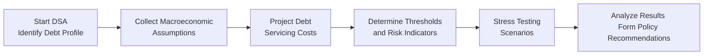

## Introduction

Have you ever found yourself wondering if a country can keep borrowing forever without running into trouble? You’re not alone. I remember chatting with a friend who believed governments just “print more money” whenever they need to repay debts. Well, that might work briefly—but it sure doesn’t solve the deeper question: How do you figure out whether a government’s debt is actually sustainable? That’s where Debt Sustainability Analysis (DSA) steps in.

In a nutshell, DSAs help evaluate if a country’s current projected debt load is manageable under expected economic conditions (and a bunch of less friendly ones, too). If a country’s debt is sustainable, it can service interest and repay principal without drastic cuts to public services or painful tax hikes. If not, faced with shocks or recessions, it might need rescue loans or face default. This is quite significant for global lenders, bond investors, policy advisors, and your typical multi-asset portfolio manager who includes sovereign debt in the mix.

## Why DSAs Matter

A government’s ability to pay back its debts impacts everything from national infrastructure budgets to inflation targets—and it absolutely influences the risk-return profile of fixed-income portfolios. The International Monetary Fund (IMF) and World Bank lead the charge in formalizing how we measure and monitor sustainability. Their frameworks incorporate a variety of economic and fiscal markers, historical precedents, and stress-testing approaches to forecast whether the debt path remains stable.

This process is particularly important for low-income economies that tap into concessional funding or relief initiatives such as the Heavily Indebted Poor Countries (HIPC) Initiative. Let’s explore the core concepts, the methodology used to assess debt sustainability, and how the results might shape policy reforms and lending terms.

## Key Concepts in Debt Sustainability Analysis

### Defining Debt Sustainability
Debt sustainability refers to a government’s capacity to service its debt under current and plausible future conditions without infinitely rolling over deficits or jeopardizing basic public services. Basic yardsticks include:


\text{Debt-to-GDP Ratio} = \frac{\text{Total Debt}}{\text{GDP}}



\text{Debt Service-to-Exports Ratio} = \frac{\text{External Debt Service}}{\text{Exports}}


On top of that, analysts look at the government’s revenue base, expenditure priorities, and potential growth shocks. A ratio that might seem manageable under growth-friendly scenarios could become unmanageable if a global recession hits, export prices tank, or local borrowing costs spike.

### External vs. Domestic Debt
Sovereign debt can be classified by currency (home currency or foreign currency) and ownership (held by domestic or external investors). External debt often involves exchange-rate risk—if the local currency depreciates, payment burdens rise. That’s why external debt levels and external debt service ratios are center stage in DSA for many emerging and developing economies.

### Sovereign Debt Stress Testing
Stress testing simulates how a country’s debt load holds up under severe but plausible scenarios, such as commodity price shocks, interest rate spikes, or a collapse in export revenues. Analysts vary key assumptions to see when the debt becomes unsustainable, or at least borderline worrisome. This ensures that policy advice factors in unexpected downturns—like the one I remember hearing about back in 2020, when commodity exporters were blindsided by a global slowdown.

### Concessionality and the Grant Element
When a loan is offered below market interest rates with extended maturities, it includes a “grant element.” A high grant element reduces the future repayment burden. This concept is critical to the IMF and World Bank’s analysis when deciding how to structure financial assistance. They might require that new loans meet a certain concessional threshold before they sign off on a support package.

## The IMF and World Bank Frameworks

The IMF and World Bank have standardized frameworks for Debt Sustainability Analysis, especially focused on low-income countries. The frameworks aim to:

• Evaluate baseline scenarios using macroeconomic forecasts (including GDP growth, interest rates, commodity prices).  
• Set thresholds for indicators (e.g., external debt-to-GDP, debt service-to-exports) based on empirical data from comparable countries that have experienced debt crises.  
• Conduct stress tests, altering these forecasts to see how the debt variables respond under less favorable conditions.  
• Provide a rating of overall debt distress risk—ranging from “Low Risk” to “High Risk” or “In Distress.”

### Baseline and Stress Scenarios
The baseline scenario looks at the “most likely” path for GDP growth, inflation, interest rates, and so on. For instance, the framework might assume moderate growth and stable local borrowing costs if the country’s central bank is successfully keeping inflation in check.

Stress scenarios layer on external shocks—like a decline in exports, a spike in international interest rates, or a “sudden stop” in capital flows. If these stress scenarios show that the country’s debt blows up out of proportion, policymakers get a warning sign.

### Thresholds and Policy Triggers
These frameworks impose numerical thresholds giving a sense of when debt is too high. For example, if the external debt-to-GDP ratio consistently exceeds a certain percentage, the country is flagged as potentially high-risk. The IMF might then require policy measures—like fiscal consolidation, structural reforms, or more prudent borrowing plans. In some cases, a country might be advised to restructure its debt, or the creditors could grant partial relief (like in the HIPC Initiative).

### Practical Example – The HIPC Initiative
Under the Heavily Indebted Poor Countries (HIPC) Initiative, eligible nations that commit to specific macroeconomic reforms and poverty-reduction policies can have part of their external debt forgiven. The IMF and World Bank rely on DSAs to determine if a country qualifies. Strangely enough, while this might sound straightforward, countries sometimes have to wait for multiple DSAs or meet a “completion point” of reforms to receive full debt relief. This shows how DSA outcomes can directly influence a government’s path to achieving debt viability.

## Understanding the DSA Process

Below is a simplified flowchart to illustrate the iterative steps in a typical DSA:



As you can see, these steps feed into each other. Outcomes from the final analysis can loop back to inform the next iteration of macro assumptions or debt structure decisions.

## A Quick Python Example for Debt Valuation

While DSAs are broader than just discounting future debt payments, computing the present value of the debt stock is necessary. Here’s a quick snippet (purely illustrative) that calculates the present value of coupon payments and principal redemption:

```python
import math

def present_value_of_debt(par_value, annual_rate, years, discount_rate):
    # Generate yearly coupon flows for 'years' periods
    cash_flows = [par_value * annual_rate for _ in range(years)]
    # Add the principal repayment in the final year
    cash_flows[-1] += par_value
    pv = 0
    for t, cf in enumerate(cash_flows, 1):
        pv += cf / ((1 + discount_rate) ** t)
    return pv

pv_debt = present_value_of_debt(1000, 0.05, 10, 0.04)
print(f"Present Value of Debt: {pv_debt:.2f}")
```

Although real-world DSAs use more complex macro and country-specific factors, the principle is the same: gauge how changes in discount rates or interest rates affect overall debt burdens.

## Real-World Insights and Best Practices

• Prioritize Data Accuracy: A DSA is only as good as its inputs. If GDP forecasts are overly optimistic (or if inflation is understated), the entire analysis might miss brewing problems.  
• Engage in Regular Updates: Annual or semi-annual DSAs ensure that policy adjustments are nimble. Rapidly changing global conditions—like a war impacting oil prices—necessitate quick revisions.  
• Don’t Ignore Off-Balance Sheet Items: Some forms of contingent liabilities (like state guarantees for public enterprises) can become real obligations almost overnight.  
• Coordinate with Other Programs: DSAs feed into the lending frameworks for IMF Stand-By Arrangements, Extended Fund Facilities, or World Bank development loans, guiding interest rates, maturity structures, and potential debt relief.

## Pitfalls and Challenges

• Over-Reliance on Historical Patterns: Countries can change drastically. A fast-growing developing nation with new resource discoveries might handle more debt than older thresholds suggest. On the flip side, ignoring historical lessons might lead to unrealistic assumptions.  
• Political Constraints: Implementing tough budget reforms is no walk in the park. Even if a DSA says “cut the deficit,” it might be politically sensitive to reduce social spending or raise taxes.  
• Data Limitations: Certain nations have incomplete records or untracked state-owned enterprise borrowing. Missing data can drastically distort a DSA.

## Strategies for Improvement

• Broaden the Stress Test Repertoire: Combine macroeconomic shocks with potential environmental or climate-related shocks.  
• Strengthen Local Capacity: Encourage in-country expertise so that governments can do DSAs proactively rather than waiting for external agencies.  
• Foster Transparent Disclosure: Lenders, rating agencies, and the public should be able to see how DSA thresholds were decided, which fosters trust and reduces speculation.

## Conclusion

Debt Sustainability Analysis is a cornerstone of sovereign risk management, shaping the IMF and World Bank’s lending frameworks. It involves systematically evaluating a government’s capacity to meet future debt obligations without eye-watering tax hikes or crippling cuts in public services. By applying standardized metrics, thresholds, and stress testing, the DSA framework offers a roadmap for governments, multilateral agencies, and investors to gauge sovereign risk levels.

For CFA Level I candidates, understanding DSAs underscores the broader principle of measuring creditworthiness, analyzing macroeconomic fundamentals, and assessing how policy reforms (or lack thereof) feed into debt outcomes. When used thoughtfully, DSAs can help preempt debt crises—and maybe spare your portfolio from a nasty write-down on sovereign bonds!

## Exam Tips for Aspiring CFA Charterholders

• Familiarize yourself with key sovereign debt ratios—debt-to-GDP, debt service-to-revenues, debt service-to-exports.  
• Understand how macroeconomic assumptions feed into baseline DSA scenarios, and how stress tests reveal vulnerabilities.  
• Remember the significance of concessional loans and how the IMF/World Bank compare these to standard market financing.  
• Review how DSA results can trigger different policy measures or risk flags in global lending frameworks.

### References and Further Reading

• IMF (https://www.imf.org) and World Bank (https://www.worldbank.org) Official Documents on Debt Sustainability Analysis.  
• Eichengreen, B. (2002). Crisis Prevention and Crisis Resolution. Oxford University Press.  
• CFA Institute. (Most recent edition). CFA Program Curriculum, Level I & II readings related to sovereign debt, credit risk, and macroeconomics.  

## Test Your Knowledge: Debt Sustainability and IMF/World Bank Frameworks



### In the context of Debt Sustainability Analysis (DSA), which ratio directly measures the capacity of a government’s export earnings to service its external debt?

- [ ] Debt-to-GDP ratio
- [ ] Budget deficit as a percentage of GDP
- [x] Debt service-to-exports ratio
- [ ] Nominal interest rate

> **Explanation:** The debt service-to-exports ratio divides a country’s external debt service obligations by its export earnings, measuring how well foreign trade revenues can meet external debt payments.

### Which of the following most commonly triggers debt relief under the Heavily Indebted Poor Countries (HIPC) Initiative?

- [ ] Continuous real GDP growth above 5%
- [x] Achievement of completion point after following IMF/World Bank-supported programs
- [ ] Consistent budget surpluses
- [ ] Declining population growth

> **Explanation:** HIPC relief is generally provided when eligible countries meet certain policy reforms and complete specific milestones set by the IMF and World Bank. Reaching the completion point typically triggers more substantial debt relief.

### Which best describes a “grant element” in concessional lending?

- [x] The portion of a concessional loan that reduces its net present value compared to a market-rate loan
- [ ] The fee charged by a central bank for emergency financing
- [ ] The portion of tax revenue set aside for debt repayment
- [ ] The net cost to the IMF of underwriting a sovereign loan

> **Explanation:** The grant element quantifies how much of a loan’s value is essentially “given away” due to lower interest rates and longer maturities relative to standard market terms.

### Which of the following is a key difference between external and domestic debt for sovereign issuers?

- [ ] Domestic debt is more likely to trigger exchange rate volatility.
- [x] External debt is often subject to foreign-currency risk, increasing repayment burdens if the local currency depreciates.
- [ ] External debt is only issued to multilateral institutions like the IMF.
- [ ] Domestic debt typically has higher legal protection for lenders.

> **Explanation:** External debt exposes the issuer to currency risks. If the local currency weakens, external debt servicing costs rise significantly when converted back into local currency.

### What is the principal objective of sovereign debt stress testing?

- [ ] Maximizing a government’s borrowing capacity
- [x] Assessing debt viability under adverse economic scenarios
- [ ] Eliminating the possibility of default
- [ ] Encouraging private financing for government projects

> **Explanation:** Stress testing helps policymakers and analysts evaluate whether a country’s debt remains sustainable if faced with shocks such as lower exports, higher interest rates, or commodity price plunges.

### How do threshold values in the IMF/World Bank DSA framework typically arise?

- [x] From historical data on countries that experienced debt distress
- [ ] From a single, fixed value set by the IMF constitution
- [ ] By using the sovereign’s credit rating
- [ ] Negotiated directly with bondholders during debt issuances

> **Explanation:** The frameworks use statistical analysis of countries that have undergone debt crises to establish indicative thresholds for debt ratios.

### Which of the following often accompanies a high debt service-to-exports ratio?

- [x] Vulnerability to currency shocks
- [ ] Improved credit rating
- [x] Reduced capacity to import goods and services
- [ ] Automatic reduction in interest rates

> **Explanation:** A high debt service-to-exports ratio means more export revenue is devoted to debt repayment, leaving less capacity to pay for essential imports. This also implies vulnerability if the local currency depreciates.

### Why might a country’s off-balance-sheet obligations pose a challenge for DSA?

- [x] They are not always transparent but can quickly become real liabilities
- [ ] They are typically repaid by private enterprises only
- [ ] They are included in full in baseline scenarios
- [ ] They diminish the need for external borrowing

> **Explanation:** Off-balance-sheet obligations, like contingent liabilities or state guarantees, are often omitted from formal debt statistics but can drastically raise actual debt burdens if they materialize.

### Which of the following best explains the approach of the IMF/World Bank DSA?

- [x] Baseline forecasts plus stress scenarios are used to gauge whether debt remains sustainable
- [ ] Purely backward-looking analysis that focuses on historical data only
- [ ] Cross-hedging using currency swaps
- [ ] Utilizing only one interest rate assumption for all government debt

> **Explanation:** The IMF/World Bank approach relies on setting a baseline forecast for key variables and then running “what-if” stress scenarios to see if the debt path remains stable.

### True or False: The HIPC Initiative’s debt relief applies only to middle-income countries.

- [ ] True
- [x] False

> **Explanation:** The Heavily Indebted Poor Countries (HIPC) Initiative targets the world’s poorest nations that meet specific criteria. It does not apply solely to middle-income economies.


