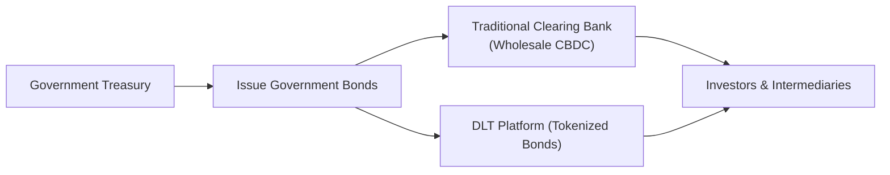

## Overview

Central Bank Digital Currencies (CBDCs) are, at their heart, digital forms of a country’s sovereign currency. They’re issued and regulated by central banks—no different than traditional banknotes except that they exist in a fully digital format. You might be thinking: “But isn’t money already mostly digital?” Yes and no. Much of what we do in payments is indeed electronic, yet behind the scenes, commercial bank money is different from central bank money. CBDCs are unique because they represent a direct liability of the issuing central bank, as opposed to being a claim on a commercial bank.

CBDCs—and the technology supporting them—have the potential to reshape how governments issue and manage their debt. You could see a world where government securities are tokenized, traded on distributed ledgers with lightning speed, and settled within seconds. It’s like going from old-fashioned snail mail to instant messaging. Gone are the days of T+2 or T+3 settlements, replaced by near real-time finality.

This section explores how CBDCs might influence government debt issuance processes, market liquidity, and payment settlement. We’ll delve into benefits such as direct distribution of government payments and discuss the many risks and implementation challenges, from cybersecurity concerns to potential financial disintermediation. The topic is fascinating—some of us have been in finance for years, occasionally wishing we could snap our fingers and have immediate trades. CBDCs might get us closer to that reality.

## Potential Impact on Government Debt Issuance

A government’s debt issuance historically involves the treasury or finance ministry, a network of primary dealers, clearing entities, and eventually the broader investment community. Let’s face it, nothing about that setup is exactly “instant.” But with CBDCs and distributed ledger technology (DLT), there’s a vision of issuance that is far more direct and transparent.

Tokenized Government Bonds  
One of the most intriguing innovations is the possibility of tokenized government bonds, where every bond coupon or principal repayment can be recorded as a token on a blockchain or similar DLT network. The bond and the currency used to settle that bond both become digital tokens, making the entire lifecycle—issuance, trading, coupon payments, redemption—trackable on a single shared ledger. Some central banks have already run pilot programs exploring this concept.

Direct Access and Retail Participation  
Retail CBDCs also open the door for direct public participation in primary auctions. Imagine your central bank’s website or mobile app invites you to buy a small slice of a newly issued government bond. Instead of going through your bank or broker, you could purchase directly, receiving your digital bond tokens instantly in your CBDC wallet. This approach could widen the investor base and potentially reduce dependency on large intermediaries, although it also begs questions about how to maintain stable bank intermediation.

Cost Savings  
CBDCs can reduce transaction costs by eliminating the need for multiple clearing and settlement intermediaries. This is especially relevant in cross-border transactions, where currency exchanges and clearing house fees can add layers of complexity. With a robust DLT solution, real-time settlement might be achieved without relying on a chain of correspondent banks, lowering costs for issuing governments and investors.

## Market Liquidity and Payment Settlement

In the context of government bond trading, high liquidity is like oxygen: everyone needs it, or the market chokes. How might CBDCs affect this liquidity? Let’s consider a few angles:

• Instant Settlements and Reduced Counterparty Risk  
CBDCs can provide near-instant settlement—essentially reducing the time between trade execution and finality. That compresses counterparty risk because the longer settlement lags, the greater the risk that one party might default before the trade completes. With real-time settlement, some friction in repurchase (repo) operations could diminish, though ironically, near-zero settlement times can reduce intraday liquidity if market participants aren’t used to the speed.

• Central Bank Operations and Collateral  
Central banks often use government bonds as collateral for short-term liquidity operations (e.g., repos). In a CBDC environment, these repos could be automated via DLT-based smart contracts. The risk is that potential disruptions—say a technical glitch—might ripple through the entire settlement process more quickly, requiring robust contingency measures. But if done right, the speed and efficiency could be extraordinary compared to legacy systems.

• Disintermediation vs. Innovation  
If individuals and companies hold CBDCs directly with the central bank, commercial banks may lose a portion of their deposit base. In a worst-case scenario, large-scale migration to CBDCs could reduce bank liquidity, hamper lending, and eventually affect government bond markets. On the other hand, new financial intermediaries may emerge in the form of digital asset exchanges and DLT-based clearinghouses, creating new layers of liquidity.

## Practical Example of DLT Settlement

It can be helpful to visualize how a DLT-based bond settlement might work:

In this simplified depiction, the government treasury issues bonds, which can either flow through a traditional clearing bank using a wholesale CBDC infrastructure or be tokenized directly onto a DLT platform, giving investors and market intermediaries near-instant access and settlement.  

## Implementation Considerations

Wholesale vs. Retail CBDC Models  
CBDCs can be “wholesale,” meaning they’re typically used for interbank or large-value transactions, or “retail,” meaning individuals and businesses can transact directly through the central bank’s digital currency. Wholesale is often the first step, as it closely resembles current central bank reserve accounts. Retail CBDCs carry more sweeping implications, potentially bypassing commercial banks for routine transactions.

Synchronizing Monetary Policy  
Central banks must reconcile their existing policy frameworks with the real-time velocity of CBDC transactions. Monetary policy could become more potent because the central bank might distribute money instantly, but also more volatile if large population segments decide to move funds in or out of the CBDC system rapidly.

Interoperability with Legacy Systems  
Most governments can’t just flick a switch. They need to ensure new digital solutions interact seamlessly with legacy financial infrastructure—like older payment systems and settlement processes. During the transitional phase, parallel systems will likely exist, creating complexities around standardization, data formats, and operational risk.

## Cybersecurity and Risk Management

CBDCs require robust cybersecurity architectures. A widely visible hack or data breach in a CBDC system would be catastrophic, undermining trust in both the digital currency and the government’s broader financial apparatus. Some central banks will rely on permissioned blockchains—creating controlled environments where only authorized validators (e.g., regulated financial institutions) can participate in the consensus process.

In addition, there could be privacy concerns for individuals. Retail CBDCs might allow central banks to trace every transaction. On the one hand, that’s great for anti-money laundering (AML). On the other, it could invoke civil liberty issues. And from a government bond perspective, the identity and transaction data of bondholders would be strictly monitored, possibly even in real time.

## Real-World Examples

• People’s Bank of China (PBoC)  
China’s e-CNY project is one of the most advanced large-scale CBDC experiments. While it primarily focuses on retail usage, there’s speculation the e-CNY may eventually link to government debt issuance for more efficient distribution.  
• Europe and the Digital Euro  
The European Central Bank (ECB) has been exploring a digital euro, which might integrate with existing TARGET2 systems for cross-border European bond settlement. Some pilot programs are testing DLT-based bond issuance at the national level.  
• BIS Innovation Hub  
The Bank for International Settlements has coordinated multiple projects (like “Project Helvetia” or “Project Jura”) that explore wholesale CBDC for settlement of tokenized assets, including government bonds.

## Best Practices and Pitfalls

Best Practices  
• Start with Wholesale: Many experts suggest rolling out wholesale CBDCs first, refining the technology in high-value interbank transactions before attempting retail usage.  
• Maintain Backup Systems: Implement robust fallback solutions in case digital ledgers experience downtime.  
• Clear Regulatory Framework: Collaborate with legislative bodies to ensure clarity on legal definitions of digital assets, liabilities, and enforceability.  
• Phased Transition: Introduce new settlement mechanisms gradually, maintaining parallel operations with legacy systems until reliability is proven.

Common Pitfalls  
• Overlooking Disintermediation: If individuals rush to hold their funds in CBDCs, commercial banks could suffer liquidity crunches, and bond market stability might face unintended consequences.  
• Inadequate Cyber Defense: Failing to secure DLT platforms and user endpoints can lead to hacks, stolen keys, and a resulting loss of faith in both the currency and government debt.  
• Weak Public Acceptance: A reluctance by households or institutions to adopt digital wallets or tokens can stall the new system. Public education and outreach matter as much as the technology.

## Glossary

Distributed Ledger Technology (DLT)  
A database that is shared across multiple nodes or sites, enabling participants to verify transactions without a central authority.

Tokenization  
The process of representing real-world assets—such as bonds, real estate, or even commodities—as digital tokens on a DLT or blockchain platform.

Wholesale CBDC  
A form of CBDC that is limited to financial institutions (e.g., banks, securities firms) for large-scale payments and settlements.

Retail CBDC  
A CBDC accessible by the general public for everyday transactions, akin to digital cash.

## Conclusion

Central Bank Digital Currencies hold so much promise: they might streamline the entire chain of government debt issuance, settlement, and redemption while lowering costs and providing real-time transparency. Still, implementing CBDCs is not a trivial task. The potential for financial disintermediation, privacy concerns, and interoperability hurdles means governments—and their central banks—need to tread carefully. 

But that’s what makes finance so thrilling: every decade, we see innovations that transform markets. CBDCs may offer a quantum leap—one that could reshape the fixed-income landscape, from how bonds are issued to how trades are settled in secondary markets. If deployed thoughtfully, CBDCs could pave the way for more efficient, inclusive, and transparent government debt markets worldwide.

## References

• Bank for International Settlements (BIS). (n.d.). Papers and reports on CBDC. Retrieved from  
  https://www.bis.org  
• People’s Bank of China. (n.d.). Research on e-CNY.  
• European Central Bank. (n.d.). Reports on digital euro and DLT-based settlements.  
• IMF Working Papers on Monetary Policy and Digital Currencies. (Various). Retrieved from  
  https://www.imf.org  

## Test Your Knowledge: CBDCs and Government Debt Quiz



### Which of the following is a potential advantage of CBDCs in government bond markets?

- [ ] They allow central banks to bypass monetary policy frameworks altogether.
- [x] They may reduce settlement times and lower overall transaction costs.
- [ ] They automatically eliminate credit risk for all participants.
- [ ] They prevent all forms of financial disintermediation.

> **Explanation:** CBDCs can streamline payment and settlement processes, thus reducing costs and times to settlement. However, they neither eliminate credit risk entirely nor bypass the need for established monetary policy frameworks.

### What is one major concern about retail CBDCs?

- [x] Potential disintermediation of commercial banks.
- [ ] Immediate elimination of sovereign risk.
- [ ] Guaranteed anonymity for all transactions.
- [ ] Complete insulation from cyberattacks.

> **Explanation:** If citizens shift large amounts of deposits into CBDCs, commercial banks could be left with insufficient liquidity. Retail CBDCs do not automatically eliminate sovereign risk, ensure anonymity, or guarantee immunity from cyber threats.

### Why might tokenized government bonds be attractive to investors?

- [ ] They can only be liquidated after the bond’s maturity date.
- [x] They allow near-instant settlement and transparent tracking of ownership.
- [ ] They yield risk-free returns that are higher than conventional bonds.
- [ ] They are always fully anonymous to regulators.

> **Explanation:** Tokenized government bonds could reduce settlement times and improve transparency via a shared ledger. They do not inherently provide higher returns nor guarantee anonymity.

### Which of the following best describes wholesale CBDCs?

- [x] A digital currency primarily used by financial institutions for large-scale settlements.
- [ ] A digital currency generally used by the public for everyday transactions.
- [ ] A form of cryptocurrency not backed by a central bank.
- [ ] A universal credit system outside conventional regulation.

> **Explanation:** Wholesale CBDCs serve interbank services like settlements and are restricted to financial institutions.

### Under a CBDC-based framework, how can coupon payments on government bonds be conducted?

- [x] Automatically and in real-time via smart contracts.
- [ ] Only through manual, end-of-day reconciliation processes.
- [x] Potentially across borders with minimal intermediary fees.
- [ ] By physical delivery of paper checks to investors.

> **Explanation:** Tokenization coupled with DLT smart contracts can streamline and automate coupon payments, even internationally. Traditional manual processes and physical checks become unnecessary in a robust digital framework.

### In a scenario where the public holds large amounts of their funds in retail CBDCs, what potential risk arises?

- [x] Reduced liquidity at commercial banks.
- [ ] Greater reliance on correspondent banking networks.
- [ ] Mandatory elimination of government bond auctions.
- [ ] Instant elimination of volatility in bond prices.

> **Explanation:** Retail CBDCs can lead to deposit flight from commercial banks, shrinking their balance sheets and reducing liquidity. This dynamic does not eliminate bond auctions or volatility.

### Which aspect of CBDCs might pose privacy challenges?

- [x] The ability for central banks to see all retail transactions.
- [ ] The untraceable movement of funds across borders.
- [x] The real-time tracking of bond ownership changes by the government.
- [ ] The impossibility of imposing anti-money laundering rules.

> **Explanation:** CBDCs can enable detailed transaction tracking. While this may help with AML efforts, it also raises privacy concerns.

### Which of the following is a best practice in implementing CBDCs for government debt markets?

- [x] Running pilot programs with wholesale CBDCs first.
- [ ] Forcing immediate adoption by all citizens and businesses.
- [ ] Eliminating all existing clearinghouses at once.
- [ ] Maintaining no backup solutions in case digital infrastructure fails.

> **Explanation:** A careful, phased approach with wholesale pilots is less disruptive. Eliminating all clearinghouses or forcing immediate adoption is risky, particularly without backup systems.

### How might cross-border CBDC transactions affect government debt settlements?

- [x] They could allow faster and cheaper simultaneous exchange of bonds and currencies.
- [ ] They increase the reliance on correspondent banks for remittances.
- [ ] They extend the settlement cycle from T+2 to T+5.
- [ ] They only apply to small, retail transactions.

> **Explanation:** Cross-border CBDC transactions can streamline the exchange of currencies and securities, potentially leading to near-real-time settlement and lower costs.

### True or False: Tokenized government bonds always guarantee higher yields compared to non-tokenized bonds.

- [x] True
- [ ] False

> **Explanation:** This statement is intentionally tricky. Technically, tokenization itself does not guarantee higher yields. The structure for coupon payments, credit risk, and other factors remain the same. However, in some pilot scenarios, yields might differ slightly based on liquidity or novelty premiums. Therefore, the “always” is too strong; yields can vary based on market conditions, risk, and other usual bond factors.


