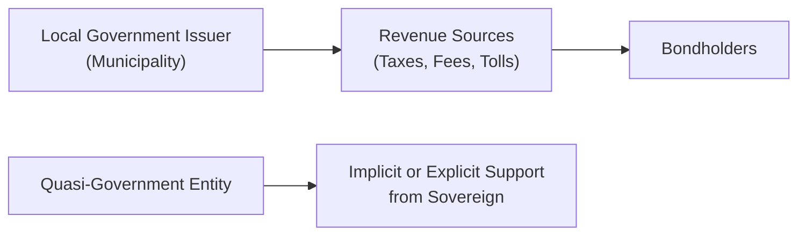

## Introduction 
Non-sovereign and quasi-government bonds play a pivotal role in the global fixed-income landscape, bridging the gap between the safety of sovereign debt and the corporate sector’s broader market. These instruments finance vital public services—think municipal water systems, highways, schools, and hospitals—as well as a range of government-linked projects. And yet, they come with distinct risk-return profiles tied to their revenue sources and to the specific legal and implicit backing they might receive from various government entities. 

I remember chatting with a friend who lives in a small town that had just issued a bond to build a new community library. She was excited about the possibility of investing locally—a great reminder that these bonds are often tied directly to the well-being of our neighborhoods and public infrastructures.

Below, we’ll examine the attributes, structures, and considerations surrounding non-sovereign bonds (like municipal debt) and quasi-government bonds (often issued by government-sponsored enterprises, or GSEs). While “non-sovereign” typically applies to bonds issued by local or regional authorities, “quasi-government” refers to bonds from entities indirectly connected to the central government, sometimes receiving preferred treatment—though this backing is not always explicit. Let’s take a closer look.

## Key Attributes of Non-Sovereign Bonds
Non-sovereign bonds, also known as municipal or sub-sovereign bonds, are issued by state, regional, or local governments. These administrations use the proceeds to fund infrastructure or essential services. The creditworthiness of these bonds largely depends on the revenue sources, which can be either broad-based tax receipts or more narrowly defined project revenues. 

• Tax Revenue Base and Stability  
Non-sovereign issuers often rely on tax revenues (property, sales, or income) to ensure bond payments. A stable or growing economy with a robust tax base can support lower bond yields and strong credit ratings. On the flip side, any local economic downturn—or even a large employer leaving town—may threaten the revenue stream needed for interest and principal. 

• Legal Framework and Governing Authority  
Laws often distinguish between general obligation (GO) bonds and revenue bonds. GO bonds are typically backed by the “full faith and credit” of the issuing entity, including its taxing power. Revenue bonds, on the other hand, are serviced exclusively by income generated from a specific project—such as a toll bridge or a water utility. 

• Impact of Infrastructure Needs  
Infrastructure is a big part of why these bonds exist in the first place. Roads, bridges, sewage treatment plants—all require substantial funding. If a project runs over budget or experiences construction delays, the issuer may need additional funding or face reputational issues. 

## Quasi-Government Bonds and Their Distinctive Features
Quasi-government bonds come from entities with strong links to the central government but are not always backed by a formal, full-faith guarantee. Investors tend to assume (sometimes incorrectly) that the government will provide support in times of crisis, which generally reduces these bonds’ yield relative to purely corporate debt. However, challenging conditions can remind everyone that implicit backing is never a certainty.

• Government-Sponsored Enterprises (GSEs)  
GSEs often focus on important national objectives. For instance, entities that support homeownership may guarantee mortgages or provide funding to enhance housing market liquidity. Because of their perceived ties to the government, these bonds trade at a spread over sovereign bonds but often offer narrower spreads than comparable corporate issues.

• Credit Considerations and Implied Support  
One of the biggest pitfalls is confusing “implied government support” with “explicit government support.” Many quasi-government bonds are not legally guaranteed by the central authority. In times of systemic crisis, the actual extent of support may be tested. Investors must distinguish between “moral obligations” and real, contractual arrangements.

• Funding Public Programs  
Quasi-government bonds might be used to finance specific programs—affordable housing, agricultural initiatives, or grants to local communities for development. Sometimes, these programs generate their own revenues (like guaranteed mortgages), which help repay bondholders over time. The track record and viability of these programs are crucial elements of credit analysis.

## Structural Variations
One reason non-sovereign and quasi-government bonds can be tricky is the variety of structures. Each structure imposes different obligations, which in turn shape credit ratings and yields.

• General Obligation (GO) Bonds  
GO bonds benefit from the issuer’s broadest revenue streams, typically including tax receipts. If the issuer faces revenue shortfalls, GO bondholders are usually senior in the repayment hierarchy. GO bonds may offer relatively lower yields because they are perceived as more secure.

• Revenue Bonds  
Revenue bonds hinge on the success of a particular project. A municipal utility that collects user fees or a toll road that charges drivers are classic examples. If user fees plummet, the issuer’s ability to pay bondholders suffers. Consequently, revenue bonds often carry a slightly higher yield than GO bonds to compensate for this narrower revenue stream.

• Moral Obligation Bonds  
These come with a “moral pledge” by a higher-level government entity to provide funds if the issuing authority can’t cover its obligations. Notice I said “moral” pledge, not a legal obligation. This distinction means the credit quality is contingent on both the issuer’s revenues and the perceived willingness of the higher jurisdiction to cover potential shortfalls.

• Special-Tax Bonds  
Some local governments pledge a specific tax, such as a sales tax on hotels or a “sin tax” on products like tobacco, to repay these bonds. The performance of that tax base thus becomes highly relevant to analyzing payment capacity.

## Visualizing the Relationship
Below is a simple Mermaid diagram that illustrates how non-sovereign entities, quasi-government issuers, and sovereign governments tie together in funding structures:

In many cases, the central government stands off to the side, offering partial support rather than a direct guarantee. Quasi-government entities link back to the sovereign primarily through mission-driven objectives or other forms of indirect support.

## Evaluating Credit Risk
Since these bonds don’t carry the direct credit of a national treasury, understanding the risk-and-return trade-off requires thorough credit analysis.

• Revenue Analysis  
First, consider how robust and diversified the revenue sources are. Less concentration risk means more stable revenues. Let’s say a small municipality’s tax base relies on one major factory; if that factory closes, the local economy could falter—bad news for bondholders.

• Expenditure and Debt Management  
Expenditure flexibility is also key. How easily can a state or local government cut costs or redirect funds if times get tough? Many sub-sovereign bodies have balanced budget requirements, which can limit how much extra debt they can issue.

• Legal and Regulatory Protections  
Municipal bankruptcies or restructurings are less common than corporate defaults, but they do happen. Potential investors should examine state laws that might protect bondholders, such as provisions granting GO creditors priority.

• Implicit vs. Explicit Support  
In quasi-government analysis, pay special attention to legal statements about government backing. A bond might have language like, “Not backed by the full faith and credit of the sovereign.” That’s pretty explicit about what you will—or will not—get. Sometimes rating agencies factor in intangible support, but it’s still not the same as an outright guarantee.

## Market Perceptions and Pricing Implications
Non-sovereign and quasi-government bonds often trade at yields above central government debt because of the extra credit risk. However, these spreads can be narrower than those for comparable corporate bonds, reflecting the perceived stability of a government-related issuer. In changing economic environments—and in times of crisis—these spreads can widen quickly if markets sense a deterioration in the creditworthiness of the issuer or doubts around sovereign support.

Here is a simplified table outlining key differences:

| Feature                            | Non-Sovereign (Municipal) Bonds                              | Quasi-Government Bonds                          |
|------------------------------------|---------------------------------------------------------------|--------------------------------------------------|
| Issuer                             | State, local, regional authorities                           | Govt.-sponsored entities, state-owned firms     |
| Revenue Support                    | Taxes, fees, or project revenues                             | Partially or wholly from govt. programs         |
| Guarantee                          | No full sovereign backing (except rare cases)                | Often “implied,” rarely explicit                |
| Typical Yield Profile              | Higher than sovereign; lower than or close to corporate      | Slightly above sovereign, but below many corporates |
| Credit Risk Factors                | Specific tax/toll base, local economics, legal environment   | Business model, potential govt. bailouts        |
| Structures                         | GO bonds, revenue bonds, moral obligation, special tax       | Bonds from GSEs, publicly owned banks, etc.     |

## Practical Example
Let’s imagine a hypothetical city called Greenfield that decides to issue a revenue bond to build a new public transportation system. The city sets up a fare-based repayment plan. If ridership meets forecasts, revenue easily covers the interest and principal. But suppose fewer commuters than anticipated use the system. The city’s revenue might fall short, forcing them to either hike fares or seek additional local taxes. That shortfall risk is why a revenue bond might offer higher yields than a general obligation bond from the same city.

Meanwhile, consider a quasi-government entity—Call it HousingAid, a GSE tasked with providing affordable mortgages. Investors buy HousingAid’s bonds believing that “the government won’t let it fail.” In normal times, yields remain quite low relative to corporate debt. But, if a housing crisis erupts, that assumption is put to the test. Market yields could spike, going from near sovereign levels to something more akin to high-grade corporate or even higher, depending on how broad the crisis is—and how convinced the market is of actual government support.

## Best Practices and Common Pitfalls
• Diversify Revenue Streams  
Issuers should avoid over-reliance on one sector (e.g., tourism or manufacturing) for tax receipts. The same logic applies to investors: look for entities with stable and varied revenue sources.

• Verify Legal Protections  
Certain states or regions have statutes that favor bondholders in a restructuring. Others may have no such protective laws, so do your due diligence.

• Don’t Overestimate Government Support  
One big pitfall is assuming “too big to fail.” History shows that quasi-government entities can and do run into significant financial distress when underlying fundamentals sour.

• Evaluate Political Climate  
Local politics matter more in non-sovereign debt markets than many investors realize. Changes in governance can lead to unexpected policy shifts that affect revenue generation or resource allocation.

## Exam Tips
• Read the Fine Print on Guarantees: Not all quasi-government issuers benefit from actual government backing. Exam questions might test your ability to differentiate between implicit moral obligations and explicit legal guarantees.  
• Master the Bond Structures: Understand differences between general obligation (GO) versus revenue bonds for sub-sovereign issuers. The exam loves to see if you can properly attribute risk to each type.  
• Assess Credit Quality Thoroughly: Knowing whether a municipality has broad taxing power or depends on narrow project income is crucial. On the exam, you could be asked to rate or compare yield spreads based on the stability of revenue sources.  
• Link to Macroeconomic Factors: A slump in local real estate or a decline in a key industry can dent tax revenues. The exam often includes scenario-based questions where you must spot the macro link to the issuer’s capacity to service debt.

## Key Terms
Municipal Bonds (Munis): Debt securities issued by local governments to finance public projects, often featuring tax benefits for residents.  
Government-Sponsored Enterprise (GSE): Quasi-government entity tasked with supporting specific sectors like housing or agriculture; generally not backed by the full faith and credit of the sovereign.  
General Obligation (GO) Bond: Municipal bond secured by the issuer’s full taxing power and broad revenue base.  
Revenue Bond: A bond where repayment hinges on revenues from a specific project, such as a toll road or utility system.  
Moral Obligation Bond: A bond with a non-binding pledge that a higher-level government entity will cover shortfalls, but without legal compulsion.

## References for Further Exploration
• Kidwell, D. S., et al. (2016). Financial Institutions, Markets, and Money. Wiley.  
• Moody’s and S&P Municipal and Quasi-Government Rating Methodologies:  
  – https://www.moodys.com  
  – https://www.spglobal.com  
• Municipal Securities Rulemaking Board (U.S.): https://www.msrb.org  

## Practice Questions: Non-Sovereign and Quasi-Government Bonds



### Which characteristic best describes a general obligation (GO) bond?
- [ ] It is solely repaid using project revenues. 
- [x] It is backed by the issuer’s full taxing power.
- [ ] It is legally guaranteed by the central government. 
- [ ] It has no backing from any government or revenue source.

> **Explanation:** A GO bond relies on the issuer’s full taxing power (the “full faith and credit” of a municipal authority), unlike revenue bonds that rely solely on specific project revenues.

### When analyzing quasi-government debt, which key distinction should an analyst focus on? 
- [x] Whether the government backing is explicit or merely implied. 
- [ ] Whether the entity has a moral obligation pledge. 
- [ ] Whether the entity is run by volunteers. 
- [ ] Whether the issue size is below $1 billion.

> **Explanation:** The critical difference lies in whether the sovereign explicitly guarantees bond payments. Merely implied support could vanish under stress, making it a central point of analysis.

### A moral obligation bond typically implies: 
- [ ] A binding legal commitment by a higher authority to pay all bond obligations. 
- [x] A non-binding pledge that a higher authority may provide financial support. 
- [ ] A rare type of bond that only exists in emerging markets. 
- [ ] Full faith and credit backing identical to a GSE bond.

> **Explanation:** Moral obligation bonds merely indicate a “moral” but not legally enforceable commitment from a higher-level government. Their backing can be politically motivated and is not a formal guarantee.

### Why might revenue bonds carry higher yields than general obligation bonds?
- [x] They are backed only by project revenues, creating a narrower repayment base. 
- [ ] They always have shorter maturities. 
- [ ] They never get rated by credit agencies. 
- [ ] They are immune to local economic downturns.

> **Explanation:** Because revenue bonds rely on a single project’s income stream, they’re riskier than general obligation bonds (backed by broad tax power), leading to higher yields.

### Which of the following is a common pitfall when investing in quasi-government bonds?
- [x] Assuming the central government will always offer bailout funds. 
- [ ] Purchasing bonds that are fully guaranteed by the sovereign. 
- [ ] Confusing corporate bonds with municipal debt. 
- [ ] Issuing moral obligation bonds in a negative interest rate environment.

> **Explanation:** Overconfidence in a central government bailout can mislead investors regarding the true credit risk of quasi-government issuers.

### Which factor most increases the credit risk of a municipal revenue bond?
- [ ] A pledge of unlimited tax revenues. 
- [x] Reliance on a single project’s cash flow. 
- [ ] Flexible budget provisions. 
- [ ] Support from multiple revenue streams.

> **Explanation:** If repayment depends on one project (like a toll road), any decline in that project’s revenues can damage the bond’s viability.

### A “special tax bond” typically pledges:
- [x] Revenues derived from a specific tax, such as a hotel bed tax.  
- [ ] The full faith and credit of the national government. 
- [ ] A moral obligation from a parent municipality. 
- [ ] Revenues from the issuing corporation’s overall profits.

> **Explanation:** Special tax bonds rely on a designated tax (e.g., on tourism or tobacco), making that particular tax a dedicated source of repayment.

### What is a critical difference between quasi-government bonds and typical corporate bonds?
- [x] Quasi-government entities often benefit from partial or implied government support.  
- [ ] Corporate bonds always trade at lower yields. 
- [ ] Quasi-government bonds are illiquid and rarely analyzed by rating agencies. 
- [ ] Corporate bonds are usually exempt from taxes.

> **Explanation:** Quasi-government entities enjoy some form of government-related support, explicit or implicit, which influences their pricing relative to corporate bonds.

### Which statement about bond rating agencies and municipal issuers is most accurate?
- [x] Rating agencies analyze the issuer’s tax base, economy, and debt burden to assign ratings.  
- [ ] Municipal issuers do not need ratings if they have moral obligation language. 
- [ ] The rating process for municipal issuers ignores tax-based revenues. 
- [ ] Ratings on municipal bonds typically default to the sovereign rating.

> **Explanation:** Rating agencies carefully assess local/regional economic conditions, taxation powers, debt management practices, and legal frameworks to assign credit ratings.

### True or False: All GSEs have the full backing of the central government.
- [x] True
- [ ] False

> **Explanation:** Although some exam questions might highlight that GSEs do not necessarily carry explicit guarantees, in certain jurisdictions they may be perceived (rightly or wrongly) as having full or near-full backing. Always check the specific legal framework of the GSE in question.


