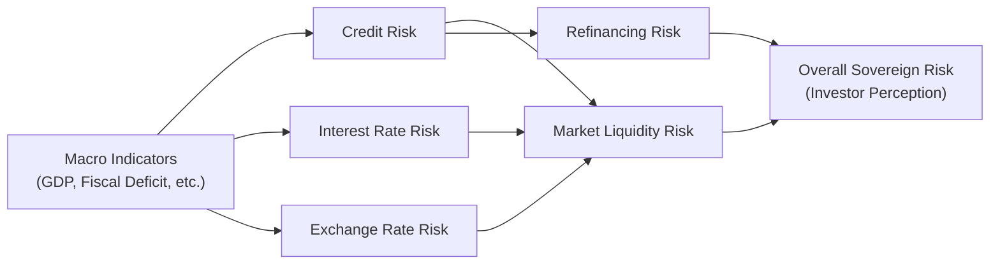

## Overview

Have you ever chatted with a friend who was excited about government bonds because they thought they were completely “safe”? I remember a conversation like that: they argued, “Governments can print money, so there’s no way they’d default.” Well, as reassuring as that might sound, it’s not always that straightforward—especially when a country issues debt in a foreign currency or faces political upheaval. Governments do enjoy certain sovereign privileges—like taxation or, in some cases, central bank support—but they also encounter a variety of risks that can significantly impact their ability and willingness to service debt. 

This section guides you through the major risk considerations for government issuers, including credit risk, interest rate risk, refinancing risk, political and policy risk, market liquidity risk, and exchange rate risk. We’ll also review how macroeconomic factors (e.g., inflation, fiscal balances) feed into sovereign risk analysis. By the end, you should have a clearer view of why even government debt can face pitfalls and how analysts differentiate between a government’s ability to pay and its willingness to pay.

## Key Government Risks

### Credit Risk

A lot of people find it surprising that governments can carry more credit risk than some large corporations, especially if the government has significant external debt obligations. “External” here means denominated in a currency other than its own. 

• Ability to Print or Tax: If the debt is in local currency, central banks can theoretically step in to keep issuing currency (though this could spur inflation). If the debt is in foreign currency, the government does not have that same printing press advantage.  

• Currency Mismatch: Suppose a country’s tax revenue is primarily in its local currency, but the bond payments are in US dollars. If the local currency suddenly weakens, repaying the debt becomes more expensive in local terms. That mismatch can rapidly magnify credit risk.  

• Sovereign Credit Ratings: Rating agencies (S&P, Moody’s, Fitch, etc.) keep an eye on governments’ economic fundamentals, external reserves, and political dynamics. A downgrade of a sovereign rating can hike bond yields and reduce market confidence.  

Fundamentally, a government’s credit risk depends on whether it remains both able and willing to keep servicing its obligations under all circumstances—especially when times get tough.

### Interest Rate Risk

Just like any other bond issuer, a government faces interest rate risk. If market interest rates rise, newly issued debt becomes more expensive for the government, and existing bonds might fall in market value. If you’re analyzing government finances, you want to watch out for:

• Cost of New Issuance: If a country suddenly needs to borrow more at higher rates, the cost of interest payments can balloon. This situation becomes especially acute if the government’s budget or deficits are already stretched.  

• Sensitivity of Outstanding Debt: Existing longer-term bonds may drop in price if rates rise, reflecting higher opportunity costs to investors. While the state might not suffer immediate cash flow constraints (since it doesn’t have to buy back its bonds at the new market price), higher interest rates can still affect refinancing decisions, budget policy, and even bond market liquidity.

### Refinancing (Rollover) Risk

Governments rarely pay off their debt in one shot. They typically issue new bonds to refinance maturing debt. At times, though, it can feel a bit like juggling: if market conditions are unfavorable—say, there’s a credit crunch or interest rates spike—issuing new bonds to roll over old ones might get painfully expensive or, in the worst case, nearly impossible.

• Large Maturity Walls: When a big chunk of government bonds all mature around the same time, the government may scramble to refinance at just the wrong moment (e.g., when there’s low demand for their bonds or when interest rates are high).  

• Demand Factors: Investor appetite can shift for a host of reasons—global risk sentiment, political instability, or simply better yields offered by other governments. If demand for a particular sovereign’s debt declines, refinancing becomes more costly.

• Bond Maturity Management: Governments can try to spread their maturities more evenly over time. However, political considerations can prevent them from doing so effectively, leading to big lumps of debt coming due all at once.

### Political and Policy Risk

Political leadership changes, elections, and unexpected policy shifts can rock the bond market’s confidence in a government’s ability or willingness to maintain stable finances and repay debt. This risk factor might seem intangible, but it often has real consequences, such as:

• Policy Uncertainty: Major policy reversals (e.g., newly elected populist government) could spook investors, especially if they fear the government might renege on debt or artificially suppress interest payments through unorthodox monetary policy.  

• Instability and Conflict: Sometimes there is a risk that political contests morph into internal conflict, impairing a country’s revenue base and financial system. For example, government offices might halt daily operations or lose the ability to collect taxes effectively.

• Pressure to Restructure: Politicians might be tempted to renegotiate or restructure existing debt if it is perceived as politically popular to redirect budget resources away from debt service and into social programs.

### Market Liquidity Risk

People often consider government bonds the world’s most liquid instruments. They can be, particularly in developed markets (e.g., US Treasuries). Yet, we’ve all seen scenarios—like during certain emerging market crises or broad market panics—where even government paper can become illiquid:

• Sudden Spread Widening: In stressed times, bid-ask spreads widen dramatically, and trading volumes can dry up, leaving investors or the government in a tough spot.  

• Flight to Quality (or Away from It): Not all government bonds benefit from a “flight to quality.” While the US might see renewed demand in a global crisis, a smaller or less-developed country might experience the opposite—capital outflows and liquidity strains.  

• Central Bank Intervention: Sometimes, a central bank steps in to buy government bonds when nobody else wants to. While that can ease liquidity pressures, it may also stoke inflationary concerns or raise future policy credibility questions.

### Exchange Rate Risk

If you’ve traveled to a country experiencing sharp currency devaluations, you’ve probably seen how prices for imported goods skyrocket. For the government, that effect can extend to their debt-servicing costs, especially if:

• External Debt Dominance: A large share of sovereign debt is denominated in a reserve currency (USD, EUR). A local-currency depreciation makes repaying that debt more difficult.  

• Pegged or Managed Exchange Rates: Some governments attempt to peg their currency to another, only to run out of reserves trying to defend the peg. If they fail, the subsequent devaluation can be brutal for debt service.  

• Floating Exchange Rates: Volatility can be high, especially if global capital flows are fickle. The government may face an unpredictable environment for paying external-obligation coupons and principals.

Below is a simplified flow diagram to visualize how these risk categories interact for a sovereign issuer:

In real life, these factors don’t exist in isolation; they feed off each other, amplifying or muting the overall risk at different times.

## Macroeconomic Indicators and Government Issuer Risk

To get a decent handle on sovereign risk, analysts track an assortment of macro indicators:

• GDP Growth: Strong growth can generate higher tax revenues, supporting debt repayment. Weak growth may swell deficits, slash tax receipts, and raise debt-to-GDP ratios.  
• Inflation Rates: If inflation runs hot, local currency debt could effectively become “cheaper” in real terms. However, high inflation often leads to higher nominal yields, raising the government’s borrowing costs.  
• Current Account Balance: A persistent current account deficit means a country relies on external funding, potentially heightening vulnerabilities if external market sentiment sours.  
• Fiscal Deficit and Debt-to-GDP Ratio: A large and persistent deficit can lead to debt accumulation that strains a country’s finances.  

The government’s primary deficit (the fiscal deficit before considering interest payments) is a vital measure. If primary deficits are very large, the government’s overall interest burden will continue to grow—barring drastic actions.

We can express a stylized debt dynamics formula like this in KaTeX:


D_{t+1} = D_t \times (1 + r) + PD_
t


where:  
• \\( D_t \\) = Government debt stock at time t.  
• \\( r \\) = Effective interest rate on debt.  
• \\( PD_t \\) = Primary deficit at time t (a positive number if the government is spending more than its non-interest revenues).  

In plain English, next period’s debt equals the current debt grown by the interest rate plus the primary deficit.

## Willingness to Pay vs. Ability to Pay

You’ll often hear analysts stress that a government’s “ability” to pay is not the same as its “willingness” to pay. Sometimes, a government can technically keep servicing debt but might choose to default or restructure for political reasons (e.g., immediate spending priorities overshadow concerns about losing access to capital markets). Other times, the government might be fully willing—politically and morally—to pay, but external constraints (like foreign reserve depletion) render payment impossible. Understanding both facets is crucial, and rating agencies typically assess both.

## Best Practices in Assessing Sovereign Risk

• Diversify Maturity Profiles: Governments often try to avoid lumps of debt maturing in the same year.  
• Monitor External Debt Ratios: Keep track of how much external debt is piling up relative to GDP or export revenues.  
• Review Exchange Rate Regimes: A truly floating currency might help absorb shocks, but pegged regimes can unravel in dramatic ways.  
• Evaluate Political Stability: Keep an eye on election cycles, populist movements, or possible governance changes that affect the long-term fiscal stance.  
• Contingent Liabilities: Governments sometimes have obligations not recorded on the main balance sheet (e.g., state-owned enterprise debt, pension guarantees). It pays to read the fine print.  

## Common Pitfalls and Personal Anecdotes

I once traveled to a budding emerging-market country, excited about the yields offered on their government bonds. Locals raved about ongoing infrastructure projects. However, political turmoil flared up around an upcoming election, causing yields to surge, currency to slide, and bond prices to tumble. Many foreign investors, caught off guard by the speed of policy changes, ended up selling at a loss. The big lesson? Don’t let a high current yield blind you to the underlying political or structural vulnerabilities.

A common pitfall is relying solely on a government’s stable past track record. Past stability is no guarantee that a sudden shift in leadership or global conditions won’t upset that stability. It’s essential to keep your antennas up for talk of capital controls, populist campaigns promising debt cancellation, or signs of an overheating economy. 

## Possible Strategies to Mitigate Risk

For large debt portfolios:

• Currency Swap Arrangements: Governments may choose to hedge some of their external obligations via currency swaps, though this can get expensive or limited by market conditions.  
• Liability Management Exercises: Governments can perform liability management, such as buybacks and exchanges, to smooth out maturities or reduce short-term repayment risk.  
• Transparent Communication: Predictable policy measures and open communication to markets can minimize negative investor sentiment.

## Putting It All Together

In essence, government debt risk has many moving parts—some purely financial, some political, some global. Analyzing sovereign bonds means looking beyond fundamental economic metrics, extending into the realm of policy decisions, currency regimes, global investor appetite, and more. Keep in mind that the stakes are high for governments: equity units might go bankrupt or vanish, but a government default can rattle an entire nation’s economic foundation.

## Final Exam Tips

• Emphasize Real-World Examples: Think about how past sovereign defaults or near-default experiences (Argentina, Greece, etc.) illustrate these risks.  
• Show the Interconnections: In any essay or item set question, tie together how credit risk influences refinancing risk, which might be compounded by political decisions.  
• Use Macro Data Wisely: Refer to typical macro data points (debt/GDP, current account deficits) when explaining potential risk scenarios.  
• Address Both Ability and Willingness: Don’t forget that exam questions love to highlight how a government might be able to pay but unwilling to do so—or vice versa.  
• Time Management: If you see a multi-part question, quickly outline how each risk factor interacts, and then write concise paragraphs for each sub-question.

## References

1. International Monetary Fund, “Fiscal Monitor,” available at:  
   https://www.imf.org/external/pubs/ft/fm/  
2. Reinhart, C. M. & Rogoff, K. S., “This Time Is Different: Eight Centuries of Financial Folly,” Princeton University Press.  
3. Standard & Poor’s, Moody’s, and Fitch Ratings: Sovereign Rating Methodologies (various publications).  
4. World Bank: Global Development Finance Reports.  
5. OECD Sovereign Borrowing Outlook.  
6. BIS Quarterly Reviews on Sovereign Debt.  

## Practice Questions on Risk Considerations for Government Issuers



### Which scenario best illustrates credit risk for a government issuer?

- [ ] A government rolling over debt at lower interest rates.  
- [x] A government that has significant USD-denominated debt and experiences a sharp local currency depreciation.  
- [ ] A government that offers tax incentives to boost foreign investment.  
- [ ] A government that issues more zero-coupon bonds to domestic investors.  

> **Explanation:** Credit risk rises when a government’s ability to repay debt is threatened, such as by foreign-currency obligations that become more expensive after a sharp devaluation.

### How does political and policy risk primarily affect government debt issuance?

- [ ] By directly forcing higher inflation.  
- [x] By creating uncertainty about future fiscal and monetary policies, which may reduce demand for government bonds.  
- [ ] By guaranteeing that the central bank will buy all government debt.  
- [ ] By providing tax advantages on domestic holdings.  

> **Explanation:** Political and policy risk translates into greater uncertainty about future financing and repayment conditions, often prompting investors to demand higher yields or avoid certain sovereign bonds.

### A large maturity wall for government bonds refers to:

- [ ] Short Average Life (SAL).  
- [ ] The sudden flattening of a sovereign yield curve.  
- [x] A concentration of bond maturities occurring around the same time, increasing rollover risk.  
- [ ] The difference between gross and net borrowing requirements.  

> **Explanation:** A maturity wall happens when a significant portion of existing debt matures in a concentrated period, possibly making refinancing more difficult and expensive.

### When assessing a government’s debt sustainability, which factor is typically easiest to overlook?

- [ ] The nominal interest rate on existing debt.  
- [ ] The maturity structure of the debt.  
- [ ] The official unemployment rate.  
- [x] Off-balance-sheet liabilities, like guarantees to state-owned enterprises.  

> **Explanation:** Off-balance-sheet or contingent liabilities can pose major risks if they become actual obligations. They’re often overlooked but can significantly alter a sovereign’s fiscal position.

### What is a primary deficit (PD)?

- [x] The budget shortfall excluding interest payments.  
- [ ] The total deficit minus social security outlays.  
- [ ] Government revenues minus population growth.  
- [ ] The difference between exports and imports (trade deficit).  

> **Explanation:** The primary deficit focuses on the government’s budgetary position before interest costs, a key measure when analyzing debt sustainability.

### In times of global turmoil, a “flight to quality”:

- [x] May drive investors out of riskier sovereign bonds and into safer ones like US Treasuries.  
- [ ] Makes all government bond yields fall equally.  
- [ ] Lowers the credit spread of emerging market debt.  
- [ ] Eliminates the market liquidity risk of all government bonds.  

> **Explanation:** A “flight to quality” involves investors seeking safer assets, generally favoring high-rated sovereigns and selling those with higher perceived risk.

### Which statement best describes the willingness-to-pay concept?

- [ ] It is synonymous with the ability to print money.  
- [x] It refers to a government’s political or policy decision to prioritize debt service over other uses of funds.  
- [ ] It is purely a function of the proportion of domestic bondholders.  
- [ ] It is determined solely by the country’s balance of payments.  

> **Explanation:** Governments may technically be able to pay but still choose to default or restructure for political reasons.

### How might a sudden depreciation of a country’s currency exacerbate its sovereign risk?

- [x] It increases the local-currency cost of servicing external debt.  
- [ ] It reduces investor demand for all forms of debt.  
- [ ] It guarantees acceptance in foreign capital markets.  
- [ ] It automatically lowers the fiscal deficit through inflation.  

> **Explanation:** When a local currency loses value, any foreign-currency-denominated debt becomes more expensive to service, increasing pressure on the government’s fiscal position.

### Under what scenario might market liquidity risk for government bonds increase sharply?

- [x] During a global financial crisis in which investors rapidly retreat from assets perceived as higher-risk.  
- [ ] When the government implements broad-based tax reforms.  
- [ ] As soon as the prime lending rate declines.  
- [ ] Immediately after a sovereign credit rating upgrade.  

> **Explanation:** In a global financial crisis or in times of heightened uncertainty, investors may sell off certain government bonds, widening bid-ask spreads and reducing liquidity.

### A government that has lower external debt than previously but faces a major leadership change might:

- [x] Experience increased political risk even though its debt burden is technically lower.  
- [ ] Automatically improve its credit rating, thanks to the new leadership.  
- [ ] Face no risk from investor uncertainty.  
- [ ] Not need to consider foreign currency obligations anymore.  

> **Explanation:** Even with lower external debt, a sudden political shift can cause uncertainty over future policies, thus increasing political and policy risk.


