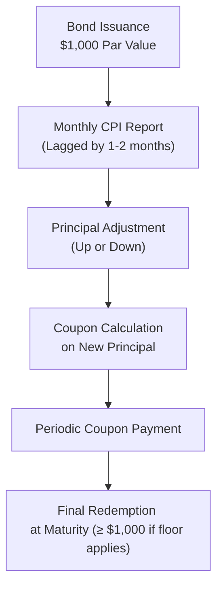

## Introduction 
Sometimes, it feels like inflation lurks right around the corner, ready to nibble away at the value of our bonds. I remember the first time I heard about Treasury Inflation-Protected Securities (TIPS). I was sitting in a finance class, and someone asked, “Wait, so how do I invest in something that keeps up with price levels no matter what?” The professor flashed a quick grin and explained TIPS—my mind was blown. That first exposure stuck with me, and ever since, I’ve seen how crucial inflation-protected instruments can be in preserving purchasing power.

Inflation-linked bonds, also nicknamed “linkers,” address that exact conundrum. They provide a systematic way for both governments and investors to hedge against inflation risk. When we talk about “inflation risk,” we’re really talking about the possibility that future coupon and principal payments—quoted in nominal terms—lose real economic value if general price levels rise faster than expected.

Below, we’ll explore the mechanics of TIPS in the United States, similar instruments found around the globe (like UK index-linked gilts), and how these securities can fit into a broader investment or liability management strategy. We’ll also look at indexation lags, break-even inflation, and some best practices in analyzing these bonds for a portfolio.

## Defining Inflation-Linked Bonds
Inflation-linked bonds, in a nutshell, link their cash flows—coupon, principal, or both—to a specific inflation index, such as the Consumer Price Index (CPI) in the U.S. or the Retail Price Index (RPI) in the UK. By doing this, the bond’s promised payments adjust to changes in price levels. The goal is to preserve the investor’s real (inflation-adjusted) return over the bond’s life.

There are different types of inflation-linked bonds around the world:
• Some adjust the principal upward (and occasionally downward) by the rate of inflation.  
• Others adjust the coupon payment directly, effectively linking the interest portion to inflation.  
• Some do a mix of both.  

Regardless of their specific structure, the big idea is the same: reduce or eliminate the inflation erosion that normally attacks your coupon and principal over time.

## How TIPS Work (U.S. Treasury Inflation-Protected Securities)
In the United States, TIPS adjust the bond’s principal based on the CPI-U (Consumer Price Index for All Urban Consumers). If inflation rises, the principal of a TIPS goes up. Because coupon interest is generally calculated as a fixed percentage of principal, your coupon payment increases too. Conversely, if official price indices indicate deflation over a period, the principal is adjusted downward—but there is typically a floor at maturity so that you do not receive less than your original principal upon final redemption (this depends on issuance details, though).

A simplified example:
• Let’s say you own a 5-year TIPS with a 1% coupon and a $1,000 face value.  
• If, over the first year, CPI increases by 2%, then the bond’s adjusted principal for year 2 becomes $1,020.  
• Your coupon payment in year 2 is 1% × $1,020 = $10.20 (instead of $10 on the original $1,000).  

This approach preserves a “real” rate of return, theoretically ensuring that your purchasing power is maintained. Of course, if deflation creeps in, your adjusted principal would go down, which lowers coupon payments for that period as well—though TIPS generally redeem at no less than par at maturity.

## Index-Linked Gilts and Other Global Inflation-Linked Bonds
Outside the U.S., you’ll find variations on how inflation indexation is applied. The UK issues index-linked gilts where coupon payments increase in line with changes in RPI (Retail Price Index) or CPI, depending on the series. Some gilts adjust both principal and coupon, while others might have a more direct link to just one of those components.

Similar linkers exist in Canada, Japan, and many other developed markets. There are also inflation-linked instruments in some emerging markets, though liquidity and indexing standards can vary. In the UK, for instance, there's often an indexation lag of around three months. If you’re investing in index-linked gilts, that means you’ll see changes to coupons and principal based on data that’s a bit behind the most recently reported inflation figure.

## Real Yields vs. Nominal Yields
Let’s take a moment to highlight a concept you’ll likely find invaluable for the CFA exam: comparing real yields (the yields on inflation-linked bonds) with nominal yields (the yields on traditional fixed coupon bonds).

Nominal Yield = Real Yield + Expected Inflation + Additional Premiums  

For TIPS and other linkers, the “yield” you see quoted in the market is a real yield, because your principal and/or coupon is adjusted for inflation. With a nominal Treasury, your coupon payments are fixed in nominal terms—no built-in inflation cushion.

The difference between a nominal bond’s yield and a TIPS yield of the same maturity is (approximately) the break-even inflation rate for that period. If you think actual inflation will be higher than that break-even figure, you might prefer the inflation-linked bond. If you expect inflation to be lower, a nominal bond might pay off better. This break-even concept is also a popular gauge for market-based inflation expectations, which can feed into broader macroeconomic and monetary policy analyses (discussed elsewhere in this volume, especially when looking at central bank operations in Chapter 4.6).

## Indexation Lag
It’s important to understand that inflation data is not instantaneous. For instance, the U.S. Bureau of Labor Statistics releases CPI data monthly, and TIPS principal adjustments typically follow that reading with a one- or two-month time lag. In other countries, the lag can be even longer. This means that if inflation spikes suddenly this month, your TIPS or linker might not reflect that new inflation picture immediately.

From a risk management perspective, this lag can create short-term discrepancies between actual price changes and the bond’s inflation adjustment. Over the long haul, though, many investors find this lag effect to be a minor inconvenience compared to the benefit of having a built-in inflation hedge.

## Break-Even Inflation Rate
As mentioned, the break-even inflation rate is simply:


\text{Break-even Inflation} \approx \text{Nominal Yield on Regular Treasury} - \text{Real Yield on TIPS}


This figure is closely watched by economists, policymakers, and investors. If actual inflation runs above this break-even during the bond’s life, holders of TIPS end up with a higher return than those in nominal Treasuries (all else being equal). If actual inflation stays below that break-even, nominal Treasuries could prove more profitable.

## Visualizing the TIPS Cash Flow
Below is a simple Mermaid diagram representing how coupon and principal adjustments might flow for a TIPS instrument. Note the lag from the reported inflation data, which eventually updates the bond’s principal.

## Potential Risks and Considerations
Though inflation-linked bonds mitigate inflation risk, they’re not a magical solution for all uncertainties. Among the key risks:

• Interest Rate Risk: TIPS are still subject to changes in real interest rates. If real yields rise, TIPS prices can drop, just like nominal bonds.  
• Deflation Risk: If deflation becomes severe, principal adjustments can reduce your bond’s value (though TIPS often have floors).  
• Liquidity Risk: In certain markets (and especially in some emerging economies), inflation-linked products can be less liquid.  
• Taxation: Under U.S. federal tax rules, the inflation increment to principal is often treated as taxable income in the year it occurs. Meanwhile, you may not receive that increment until maturity. This can result in a “phantom income” problem. IFRS vs. US GAAP classification of inflation-linked bonds can also differ in how they account for changes in principal, so it’s wise to check your local rules or consult an accounting reference.  
• Index Construction and Lag: The inflation index used (CPI, RPI, HICP, etc.) may not perfectly match a specific investor’s cost of living, and there’s always a lag in data reporting and bond adjustment. 

## Practical Examples and Portfolio Integration
Suppose you manage a pension fund with large, inflation-sensitive liabilities. TIPS or other linkers can help match those long-dated obligations, because pension benefits often rise with inflation or wage levels. By incorporating TIPS, you reduce the mismatch between your assets and liabilities—even if nominal interest rates remain low.

On a personal note, I once saw an endowment fund shift a portion of its nominal Treasury exposure into TIPS during a period of unusually uncertain monetary policy. The logic was straightforward: the real yield they give up might be small, but the security of locking in an inflation-adjusted return was well worth it. 

When analyzing TIPS in multi-asset portfolios (as covered in other chapters of this volume), investors typically consider the correlation patterns of TIPS returns with equities, nominal bonds, and alternative assets. TIPS can also serve as a hedge if the portfolio is worried about unexpected inflation shocks.

## IFRS vs. US GAAP Considerations
Under International Financial Reporting Standards (IFRS), interest income and changes in the carrying amount of a bond can be recognized separately. The inflation accretion could be accounted for as interest income if viewed as part of the effective yield. Under US GAAP, TIPS accretion might also be recognized as taxable interest in the period it occurs, even though the actual receipt of funds could be delayed until maturity (for the principal component). In both frameworks, the bond’s book value on the balance sheet increases with the inflation adjustments, but disclosures and classification can differ. To avoid confusion, especially in cross-border investing or reporting scenarios, it’s worth consulting specific accounting guidelines.

## Best Practices and Common Pitfalls
• Keep an eye on break-even inflation. It’s a quick, market-based gauge of inflation expectations.  
• Understand the indexation lag so you’re not surprised by slower-than-expected adjustments.  
• Remember that TIPS might still lose market value if real interest rates spike.  
• Watch out for “phantom income” for tax purposes—especially relevant in a non-qualified account.  
• Don’t forget liquidity. Some TIPS issues may have narrower trading volumes compared to more on-the-run nominal Treasuries.  

## Encouraging Critical Thinking
Before jumping to a conclusion that TIPS are always better than nominal Treasuries, ask yourself: “What if inflation never materializes as expected?” Market conditions, supply/demand for TIPS themselves, and central bank policy changes can dramatically shift whether linkers outperform standard bonds. We also want to consider that break-even inflation might reflect not only pure inflation expectations but also a liquidity premium and other market frictions.

## Conclusion and Exam Tips
Inflation-linked bonds offer a powerful tool for insulating a portfolio against the ravages of inflation. By adjusting your principal and/or coupon to reflect realized inflation, TIPS and other linkers help maintain real purchasing power. Knowing how to compute break-even inflation, interpret indexation lags, and understand the real yield framework will be crucial not only for your exam success but also for real-world portfolio management decisions.

On the CFA exam, you may encounter item sets or constructed-response questions that ask you to:
• Calculate the break-even inflation rate.  
• Determine the impact of unexpected inflation on TIPS vs. nominal bonds.  
• Illustrate tax treatments of TIPS principal accretion under different accounting standards.  
• Incorporate TIPS into an overall asset allocation, especially with liability-driven investing (LDI).  

Time management on these questions is key—be succinct and focus on the fundamental relationships between nominal yields, real yields, and inflation. Practice with the formulas and real-world numbers so that you’re comfortable deriving implied inflation rates and analyzing TIPS performance scenarios.

## References
• U.S. Treasury. (n.d.). Treasury Direct – TIPS Overview: https://www.treasurydirect.gov  
• Bank of England. (n.d.). Index-Linked Gilts: https://www.bankofengland.co.uk  
• Campbell, J. Y., & Shiller, R. J. (1996). A Scorecard for Indexed Government Debt. NBER.  
• IFRS (IASB) and FASB Guidelines on Debt Instruments, available from official IFRS and FASB publications.  

## Test Your Knowledge: Inflation-Linked Bonds (TIPS and Linkers) Exam-Style Questions



### Which of the following best describes how principal accretion works for U.S. TIPS?
- [x] The bond’s principal is adjusted upward or downward by the reported inflation rate, and coupons are paid on the adjusted principal.
- [ ] The bond’s coupon rate changes to match the inflation rate.
- [ ] The bond’s yield is set equal to the trailing 3-month CPI increase.
- [ ] The bond’s principal remains fixed, but the coupon payments are directly indexed to inflation.
> **Explanation:** TIPS adjust the bond’s principal according to the CPI. The coupon payment is based on that inflation-adjusted principal amount.

### An investor is considering purchasing either a nominal Treasury at 3% yield or a TIPS at 1% real yield. Which of the following is the approximate break-even inflation rate?
- [ ] 5%
- [ ] 2%
- [x] 2% (plus any additional premiums)
- [ ] 4%
> **Explanation:** The break-even inflation rate is nominal yield minus real yield, so 3% – 1% = 2%. (In reality, liquidity premiums and other factors could shift the exact figure, but 2% is the basic approximation.)

### What is one major benefit of investing in TIPS over nominal Treasuries?
- [x] TIPS provide protection against unexpected inflation, maintaining real purchasing power.
- [ ] TIPS are always exempt from federal taxes on accrued principal.
- [ ] TIPS offer higher nominal returns during periods of deflation.
- [ ] TIPS coupons are never taxed if held in a taxable brokerage account.
> **Explanation:** TIPS are designed to protect against inflation by adjusting principal. However, phantom income tax is usually owed on these inflation adjustments in taxable accounts unless otherwise specified.

### What is the main drawback of the indexation lag in TIPS or other inflation-linked bonds?
- [ ] No bond price adjustments are ever made.
- [ ] It increases liquidity risk permanently.
- [x] The bond’s adjustments for inflation reflect older inflation data, potentially misaligning short-term cash flows with current inflation.
- [ ] It forces the issuer to buy back bonds at a discount if inflation is too high.
> **Explanation:** Because inflation data is reported with a delay, TIPS and other linkers adjust after a lag, so short-term movements in inflation are not immediately reflected in principal or coupon payments.

### Which statement related to the tax treatment of TIPS is correct for U.S. investors?
- [ ] Adjusted principal increases are taxed only at maturity.
- [x] Investors may owe tax each year on the inflation adjustment to principal, even if it is not received until maturity.
- [ ] TIPS are fully exempt from all state and federal taxes.
- [ ] TIPS principal adjustments are taxed as long-term capital gains annually.
> **Explanation:** Under U.S. tax rules, the inflation accretion in TIPS is considered taxable income in the year it occurs, leading to the so-called “phantom income” issue.

### In a deflationary environment, which of the following might occur with TIPS?
- [ ] Principal continues to rise and coupons increase.
- [ ] Coupons rise, but principal remains flat.
- [x] Principal is adjusted downward, reducing coupon amounts, yet many TIPS redeem at least par at maturity.
- [ ] Principal and coupons vanish entirely.
> **Explanation:** When prices fall, TIPS principal is adjusted downward, thereby reducing coupon payments. However, most TIPS issues have a maturity floor that ensures redemption at par.

### Suppose an investor expects actual inflation to be higher than the break-even inflation rate implied by TIPS vs. nominal Treasuries. Which security might they favor?
- [x] They might favor TIPS because the realized inflation adjustment could exceed that implied level.
- [ ] They might favor nominal Treasuries to lock in a lower rate.
- [x] They might also consider a long-only bond portfolio of nominal Treasuries.
- [ ] They should only consider floating-rate notes.
> **Explanation:** If you believe realized inflation will exceed the break-even rate, TIPS generally outperform nominal bonds. However, some investors may still hold both as part of a larger strategy.

### During which market scenario might TIPS underperform nominal Treasuries?
- [x] If actual inflation remains significantly below the break-even rate.
- [ ] If inflation is unexpectedly high.
- [ ] If short-term rates fall to zero.
- [ ] If the yield curve inverts for nominal Treasuries.
> **Explanation:** When actual inflation turns out lower than what the market priced in, nominal Treasuries could generate higher total returns relative to TIPS.

### From a global perspective, which of the following is true about inflation-linked bonds?
- [x] Many developed markets issue linkers, but indexing methods and lags can differ.
- [ ] They are only issued by the U.S. Treasury Department.
- [ ] They offer the same yields worldwide due to inflation parity.
- [ ] They cannot be held by foreign investors.
> **Explanation:** Inflation-linked bonds exist in various forms across many countries, but methods of indexation and the specific indices used can differ.  

### True or False: Break-even inflation can be calculated by subtracting the real yield on a TIPS from a nominal bond yield of the same maturity.
- [x] True
- [ ] False
> **Explanation:** This is essentially how market participants estimate the break-even inflation rate, ignoring certain premiums and technical factors.  


