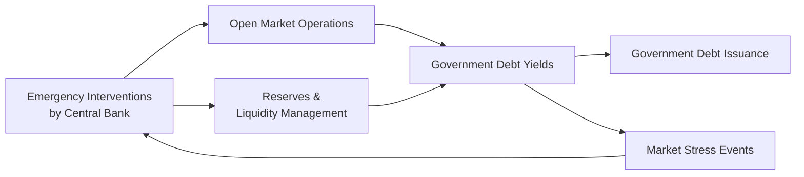

## Introduction
Central banks are at the heart of every modern economy (well, at least that’s how it seems to me). They influence virtually everything related to government debt, from the primary issuance of sovereign bonds to the daily fluctuations in bond yields. In this section, we’ll uncover key ways central banks execute monetary policy, coordinate with fiscal authorities, and step in when markets get shaky. Some of these methods—like open market operations or even the more dramatic quantitative easing (QE)—can seriously move bond prices and shape the yield curve, so it's no wonder that fixed-income analysts pay very close attention to every word coming out of major central banks.

You might recall that earlier chapters introduced concepts like bond valuation (Chapter 6) and yield curve construction (Chapter 7). Here, we look at how central banks create or remove liquidity from the financial system, which in turn alters bond yields, either subtly or quite dramatically. The upshot is simple: central bank actions can make or break the cost of sovereign funding, and their decisions often ripple through every segment of the fixed-income market.

## Central Bank Policy Tools
It’s tempting to think that all central banks do is tweak short-term interest rates, but that’s just one tool in a whole toolbox they use to influence government bond markets. Let’s take a quick look at some of these tools:

Open Market Operations (OMO)  
Open market operations are a classic. By buying or selling government securities in the open market, central banks can directly affect the supply of reserves in the banking system. If a central bank buys government bonds (expansionary OMO), it injects liquidity, pushing rates down and often stirring demand for newly issued government debt. In times of monetary tightening, central banks sell securities, extracting liquidity and exerting upward pressure on yields. You’ll see references to this in many policy statements—“the central bank stands ready to inject or absorb liquidity as needed”—which basically means more or fewer bonds on their balance sheet.

Quantitative Easing (QE)  
When conventional policy rates approach the lower bound (like 0% or, in some cases, negative), central banks don’t just shrug and say, “Well, that’s that.” They might adopt QE: large-scale purchases of longer-term government bonds (and sometimes other assets, such as mortgage-backed securities). QE aims to reduce long-term yields, spur lending, and boost economic activity. Of course, the side effect is that government bonds enjoy a dedicated buyer, which can artificially suppress yields and distort the yield curve slope. Remember how in the aftermath of 2008, the Federal Reserve’s balance sheet skyrocketed? That was a QE play, along with similar moves by the Bank of England and the European Central Bank.

Yield Curve Control  
If a central bank wants to pin down yields at a specific maturity, it might announce a target and buy as many securities as needed to enforce that yield—an approach known as yield curve control. The Bank of Japan famously embarked on such a policy, capping 10-year government bond yields at around 0%. Does it work? It can, up to a point. Market participants might test that resolve if they suspect the central bank isn’t fully committed or if inflationary pressures rise, forcing an eventual policy pivot.

Reserve Requirements, Discount Window, and Reverse Repos  
While these tools may seem more “technical,” they can also subtly influence liquidity and bond pricing. A central bank can alter reserve requirements (the fraction of deposits banks must hold with the central bank) to change the amount of money banks can lend. If high reserve requirements lock up liquidity, banks may rein in purchases of government bonds, impacting demand and yields. The discount window (or marginal lending facility) is another channel, allowing banks to borrow from the central bank at a set rate—this rate can act as a ceiling on market interest rates. Meanwhile, reverse repos provide a mechanism for absorbing liquidity from the market (the central bank sells a security with an agreement to repurchase it later). These day-to-day liquidity maneuvers keep short-term yields near the policy target, and they also reinforce the central bank's ability to stabilize the government debt market if needed.

## Coordinating Government Debt Issuance
Ever wonder who actually orchestrates all those treasury auctions? Often, it’s the central bank acting as the government’s fiscal agent. I remember the first time I realized the treasury and the central bank were so closely linked: it felt like discovering that two entire institutions were basically working in the same building. It’s not that they have identical goals—fiscal authorities seek to finance the government at the lowest cost, while the central bank aims to meet inflation and employment objectives—but they do need to coordinate auction calendars and ensure smooth rollovers. 

In practice, the finance ministry (or treasury department) sets the borrowing need, and the central bank provides logistical support. That might include:

• Scheduling auctions so they don’t clash with major policy announcements.  
• Providing transparent auction mechanisms (e.g., Dutch auctions) to preserve market confidence.  
• Acting as a buyer of last resort in times of crisis, though that has obvious implications for independence and inflation.  

These collaborative efforts can mean the difference between a well-functioning sovereign bond market and one caught off guard by supply surges or abrupt rate hikes.

## The Influence of Monetary Policy on Sovereign Yields
Chapter 7 introduced the concept of the yield curve, highlighting how short-term rates often reflect monetary policy expectations, while longer-term yields incorporate expectations of future rates, inflation, and risk premiums. Central bank policy rates—often called policy targets or reference rates—anchor the short end of the yield curve. If the market expects a series of rate hikes, the entire curve might shift upward or become steeper, especially if inflation concerns come into play.

It’s pretty fascinating how quickly markets can move. A single press conference can swing bond yields by 20 or 30 basis points if traders reinterpret the central bank’s stance. (I can still recall days in the trading room when we’d collectively huddle around the TV awaiting the Fed Chair’s carefully chosen words.) In advanced economies, a stable policy environment contributes significantly to steady funding costs for the sovereign. But in emerging markets—where inflation or currency stability might be less predictable—shifts in monetary policy can produce wilder fluctuations in government bond yields.

Here’s a simple relationship that sometimes helps illustrate how interest rates and bond prices move:


P_{\text{bond}} = \sum_{t=1}^{T} \frac{C_t}{(1 + r_t)^t} + \frac{M}{(1 + r_T)^T}


where:  
• \\(C_t\\) is the coupon payment at time \\(t\\).  
• \\(M\\) is the principal (or par) value at maturity.  
• \\(r_t\\) is the yield (or discount rate) corresponding to each payment.  

When central banks lower policy rates, overall yields (\\(r_t\\)) tend to decline, pushing up bond prices. Conversely, a tightening cycle typically lifts yields, lowering prices.

## Interventions During Market Stress
Markets can get choppy. Liquidity can vanish. Rates can spike. In these moments, central banks might intervene to restore order in the government bond market. During the global financial crisis of 2008 and, more recently, amid the COVID-19 pandemic, central banks deployed various “emergency” tools—notably large-scale asset purchases (QE) but also targeted bond-buying in specific segments. Some central banks performed repo operations on an unprecedented scale to ensure dealers remained liquid enough to make markets.

One approach that gained traction in stressful times is for the central bank to temporarily relieve collateral constraints. For example, if dealers can’t finance their government bond positions due to counterparty risk, yields could spike unsustainably. By offering repos on favorable terms, the central bank effectively stabilizes the market, preventing a fire sale. This can reduce what we call “liquidity premiums,” leading to more normal yield levels and lower volatility.

Further, yield curve control (especially in the mid-range to longer maturities) can be invoked to keep borrowing costs from surging when markets are stressed. While that might sound good for preventing panic, it can also create moral hazard if markets come to rely on central bank backstops indefinitely.

## Diagrams and Visualizing Influence
The relationship between the central bank and government debt markets can be visualized in a simple flow diagram. Below is a Mermaid diagram illustrating basic interactions:



The arrows show how policy settings and open market operations flow through to government bond yields, which in turn affect the government’s cost of issuing debt. If market stress arises, the feedback loop continues, and the central bank might intervene.

## Real-World Examples
It’s always handy to look at large real-world examples:

• Federal Reserve (U.S.): Initiated QE in 2008 and again in 2020, buying trillions of dollars in Treasuries, mortgage-backed securities, and corporate bond ETFs (the latter in 2020). This massive injection of liquidity kept yields low for quite some time.  

• European Central Bank (ECB): Launched its “Asset Purchase Programme” (APP) and later the “Pandemic Emergency Purchase Programme” (PEPP). Sovereign rates in Italy, Spain, and other Eurozone periphery nations declined dramatically, reflecting the ECB’s backstop.  

• Bank of Japan (BoJ): The pioneer of yield curve control, setting explicit yield targets for 10-year Japanese Government Bonds (JGBs). It continues to buy huge quantities of government debt in an attempt to combat deflation and encourage spending.  

• Reserve Bank of Australia (RBA): Announced yield target for 3-year government bonds during the COVID-19 crisis—an unusual step outside Japan.  

These cases highlight how central banks not only stabilize markets but also actively shape the yield curve, for better or worse.

## Practical Examples and Short Python Illustration
Sometimes, it can be fun (yes, I said fun) to see basic yield-curve shifts in code. Suppose you want to calculate how a 25 basis point drop in yields might change a bond’s price. Below is a quick snippet in Python:

```python
import math

def bond_price(face_value, annual_coupon_rate, market_yield, years_to_maturity, payments_per_year=1):
    coupon_payment = face_value * annual_coupon_rate / payments_per_year
    price = 0.0
    for t in range(1, years_to_maturity * payments_per_year + 1):
        price += coupon_payment / ((1 + market_yield/payments_per_year)**t)
    # add redemption of principal (face value) at maturity
    price += face_value / ((1 + market_yield/payments_per_year)**(years_to_maturity * payments_per_year))
    return price

face_value = 1000
annual_coupon_rate = 0.05  # 5%
current_yield = 0.03       # 3%
years = 10

initial_price = bond_price(face_value, annual_coupon_rate, current_yield, years)
new_price_after_cut = bond_price(face_value, annual_coupon_rate, current_yield - 0.0025, years)  # 25 bp drop

print("Initial Price:", round(initial_price, 2))
print("New Price After 25bp Cut:", round(new_price_after_cut, 2))
print("Price Change:", round(new_price_after_cut - initial_price, 2))
```

If the central bank unexpectedly cuts policy rates by 25 basis points, you might see yields across the curve move similarly, boosting bond prices. Of course, real markets are more complex, but this snippet captures the spirit of how a shift in yield can impact valuation.

## Potential Pitfalls and Best Practices
An overly zealous central bank might inadvertently fuel asset bubbles if it keeps rates too low or if QE goes on longer than necessary. The lessons from historical episodes underscore the importance of exit strategies. On the flip side, a hesitant or inconsistent approach can cause volatility, as markets rely heavily on policy signals.

Another pitfall is the central bank losing credibility. If market participants believe the monetary authority won’t stick to its inflation target or yield curve control policy, yields can jump. Credibility is earned over time, and once lost, it’s quite painful (and expensive) to regain.

From an investment perspective, staying alert to central bank communications is key. Traders often watch meeting minutes, press conferences, and economic projections to gauge future interest rates. This helps in constructing strategies that anticipate yield curve changes or local liquidity conditions, which can be crucial for immunizing portfolios (as discussed in Chapter 8 on interest rate risk).

## Conclusion and Final Exam Tips
Central banks do far more than just set interest rates. By influencing government debt issuance, implementing targeted bond purchases, and stepping in during market stress, they shape the entire fixed-income landscape. Understanding these dynamics is essential for any fixed-income professional, not to mention for those of us preparing for the CFA exam. 

Here are a few pointers you might find useful — or at least, I would have appreciated them when I was studying:

• Monitor Policy Signals: Don’t just look at the headline policy rate. Listen carefully to press conferences and read meeting minutes to understand forward guidance.  
• Connect the Dots: Relate central bank announcements to yield curve shifts. Think about how changes in the yield curve can be linked to the broader macro environment.  
• Stress Scenarios: Be prepared to discuss how central banks respond to crises. Look at historical examples for hints on how to approach scenario-based exam questions.  
• Ethical & Practical Implications: Reflect on how large-scale interventions might spook or reassure markets. Propose solutions balancing market stability and moral hazard.  

In the exam, you may see case studies where a central bank’s actions directly affect bond prices, yield spreads, or portfolio duration. Respond systematically: identify the tool in use, describe the monetary transmission mechanism, and analyze the impact on bond markets.

## References
• Mishkin, F. (2019). The Economics of Money, Banking, and Financial Markets. Pearson.  
• Bank for International Settlements (BIS) publications on monetary policy implementation: https://www.bis.org  
• Federal Reserve (USA) and European Central Bank (ECB) policy announcements: https://www.federalreserve.gov, https://www.ecb.europa.eu  

## Test Your Knowledge: Central Bank Influence on Government Debt Markets



### Which of the following tools directly involves a central bank injecting or removing reserves by trading government securities in the open market?
- [x] Open Market Operations
- [ ] Reserve Requirement Adjustments
- [ ] Discount Window Lending
- [ ] Currency Peg Arrangements

> **Explanation:** Open market operations (OMO) are the direct buying or selling of government securities to control liquidity and influence interest rates.

### A central bank wishing to reduce long-term yields and stimulate economic growth might adopt which large-scale intervention?
- [ ] Reserve Requirement Adjustments
- [x] Quantitative Easing
- [ ] Raising Reserve Repo Rates
- [ ] Imposing Capital Controls

> **Explanation:** Quantitative Easing involves purchasing longer-term securities to lower long-term interest rates, thereby stimulating borrowing and economic activity.

### Yield curve control typically involves a central bank:
- [x] Targeting a specific yield on a chosen maturity and buying bonds as necessary to maintain that yield
- [ ] Selling currency forward to stabilize foreign exchange markets
- [ ] Providing discount window lending to financial institutions in distress
- [ ] Strongly committing to a fixed money supply target

> **Explanation:** Under yield curve control, the central bank sets a yield target for certain maturities and will buy unlimited amounts of bonds to keep that yield from rising above the announced target.

### One potential negative side effect of prolonged quantitative easing is:
- [ ] Reducing the supply of money in circulation
- [ ] Decreasing asset prices across the board
- [x] Fueling asset price bubbles if interest rates remain artificially low
- [ ] Constraining banks from lending to consumers

> **Explanation:** When QE continues indefinitely, it can inflate asset prices excessively and encourage risk-taking, potentially leading to bubbles.

### If the central bank acts as the government’s fiscal agent, it generally supports:
- [x] Coordinating the debt issuance calendar
- [ ] Setting statutory tax rates
- [x] Conducting primary auctions for government bonds
- [ ] Determining overall government spending levels

> **Explanation:** Acting as fiscal agent involves practical tasks like organizing auctions and managing government accounts, rather than setting fiscal policy metrics (like tax rates).

### During a market crisis, a central bank might provide support by:
- [x] Offering large-scale repo operations to ease liquidity constraints
- [ ] Refusing to buy government bonds under any circumstances
- [ ] Increasing the policy rate sharply to discourage borrowing
- [ ] Strictly limiting currency in circulation

> **Explanation:** In times of stress, central banks often focus on providing liquidity through repo operations, ensuring a functioning market and preventing fire sales.

### Which of the following is likely to happen when the central bank lowers its policy rate?
- [x] Short-term yields generally decline
- [ ] Short-term yields generally rise
- [x] Bond prices increase
- [ ] Bond coupons are reset to a higher level automatically

> **Explanation:** A lower policy rate typically reduces short-term yields (moving bond yields down) and raises bond prices. Coupon rates aren’t automatically reset unless it’s a floating-rate bond linked to that policy rate.

### Why might a central bank’s credibility be critical in implementing yield curve control?
- [x] Market participants will test the bank’s resolve if they doubt its commitment 
- [ ] Banks are never concerned with a central bank’s policy announcements
- [ ] Governments can easily override monetary policy at any time
- [ ] Credibility is irrelevant in advanced economies

> **Explanation:** If the market believes the central bank can’t or won’t purchase enough bonds, yields could spike. Credibility in following through on stated objectives is essential.

### In times of low inflation and a zero lower bound on policy rates, central banks often resort to:
- [x] Buying longer-term government securities (QE)
- [ ] Complete cessation of monetary operations
- [ ] Exclusive reliance on raising reserve requirements
- [ ] Selling vast amounts of foreign currency

> **Explanation:** When policy rates are near zero, quantitative easing becomes a common tool to further stimulate the economy by reducing longer-term yields.

### A true statement about open market operations is:
- [x] They are used to fine-tune the level of reserves in the banking system.
- [ ] They force private banks to lend directly to the government.
- [ ] They make the yield curve completely flat.
- [ ] They eliminate credit risk in the system.

> **Explanation:** OMO allows the central bank to inject or absorb reserves, influencing short-term interest rates without guaranteeing a particular yield curve shape or eliminating credit risk.


