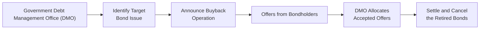

## Introduction
Sometimes, governments decide they want to change up the terms under which they owe money—maybe they’re paying a higher interest rate than they’d like, or they see a big wall of maturities looming on the horizon that could hamper their future budgets. Enter debt buybacks and liability management: tools designed to refine a government's debt profile and potentially save on interest costs. Hey, we all like bargains and efficiency, right?

This section explores the basics of government debt buybacks and how sovereign liability management strategies can help smooth redemption schedules, keep interest expenses in check, and protect against unexpected market swings. We’ll also look at the investor’s perspective—because whenever the government starts tinkering with outstanding bonds, we bondholders need to understand how it affects our returns and risk exposures.

## Government Debt Buybacks: A High-Level Overview
At its core, a debt buyback (sometimes called a bond buyback or repurchase) is when the issuer repurchases its own debt security before maturity. Governments may conduct these buybacks in open-market operations or through formal offers to holders of a specific bond issue.

Imagine, for instance, a government bond that was issued a few years back at, say, a 5% coupon. Maybe interest rates have dropped in the meantime to around 3%. The government might decide it’s cheaper overall to repurchase those old 5% bonds at a fair price—often a price above par if the coupon is higher than current market yields—and then issue new bonds at 3%. Doing so can lead to immediate interest-cost savings, or at least help smooth out future obligations. Of course, buybacks can also target upcoming maturities that might cause cash-flow headaches if they all come due at once.

### Reasons for Debt Buybacks
• Interest Cost Reduction: When market yields fall, high-coupon legacy bonds become expensive liabilities. Repurchasing and refinancing these bonds at lower yields may reduce overall interest expenses.  
• Maturity Smoothing: Spreading out redemption dates across the curve can reduce refinancing stress.  
• Market Opportunities: Certain market conditions (e.g., wide bond spreads, strong government cash balances) might make buybacks favorable.  
• Improved Investor Sentiment: An orderly buyback program can signal a healthy fiscal position, provided the market perceives it as a proactive effort rather than a desperate measure.

## Liability Management Strategies Beyond Buybacks
Debt buybacks are only one piece of the liability management puzzle. Sovereigns often bundle buyback operations with exchanges (also called switches) to extend maturities or alter coupon structures. At the same time, some governments initiate interest-rate swap positions or cross-currency swaps to manage currency risk exposures. Liability management can be a real balancing act—like spinning plates on sticks—where the government tries to keep interest costs and refinancing risk manageable without spooking markets.

### Switch (Exchange) Offers
In a switch offer, a government invites bondholders to swap their old securities for new ones. Let’s say you hold a bond maturing in two years with a coupon of 6%. The government might ask you to exchange it for a new 10-year bond at 4.5%. If you’re an investor who’d prefer a longer time horizon, you might find the swap appealing, especially if it balances out your portfolio’s duration or if you’re capturing some price premium during the exchange. Meanwhile, the government lengthens its debt profile, pushing out maturities and reducing the need to refinance large sums in the near term.

Exchanges can be voluntary, meaning bondholders can say, “No thanks, I’ll keep my old bond,” or they can be more “coercive,” nudging investors to exchange under the threat of less appealing alternatives. Voluntary exchanges tend to be more common in normal conditions, while coercive tactics often appear in distressed scenarios—think of times when a country is on the brink of default.

## Practical Mechanics of a Debt Buyback
Let’s walk through a hypothetical buyback operation, from planning to settlement:

1. Planning and Announcement  
   The debt management office (DMO), a unit within a finance ministry or treasury department, studies the outstanding stock of government bonds. It pinpoints a bond series with a high coupon or near-term maturity that’s expensive or risky to keep. The DMO then announces a buyback offer, specifying the exact bond series, the purchase price or yield, and the time window for investors to accept.

2. Pricing and Allocation  
   In many buyback operations, the government sets a fixed price (often at a premium to par if coupon rates exceed current yields) or uses an auction approach where holders submit offers at which they’re willing to sell. The DMO accepts the best (lowest yield) offers until it reaches a targeted retirement amount. That’s somewhat similar to a reverse auction structure.

3. Funding the Buyback  
   The government might pay for the buyback with existing cash reserves—say, from a budget surplus or from an external loan designed specifically for the buyback. Alternatively, it might simultaneously issue new, lower-coupon debt to fund the redemption. Either way, the government’s debt composition changes, ideally lowering overall interest burden or smoothing redemptions.

4. Settlement and Retirement  
   Once the transaction is complete, the DMO cancels the retired bonds, removing them from the list of outstanding liabilities. This step ensures the old securities don’t reenter circulation.  

Below is a simplified mermaid diagram showing the typical flow of a buyback operation:

## Investor Perspective
From an investor’s standpoint, a government buyback or exchange can generate gains or losses depending on the bond’s current market price relative to par. If your bond is trading at 110 (above par) because of a high coupon, a buyback offer might let you lock in a capital gain. On the other hand, if the bond is trading below par—maybe because of credit concerns—an investor might not want to sell at a lower price unless they consider the alternative risk of a more distress-induced scenario later.

Some investors actually like the certainty of being taken out of a position early, especially if the bond’s liquidity has diminished over time. But others might be disappointed to lose a steady stream of high coupon income. Often, the decision to participate in a buyback or not depends on the investor’s portfolio strategy, tax considerations, or the attractiveness of alternative reinvestment opportunities.

## Risks and Pitfalls
While debt buybacks and exchanges can be good tools, they’re not without risks:

• Market Perception: If the government’s timing or rationale is unclear, the operation might be seen as an act of desperation. This could spike yields on the government’s other bonds.  
• Coercive Offers: In distressed scenarios, the government may force bondholders to accept less favorable terms. This can shake investor confidence.  
• Liquidity Risks: Massive buybacks might reduce liquidity in certain maturities. Conversely, a partial buyback might result in an odd-lot or “stranded” bond issue that trades poorly in the secondary market.  
• Legal and Documentation Risks: Some bond indentures have rules around redemption, requiring specific notices or limiting the percentage of debt that can be repurchased before maturity.  

I recall reading about a distressed country that launched a buyback when it clearly did not have enough reserves to finance the operation. The entire plan hinged on funds from a development bank, which fell through at the last minute. That fiasco significantly damaged investor confidence, demonstrating that successful liability management requires proper planning, transparent communication, and credible financing resources.

## Real-World Case Studies
• Greece (2012)  
  In the aftermath of the European sovereign debt crisis, Greece used a program of debt buybacks to reduce its obligations at a discount. While it provided partial relief, some investors faced haircuts, and the operation was widely perceived as an implicit default.  
• Uruguay (2003)  
  Uruguay conducted a successful exchange of its global bonds with the support of the IMF. The exchange extended bond maturities, giving Uruguay breathing room to recover from a regional financial crisis. Investors accepted the swap because it was a better outcome than a full-blown default.  

The success of these operations often depends on the country’s credibility in the eyes of global capital markets, the transparency of the terms offered, and the overall macroeconomic environment.

## Liability Management: Key Considerations for Governments
To effectively plan and execute liability management, DMOs consider:

• Debt Sustainability: Evaluating the overall debt-to-GDP ratio, interest-to-revenue ratio, and maturity distribution.  
• Market Conditions: Monitoring yields, overall demand for sovereign bonds, and the credit spread environment to identify favorable windows for buybacks or exchanges.  
• Regulatory Constraints: Confirming adherence to local laws and possible covenant restrictions in bond documentation.  
• Investor Relations: Communicating openly about the rationale, timing, and structure of any operation. Surprising investors with abrupt changes can backfire, especially if it’s perceived as forcing heavy losses.  
• External Funding Plans: Coordinating with supranational lenders (e.g., IMF, World Bank) or tapping capital markets at the same time to keep the operation well-funded.

## Maturity Profile Management
One of the main objectives of liability management is to smooth and extend a government’s maturity profile—i.e., spread out redemption dates so there’s no single year where a massive amount of bonds matures all at once. This can mitigate the risk of “rollover crises,” situations where the government is forced to refinance huge chunks of debt at potentially unfavorable rates. A standard approach might combine partial buybacks of near-term maturities with simultaneous issuance of longer-dated instruments.

Here’s a simple hypothetical illustration. Suppose a country’s maturity schedule looks like this:

• Year 2026: $10 billion  
• Year 2027: $2 billion  
• Year 2028: $3 billion  
• Year 2029: $4 billion  

Seeing that $10 billion is coming due in 2026 (which is quite a lot), the government might buy back $5 billion of the 2026 bond and issue a new 2031 bond. Post-operation, the new schedule might reduce the 2026 maturity to $5 billion, while adding (say) $5 billion due in 2031. This basically shifts the risk into more distant years and helps reduce near-term funding pressure.

## Valuation Elements in Debt Buybacks
From a finance perspective, the price offered in a buyback is typically determined by the net present value (NPV) of future cash flows of the bond, discounted at prevailing market yields. In formula form:


\text{Price} = \sum_{t=1}^{T} \frac{C_t}{(1 + r_t)^t} + \frac{M}{(1 + r_T)^T}


• \\(C_t\\) = Coupon payment at time \\(t\\)  
• \\(M\\) = Maturity (face value) of the bond  
• \\(r_t\\) = Discount rate appropriate for time \\(t\\)  
• \\(T\\) = Total number of periods to maturity  

During a buyback, if the issuer is offering a premium, it implies a discount rate slightly lower than the market’s. Conversely, a discount price might reflect a higher required rate due to credit concerns. The difference between these present values and the bond’s carrying value on the country’s books can lead to realized gains or losses for both the issuer (in an accounting sense) and bondholders. Under IFRS or US GAAP, the partial extinguishment of debt is recorded in the issuer’s financial statements, typically with immediate impact on net income if it’s material.

## Best Practices and Common Pitfalls
• Plan Ahead: Governments that schedule buybacks or swaps well in advance avoid last-minute scrambles.  
• Transparent Communication: Surprises seldom go down well. Clear objectives help maintain investor confidence.  
• Target the Right Bonds: It makes sense to prioritize high-coupon or near-maturity bonds that are the biggest threats to the government’s liability profile.  
• Avoid Overreach: Don’t try to repurchase more than the market can comfortably absorb. A too-aggressive approach can drive prices up, undermining cost savings.  
• Proper Legal Framework: Confirm that offering documents, prospectuses, and local regulations all permit early redemption and buybacks.

Anyway, if there’s one note to carry forward, it’s that liability management can create a win-win scenario—governments reduce risk and possibly cost, and investors get timely opportunities to exit positions or reshape their portfolios. But these operations demand strong financial planning and effective communication to ensure that the motives and methods are clear.  

## Glossary
• Debt Restructuring: A broad term for modifying the terms of existing debt, which may include buybacks, maturity extensions, or coupon changes.  
• Sovereign Debt Exchange: An offer for existing bondholders to swap old securities for new ones with different terms.  
• Maturity Profile: The distribution of repayment obligations over time. A “smooth” profile prevents any single year from bearing an outsized redemption burden.

## Additional References
• World Bank Archives, Sovereign Debt Case Studies:  
  https://www.worldbank.org  
• IMF Working Papers on Liability Management and Sovereign Cost Optimization:  
  https://www.imf.org/en/Publications/Search  
• Comprehensive coverage of government liability management approaches in the IMF-World Bank Guidelines for Public Debt Management, found at:  
  https://www.imf.org/external/np/mae/pde/index.htm

## Final Thoughts for Exam Preparation
It’s essential to understand how governments balance the costs and risks of their debt portfolios. Debt buybacks and exchanges form a key toolkit for smoothing maturities, lowering interest expenses, and managing investor relations. Pay close attention to how these operations might appear in scenario-based exam questions, where you’ll be asked to evaluate the financial and strategic consequences for both issuer and investor. Remember that clarity around discount rates, bond valuation, and economic context is crucial in analyzing these programs.  

Below are some sample questions to test your knowledge. Practice these to become comfortable with the underlying mechanics and the potential motivations, benefits, and pitfalls of debt buybacks and liability management.

## Test Your Knowledge: Government Debt Buybacks Quiz



### A government wants to reduce its near-term debt maturities. Which of the following strategies best achieves this objective?

- [x] Offer to repurchase large portions of a bond issue maturing soon.  
- [ ] Issue new bonds with short maturities.  
- [ ] Increase the coupon on existing short-term bonds.  
- [ ] Prolong the interest payments but maintain the same redemption date.  

> **Explanation:** Buying back (or retiring) bonds that mature soon reduces near-term obligations. Issuing short-term bonds doesn’t reduce near-term payments; increasing coupons does nothing to postpone principal repayment; and only shifting coupon schedules is not aligned with the goal of addressing the maturity date.

### A “switch offer” in sovereign liability management refers to:

- [x] Exchanging old bonds for new ones with different maturities or coupons.  
- [ ] Forcing bondholders to accept haircuts during restructuring.  
- [ ] Moving from fixed-rate to floating-rate debt through swaps.  
- [ ] Splitting a single issue into multiple tranches with varied maturities.  

> **Explanation:** A switch (or exchange) offer is a voluntary mechanism allowing investors to trade older debt securities for newly issued securities under revised terms (often to extend maturities or lower coupons).

### Which of the following is most likely a key motivation for debt repurchases by governments?

- [x] Reducing long-term interest costs.  
- [ ] Boosting short-term yields for speculators.  
- [ ] Eliminating the need for credit ratings.  
- [ ] Giving investors no choice but to increase holdings.  

> **Explanation:** Governments typically employ buybacks to lower future interest costs (especially when coupon rates are above current market levels) or to restructure debt maturities. They don’t repurchase debt to boost short-term yields, eliminate credit rating requirements, or force greater investor participation.

### In a buyback operation, the issuer typically:

- [x] Cancels the repurchased debt, reducing outstanding principal.  
- [ ] Resells the repurchased debt in the secondary market for a profit.  
- [ ] Retains ownership of the bond as part of its investment portfolio.  
- [ ] Transfers ownership of the bond to a third-party custodian.  

> **Explanation:** Repurchased bonds are generally canceled or retired, which lowers total outstanding debt. They are not held as an investment asset nor resold in the normal course of liability management.

### True or False: When a government conducts a buyback at a premium to par, it is guaranteed that the government achieves lower interest costs.

- [ ] True  
- [x] False  

> **Explanation:** A premium to par often compensates investors for a higher coupon bond. While it can still lower the issuer’s overall interest expense if the new financing has a sufficiently lower rate, it’s not guaranteed that the buyback will always reduce overall costs, especially if broader market conditions change or if the buyback premium is very large.

### One big reason governments focus on “smoothing” their maturity profile is to:

- [x] Minimize the risk of large-scale refinancing in any single year.  
- [ ] Strengthen investors’ bargaining power.  
- [ ] Maximize short-term interest payments to attract speculators.  
- [ ] Prevent accrual of any coupon payments.  

> **Explanation:** Governments aim to avoid a big “lump” of debt coming due all at once, which could significantly increase refinancing risk. Smoothing maturities helps reduce that concentrated rollover exposure.

### Which of the following is a key challenge when planning a sovereign buyback?

- [ ] Investors offering bonds below market price.  
- [ ] The possibility that no investor will be interested in selling.  
- [x] Legal constraints and bond indenture provisions limiting early repurchase.  
- [ ] The need to maintain very high short-term interest rates.  

> **Explanation:** Bond indentures may provide specific call or repurchase conditions, limiting or restricting governments from repurchasing debt without a formal procedure. These constraints often complicate sovereign buyback strategies.

### How does market liquidity impact a government’s debt buyback?

- [x] In illiquid conditions, prices can move sharply if the government tries to buy large amounts.  
- [ ] Illiquid conditions make it cheaper for the government to buy large volumes.  
- [ ] Liquidity is irrelevant to sovereign buybacks.  
- [ ] Illiquidity typically means stronger investor demand for new bonds.  

> **Explanation:** If liquidity is poor, a government’s attempt to buy substantial amounts of bonds can cause significant price swings, potentially making the operation more expensive.

### If a government announces a buyback of a bond issue trading well above par, the bondholders might:

- [x] Demand an even higher price than par, reflecting the bond’s premium.  
- [ ] Rush to sell at par to secure a quick gain.  
- [ ] Accept a price below par if coupons are above market rates.  
- [ ] Refuse to sell because of legal restrictions.  

> **Explanation:** When a bond trades above par, investors expect a repurchase price that at least reflects the current market premium. They won't accept par if market price is higher.

### True or False: Liability management can completely eliminate a government’s refinancing risk.

- [ ] True  
- [x] False  

> **Explanation:** While liability management helps mitigate and reduce the refinancing burden, no strategy can fully eliminate all risk. Market conditions, global economic factors, and unexpected events can still complicate or undermine even the best-laid plans.


