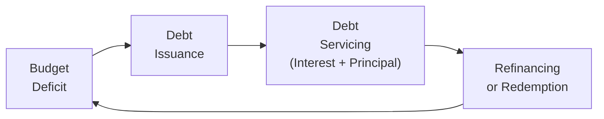

## Introduction
It’s always fascinating how a government budget—basically a list of what money’s coming in and where it’s going—plays a massive role in driving the national economy. For many of us, budgets might seem like dusty documents full of line items for defense, social programs, and infrastructure. But think of them as the country’s giant wallet: if that wallet doesn’t have enough cash inflow (taxes, tariffs, fees, etc.) to cover all the outflow (health care, roads, schools, etc.), it has to borrow. And that’s where sovereign debt enters the picture.

In this section, we'll break down how governments make budget decisions, why deficits and surpluses matter, and how the so-called “sovereign debt cycle” flows between issuing debt, paying interest, and eventually refinancing or redeeming the borrowed funds. Along the way, we’ll highlight a few pointers on how all this affects investor sentiment. And—well—maybe I’ll share a brief personal observation from my own travels (I once worked in a developing economy that ran persistent budget deficits).

## Government Budget Overview
A government budget is a projection of revenues and expenditures over a specific period—usually a fiscal year. Revenues include:

• Taxation (individual income taxes, corporate taxes, etc.)  
• Customs duties and tariffs  
• Proceeds from state-owned enterprises or natural resources (e.g., oil revenue)  
• Fees, fines, and other miscellaneous income  

Expenditures are typically categorized into:

• Social programs (health care, education, pensions)  
• Public infrastructure (roads, bridges, technology)  
• Defense and security  
• General administrative costs  

If you’re glancing at a national budget document, you might see something like “Estimated Tax Revenue: $X” or “Planned Spending on Education: $Y.” Simple enough in concept, but the sums involved can be staggering.

### Deficits and Surpluses
A budget deficit arises if the government’s planned expenditures exceed its revenue—in other words, it’s spending more than it’s collecting. Conversely, a budget surplus arises when revenues exceed expenditures, giving the government a bit of a cushion. In real-life practice, deficits are more common than surpluses, especially during economic slowdowns or times of crisis (think major recessions or global health emergencies).

We often hear about stimulus packages or government bailouts, which can push expenditures beyond what the government had planned. If deficits persist year after year, the accumulated shortfall eventually forms part of the national (sovereign) debt.

## Understanding the Sovereign Debt Cycle
The sovereign debt cycle is the repeated process in which a government finances deficits by issuing debt, services that debt by paying interest and principal, and then refinances (or redeems) as needed. Governments typically do this in a series of steps, though in practice it can feel like a continuous juggling act. Let’s outline the cycle:

### Debt Issuance
When governments need money to cover a deficit, they can issue bonds or other debt instruments. Investors, including banks, pension funds, and individuals, buy these bonds in exchange for periodic coupon payments and the promise of repayment of principal at maturity. The yield on such bonds typically reflects the perceived creditworthiness of the nation (among other macroeconomic conditions).

### Servicing the Debt
Over the life of the bond, the government must pay interest to bondholders. When the bond reaches maturity, the principal must be repaid. If the government doesn’t manage its budget effectively, servicing costs can balloon relative to revenue, creating stress. If you’ve ever carried a credit card balance, you’ll understand: paying interest month after month leaves less money to spend on other things.

### Refinancing or Redemption
Upon maturity, the government can either:
• Redeem the debt with cash (often from a surplus or from reserves),  
• Roll it over by issuing new bonds to pay off old bonds, or  
• Use a combination of both.

Refinancing can also occur if the government wants to take advantage of lower interest rates (like refinancing a mortgage). From a sovereign perspective, rolling over debt is quite common, which is why the debt cycle is truly cyclical—it doesn’t just end; it repeats.

## Monitoring Debt Sustainability
One of the most critical metrics for investors and economists is how the level of government debt stands in relation to the overall economy. A common measure is the Debt-to-GDP Ratio:


\text{Debt-to-GDP Ratio} \;=\; \frac{\text{Total Government Debt}}{\text{Gross Domestic Product}} \times 100\%


If this ratio grows too quickly, it can scare investors, prompting rating downgrades and higher borrowing costs (which makes the cycle even more expensive). If the ratio remains moderate or stable—and the government’s budget looks well-managed—the market is typically more confident about a country’s capacity to repay.

### Primary Balance
One key figure in all this is the primary balance—basically the budget balance excluding interest payments. It gives us a sense of the government’s baseline fiscal health before considering the added costs of its debt load. If a government can keep a positive primary balance over time, it often signals that debt can be stabilized or reduced.

### Fiscal Multiplier
Governments sometimes justify higher deficits by citing the “fiscal multiplier,” which measures how changes in government spending or taxes can influence overall economic output. In simpler terms, if the multiplier is greater than 1, each dollar of public spending might boost the economy by more than one dollar of GDP. However, the effect can vary significantly based on economic conditions, the stance of monetary policy, and whether the spending is directed to productive areas.

## Market Confidence and Debt Management
Market participants closely watch how rational and transparent budget policies are, as well as whether a government can keep any sudden shocks (like a recession or conflict) from spiraling out of control. In a situation where governments fail to demonstrate fiscal discipline, bond yields may spike, reflecting growing risk. Investors start to seek higher returns for taking on the extra uncertainty.

I remember being in a country—let’s call it Country X—where every year, the government overshot its spending targets. Before long, rates on government bonds in that market soared because foreign and domestic investors lost confidence. Interestingly, after a change in administration and a few strong budget cuts, the yields came back down. It was a vivid reminder that transparency and consistent debt management policies can rebuild trust.

## Best Practices in Budget Decision-Making
Governments aspiring to maintain market confidence and ensure debt sustainability often consider the following tactics:

• Transparent Budgeting: Publishing clear, detailed budgets with credible revenue and expenditure estimates.  
• Countercyclical Policy: Reducing deficits during economic booms (to build fiscal buffers) and allowing some fiscal expansion in recessions to stimulate the economy.  
• Rule-Based Frameworks: Adopting laws that put limits on deficit spending or specify maximum debt-to-GDP ratios.  
• Long-Term Planning: Factoring in pension liabilities, healthcare costs, and demographic changes that could affect future spending.  

For example, some countries operate under a “golden rule” of public finance, allowing deficits only for investment in infrastructure or other capital projects, not for operating expenses.

## Potential Pitfalls
• Political Pressure: Politicians may promise higher spending or widespread tax cuts, pushing budgets into deficit territory.  
• Overreliance on Short-Term Debt: Governments that frequently issue short-term maturities can face acute rollover risk if markets freeze or rates spike suddenly.  
• External Shocks: Commodity price collapses or global financial crises can slash revenue or inflate expenditure, eroding debt sustainability.  

## Conclusion and Final Exam Tips
Budget decisions can either stabilize or destabilize a government’s finances. For investors, it’s crucial to watch not just the headline deficit numbers, but how a government employs debt, the structure of that debt, and how committed the authorities are to transparent and consistent policy management. Always remember that a government’s ability to issue debt at low rates hinges greatly on the confidence of the market in future repayment capacity.

From an exam perspective:  
• Be comfortable with analyzing deficits and surpluses in the context of economic cycles.  
• Understand how primary balances can signal deeper strength (or weakness).  
• Keep in mind how the fiscal multiplier can influence government budgeting decisions, especially in times of global stress.  
• Recognize that debt sustainability and the sovereign debt cycle are recurring themes in macroeconomics and fixed-income analysis.  

## References
• OECD reports on government budgeting:  
  https://www.oecd.org/gov/budgeting/  
• Harvey S. Rosen, Public Finance (various editions)  
• IMF and World Bank Publications on Debt Sustainability Analyses  

## Test Your Knowledge: Budget Decisions and the Sovereign Debt Cycle



### Which statement best describes the primary balance in the context of government finances?

- [x] It is the government fiscal balance excluding interest expenses.
- [ ] It is the government fiscal balance after including interest expenses.
- [ ] It is the debt level compared to GDP.
- [ ] It is the difference between tax revenues and total expenditures.

> **Explanation:** The primary balance is calculated before adding in interest payments, providing a view of underlying fiscal health.

### If a government realizes that its expenditures are outpacing revenues in a fiscal year, what action is it most likely to take?

- [ ] Reduce all public expenditures immediately to zero.
- [ ] Cease collecting taxes until expenditures match revenues.
- [ ] Repay all existing debt using foreign currency reserves.
- [x] Issue additional debt securities to cover the shortfall.

> **Explanation:** A budget deficit typically forces governments to borrow through debt markets if adjusting expenditures or revenues on short notice is impractical.

### Which term is commonly used to estimate the impact of government spending or tax changes on overall economic output?

- [ ] Debt-to-GDP ratio
- [x] Fiscal multiplier
- [ ] Primary deficit
- [ ] Weighted average cost of capital (WACC)

> **Explanation:** The fiscal multiplier measures how changes in government spending or taxation feed through to the broader economy.

### A government uses surplus funds to retire some of its outstanding bonds. How might this decision affect its debt-to-GDP ratio, all else being equal?

- [x] The debt-to-GDP ratio would likely decrease.
- [ ] The debt-to-GDP ratio would likely increase.
- [ ] The debt-to-GDP ratio would remain unchanged.
- [ ] The effect on the debt-to-GDP ratio depends solely on market sentiment.

> **Explanation:** Retiring debt means reducing the numerator in the Debt/GDP calculation, so the ratio should decline if GDP remains constant.

### Which of the following most accurately describes a potential outcome when markets lose confidence in a country’s fiscal policy?

- [x] Interest rates on new government bond issues rise.
- [ ] The government’s bond yields remain unaffected.
- [ ] Tax revenues increase significantly without any policy changes.
- [ ] Investors automatically buy more government bonds.

> **Explanation:** When investor confidence falls, they demand higher yields (i.e., lower bond prices) to compensate for increased risk.

### What does “refinancing” typically involve in the sovereign debt cycle?

- [ ] Immediately repaying all outstanding debt using gold reserves.
- [x] Issuing new debt to pay off maturing debt obligations.
- [ ] Eliminating all future coupon payments to bondholders.
- [ ] Stopping all interest payments indefinitely.

> **Explanation:** Refinancing is usually about paying off old debt with new debt, often at better terms or different maturities.

### A government’s deficit persists, but it shows a positive primary balance. Which statement most accurately explains this scenario?

- [x] The government’s interest payments on existing debt cause overall expenditures to exceed revenues.
- [ ] The government’s principal payments are zero and thus irrelevant to the deficit.
- [ ] Tax revenues exceed total spending, including interest.
- [ ] The government does not borrow any new funds.

> **Explanation:** Even with a positive primary balance (revenues > non-interest expenses), large interest costs can move the overall budget into deficit.

### Which of the following is a core component of the sovereign debt cycle?

- [ ] The government privatizes all industries it owns.
- [x] The government issues debt, pays interest on it, and eventually refinances or redeems it.
- [ ] The government cancels all public sector wages.
- [ ] The government invests heavily in foreign sovereign bonds.

> **Explanation:** The sovereign debt cycle, in essence, is about issuing debt, servicing that debt, and rolling it over or paying it off.

### Why might a country rely heavily on short-term borrowing?

- [ ] It permanently eliminates rollover risk.
- [x] Short-term rates might be lower, but continuous refinancing increases rollover risk.
- [ ] Investors rarely demand repayment on short-term debt.
- [ ] It’s an explicit requirement under most fiscal constitutions.

> **Explanation:** Governments sometimes find short-term borrowing cheaper, but this strategy magnifies the pressures of frequent debt rollovers.

### The debt-to-GDP ratio of a sovereign issuer has climbed sharply in a short period. Which of the following statements is likely to be true?

- [x] Lenders will demand higher yields due to perceived higher credit risk.
- [ ] The government will default without any chance of recovery.
- [ ] The primary balance has always been positive during that period.
- [ ] No impact on lending rates or debt service costs is expected.

> **Explanation:** A fast-rising debt-to-GDP ratio typically signals growing credit risk, prompting investors to demand higher yields.


