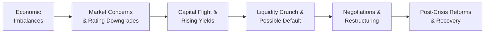

## Introduction and Context

Sometimes, the image of a government defaulting on its debts feels counterintuitive—how can a sovereign entity, which literally issues its own currency in some cases, run out of money? Well, the short answer is that sovereigns can hit constraints too (especially when their debt isn’t denominated in their home currency), and such constraints can spark intense market turmoil and political upheaval. In the realm of public finance, a sovereign debt crisis manifests when a government is either unwilling or unable to repay its debt on time and in full. These crises can snowball into broader economic collapses, exacerbating unemployment, inflation, social unrest, and more.

In this section, we’ll delve into the nitty gritty of sovereign debt crises: how they arise, who’s involved, and what can be done to manage or resolve them. This ties back to the broader fixed-income framework in various ways—most notably by illustrating how government obligations, often seen as “risk-free” in an investment context, do in fact carry unique forms of credit risk. For advanced investment professionals, understanding sovereign debt crises and restructurings is crucial for building robust multi-asset portfolios, anticipating macroeconomic calamities, and optimizing risk management strategies.

## Major Causes of Sovereign Debt Crises

From my experience, having followed the news on sovereign defaults—like Argentina’s repeated issues or the Greek crisis in the early 2010s—I’ve noticed that most sovereign debt crises don’t just happen overnight. They typically brew over time, fueled by a combination of macroeconomic imbalances, policy missteps, or external shocks. Below are some of the most common triggers:

Macroeconomic Imbalances  
A persistent fiscal deficit where governments continually spend more than they collect in revenue is one classic scenario. The government piles on debt to fund these deficits. Eventually, market participants question either the sustainability of that debt or the currency stability and start requiring higher yields. These higher financing costs can make the problem worse, turning a liquidity issue into a solvency nightmare.  

Sudden Capital Flight  
When global investors lose confidence—often triggered by a credit rating downgrade, political instability, or a shift in global sentiment—they withdraw their funds from local markets, intensifying the government’s inability to refinance its maturing debt. This “run” on the sovereign can plunge a country into crisis almost overnight.

Commodity Price Shocks  
For countries heavily reliant on commodities (oil, minerals, agricultural products, etc.), a sharp decline in prices can erode export revenues. Reduced tax revenues and foreign exchange inflows constrain the government’s ability to service external debt. Because these countries frequently must pay debt in foreign currencies, the shortage of foreign exchange reserves can accelerate default risk.

Political Instability  
Policy uncertainty, post-election transitions, sudden regime changes, or internal strife can provoke capital outflows and hamper long-term fiscal or monetary policymaking. Investors grow nervous about the continuity of economic reforms or the risk that new governments may repudiate existing debt obligations.

Currency Mismatch  
Sovereigns that issue debt in a currency other than their own are especially vulnerable. If the local currency depreciates significantly, the cost of repayments in hard currency (e.g., USD, EUR) can skyrocket. The government effectively needs more local currency to purchase the foreign currency necessary for debt servicing.

## Early Signs and Market Indicators

Recognizing early signs of a brewing sovereign debt crisis helps portfolio managers adapt exposures and hedge against potential losses:

• Steep climbs in government bond yields or dramatic widening of the option-adjusted spread (OAS).  
• Deterioration in foreign currency reserves.  
• Rising credit default swap (CDS) spreads.  
• Negative changes in sovereign credit ratings.  
• Rapid depreciation of the local currency.  

These indicators often form the basis of scenario analyses, stress tests, and dynamic asset allocation decisions.  

## Restructuring Tools and Mechanics

Once the possibility of default is real, the question becomes: how does a government restructure its outstanding obligations in a way that is acceptable (or at least tolerable) to creditors? The main restructuring techniques include:

Maturity Extension  
Instead of paying the principal on the original schedule, the sovereign negotiates to lengthen the duration of its debts. This effectively grants the issuer more time to improve its fiscal position. From an investor’s standpoint, it may be somewhat painful—delayed repayment—but it’s arguably less painful than a steep principal haircut (which we’ll discuss next).

Coupon Reduction  
Governments might also seek to lower the interest rate they pay on their debts. By cutting the coupon, they reduce their annual servicing costs. In practice, there’s often a tradeoff: investors might accept a modest coupon reduction if they believe they’ll retain more of their principal and if the revised repayment schedule looks credible.

Haircut on Principal  
The most stringent approach is to reduce the face value of the bond itself. For example, in a 50% haircut scenario, a bond with a face value of USD 1,000 might become “worth” USD 500. This kind of measure can lead to large losses for investors but may be the only way for the sovereign to stay afloat. And sometimes, ironically, investors can prefer a one-time big haircut to repeated small restructurings that never truly fix the issue.

## The Key Players and Negotiation Framework

The negotiation for sovereign debt restructuring can be quite dramatic, resembling a complicated chess match. Picture large institutional bondholders, local banks, bilateral lenders (other governments), and organizations like the IMF all huddled around a table trying to balance self-interest with the risk of plunging the economy into deeper crisis.

• IMF: Often steps in with an emergency lending program that is conditional on fiscal austerity, structural reforms, and changes in local governance.  
• Bondholder Committees: Groupings of institutional investors and asset managers who collectively hold a large chunk of the country’s debt. They negotiate in unison for better recovery rates.  
• Paris Club: An informal group of major creditor governments (such as the U.S., U.K., France, Japan) who coordinate strategies for dealing with debtor nations that face payment difficulties.  

### Collective Action Clauses (CACs)

An increasingly common feature in modern sovereign debt contracts, CACs allow a supermajority of bondholders (often around 75%) to agree to a proposed restructuring. Once that threshold is met, the terms become binding for all bondholders, even those who voted against the proposal. This mechanism is designed to prevent “holdout bondholders” from derailing restructuring deals or demanding more favorable terms.

### Local Law vs. Foreign Law Bonds

Restructuring outcomes often hinge on the legal jurisdiction of the bonds. When bonds are issued under local law, governments can sometimes change statutes unilaterally to force changes in bond terms. This can ease the restructuring process for the government but sow distrust among foreign investors. Meanwhile, bonds issued under international or foreign jurisdictions often require negotiations in foreign courts, limiting the sovereign’s ability to impose a quick fix.

## Diagram: Sovereign Debt Crisis Lifecycle

Below is a simplified Mermaid diagram illustrating the typical lifecycle of a sovereign debt crisis.

## Argentina & Greece: Two Contrasting Case Studies

It’s one thing to talk theory, but real cases illustrate how hair-raising sovereign debt crises can be:

Argentina (Early 2000s)  
• In 2001, Argentina defaulted on about USD 95 billion of government debt, one of the largest sovereign defaults in history. After years of currency peg misalignments, capital flight, and the unsustainable accumulation of debt, the government was forced into default.  
• The restructuring discussions stretched over a decade, with some investors (the “holdouts”) demanding better terms. This legal battle even made it into U.S. federal courts since many bonds were governed under New York law.  
• Ultimately, Argentina had to offer new bonds at significantly reduced face value, and the complexity of the process became a cautionary lesson.

Greece (2012)  
• Greece’s membership in the Eurozone meant it couldn’t simply devalue its currency. When government spending ballooned amid the global financial crisis, the country found itself on the brink of default.  
• Multiple bailouts were arranged by the European Union and the IMF, contingent on rigorous austerity measures. Private sector bondholders took roughly a 53.5% nominal haircut (one of the largest in advanced economies) and faced extended maturities.  
• Collective Action Clauses inserted into Greek law facilitated the deal, forcing all bondholders to comply if a supermajority agreed. Despite the challenges, the short restructuring timeframe and the robust legal framework used for the exchange distinguished it from the prolonged Argentine saga.

## Post-Crisis Impact and Recovery

After a sovereign debt restructuring, the real challenge begins—namely, regaining investor trust. Portfolio managers watch closely for signs that the sovereign is returning to a sustainable fiscal path:

• Implementation of structural reforms, such as broadening the tax base or privatizing state-owned industries.  
• Improvements in governance, transparency, and the rule of law.  
• Stabilization of external balances and the consolidation of fiscal deficits.  
• Uptick in economic growth rates, which helps debt-to-GDP ratios find healthier levels over time.  

These post-crisis reforms often shape the long-term yield spreads on the restructured debt. Strong reforms may compress spreads as investors regain optimism and credit ratings improve. Conversely, if reforms stall or if policymakers backtrack (perhaps due to political resistance), the country may remain stuck with high borrowing costs and limited market access.

## Key Terms and Concepts

Haircut  
Defined as the reduction in the bond’s principal or net present value (NPV). A 30% haircut might indicate a USD 1,000 bond is restructured to a face value of USD 700, or, equivalently, its present value is cut by 30%.

Paris Club  
An informal group of creditor nations who aim to find coordinated solutions for countries with payment difficulties. The Paris Club primarily deals with official (government-to-government) debt rather than private credits.

IMF Conditionality  
Refers to the policy actions, reforms, or conditions a sovereign must fulfill to receive financial assistance from the IMF. These conditions aim to restore macroeconomic stability and ensure that the debtor nation can repay the IMF over time.

External vs. Domestic Debt  
External debt is typically foreign-currency-denominated and governed by foreign law. Domestic debt is essentially local-currency-denominated under domestic law. The distinction is crucial for the difficulty of restructuring, investor base, and risk exposure.

## Best Practices for Analysis and Monitoring

For CFA candidates focusing on portfolio management strategies, here’s how you might apply these insights:

• Spread Analysis: Watch yield spreads against a benchmark (e.g., U.S. Treasuries or German Bunds) for early warning signals. A sudden spike can indicate rising default fears.  
• Credit Ratings & CDS: Examine rating agency updates and credit default swap pricing to gauge market sentiment about default probabilities.  
• Scenario Testing & Stress Simulations: Model how sovereign yields might respond to commodity price shocks or capital outflows to see potential impacts on fixed-income portfolio valuations.  
• Diversification & Hedging: Incorporate currency hedges (if feasible) and build diversified sovereign risk exposures across different regions and commodity sensitivities.  
• Regulatory Considerations: Keep track of new local laws regarding CACs, foreign exchange controls, or capital flow measures, which can directly affect bond restructuring outcomes.

## Possible Pitfalls and Common Challenges

• Overreliance on Past Performance: Just because a country has historically serviced its debt does not guarantee it always will—shifting political winds or macroeconomic conditions can quickly upend outdated assumptions.  
• Underestimating Legal Complexities: Restructuring under local law versus foreign law can drastically alter the timeline and the final resolution.  
• Political Resistance to Austerity: Governments often face fierce backlash when implementing IMF conditions or fiscal tightening, which can stall reforms and complicate negotiations.  
• Contagion Risks: In an interconnected global market, one sovereign default can impact other nations’ borrowing costs (especially within regional blocs or currency unions).

## Practical Application in a Multi-Asset Portfolio

Although we typically associate government bond holdings with relative safety, a sovereign debt crisis can shatter that assumption. A few portfolio-level considerations:

• **Rebalancing**: If you sense rising credit risk in a country’s debt, rebalancing into safer or uncorrelated assets (e.g., U.S. Treasuries, gold, or well-diversified global equity indexes) might help contain downside.  
• **Allocations to EM Sovereigns**: Emerging market (EM) sovereign bonds, which often carry higher yields, also face more acute vulnerability to crisis. Setting clear position size limits can control concentration risk.  
• **Integration with Macro Strategies**: Some managers employ macro strategies—like shorting the currency or purchasing CDS—to hedge or profit from rising sovereign risk.  
• **Active Engagement**: Large institutional bondholders sometimes coordinate or even engage directly with issuers and policymakers to facilitate workable solutions, aiming to maximize recoveries and support stable transitions.

## Exam Relevance and Constructed Responses

On the CFA exam, especially at the advanced levels where portfolio management is emphasized, you may encounter scenario-based essays or item sets describing an economy showing early signs of stress—rising yields, capital flight, currency depreciation—and then be asked to:

• Recommend a strategy for hedging sovereign risk in a bond portfolio.  
• Evaluate the potential impact of haircuts on the portfolio’s yield and duration profile.  
• Perform break-even analysis to see if the restructuring terms might be worth accepting.  
• Identify macro signals that would justify a shift in country allocation.

Because the exam can integrate fixed-income analysis with ethics, risk management, and portfolio construction, proficiency in diagnosing sovereign crises and formulating solutions can be key to performing well in scenario-based questions.

## Personal Reflections

I remember reading the news from early 2012 about Greece’s dire predicament, and it felt surreal that a developed-market country in the Eurozone was on the verge of default. It taught me that no entity—no matter how advanced or stable it appears—can escape the consequences of unsustainable fiscal policies and rigid monetary constraints. Watching the negotiations unfold, seeing the role of the IMF and the ECB, understanding how bondholders assessed the risk, all made it clear that behind words like “sovereign” and “restructuring,” there are very human policy missteps, constraints, and urgent improvisations.

## Strategies to Avoid Future Crises

From a policy perspective, it’s worth knowing (even as an investor) that governments can mitigate the risk of a future crisis by:

• Maintaining prudent debt levels relative to GDP.  
• Diversifying the investor base and denominating debt in the local currency as much as possible.  
• Building robust foreign exchange reserves.  
• Establishing clear fiscal rules (like balanced-budget amendments or debt brakes).  
• Enhancing legal frameworks to accelerate negotiations and reduce holdout risks.

## Conclusion and Final Exam Tips

Sovereign debt crises underscore the notion that “risk-free” is never an absolute guarantee, particularly for countries that can’t print the currency in which their debt is denominated (or do so without fueling harmful inflation). Identifying vulnerabilities in a government’s finances, understanding the restructuring process, and anticipating negotiations provide a huge advantage from a portfolio management standpoint.

When approaching case studies or constructed-response questions on the exam:

• Stay alert to macroeconomic indicators, rating signals, and primary drivers of potential stress.  
• Be precise when describing the legal framework (CACs, local vs. foreign law).  
• Use thorough scenario analysis—no single ratio or metric can capture everything.  
• Summarize the benefits and drawbacks of each restructuring tool (maturity extension, coupon reduction, principal haircut) and link them to potential portfolio outcomes.  
• Show keen awareness of how official bodies (IMF, Paris Club) interact with private creditors, and the role of any external conditions or legal constraints.  

With a smart eye on these details, you can navigate or even advantageously position a portfolio amidst sovereign debt turbulence.

## References

• Sturzenegger, F., & Zettelmeyer, J. (2007). Debt Defaults and Lessons from a Decade of Crises. MIT Press.  
• IMF official website: https://www.imf.org  
• Academic case studies on Argentina (early 2000s) and Greece (2012).  
• “Chapter 6: Bond Pricing and Valuation Basics” and “Chapter 8: Interest Rate Risk and Return Analysis” in this volume for added perspective on yield shifts, pricing, and risk measurement.

---

## Test Your Knowledge: Sovereign Debt Crisis and Restructuring



### A government has historically managed its debt obligations but faces a sharp drop in commodity export prices. Investors quickly pull their funds out, causing a spike in bond yields. Which key factor in sovereign debt crises is most directly illustrated by this scenario?

- [ ] Political instability
- [ ] New austere fiscal legislation
- [x] Sudden capital flight
- [ ] Excess local currency printing

> **Explanation:** A significant commodity price drop can undermine sovereign revenue streams, causing capital flight as investors fear default.

### Which of the following statements best describes a maturity extension in sovereign debt restructuring?

- [x] It delays the dates for principal repayment.
- [ ] It completely erases the outstanding principal obligation.
- [ ] It guarantees an increase in coupon rates.
- [ ] It grants creditors additional collateral.

> **Explanation:** A maturity extension prolongs the repayment schedule, reducing near-term obligations but not altering the principal amount.

### Why do Collective Action Clauses (CACs) matter in modern sovereign bond contracts?

- [ ] They guarantee that all bondholders receive the exact same recovery rate.
- [ ] They allow each bondholder to opt out of restructuring terms if they disagree.
- [x] They let a supermajority of bondholders approve a deal that becomes binding on all holders.
- [ ] They provide automatic IMF financing in a restructuring scenario.

> **Explanation:** CACs prevent minority holdouts from blocking restructuring agreements by requiring only a supermajority of bondholders to consent.

### Which entity is most commonly responsible for providing emergency funding and imposing conditions on a country during a sovereign debt crisis?

- [ ] Credit rating agencies
- [x] International Monetary Fund (IMF)
- [ ] The Federal Reserve
- [ ] U.S. Department of the Treasury

> **Explanation:** The IMF steps in with conditional rescue packages to help restore macroeconomic stability.

### Which of the following accurately describes the difference between domestic-law bonds and foreign-law bonds?

- [x] Bonds under domestic law can be more easily restructured through local statutes.
- [ ] Foreign-law bonds are always in the local currency.
- [x] Domestic-law bonds inherently require no coupon payments.
- [ ] Foreign-law bonds must carry collateral from the issuer.

> **Explanation:** Sovereigns can usually pass local legislation to change domestic bond terms, whereas foreign-law bonds require negotiations under external legal frameworks.

### From a portfolio manager’s perspective, which approach is most effective when sovereign bonds begin showing distress signals?

- [x] Scenario testing and potential rebalancing to reduce exposure.
- [ ] Ignoring the spreads and focusing on historical yields.
- [ ] Concentrating all resources in local-currency bonds to “average down.”
- [ ] Immediately filing legal action against the sovereign.

> **Explanation:** Scenario-based stress testing can inform a rational strategy—potentially hedging exposure or rebalancing away from the distressed issue.

### Which of the following is generally true about sovereigns facing a currency mismatch in their debt obligations?

- [x] A weakening local currency increases the real burden of the debt.
- [ ] Currency mismatch ceases to matter if the sovereign has a large gold reserve.
- [x] Currency fluctuations have no effect on coupon payments.
- [ ] Currency mismatch is not a meaningful factor in emerging markets.

> **Explanation:** When a government borrows in foreign currency, a sharp depreciation of the local currency can push debt servicing costs to untenable levels.

### Which real-world sovereign debt restructuring famously involved “holdout creditors” that refused initial restructuring terms for over a decade?

- [ ] Greece in 2012
- [x] Argentina in the early 2000s
- [ ] Iceland in 2008
- [ ] Portugal in 2011

> **Explanation:** Argentina’s default in 2001 resulted in a prolonged legal battle with holdout creditors under New York law.

### What is the primary risk for bondholders if a sovereign unilaterally amends its local legislation within domestic-law bond contracts?

- [x] The sovereign can alter repayment terms, forcing bondholders to accept worse conditions.
- [ ] All bondholders would need to be repaid in gold or other physical reserves.
- [ ] Credit rating agencies would automatically upgrade the sovereign’s status.
- [ ] The bondholders gain priority over all other sovereign obligations.

> **Explanation:** Domestic-law bonds are vulnerable to unilateral changes, lessening litigation options for investors.

### In a negative economic environment, which of the following statements about sovereign restructuring is most likely true?

- [x] True
- [ ] False

> **Explanation:** Sovereign restructuring often arises amid mounting pressures like capital flight, declining revenues, or political instability—making it a relevant scenario in negative economic conditions.


