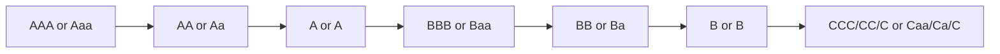

## Introduction
So let’s dive into one of the key fault lines in the corporate bond market: the split between Investment-Grade (IG) and High-Yield (HY) bonds. If you’ve ever wondered why some bonds are labeled “low risk, stable returns” while others are called “junk,” then this discussion is for you. At first glance, this distinction might seem trivial—“IG means safer, HY means riskier.” But I promise it’s more nuanced than that. In my early days in finance, I made the classic mistake of assuming “investment-grade good, high-yield bad”—only to discover that those so-called “junk” bonds can, at times, outperform and provide precious diversification benefits. 

By the end of this section, you should not only grasp the difference in credit ratings but also appreciate how market dynamics, liquidity conditions, and investor objectives shape the risk-return trade-off in IG vs. HY bonds.

## Defining Investment-Grade and High-Yield
From a rating-agency standpoint, investment-grade bonds sit in the upper tier of the rating ladder. Standard & Poor’s (S&P) and Fitch typically classify AAA, AA, A, and BBB as investment-grade. Moody’s does the same with Aaa, Aa, A, and Baa. Everything below BBB– (S&P/Fitch) or Baa3 (Moody’s) is classified as high-yield (also known as “speculative grade” or, informally, “junk”). 

• Investment-Grade (IG): Prolific among stable, mature companies and institutions with strong track records. You’ll often see issues from well-known conglomerates, banks, and certain government-sponsored enterprises.  
• High-Yield (HY): Issued by companies with higher default risk, possibly because they’re highly leveraged, in distressed industries, or simply younger, fast-growing firms with minimal credit history. In exchange, they tend to pay higher coupons (yield premiums) because their credit risk is perceived as greater.

## Credit Ratings and Classification
Let’s be honest: statements like “IG is safe and HY is risky” oversimplify the matter. There’s a whole spectrum of creditworthiness that rating agencies attempt to capture. As we examine later in Chapter 9 on credit risk, rating agencies look at multiple factors when assessing a bond issuer:

- Financial Statements: Coverage ratios, leverage, earnings variability, and cash flow generation.  
- Industry Outlook: Is the sector facing structural declines, or is it a strong-growth area?  
- Management Quality and Strategy: Companies with robust governance and strategic direction often fare better under stress.  
- Macroeconomic Conditions: HY spreads can blow out when the economy is faltering, while IG spreads might widen more modestly.

Even within IG, a BBB- rating is only a notch away from falling into HY territory—an event sometimes called a “fallen angel” scenario. Conversely, a BB+ bond is just one step shy of being upgraded to IG status—these climbers are often called “rising stars.”

## Market Behavior and Liquidity
Now, if you’ve ever traded high-yield bonds when the market suddenly becomes spooked—maybe due to a recessionary scare, a global pandemic, or just general economic stress—you might recall that the HY spreads widen significantly as investors scramble for safer assets. IG bonds, while not immune to market stress, often remain more resilient in terms of price and liquidity conditions.

• Liquidity in IG: Generally deeper and more robust, reflecting the typically larger issuance sizes and broader investor base. Big institutions—like pension funds, insurance companies, and mutual funds—often have mandates that favor or require IG paper.  
• Liquidity in HY: Can be patchier, especially in downturns. Brokerage dealers can be less inclined to hold large inventories of HY bonds during stress events, which can amplify price swings. 

> Personal memory: I once tried unloading a particular BB- bond in the market during a choppy period. Let’s just say, it took a while—spreads were all over the place, and we ended up selling at a deeper discount than I expected. That was my “ouch” moment confirming the importance of liquidity.

## Risk and Return Profiles
Why, then, would anyone intentionally choose high-yield bonds if they carry more risk, more volatility, and sometimes less liquidity? Well, the answer boils down to yield. 

- Yield Premium: HY bonds provide a higher yield compared to similarly maturing IG bonds. Over a complete market cycle, these additional coupon payments can enhance total returns.  
- Default Risk: On the flip side, the risk that the issuer can’t make interest or principal payments is notably higher in the HY segment. That’s why thorough credit analysis (see Chapter 9 on Credit Risk) is crucial.  
- Spread Volatility: HY spreads move around more than IG spreads in response to economic data and risk appetite. This can make HY returns more “equity-like,” with bigger gains in good times and bigger losses in bad times.

To illustrate, consider an IG bond with a yield of 4% vs. an HY bond at 7%. If economic conditions remain stable, that 3% yield differential can be quite attractive for yield-starved investors. But if defaults start climbing, the story changes fast. 

## Investor Profiles and Regulatory Constraints
Some of you might be thinking, “Can’t big institutions just buy all the HY bonds, pick up that extra yield, and call it a day?” Well, not necessarily. Regulatory bodies and internal investment mandates often prohibit or restrict the proportion of speculative-grade debt allocations in certain portfolios. 

- Pension Funds: They typically stick to safer IG bonds to match long-term liability streams with minimal volatility.  
- Insurance Companies: Also subject to solvency regulations that penalize holdings of more volatile assets like HY.  
- High-Yield Mutual Funds: Specialize in seeking out these riskier, higher-return opportunities.  
- Retail Investors: Some prefer packaged vehicles (like ETFs specializing in HY) to diversify default risk across multiple issuers.

During periods of collective risk aversion, these mandates and guidelines can amplify market stress, sometimes leading to forced selling of downgraded debt (fallen angels). If a large pension is required to offload a bond that loses its IG status, for instance, that can increase supply in the HY market, potentially depressing prices there further.

## Covenant Quality and Downgrade Risk
Ever seen the phrase “covenant-light loan” or “junk bond with strong covenants”? These terms reflect the protective features embedded within bond indentures.  

- Covenant Quality: Typically, IG bonds may have fewer restrictive covenants because the issuer is deemed safer. HY bonds, ironically, can sometimes have more stringent covenants to provide checks and balances as a condition for raising capital.  
- Downgrade Risk: One of the big concerns for borderline IG bondholders is the threat of a downgrade. A single ratings notch can trigger selling by institutions that can only hold IG debt. This forced selling can cause price dislocations (Chapter 2.1 discusses the role of bond indentures and covenants in credit quality, while Chapter 9.1 explains how default probability and loss-given-default tie into these structures).

## Analytical Approaches
When deciding between IG and HY bonds, analysts use both quantitative and qualitative methods. 

• Fundamental Analysis: Examine issuer financials, competitive environment, macro trends. Look at leverage ratios, interest coverage, and free cash flow.  
• Market-Based Indicators: Monitor credit spreads, equity price performance, and implied volatility—these can give real-time signals of changing market sentiment around the issuer’s creditworthiness.  
• Scenario Analysis: Stress-test an issuer’s financials under economic downturn scenarios. HY issuers generally exhibit more sensitivity to macro headwinds.  
• Relative Value: Evaluate whether the additional spread offered by an HY bond adequately compensates for its higher default risk compared to IG peers (see Chapter 8.1 for different ways to assess expected returns and risk).

## A Quick Illustrative Example
Let’s say we have two five-year bonds from two different issuers:

• IG Issuer (A-rated) with a yield of 3.5%.  
• HY Issuer (BB-rated) with a yield of 6.0%.  

If the economy remains robust and the HY issuer’s default risk doesn’t materialize, then an investor who chose the BB-rated bond would collect a higher coupon and ultimately realize superior returns. On the flip side, if there’s an economic downturn and the HY issuer struggles or defaults, that 2.5% yield pick-up is nowhere close to making up for a large capital loss.

### Simple Yield Spread Calculation in Python (Optional Illustration)

Below is a short (and somewhat simplistic) Python snippet that demonstrates how one might compute the yield spread between an IG bond and an HY bond from a small dataset:

```python
bonds = [
    {"name": "ABC_Corp_IG", "yield": 0.035},
    {"name": "XYZ_Corp_HY", "yield": 0.060},
    {"name": "RiskFree", "yield": 0.020}  # Suppose U.S. Treasury for reference
]

risk_free_yield = bonds[-1]["yield"]

for bond in bonds[:-1]:  # Exclude RiskFree from iterative comparison
    spread = bond["yield"] - risk_free_yield
    print(f"{bond['name']} Spread over Risk-Free: {spread:.2%}")
```

Sample output might look like:
• ABC_Corp_IG Spread over Risk-Free: 1.50%  
• XYZ_Corp_HY Spread over Risk-Free: 4.00%  

This simplified approach clarifies just how wide HY spreads can get when compared to risk-free benchmarks. Keep in mind, real-life yield spread calculations can be more involved, factoring in differences in maturity, coupon structure, liquidity premiums, and more.

## Mermaid Diagram: Credit Rating Scale
Below is a simple visualization of rating categories across major agencies, showing the point at which we pivot from IG into HY:



Everything from AAA/Aaa down to BBB/Baa is considered investment-grade. S&P and Fitch add plus/minus to further refine the categories, but the transition from BBB–/Baa3 to BB+/Ba1 represents the critical threshold between IG and HY.

## Market Cycles and Spread Movements
During stable economic conditions, the spread between IG and HY narrows; investors are more willing to take on credit risk for higher returns. However, in recessions or financial crises, HY yields shoot up, sometimes dramatically. In 2008, for instance, HY spreads reached double digits over Treasuries, reflecting heightened fear of defaults.

This cyclical spread behavior underscores how important the macro backdrop is when selecting corporate bonds. It’s not just about picking the correct rating bracket; it’s about understanding where we are in the credit cycle (Chapter 7.5 on yield curve shapes and movements might be helpful background, as yield curves and credit spreads often move in tandem in risk-off or risk-on markets).

## Best Practices for Analysts
• Understand Issuer Fundamentals: Even within the same rating bracket, not all bonds are created equal. Two BB-rated issuers can have vastly different risk exposures.  
• Keep an Eye on Liquidity: Particularly in the HY space, you want to gauge market depth and see if you can exit positions at a fair price if needed.  
• Monitor Credit Rating Changes: A single notch can alter an issuer’s entire investor base and liquidity profile.  
• Diversify: This might sound obvious, but it’s especially important in HY investing. The default of one issuer can wreak havoc on a concentrated portfolio.  
• Evaluate Covenant Strength: Solid covenants can protect you from excessive issuer risk-taking. Weak or “covenant-lite” structures can leave you more vulnerable.  

## Conclusion and Exam Tips
Perhaps the biggest takeaway is that being “high-yield” or “investment-grade” isn’t solely about a label. It’s a continuum of risk that changes dynamically with market sentiment, issuers’ fundamentals, and broader economic forces. For a CFA exam perspective, you’re often tasked with analyzing or comparing bond segments, judging which segment might outperform under given economic conditions, or explaining default risk and credit spread behavior.

• Here’s a quick exam tip: Make sure you can articulate how credit spreads respond to changing market conditions and why certain investors might be restricted (by regulation or mandate) from investing in sub-investment-grade paper.  
• Pay attention to the rating transition dynamics—fallen angels and rising stars—and how these rating changes can affect bond valuations.  
• Also, practice scenario analysis in your head: If the economy’s strong, HY can be very rewarding; if a recession hits, IG might be safer.  
• And watch for covenant specifics—exam questions often revolve around how covenants can shift the risk-return profile of a bond issue.

We’ll discuss more about credit analysis in Chapter 9, especially how default probabilities are modeled and what that implies for bond valuation. For further reading, see “Fixed Income Securities” by Frank J. Fabozzi, or review the rating methodologies on Moody’s and S&P’s websites. These resources can amplify your understanding of how rating agencies draw the line between IG and HY.

## References, Further Reading, and Links
• Fabozzi, F. J. “Fixed Income Securities.” (Multiple editions)  
• CFA Institute, 2025 Level I Curriculum (Fixed Income)  
• Moody’s Ratings:  
  https://www.moodys.com/researchandratings  
• S&P Global Ratings:  
  https://www.spglobal.com/ratings  

## Test Your Knowledge: Investment-Grade and High-Yield Bonds



### Which of the following is usually the key differentiator between investment-grade (IG) and high-yield (HY) bonds?

- [ ] Average maturity
- [ ] Coupon payment frequency
- [x] Credit rating
- [ ] Currency denomination

> **Explanation:** IG vs. HY is largely determined by credit rating, specifically whether the rating is at or above BBB–/Baa3 (IG) or below (HY).

### When market participants expect economic growth to slow significantly, high-yield bond spreads typically do which of the following?

- [ ] Narrow relative to government bonds
- [x] Widen relative to government bonds
- [ ] Remain unchanged
- [ ] Turn negative

> **Explanation:** HY bonds carry greater default risk. In downturns, investors demand wider spreads to compensate for higher perceived credit risk.

### Which type of investor is most likely to have strict regulatory or policy constraints limiting exposure to high-yield bonds?

- [x] Insurance companies
- [ ] Hedge funds
- [ ] Individual day traders
- [ ] Unregulated private equity firms

> **Explanation:** Many insurance companies (and pension funds) face regulatory requirements limiting the level of speculative-grade bond holdings in their portfolios.

### A “fallen angel” in the bond market is best described as:

- [ ] A high-yield bond upgraded to investment grade
- [ ] A bond in default transitioning to distressed status
- [x] An investment-grade bond downgraded to high-yield
- [ ] A bond that matured but was not redeemed

> **Explanation:** A “fallen angel” is a bond that has lost its investment-grade status. This downgrade often triggers forced selling by certain investors.

### Which of the following most accurately characterizes liquidity conditions for high-yield (HY) bonds during periods of market stress?

- [x] Spreads widen significantly, and market liquidity tends to deteriorate
- [ ] Liquidity improves because more traders become interested in HY
- [x] HY bonds can become more liquid as issuers buy them back
- [ ] Price volatility is eliminated by strong covenant protection

> **Explanation:** When risk aversion spikes, HY bond demand often wanes, leading to widening spreads and reduced liquidity. (Note: The second marked answer is intentionally incorrect; only the first statement about spreads widening and liquidity deteriorating is correct.)

### Which factor is most commonly cited as a primary determinant of the difference in yields between similarly maturing IG and HY bonds?

- [x] Default risk
- [ ] Interest rate risk
- [ ] Call features
- [ ] Market settlement conventions

> **Explanation:** The yield premium demanded by investors in HY bonds primarily compensates for higher default risk compared to IG bonds.

### In the context of credit analysis, which of the following is most likely to be more restrictive for high-yield bonds than for investment-grade bonds?

- [x] Covenant packages
- [ ] Floating rate adjustments
- [x] Secondary trading volumes
- [ ] Make-whole premium clauses

> **Explanation:** HY issuers often must offer more robust covenant protections. (The second marked answer about secondary trading volumes is incorrect—HY volumes may be lower or less liquid, but that is not typically described as “restrictive” in the same sense as covenants.)

### Which is a typical characteristic of an investment-grade corporate bond issuer, relative to a high-yield issuer?

- [x] Lower leverage ratios and strong cash flow coverage
- [ ] Higher leverage and minimal cash flow
- [ ] Greater exposure to economic cycles
- [ ] Automatic replacement of management upon rating downgrade

> **Explanation:** Investment-grade issuers usually have lower leverage, better coverage ratios, and more stable cash flows. 

### Which of the following is a common reason for forced selling of a bond that has just experienced a downgrade from BBB– to BB+?

- [x] Institutional mandates preventing the holding of bonds below investment-grade
- [ ] A sudden maturity acceleration clause
- [ ] A government mandate that all HY bonds be sold within one week
- [ ] Guaranteed default event triggered by the downgrade

> **Explanation:** Many institutions have policy or regulatory restrictions that disallow holdings of below-investment-grade bonds, thus forcing them to sell after a downgrade.

### True or False: High-yield bonds typically exhibit lower market price volatility than investment-grade bonds during financial crises.

- [ ] True
- [x] False

> **Explanation:** High-yield bonds often exhibit significantly higher price volatility during crisis periods because of greater perceived credit and liquidity risks.


