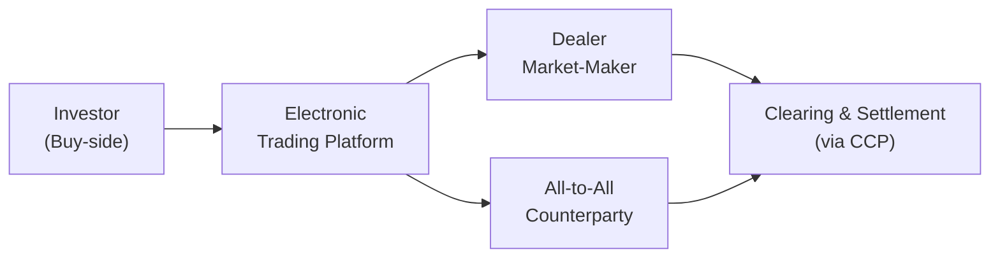

## Background and Overview

So, let’s begin with a quick look back at life before 2008. Picture a busy trading floor—dealers animatedly quoting prices over phone lines, large bond inventories on bank balance sheets, and plenty of capital available to take positions. Recall that banks served as the central hub for corporate bond trading; they were often the key market-makers and their balance sheets could warehouse significant amounts of inventory. But, well, you know, everything changed when the global financial crisis hit. Suddenly, increased capital requirements, higher regulatory scrutiny, and a collective surge of caution forced a major shift in how corporate bonds trade.

In the decade or so after the crisis, we saw new rules (like Basel III and the Dodd-Frank Act) come into effect. These rules incentivized banks to reduce risk, which—for better or for worse—translated into reduced market-making capacity. And guess what followed? A wave of electronic trading, more direct “all-to-all” trading platforms, and an explosion in bond exchange-traded funds (ETFs). Today’s corporate bond market might be unrecognizable to a pre-crisis bond trader, especially given the reliance on electronic platforms. 

But the story doesn’t end there: all these structural changes introduced new challenges. Market liquidity can sometimes feel elusive, and it can fragment across different trading venues. Regulatory emphasis on transparency (e.g., FINRA’s TRACE in the U.S.) adds a new dimension of post-trade reporting that some say helps reduce transaction costs, while others worry it might stifle large trades. So let’s walk through the major changes one by one and see how it all ties together for market participants, portfolio managers, and, yes, CFA candidates diligently preparing for their final exam.

## The Impact of Post-Crisis Regulatory Reforms

After 2008, global financial regulators were determined to reduce systemic risk. Big banks, already licking their wounds, watched as rules like Basel III demanded larger capital buffers, especially for less liquid assets. Dodd-Frank in the U.S. imposed additional constraints on proprietary trading and derivatives activities. For corporate bond desks, higher capital charges and stricter oversight ultimately made it more expensive to “warehouse risk,” meaning to hold a large inventory of bonds while waiting for buyers.

In my own experience on a bond trading desk (and, well, let’s just admit it: I always liked having a decent inventory to serve clients fast), these new rules forced us to become pickier about which bonds we held. Suddenly, the cost-benefit analysis changed. If a dealer is penalized for holding illiquid paper, they’ll scale back those positions—a straightforward but powerful link between regulation and liquidity. Combined with the more general atmosphere of caution, many dealers cut staff and reduced trading activities in riskier segments, like high-yield corporate bonds.

Of course, these reforms had an upside: the banking system is arguably more resilient, and the possibility of a bank’s collapse from overextended trading positions is (in theory) lower. But from an investor’s standpoint, it also meant that the old “principal-based” liquidity a dealer might have provided shrank. This precipitous shift in how suddenly large bond inventories vanished is widely regarded as one of the most transformative changes in corporate bond microstructure post-crisis.

## Electronification and the Bucking of Old Traditions

In parallel, the corporate bond market discovered electronic platforms. Historically, bond trading was relationship-driven, executed via telephone or specialized messenger systems. But, as is often the case, technology rushed in to fill the void that banks left behind. Market participants, hungry for alternative price discovery mechanisms, turned to electronic trading platforms for increased transparency and faster execution.

All-to-all trading venues—where buy-side participants are no longer forced to trade exclusively with dealers—gained traction. This was essentially a ripple effect. If dealers are less willing to hold bonds on their books, then buy-side participants increasingly trade with each other, matching a seller’s inventory directly with a buyer’s demand. In some venues, any participant can place bids and offers, effectively bypassing the traditional role of a single dealer.

It’s important, however, to realize that not all of the corporate bond market is equally “electronified.” Highly liquid, benchmark issues or recently issued large names might see very active electronic trading. But less liquid, smaller issuers may still rely heavily on over-the-phone negotiations or other more relationship-driven processes. That means the market is partially fragmented between technology-forward segments (like large, frequently traded investment-grade corporate bonds) and those with lower liquidity—where technology’s footprint remains a work in progress.

## Market Fragmentation and the Rise of All-to-All Trading

A frequent comment from buy-side veterans is that the corporate bond market feels more fragmented than ever before. Instead of one or two main dealer banks quoting everything, we’ve got an evolving patchwork of central limit order books, crossing networks, and request-for-quote (RFQ) platforms. As a result, traders often have to check multiple platforms to find the best execution or the largest available trade size. 

Some participants love it: more competition can theoretically drive costs lower, and all-to-all puts the buy-side in a position to provide liquidity and earn the spread when they want to. Others worry about that dreaded liquidity vacuum if everyone suddenly turns into a seller at the same time—without dealers stepping in to smooth out imbalances. 

In stressful markets, it’s not always guaranteed that these electronic platforms will seamlessly handle waves of selling pressure or large institutional trades that used to occur via voice negotiation. The upshot is that modern markets might experience sharper price movements when sentiment shifts, because it’s harder to find someone willing to “warehouse” big chunks of bonds. 

## Post-Trade Transparency: FINRA’s TRACE 

If you remember what it was like to buy and sell corporate bonds a couple of decades ago, you might recall an almost total lack of post-trade transparency. Before FINRA’s Trade Reporting and Compliance Engine (TRACE) in the U.S., it wasn’t trivial to figure out where comparable bonds were trading. But now, large trades are usually reported within minutes, providing a reference point for market participants. In fact, many other regions across the globe have followed suit with their own transparency initiatives.

Post-trade transparency does more than just keep everyday traders informed. It has broader implications for portfolio managers, compliance analysts, and risk managers—everyone gets a better sense of market pricing and transaction volumes. Moreover, the documented data allow for more meaningful analytics and better measurement of transaction costs. 

Though the consensus is generally that transparency is beneficial, some worry that large block trades could push prices away from a fair level if the market sees the actual size or the identity of the buyer. For that reason, certain regulatory frameworks allow for delayed or partial reporting of block trades. On the exam, you might see how these delayed reporting rules try to balance transparency with the risk of front-running or “information leakage,” especially for institutional block trades.

## Operating Costs, Regulatory Compliance, and Algorithmic Trading

Let’s not sugarcoat it: cost pressures in fixed income have soared post-crisis. Due to more burdensome compliance requirements, banks (and other broker-dealers) must keep robust records of trades, ensure best execution, and abide by rules set by Dodd-Frank or similar regulations around the world. Keeping a trading floor afloat is no small expense; the technology, back-office staff, compliance, and risk management capabilities all cost money.

As a response, some dealers have pivoted to more data-driven approaches. Algorithmic and high-frequency trading (HFT) techniques—which are already mainstream in equities—are creeping into liquid corners of the corporate bond market. The process is slower than in equity or FX markets because corporate bonds are more diverse, less standardized, and often less liquid. But for large, well-known issuers, algorithmic strategies can quickly parse real-time data to identify short-term mispricings between closely related securities.

That said, we don’t see HFT dominating corporate bonds as it does in equities—liquidity constraints and over-the-counter (OTC) characteristics limit the scalp-type trades typical in stock markets. Instead, you might see “quant stat-arb” funds that try to exploit small yield spread anomalies or engage in cross-instrument hedging (for example, by using credit default swaps or interest rate futures). The net takeaway is that technology and advanced analytics are definitely playing a bigger role. From a microstructure standpoint, the injection of more algorithmic players can tighten bid-ask spreads in more liquid segments but doesn’t necessarily solve the liquidity puzzle for smaller or less frequently traded issues.

## Bond ETFs and Their Influence on Liquidity

One of the most transformative trends post-crisis—especially relevant for buy-side investors—has been the meteoric rise of corporate bond ETFs. ETFs enable investors to buy or sell a basket of bonds in one shot, usually on an exchange. This can be a blessing if you want quick market exposure, or if you need to offload a position fast without individually sourcing trades for 50 different bonds.

There’s an ongoing debate, though, about the extent to which bond ETFs encourage or damage market liquidity. On one hand, they provide immediate access to the bond market, reduce friction, and can sometimes trade at narrower spreads (especially for the most popular ETFs). On the other hand, critics fear a mismatch: the underlying bonds might be illiquid at certain times, so the ETF vehicle could face dislocations between its market price and the net asset value (NAV) of its underlying holdings. 

Investors have caught glimpses of this mismatch during market stress. In March 2020, for instance, some bond ETFs briefly traded at discounts to NAV because the underlying bond market seized up. To be fair, the discount attracted arbitrage participants who stepped in to buy ETF shares and redeem them for the underlying bonds—an action that eventually helped restore alignment. That phenomenon highlights the interplay of ETF arbitrage, liquidity, and pricing. In a sense, bond ETFs serve as a barometer for liquidity conditions in the underlying corporate bond market.

## Liquidity Premium and Narrow Dealer Balance Sheets

A fundamental piece of corporate bond valuation is the liquidity premium. Informally, you might think of the corporate bond yield as:


\text{Yield}_{\text{corporate}} 
= \text{Risk-Free Rate} 
+ \text{Credit Spread} 
+ \text{Liquidity Premium}.


Post-crisis, we’ve seen changes in how big that liquidity premium can get—and how quickly it can spike. In stable markets, liquidity premiums might look modest, thanks to competition between dealers and the emergence of electronic platforms. However, in times of panic or major stress events, the liquidity premium can balloon if dealers are reluctant to commit capital and inventories to soak up selling pressure. 

The overall narrower balance sheets at dealer banks, combined with risk aversion and compliance constraints, mean that the corporate bond market can gyrate more abruptly. Agile portfolio managers want to pay attention to this dynamic. Even though technology and transparency might have improved average-day liquidity, the “tail risk” of a sudden liquidity drought remains acute. And that’s precisely why some advanced credit strategies will incorporate measures of liquidity risk into their models—particularly for high-yield bonds, where volatility can be intense.

## Practical Implications for Portfolio Managers and Market Participants

From a portfolio management standpoint, all these microstructure changes have real-world consequences. For instance, large institutional investors used to rely on dealers for immediate fills on big block trades; now, they might slice up a single trade into multiple smaller transactions across multiple platforms to minimize market impact. That affects transaction costs, slippage, and even the viability of certain active trading strategies in credit markets.

Managers also have to think more holistically about liquidity. Hedging strategies (like shorting investment-grade bond futures or corporate credit index products) are widely used to manage credit risk, but one must track how well those hedges hold up in a less dealer-centric landscape. Meanwhile, the presence of bond ETFs can help quickly adjust exposures at a portfolio level. 

If you’re prepping for the CFA exam, it’s common to see scenario-based questions where you need to articulate how an all-to-all platform might improve (or degrade) execution for a large order. Or you might be asked to compare the attractiveness of a bond ETF to direct bond ownership in terms of liquidity, trading costs, or pricing transparency. Keep in mind that the exam frequently wants to see your reasoning about risk and the potential for volatility in “less liquid” segments of the bond market.

## Case Study: The COVID-19 Market Stress

A recent example that tested the post-crisis ecosystem was the COVID-19 market turmoil in March 2020. Liquidity in the corporate bond market dried up quickly as investors scrambled to de-risk. We saw dealer balance sheets remain constrained, while bond ETFs traded at noticeable discounts to NAV. Central banks, like the Federal Reserve, stepped in with corporate bond purchase programs to stabilize markets. 

This period illustrated both the vulnerabilities and strengths of the new microstructure. On one side, the immediate price dislocations showed how quickly liquidity can vanish. On the other, electronic platforms allowed trades to keep flowing (albeit at wider bid-ask spreads), and ETF arbitrage mechanisms functioned well enough to eventually restore normalcy. So the post-crisis market structure certainly faced a major stress test—a test that likely would have played out quite differently had it been pre-2008 with the old dealer-centric model in place.

## Best Practices, Common Pitfalls, and Strategies

• Use multiple trading venues: With fragmentation, it’s rarely optimal to rely on a single platform or dealer. Smart order routing systems can help find the best liquidity across venues.  
• Monitor TRACE or other reporting systems: Post-trade data can give you real-time insights into where credit markets are trading, which helps with both pricing and compliance.  
• Size trades carefully: Large block trades can cause big slippage if the market is thin; consider slicing them into smaller orders or using dark (crossing) pools that preserve anonymity.  
• Leverage bond ETFs for short-term exposure: ETFs might be a cost-effective way to gain or reduce sector/credit exposure quickly, but keep an eye on premiums/discounts and track liquidity.  
• Stress-test for liquidity crunches: Remember that in a crisis, “liquidity” can be ephemeral. Build robust scenario analyses that consider widening bid-ask spreads and limited dealer capacity.

## Exam Relevance and Final Tips

It’s quite possible you’ll face a question combining corporate bond valuation, liquidity risk, and portfolio management on the Level III exam. You might be asked: “How do narrower dealer balance sheets affect corporate bond liquidity, and which strategies might mitigate these effects?” Or you might have to explain how increased post-trade transparency impacts the cost of transacting in thinly traded securities. 

Be prepared to connect the dots between yield spreads, credit risk, and liquidity constraints. In essay-style questions, highlight the interplay of regulation, technology, and risk management. Demonstrate an understanding of how and why corporate bond microstructure has evolved post-crisis—and how that evolution might manifest in both normal markets and times of stress. Also consider referencing the role of central counterparties (CCPs) in mitigating counterparty risk for certain fixed-income transactions, or the effect of index rebalancing on bond liquidity.

A few final tips:  
• When discussing liquidity premiums, be specific about how they vary in normal vs. stressed scenarios.  
• If referencing all-to-all trading, describe how the system can democratize access to liquidity but also how it might fail during a mass sell-off.  
• Remember that regulators want fewer systemic blowups, so while capital requirements curb dealer risk-taking, they also reduce the cushion that once smoothed the market.  

Demonstrating a balanced view—recognizing both the benefits and limitations of the new structure—will serve you well on exam questions.

## References and Further Reading

• FINRA’s TRACE official website:  
  https://www.finra.org/rules-guidance/key-topics/trace  

• Foucault, T., Pagano, M., & Röell, A. (2013). “Market Liquidity: Theory, Evidence, and Policy.” Oxford University Press.  

• Federal Reserve Bank Research Discussions on Corporate Bond Liquidity (various publications).  

• European Central Bank (ECB) Occasional Papers on Post-Crisis Market Reforms.  

• Basel III: https://www.bis.org/bcbs/basel3.htm  

• Dodd-Frank Wall Street Reform and Consumer Protection Act (U.S.):  
  https://www.congress.gov/bill/111th-congress/house-bill/4173  

---------------------------------

## Test Your Knowledge: Corporate Bond Market Microstructure Updates Quiz



### Which of the following post-2008 regulatory changes has most directly pressured dealer banks to reduce their bond inventories?

- [ ] Introduction of new government bond issuances
- [ ] Exemptions for hedge funds trading OTC derivatives
- [x] Higher capital requirements (Basel III, Dodd-Frank)
- [ ] Expansion of credit rating agencies

> **Explanation:** Basel III and Dodd-Frank enforce stricter capital and liquidity coverage ratios, making it more expensive for dealers to hold large inventories of corporate bonds on their balance sheets.

### Which trading model allows buy-side participants to trade directly with each other rather than routing all trades through a dealer?

- [ ] Crossing network
- [x] All-to-all platform
- [ ] Central counterparty clearing
- [ ] Voice-based interbank market

> **Explanation:** All-to-all trading describes a model in which any participant, including buy-side firms, can post bids and offers and transact with other buy-side or sell-side participants directly.

### What is a primary benefit of TRACE (Trade Reporting and Compliance Engine) in the U.S. corporate bond market?

- [x] It increases post-trade transparency by disseminating transaction data.
- [ ] It eliminates counterparty risk by guaranteeing trade completion.
- [ ] It mandates that block trades remain undisclosed for 30 days.
- [ ] It sets official reference prices for settlement.

> **Explanation:** TRACE improves transparency by publishing near-real-time data on executed trades, helping market participants gauge fair pricing and liquidity.

### Why might high-frequency trading (HFT) be less prevalent in the corporate bond market than in equities?

- [ ] HFT is illegal for corporate bonds.
- [x] Corporate bonds often exhibit lower liquidity and diversity across issuers, limiting HFT’s effectiveness.
- [ ] HFT costs are higher for bond traders than for equity traders.
- [ ] Regulators only permit HFT in exchange-listed assets.

> **Explanation:** The diversity and lower liquidity in corporate bonds hamper the rapid in-and-out strategies that define HFT, making it less central than in equities or FX markets.

### When referring to an ETF’s price trading at a discount or premium to its net asset value (NAV), which scenario below is most accurate?

- [ ] Bond ETFs typically always trade at par with their NAV.
- [ ] Discounts are impossible due to authorized participants.
- [x] In periods of market stress, the ETF’s market price may diverge from its NAV due to liquidity mismatches.
- [ ] ETFs only trade at a premium during bull markets.

> **Explanation:** During volatile or illiquid periods, bond ETFs can trade at discounts (or premiums) to NAV because the underlying basket of securities may be harder to price accurately or sell quickly.

### Which of the following factors best explains why corporate bond spreads may widen suddenly in a stressed market?

- [ ] Greater investor demand for immediate execution
- [ ] Improved post-trade transparency
- [x] Reduced dealer balance sheet capacity to absorb sell orders
- [ ] Lower interest rate environments

> **Explanation:** With dealers reluctant to warehouse inventory, any surge in selling can rapidly push spreads wider as there are fewer market-makers taking the other side.

### How does the new post-crisis microstructure most directly affect block trades of illiquid corporate bonds?

- [x] Investors often split trades into smaller pieces and execute them across multiple platforms.
- [ ] Dealers always provide immediate fills at narrower spreads.
- [x] Block trades are more easily executed as one large piece on electronic order books.
- [ ] There is no impact on block trades.

> **Explanation:** Traders may break big orders into smaller slices to reduce market impact, especially when liquidity is fragmented across several electronic platforms.

### What is one potential disadvantage of increased market fragmentation in corporate bonds?

- [ ] Investors must call their broker over the phone for every trade.
- [x] Traders may have to check multiple venues for best execution, increasing operational complexity.
- [ ] Transparency is essentially eliminated.
- [ ] Liquidity is never an issue.

> **Explanation:** With multiple trading venues and platforms, liquidity can be scattered. Traders often invest in technology solutions to aggregate quotes and optimize execution, which increases complexity.

### Which statement best describes the role of bond ETFs in providing liquidity to the corporate bond market?

- [ ] They eliminate the need for physical bond trading.
- [ ] They have completely replaced traditional bond dealers.
- [x] They offer a vehicle to gain or shed broad exposure quickly, but can trade at premiums/discounts to NAV.
- [ ] They are primarily used for high-frequency trading in credit markets.

> **Explanation:** Bond ETFs can be a liquidity conduit for investors seeking quick exposure or exit from a credit sector, yet during times of stress they may deviate from NAV if underlying bonds are illiquid.

### From a portfolio management perspective, which statement is TRUE regarding liquidity risks in the post-crisis corporate bond market?

- [x] Liquidity risk can spike quickly because dealers maintain smaller inventories.
- [ ] All-to-all platforms guarantee liquidity in downturns.
- [ ] TRACE reporting eliminates liquidity premium altogether.
- [ ] Regulatory reforms have permanently cured market stress scenarios.

> **Explanation:** With narrower dealer balance sheets, liquidity can vanish quickly in times of stress, underscoring the need for robust liquidity risk management.


