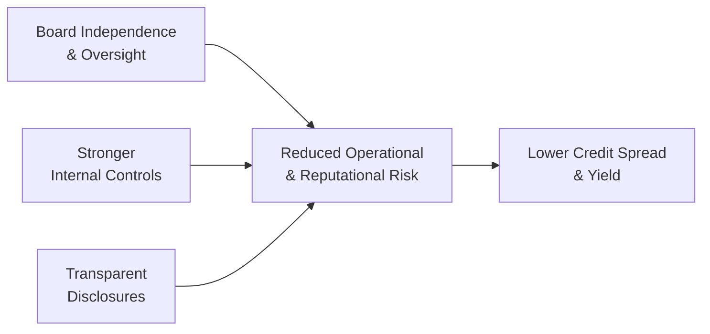

## Context and Overview

I remember the first time I analyzed a corporate bond with shaky governance. You know, back then, there was this manufacturing firm that had a few controversies around how its board was structured and how its executives were compensated. On the surface, the company was profitable, but something felt off. The board was full of insiders with personal ties to the CEO, there was minimal disclosure on how cash was being allocated, and rumors about conflicts of interest were popping up in newspaper headlines. To cut the story short, bond prices eventually slumped after the firm admitted to overstating earnings and had to restate its financials.

The experience was eye-opening. It showed me how corporate governance—and its many reforms—aren’t just impactful for equity holders. Strong governance structures can significantly alter the risk/reward profile for lenders and bond investors as well. Below, we’ll dig deep into the relationship between corporate governance reforms and what they imply for the debt markets, focusing on areas such as board oversight, disclosure quality, ESG factors, and the evolving regulatory landscape.

## Why Corporate Governance Matters for Bondholders

Corporate governance typically involves the system by which companies are directed and controlled. This includes processes to ensure accountability, transparency, and ethical behavior at the highest levels of the organization. While equity holders might see governance as primarily affecting share prices and dividend payouts, bondholders care just as much—maybe more—because weaker governance systems can lead to:

• Concealed leverage or misrepresentation of financials.  
• Increased operational risks (for instance, from fraudulent activities or self-dealing).  
• Strategic decisions that favor short-term equity interests at the expense of long-term debt repayment.  
• Troubling conflicts of interest that ultimately increase default risk.

When governance reforms minimize these threats, a corporation’s perceived credit risk declines—often resulting in tighter credit spreads and more stable bond prices. So if you’re wearing the hat of a bond investor, any improvement that strengthens the board’s oversight and fosters transparent financial disclosures is essentially good news for your investment.

## Key Governance Reforms and Their Relevance to Debt Markets

Strong governance rarely appears out of thin air; it is generally driven by regulators, investor demands, or as a result of corporate scandals that highlight glaring weaknesses. Let’s look at a few common reforms and how they might affect a firm’s debt profile.

### Board Independence and Oversight

More independent, objective board members mean higher likelihood that managerial decisions serve the long-term health of the company. Bondholders like to see that major strategic moves—like large acquisitions or extra risky expansions—face thorough scrutiny. An independent board is less likely to allow questionable special dividends that reduce the security cushion for creditors or to engage in reckless leverage that could jeopardize the firm’s credit rating.

Moreover, the presence of committees tasked with specialized oversight—like an independent audit committee—can significantly reduce the incidence of accounting irregularities or hidden liabilities. This improved reliability of financial reporting helps bondholders trust the numbers they see on the balance sheet.

### Enhanced Disclosure and Transparency

Some of the scariest scenarios for bondholders unfold when a company suddenly announces massive write-downs, restatements, or hidden obligations. Regulatory reforms that push timely and accurate disclosures reduce the risk of such surprises. For instance, the requirement to report off-balance-sheet liabilities or to provide details about derivative exposures can help bond analysts more accurately gauge leverage.

In many countries, reforms also emphasize whistleblower protection, giving employees a safer channel to report misconduct. That can bring potential red flags to the surface quicker, allowing market participants to react accordingly before the situation spirals out of control.

### ESG Reporting and Sustainability Disclosures

Investors—both institutional and retail—are increasingly focused on how environmental, social, and governance (ESG) factors affect a firm’s operations. In debt markets, large institutional investors might demand sustainability metrics to gauge long-term risks. For example, a mining company with robust environmental oversight might face lower regulatory fines, fewer lawsuits, and reduced reputational damage, potentially stabilizing cash flows over time.

Governance reforms that incorporate or mandate ESG reporting help bondholders evaluate whether the company is vulnerable to climate-change-related disruptions or social backlash that can undermine future revenue. From a cost-of-capital standpoint, strong ESG governance often translates to narrower credit spreads, as the market perceives reduced idiosyncratic risk.

### Constraints on Management Compensation and “Say-on-Pay”

Say-on-pay reforms allow shareholders to vote on executive compensation. While non-binding in many jurisdictions, they set a tone. When executives have pay structures that reward long-term stability over short-term share-price gains, bondholders generally breathe easier. Bonus structures that hinge only on stock price achievements can prompt more aggressive actions, such as share buybacks funded by additional debt. In that scenario, bondholders might be stuck with a heavier debt load while top executives get their payouts.

Reforms centered on making executive and director pay more transparent—and linking it to the firm’s strategic objectives—can reduce the risk of management decisions that privilege equity gains to the detriment of creditors.

### Activist Shareholders’ Influence

Activist shareholders may demand significant changes to corporate strategy, capital allocation, or financial policy. Some of these demands, like cutting overhead or divesting underperforming assets, can be bondholder-friendly if they strengthen the balance sheet. On the other hand, demands to increase dividends or execute leveraged buybacks might push up the firm’s debt levels, introducing higher financial risk.

Reforms that facilitate activist involvement—like proxy access—might accelerate certain changes in corporate policy. For bond investors, close monitoring is essential because activists’ priorities can sometimes conflict with the more conservative goals of maintaining ample credit quality.

### Prevention of Tunneling and Minority Investor Abuse

In certain emerging markets, controlling shareholders have historically engaged in “tunneling,” which refers to the unjust or unethical shifting of valuable assets out of a company to benefit insiders or a related entity. Regulators have introduced reforms to restrict these transactions and enhance minority investor protections. From a debt perspective, the main benefit is that bondholders feel more confident that the company’s assets won’t be siphoned away. This security fosters a more stable collateral base and better long-term repayment prospects, reducing default risk.

### Stronger Audit Committees and Internal Controls

An audit committee usually exists within the board structure to oversee the integrity of financial statements, the engagement of external auditors, and the internal control environment. When regulatory or voluntary corporate governance reforms fortify the independence and competency of the audit committee, the outcome is typically more robust financial monitoring.

Stricter auditing standards, the rotation of external audit firms, and regular internal control evaluations help reduce fraud risk. Ultimately, less fraud risk is good news for corporate bonds—reliable cash flows, fewer recognized liabilities out of nowhere, and consistent adherence to loan or bond covenants.

### Stewardship Codes and Bondholder Engagement

We often hear about stewardship codes that encourage long-term engagement and responsible ownership by institutional investors like pension funds, insurance companies, or large asset managers. The stewardship code typically focuses on equity ownership. However, a similar push has emerged in parts of the fixed-income world, urging large bond investors to be more active in governance discussions when their interests might be at stake.

By actively engaging with corporate management and boards, bond investors can voice concerns about capital structure decisions, acquisitions, or potential conflicts of interest that threaten bondholders. This dynamic encourages more transparent dialogue and fosters better risk management within the firm.

## Governance Lapses and Their Consequences

Even with the best of intentions, lapses do occur:

• Boards might ignore auditor warnings about questionable accounting.  
• Executives could be overly aggressive with off-balance-sheet financing.  
• Directors could fail to prevent management from taking out too much debt to finance expansions or share buybacks.

Once the market suspects governance failures, bond prices can plummet quickly. Weak governance that leads to a major scandal or liquidity crisis might spark a downgrade in the company’s credit rating—often a huge blow to bondholders. Investors then demand higher yields to compensate for the newfound risk, raising the firm’s cost of debt and making future financing more expensive.

## Illustrative Mermaid Diagram

Below is a simple flowchart illustrating how governance reforms can lead to tangible debt market implications:

## Examples and Case Studies

• Enron Scandal (Early 2000s): This infamous collapse led to the Sarbanes-Oxley Act, a major corporate governance reform in the United States. Sarbanes-Oxley mandated stricter audit practices, CEO/CFO certifications of financial statements, and harsh penalties for fraudulent disclosures. In its wake, many firms saw increased investor confidence and lower spreads on their bonds as these reforms took root.  
• Volkswagen Emissions Crisis (2015): The auto giant’s admission of manipulating emissions data spurred new debates about the efficacy of board oversight. Bondholders were caught off guard by potential liabilities and legal settlements, which caused bond prices to dip, at least until the firm took substantial steps to restructure its board and improve reporting transparency.  
• Steinhoff Accounting Crisis (2017): The South African-based retailer faced allegations of accounting fraud, causing its bonds to lose significant value overnight. Investors realized that governance issues and inadequate oversight could lead to hidden liabilities. Post-crisis reforms in the region emphasized better whistleblower protections and more stringent auditing practices for multinational entities.

## Common Terms and Applications

Below are key terms that frequently surface when discussing governance reforms and their debt market impact:

• Board Independence: A measure of non-executive directors unaffiliated with management. This helps ensure unbiased decision-making and oversight.  
• ESG Integration: The inclusion of environmental, social, and governance metrics in evaluating credit risk. Investors see this as a long-term determinant of sustainability and corporate behavior.  
• Say-on-Pay: A shareholder vote on executive compensation that can provide insight into whether management incentives align with healthy, sustainable corporate strategies.  
• Tunneling: The extraction of resources from a company by controlling shareholders. Reforms curb such practices by enhancing minority investor protections—hence safeguarding bondholder interests and collateral.  
• Stewardship Code: A set of guidelines encouraging large institutional investors to be active owners. While primarily aimed at equity, stewardship can also apply to bond investing, urging fixed-income investors to engage with issuers on governance issues.  
• Audit Committee: A specialized board committee responsible for overseeing financial reporting, internal controls, and external auditor engagements.  
• Whistleblower Protection: Legal safeguards encouraging employees to report wrongdoing without fear of retaliation. This can provide early warning signals for issues that might harm bondholders.  
• Majority Voting: An electoral requirement that directors secure a majority of votes to be elected, reinforcing their accountability to broader shareholders and, by extension, possibly benefiting bondholders when it prompts more prudent leadership.

## Practical Takeaways for CFA Candidates

It’s easy to assume that corporate governance primarily influences stock prices, but as we’ve seen, it can have a profound impact on the pricing and stability of bonds as well. From a CFA exam point of view:

• Understand how to integrate governance considerations into credit analysis. When you do your credit spread breakdown, factor in the firm’s governance structure.  
• Provide an informed perspective on how major reforms—like enhanced disclosures or changes in board composition—can mitigate default risk or operational risk.  
• Be aware of how activism, say-on-pay, or ESG standards might alter a firm’s capital allocation policies.  
• Recognize red flags of poor governance—such as unusually high executive compensation without performance ties, minimal board independence, repeated restatements, or lackluster internal controls.  
• Practice evaluating possible changes in the cost of capital and rating outlook after major governance reforms.

## Exam Tips and Points of Emphasis

• During essay (constructed-response) questions on fixed-income portfolio management, you might be given a case describing a high-yield borrower with known governance issues. Demonstrate how you would adjust your risk assessment using governance improvements or red flags.  
• In item sets, you might see vignettes describing a bond analyst’s conversation with management about upcoming changes in board composition or audit policies. Know how to connect these details to credit spreads, bond prices, and yields.  
• Don’t forget to tie in ethics and professional standards: A strong governance environment complements ethical behavior, supporting the integrity of capital markets.

## References and Further Reading

• OECD Principles of Corporate Governance:  
  http://www.oecd.org/corporate/  
• World Bank Group Research on Corporate Governance Reforms and Their Impact on Corporate Debt  
• CFA Institute: “Corporate Governance for Institutional Investors: Principles and Best Practices.”  

## Practice Questions on Corporate Governance Reforms in Debt Markets



### Which of the following best describes how reforms that mandate board independence can impact a company’s bond prices?

- [ ] They generally cause bond prices to decline because independent directors often favor equity holders over bondholders.  
- [x] They can support higher bond prices by reducing default risk through better oversight.  
- [ ] They have little impact on bond prices because governance issues predominantly affect equity returns.  
- [ ] They can cause more frequent defaults by encouraging risk-taking.  

> **Explanation:** Independent boards typically provide stronger oversight, reducing the risk of mismanagement or unethical practices. This can lower a company’s perceived default risk and potentially improve bond prices.

### Which of the following statements about disclosure reforms is most accurate from a bondholder’s perspective?

- [x] Enhanced disclosure requirements help reduce uncertainty about a firm’s true financial position, lowering credit risk.  
- [ ] Stronger disclosure mandates usually result in bondholders paying higher yields.  
- [ ] Increased transparency inherently reduces a firm’s credit spread to zero.  
- [ ] Disclosure reforms are irrelevant for high-yield bonds.  

> **Explanation:** More transparent disclosures help bondholders better appraise a firm’s leverage and operational stability. This typically reduces perceived risk and may lead to narrower spreads.

### What is the primary reason that whistleblower protection can benefit bondholders?

- [ ] It forces management to issue more dividends.  
- [x] It reveals potential fraud or mismanagement early, minimizing hidden risks.  
- [ ] It restricts access to short-term funding markets.  
- [ ] It raises interest costs for issuers.  

> **Explanation:** Whistleblower protection encourages employees and other insiders to come forward with concerns about fraudulent or unethical behavior. If these issues are caught early, the firm’s credit health can be preserved or safeguarded.

### How do activist shareholders likely influence corporate debt policies?

- [x] They might push for higher leverage or share buybacks, which can affect bondholders negatively.  
- [ ] They never advocate for changes that affect debt structure.  
- [ ] They only propose measures that benefit bondholders exclusively.  
- [ ] They solely focus on environmental issues and ignore capital structure.  

> **Explanation:** Activist shareholders may demand actions that enhance equity returns (e.g., leveraged buybacks or special dividends). Such moves can raise the firm’s leverage, potentially increasing default risk for debt holders.

### Which of the following best describes “tunneling” in the context of corporate governance?

- [x] The transfer of resources out of a firm to benefit controlling shareholders at the expense of creditors or minority shareholders.  
- [ ] The practice of issuing more bonds with lower credit quality.  
- [ ] A method used by activists to increase board representation.  
- [ ] The legal requirement that board members undergo financial training.  

> **Explanation:** Tunneling involves unethical or illicit transfer of corporate assets to controlling shareholders or their affiliates, weakening the firm’s balance sheet and raising credit risk.

### Why do bondholders often view reforms that encourage stronger audit committees favorably?

- [x] Because they help reduce the likelihood of accounting fraud and hidden liabilities.  
- [ ] Because they always increase bond coupon rates.  
- [ ] Because they eliminate the need for credit analysis.  
- [ ] Because they replace the external audit process.  

> **Explanation:** When an audit committee is more independent and effective, it can scrutinize financial reporting, lowering the risk that unexpected liabilities or misstatements will surprise creditors.

### Which of the following scenarios illustrates how Say-on-Pay reforms might indirectly help bondholders?

- [x] Executives are steered away from short-term incentives, reducing the likelihood of excessive leverage.  
- [ ] Boards become less transparent, hiding potential wrongdoing.  
- [ ] Shareholders are forced to accept higher coupon rates on corporate debt.  
- [ ] CEOs can pay bondholders directly with stock grants.  

> **Explanation:** Tieing executive pay more closely to enduring performance metrics can dissuade management from overly risky actions that harm bondholders, such as piling on debt for short-term equity gains.

### ESG-related governance reforms primarily benefit bondholders by:

- [x] Providing deeper insights into a company’s long-term environmental and social risk exposures.  
- [ ] Removing all default risk from the corporate’s capital structure.  
- [ ] Forcing bondholders to convert their holdings into equity.  
- [ ] Guaranteeing a higher credit rating by law.  

> **Explanation:** Disclosing environmental and social factors helps bond investors understand the full spectrum of risks, potentially improving credit valuation and guiding investment decisions.

### In markets where tunneling is common, which reform often helps protect bondholder interests?

- [x] Strengthening minority investor protections against controlling shareholders.  
- [ ] Imposing mandatory convertible bonds.  
- [ ] Eliminating oversight responsibilities for the board.  
- [ ] Restricting external audit requirements.  

> **Explanation:** By protecting minority investors (e.g., bondholders without controlling ownership), these reforms create barriers against asset transfers that could deplete the firm’s resources.

### True or False: Activist shareholders always have a positive effect on bond prices because they eliminate agency conflicts.

- [x] True  
- [ ] False  

> **Explanation:** This statement is only “true” if we consider specific cases where activists push for governance changes that strengthen a firm’s financial position. In other instances—such as demanding higher leverage—it could be detrimental. Therefore, “Always” is an overstatement. However, from a purely theoretical viewpoint, activists often do aim to eliminate agency conflicts, which can be beneficial, but real outcomes vary by situation.



-----

By recognizing the interplay between corporate governance reforms and bond market dynamics, you’re better positioned to assess credit risk, anticipate changes in yield spreads, and gauge the overall quality of a corporate issuer. It’s all about connecting the dots: robust oversight and transparency often drive stable cash flows and predictable corporate behavior—which, in turn, is music to a bondholder’s ears.
